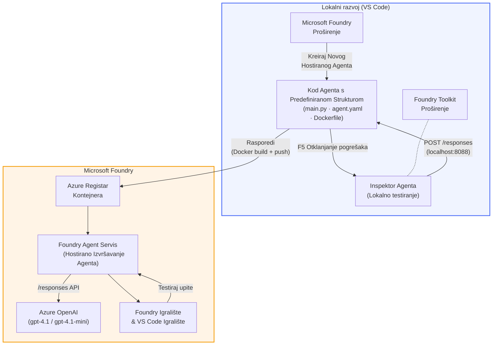

# Foundry Toolkit + Foundry Hosted Agents radionica

[](https://www.python.org/)
[](https://github.com/microsoft/agents)
[](https://learn.microsoft.com/azure/ai-foundry/agents/concepts/hosted-agents/)
[](https://ai.azure.com/)
[](https://learn.microsoft.com/azure/ai-services/openai/)
[](https://learn.microsoft.com/cli/azure/install-azure-cli)
[](https://learn.microsoft.com/azure/developer/azure-developer-cli/install-azd)
[](https://www.docker.com/)
[](https://marketplace.visualstudio.com/items?itemName=ms-windows-ai-studio.windows-ai-studio)
[](LICENSE)

Gradite, testirajte i implementirajte AI agente u **Microsoft Foundry Agent Service** kao **Hosted Agents** - potpuno iz VS Code koristeći **Microsoft Foundry ekstenziju** i **Foundry Toolkit**.

> **Hosted Agents su trenutno u pretpregledu.** Podržane regije su ograničene - pogledajte [dostupnost regija](https://learn.microsoft.com/azure/foundry/agents/concepts/hosted-agents#region-availability).

> Mapa `agent/` unutar svakog laboratorija je **automatski generirana** od strane Foundry ekstenzije - zatim prilagođavate kod, testirate lokalno i implementirate.

<!-- CO-OP TRANSLATOR LANGUAGES TABLE START -->
[Arabic](../ar/README.md) | [Bengali](../bn/README.md) | [Bulgarian](../bg/README.md) | [Burmese (Myanmar)](../my/README.md) | [Chinese (Simplified)](../zh-CN/README.md) | [Chinese (Traditional, Hong Kong)](../zh-HK/README.md) | [Chinese (Traditional, Macau)](../zh-MO/README.md) | [Chinese (Traditional, Taiwan)](../zh-TW/README.md) | [Croatian](./README.md) | [Czech](../cs/README.md) | [Danish](../da/README.md) | [Dutch](../nl/README.md) | [Estonian](../et/README.md) | [Finnish](../fi/README.md) | [French](../fr/README.md) | [German](../de/README.md) | [Greek](../el/README.md) | [Hebrew](../he/README.md) | [Hindi](../hi/README.md) | [Hungarian](../hu/README.md) | [Indonesian](../id/README.md) | [Italian](../it/README.md) | [Japanese](../ja/README.md) | [Kannada](../kn/README.md) | [Khmer](../km/README.md) | [Korean](../ko/README.md) | [Lithuanian](../lt/README.md) | [Malay](../ms/README.md) | [Malayalam](../ml/README.md) | [Marathi](../mr/README.md) | [Nepali](../ne/README.md) | [Nigerian Pidgin](../pcm/README.md) | [Norwegian](../no/README.md) | [Persian (Farsi)](../fa/README.md) | [Polish](../pl/README.md) | [Portuguese (Brazil)](../pt-BR/README.md) | [Portuguese (Portugal)](../pt-PT/README.md) | [Punjabi (Gurmukhi)](../pa/README.md) | [Romanian](../ro/README.md) | [Russian](../ru/README.md) | [Serbian (Cyrillic)](../sr/README.md) | [Slovak](../sk/README.md) | [Slovenian](../sl/README.md) | [Spanish](../es/README.md) | [Swahili](../sw/README.md) | [Swedish](../sv/README.md) | [Tagalog (Filipino)](../tl/README.md) | [Tamil](../ta/README.md) | [Telugu](../te/README.md) | [Thai](../th/README.md) | [Turkish](../tr/README.md) | [Ukrainian](../uk/README.md) | [Urdu](../ur/README.md) | [Vietnamese](../vi/README.md)

> **Više volite klonirati lokalno?**
>
> Ovaj repozitorij uključuje prijevode na više od 50 jezika što značajno povećava veličinu preuzimanja. Za kloniranje bez prijevoda, koristite sparse checkout:
>
> **Bash / macOS / Linux:**
> ```bash
> git clone --filter=blob:none --sparse https://github.com/microsoft-foundry/Foundry_Toolkit_for_VSCode_Lab.git
> cd Foundry_Toolkit_for_VSCode_Lab
> git sparse-checkout set --no-cone '/*' '!translations' '!translated_images'
> ```
>
> **CMD (Windows):**
> ```cmd
> git clone --filter=blob:none --sparse https://github.com/microsoft-foundry/Foundry_Toolkit_for_VSCode_Lab.git
> cd Foundry_Toolkit_for_VSCode_Lab
> git sparse-checkout set --no-cone "/*" "!translations" "!translated_images"
> ```
>
> Ovo vam daje sve što vam treba za dovršetak tečaja s puno bržim preuzimanjem.
<!-- CO-OP TRANSLATOR LANGUAGES TABLE END -->

---

## Arhitektura


**Tijek:** Foundry ekstenzija generira agenta → vi prilagođavate kod i upute → testirate lokalno s Agent Inspectorom → implementirate u Foundry (Docker image se šalje u ACR) → provjeravate u Playgroundu.

---

## Što ćete izgraditi

| Laboratorij | Opis | Status |
|------------|-------|--------|
| **Lab 01 - Jedan agent** | Izgradite **"Objasni kao da sam izvršni direktor" agenta**, testirajte ga lokalno i implementirajte u Foundry | ✅ Dostupno |
| **Lab 02 - Višestruki agenti u radu** | Izgradite **"Procjena prikladnosti životopisa → posao"** - 4 agenta surađuju za ocjenu prikladnosti životopisa i generiranje plana učenja | ✅ Dostupno |

---

## Upoznajte izvršnog agenta

U ovoj radionici izgradit ćete **"Objasni kao da sam izvršni direktor" agenta** - AI agenta koji uzima kompleksni tehnički žargon i prevodi ga u smirene sažetke prikladne za upravni odbor. Jer budimo iskreni, nitko u C-suiteu ne želi slušati o "pregorjelom thread poolu uzrokovanom sinkronim pozivima uvedenim u v3.2."

Izgradio sam ovog agenta nakon previše situacija gdje je moj savršeno složeni post-mortem dobio odgovor: *"Dakle... je li web stranica dolje ili nije?"*

### Kako funkcionira

Dajete mu tehničko ažuriranje. On vraća izvršni sažetak - tri ključne točke, bez žargona, bez stack traceova, bez egzistencijalnog straha. Samo **što se dogodilo**, **poslovni utjecaj** i **sljedeći korak**.

### Pogledajte ga u akciji

**Vi kažete:**
> "API latencija se povećala zbog pregorijelosti thread poola uzrokovane sinkronim pozivima uvedenim u v3.2."

**Agent odgovara:**

> **Izvršni sažetak:**
> - **Što se dogodilo:** Nakon najnovijeg izdanja, sustav je usporio.
> - **Poslovni utjecaj:** Neki korisnici su iskusili kašnjenja prilikom korištenja usluge.
> - **Sljedeći korak:** Promjena je vraćena unatrag i priprema se popravak prije ponovne implementacije.

### Zašto ovaj agent?

To je jednostavan agent sa jednom svrhom - savršen za učenje tijeka rada hostanih agenata od početka do kraja bez zadržavanja u složenim alatnim lancima. I iskreno? Svaki inženjerski tim trebao bi imati jednog ovakvog.

---

## Struktura radionice

```
📂 Foundry_Toolkit_for_VSCode_Lab/
├── 📄 README.md                      ← You are here
├── 📂 ExecutiveAgent/                ← Standalone hosted agent project
│   ├── agent.yaml
│   ├── Dockerfile
│   ├── main.py
│   └── requirements.txt
└── 📂 workshop/
    ├── 📂 lab01-single-agent/        ← Full lab: docs + agent code
    │   ├── README.md                 ← Hands-on lab instructions
    │   ├── 📂 docs/                  ← Step-by-step tutorial modules
    │   │   ├── 00-prerequisites.md
    │   │   ├── 01-install-foundry-toolkit.md
    │   │   ├── 02-create-foundry-project.md
    │   │   ├── 03-create-hosted-agent.md
    │   │   ├── 04-configure-and-code.md
    │   │   ├── 05-test-locally.md
    │   │   ├── 06-deploy-to-foundry.md
    │   │   ├── 07-verify-in-playground.md
    │   │   └── 08-troubleshooting.md
    │   └── 📂 agent/                 ← Reference solution (auto-scaffolded by Foundry extension)
    │       ├── agent.yaml
    │       ├── Dockerfile
    │       ├── main.py
    │       └── requirements.txt
    └── 📂 lab02-multi-agent/         ← Resume → Job Fit Evaluator
        ├── README.md                 ← Hands-on lab instructions (end-to-end)
        ├── 📂 docs/                  ← Step-by-step tutorial modules
        │   ├── 00-prerequisites.md
        │   ├── 01-understand-multi-agent.md
        │   ├── 02-scaffold-multi-agent.md
        │   ├── 03-configure-agents.md
        │   ├── 04-orchestration-patterns.md
        │   ├── 05-test-locally.md
        │   ├── 06-deploy-to-foundry.md
        │   ├── 07-verify-in-playground.md
        │   └── 08-troubleshooting.md
        └── 📂 PersonalCareerCopilot/ ← Reference solution (multi-agent workflow)
            ├── agent.yaml
            ├── Dockerfile
            ├── main.py
            └── requirements.txt
```

> **Napomena:** Mapa `agent/` unutar svakog laboratorija je ono što **Microsoft Foundry ekstenzija** generira kada pokrenete `Microsoft Foundry: Create a New Hosted Agent` iz Command Palettea. Datoteke se zatim prilagođavaju uputama, alatima i konfiguracijom vašeg agenta. Laboratorij 01 će vas kroz to provesti od nule.

---

## Početak rada

### 1. Klonirajte repozitorij

```bash
git clone https://github.com/microsoft-foundry/Foundry_Toolkit_for_VSCode_Lab.git
cd Foundry_Toolkit_for_VSCode_Lab
```

### 2. Postavite Python virtualno okruženje

```bash
python -m venv venv
```

Aktivirajte ga:

- **Windows (PowerShell):**
  ```powershell
  .\venv\Scripts\Activate.ps1
  ```
- **macOS / Linux:**
  ```bash
  source venv/bin/activate
  ```

### 3. Instalirajte ovisnosti

```bash
pip install -r workshop/lab01-single-agent/agent/requirements.txt
```

### 4. Konfigurirajte varijable okoline

Kopirajte primjer `.env` datoteke unutar mape agenta i ispunite svoje vrijednosti:

```bash
cp workshop/lab01-single-agent/agent/.env.example workshop/lab01-single-agent/agent/.env
```

Uredite `workshop/lab01-single-agent/agent/.env`:

```env
AZURE_AI_PROJECT_ENDPOINT=https://<your-account>.services.ai.azure.com/api/projects/<your-project>
MODEL_DEPLOYMENT_NAME=<your-model-deployment-name>
```

### 5. Slijedite radionice

Svaki laboratorij je samostalan sa svojim modulima. Počnite s **Lab 01** za učenje osnova, zatim pređite na **Lab 02** za višestruke agente u radu.

#### Lab 01 - Jedan agent ([pune upute](workshop/lab01-single-agent/README.md))

| # | Modul | Poveznica |
|---|---------|---------|
| 1 | Pročitajte preduvjete | [00-prerequisites.md](workshop/lab01-single-agent/docs/00-prerequisites.md) |
| 2 | Instalirajte Foundry Toolkit i Foundry ekstenziju | [01-install-foundry-toolkit.md](workshop/lab01-single-agent/docs/01-install-foundry-toolkit.md) |
| 3 | Kreirajte Foundry projekt | [02-create-foundry-project.md](workshop/lab01-single-agent/docs/02-create-foundry-project.md) |
| 4 | Kreirajte hostanog agenta | [03-create-hosted-agent.md](workshop/lab01-single-agent/docs/03-create-hosted-agent.md) |
| 5 | Konfigurirajte upute i okruženje | [04-configure-and-code.md](workshop/lab01-single-agent/docs/04-configure-and-code.md) |
| 6 | Testirajte lokalno | [05-test-locally.md](workshop/lab01-single-agent/docs/05-test-locally.md) |
| 7 | Implementirajte u Foundry | [06-deploy-to-foundry.md](workshop/lab01-single-agent/docs/06-deploy-to-foundry.md) |
| 8 | Provjerite u playgroundu | [07-verify-in-playground.md](workshop/lab01-single-agent/docs/07-verify-in-playground.md) |
| 9 | Otklanjanje poteškoća | [08-troubleshooting.md](workshop/lab01-single-agent/docs/08-troubleshooting.md) |

#### Lab 02 - Višestruki agenti u radu ([pune upute](workshop/lab02-multi-agent/README.md))

| # | Modul | Poveznica |
|---|---------|---------|
| 1 | Preduvjeti (Lab 02) | [00-prerequisites.md](workshop/lab02-multi-agent/docs/00-prerequisites.md) |
| 2 | Razumijevanje arhitekture višestrukih agenata | [01-understand-multi-agent.md](workshop/lab02-multi-agent/docs/01-understand-multi-agent.md) |
| 3 | Generiranje projekta za više agenata | [02-scaffold-multi-agent.md](workshop/lab02-multi-agent/docs/02-scaffold-multi-agent.md) |
| 4 | Konfiguriranje agenata i okoline | [03-configure-agents.md](workshop/lab02-multi-agent/docs/03-configure-agents.md) |
| 5 | Obrasci orkestracije | [04-orchestration-patterns.md](workshop/lab02-multi-agent/docs/04-orchestration-patterns.md) |
| 6 | Testiranje lokalno (više agenata) | [05-test-locally.md](workshop/lab02-multi-agent/docs/05-test-locally.md) |
| 7 | Objavi na Foundry | [06-deploy-to-foundry.md](workshop/lab02-multi-agent/docs/06-deploy-to-foundry.md) |
| 8 | Provjeri u igralištu | [07-verify-in-playground.md](workshop/lab02-multi-agent/docs/07-verify-in-playground.md) |
| 9 | Rješavanje problema (više agenata) | [08-troubleshooting.md](workshop/lab02-multi-agent/docs/08-troubleshooting.md) |

---

## Održavatelj

<table>
<tr>
    <td align="center"><a href="https://github.com/ShivamGoyal03">
        <br />
        <sub><b>Shivam Goyal</b></sub>
    </a><br />
    </td>
</tr>
</table>

---

## Potrebne dozvole (brzi pregled)

| Scenarij | Potrebne uloge |
|----------|---------------|
| Izrada novog Foundry projekta | **Azure AI Owner** na Foundry resursu |
| Objavljivanje postojećeg projekta (novi resursi) | **Azure AI Owner** + **Contributor** na pretplati |
| Objavljivanje potpuno konfiguriranog projekta | **Reader** na računu + **Azure AI User** na projektu |

> **Važno:** Azure `Owner` i `Contributor` uloge uključuju samo *upravljanje* dozvolama, ne i *razvojne* (radnje s podacima). Potreban vam je **Azure AI User** ili **Azure AI Owner** za izgradnju i objavljivanje agenata.

---

## Reference

- [Brzi početak: Objavite svog prvog hostiranog agenta (VS Code)](https://learn.microsoft.com/azure/foundry/agents/quickstarts/quickstart-hosted-agent)
- [Što su hostirani agenti?](https://learn.microsoft.com/azure/foundry/agents/concepts/hosted-agents)
- [Izrada workflowa hostiranih agenata u VS Code](https://learn.microsoft.com/azure/foundry/agents/how-to/vs-code-agents-workflow-pro-code)
- [Objava hostiranog agenta](https://learn.microsoft.com/azure/foundry/agents/how-to/deploy-hosted-agent)
- [RBAC za Microsoft Foundry](https://learn.microsoft.com/azure/foundry/concepts/rbac-foundry)
- [Primjer arhitekture recenzije agenta](https://github.com/Azure-Samples/agent-architecture-review-sample) - Hostirani agent iz stvarnog svijeta s MCP alatima, Excalidraw dijagramima i dvostrukom objavom

---


## Licenca

[MIT](../../LICENSE)

---

<!-- CO-OP TRANSLATOR DISCLAIMER START -->
**Odricanje od odgovornosti**:
Ovaj dokument je preveden korištenjem AI prevoditeljske usluge [Co-op Translator](https://github.com/Azure/co-op-translator). Iako nastojimo osigurati točnost, imajte na umu da automatski prijevodi mogu sadržavati pogreške ili netočnosti. Izvorni dokument na izvornom jeziku treba smatrati autoritativnim izvorom. Za kritične informacije preporučuje se profesionalni ljudski prijevod. Ne snosimo odgovornost za bilo kakve nesporazume ili pogrešna tumačenja koja proizlaze iz korištenja ovog prijevoda.
<!-- CO-OP TRANSLATOR DISCLAIMER END -->