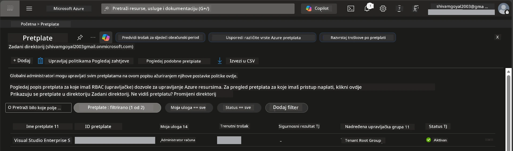

# Module 0 - Preduvjeti

Prije početka radionice, potvrdite da imate sljedeće alate, pristup i pripremljeno okruženje. Slijedite svaki korak u nastavku - nemojte preskakati.

---

## 1. Azure račun i pretplata

### 1.1 Kreirajte ili provjerite svoju Azure pretplatu

1. Otvorite preglednik i idite na [https://azure.microsoft.com/free/](https://azure.microsoft.com/free/).
2. Ako nemate Azure račun, kliknite **Start free** i slijedite postupak prijave. Trebat će vam Microsoft račun (ili napravite novi) i kreditna kartica za provjeru identiteta.
3. Ako već imate račun, prijavite se na [https://portal.azure.com](https://portal.azure.com).
4. U Portalu kliknite na ploču **Subscriptions** u lijevom izborniku (ili potražite "Subscriptions" u gornjoj tražilici).
5. Provjerite imate li najmanje jednu **Active** pretplatu. Zabilježite **Subscription ID** - trebat će vam kasnije.



### 1.2 Razumjeti potrebne RBAC uloge

[Hosted Agent](https://learn.microsoft.com/azure/foundry/agents/concepts/hosted-agents) implementacija zahtijeva dozvole za **data action** koje standardne Azure `Owner` i `Contributor` uloge **ne** uključuju. Trebat će vam jedna od ovih [kombinacija uloga](https://learn.microsoft.com/azure/foundry/concepts/rbac-foundry#built-in-roles):

| Scenarij | Potrebne uloge | Gdje ih dodijeliti |
|----------|----------------|--------------------|
| Kreiranje novog Foundry projekta | **Azure AI Owner** na Foundry resursu | Foundry resurs u Azure Portalu |
| Implementacija u postojeći projekt (novi resursi) | **Azure AI Owner** + **Contributor** na pretplatu | Pretplata + Foundry resurs |
| Implementacija u potpuno konfigurirani projekt | **Reader** na računu + **Azure AI User** na projektu | Račun + Projekt u Azure Portalu |

> **Ključna točka:** Azure `Owner` i `Contributor` uloge pokrivaju samo *upravljanje* dozvolama (ARM operacije). Trebate [**Azure AI User**](https://learn.microsoft.com/azure/foundry/concepts/rbac-foundry#built-in-roles) (ili višu) za *data actions* poput `agents/write` koje je potrebno za kreiranje i implementaciju agenata. Ove ćete uloge dodijeliti u [Modulu 2](02-create-foundry-project.md).

---

## 2. Instalacija lokalnih alata

Instalirajte svaki alat u nastavku. Nakon instalacije, provjerite radi li tako da pokrenete naredbu za provjeru.

### 2.1 Visual Studio Code

1. Posjetite [https://code.visualstudio.com/](https://code.visualstudio.com/).
2. Preuzmite instalacijski program za vaš OS (Windows/macOS/Linux).
3. Pokrenite instalaciju s zadanim postavkama.
4. Otvorite VS Code da potvrdite da se pokreće.

### 2.2 Python 3.10+

1. Posjetite [https://www.python.org/downloads/](https://www.python.org/downloads/).
2. Preuzmite Python 3.10 ili noviju verziju (preporučeno 3.12+).
3. **Windows:** Tijekom instalacije označite **"Add Python to PATH"** na prvom zaslonu.
4. Otvorite terminal i provjerite:

   ```powershell
   python --version
   ```
  
   Očekivani ispis: `Python 3.10.x` ili noviji.

### 2.3 Azure CLI

1. Posjetite [https://learn.microsoft.com/cli/azure/install-azure-cli](https://learn.microsoft.com/cli/azure/install-azure-cli).
2. Slijedite upute za instalaciju prema vašem OS-u.
3. Provjerite:

   ```powershell
   az --version
   ```
  
   Očekivano: `azure-cli 2.80.0` ili novije.

4. Prijavite se:

   ```powershell
   az login
   ```
  
### 2.4 Azure Developer CLI (azd)

1. Posjetite [https://learn.microsoft.com/azure/developer/azure-developer-cli/install-azd](https://learn.microsoft.com/azure/developer/azure-developer-cli/install-azd).
2. Slijedite upute za instalaciju za vaš OS. Na Windowsu:

   ```powershell
   winget install microsoft.azd
   ```
  
3. Provjerite:

   ```powershell
   azd version
   ```
  
   Očekivano: `azd version 1.x.x` ili novije.

4. Prijavite se:

   ```powershell
   azd auth login
   ```
  
### 2.5 Docker Desktop (opcionalno)

Docker je potreban samo ako želite lokalno izgraditi i testirati images kontejnera prije implementacije. Foundry ekstenzija automatski upravlja izgradnjom kontejnera tijekom implementacije.

1. Posjetite [https://docs.docker.com/get-docker/](https://docs.docker.com/get-docker/).
2. Preuzmite i instalirajte Docker Desktop za vaš OS.
3. **Windows:** Osigurajte da je WSL 2 backend odabran tijekom instalacije.
4. Pokrenite Docker Desktop i pričekajte da ikona u sistemskoj traci prikaže **"Docker Desktop is running"**.
5. Otvorite terminal i provjerite:

   ```powershell
   docker info
   ```
  
   Ovo bi trebalo ispisati Docker sistemske informacije bez grešaka. Ako vidite `Cannot connect to the Docker daemon`, pričekajte još nekoliko sekundi da se Docker potpuno pokrene.

---

## 3. Instalacija ekstenzija za VS Code

Trebat će vam tri ekstenzije. Instalirajte ih **prije** početka radionice.

### 3.1 Microsoft Foundry za VS Code

1. Otvorite VS Code.
2. Pritisnite `Ctrl+Shift+X` da otvorite panel za ekstenzije.
3. U polje za pretraživanje upišite **"Microsoft Foundry"**.
4. Pronađite **Microsoft Foundry for Visual Studio Code** (izdavač: Microsoft, ID: `TeamsDevApp.vscode-ai-foundry`).
5. Kliknite **Install**.
6. Nakon instalacije trebali biste vidjeti ikonu **Microsoft Foundry** u Activity Baru (lijeva bočna traka).

### 3.2 Foundry Toolkit

1. U panelu za ekstenzije (`Ctrl+Shift+X`), potražite **"Foundry Toolkit"**.
2. Pronađite **Foundry Toolkit** (izdavač: Microsoft, ID: `ms-windows-ai-studio.windows-ai-studio`).
3. Kliknite **Install**.
4. Ikona **Foundry Toolkit** trebala bi se pojaviti u Activity Baru.

### 3.3 Python

1. U panelu za ekstenzije potražite **"Python"**.
2. Pronađite **Python** (izdavač: Microsoft, ID: `ms-python.python`).
3. Kliknite **Install**.

---

## 4. Prijava u Azure iz VS Codea

[Microsoft Agent Framework](https://learn.microsoft.com/agent-framework/overview/) koristi [`DefaultAzureCredential`](https://learn.microsoft.com/azure/developer/python/sdk/authentication/credential-chains#defaultazurecredential-overview) za autentikaciju. Morate biti prijavljeni u Azure u VS Code.

### 4.1 Prijava putem VS Code

1. Pogledajte donji lijevi kut VS Codea i kliknite na ikonu **Accounts** (silhueta osobe).
2. Kliknite **Sign in to use Microsoft Foundry** (ili **Sign in with Azure**).
3. Otvorit će se preglednik - prijavite se Azure računom koji ima pristup vašoj pretplati.
4. Vratite se u VS Code. Trebali biste vidjeti svoje korisničko ime u donjem lijevom kutu.

### 4.2 (Opcionalno) Prijava putem Azure CLI

Ako ste instalirali Azure CLI i preferirate autentikaciju preko CLI:

```powershell
az login
```
  
Ovo otvara preglednik za prijavu. Nakon prijave odaberite ispravnu pretplatu:

```powershell
az account set --subscription "<your-subscription-id>"
```
  
Provjerite:

```powershell
az account show --query "{name:name, id:id, state:state}" --output table
```
  
Trebali biste vidjeti naziv vaše pretplate, ID i stanje = `Enabled`.

### 4.3 (Alternativa) Autentikacija servisnim prinicipom

Za CI/CD ili dijeljena okruženja postavite ove varijable okruženja:

```powershell
$env:AZURE_TENANT_ID = "<your-tenant-id>"
$env:AZURE_CLIENT_ID = "<your-client-id>"
$env:AZURE_CLIENT_SECRET = "<your-client-secret>"
```
  
---

## 5. Ograničenja u pregledu

Prije nastavka, budite svjesni trenutnih ograničenja:

- [**Hosted Agents**](https://learn.microsoft.com/azure/foundry/agents/concepts/hosted-agents) su trenutno u **javnom pregledu** - nisu preporučeni za produkcijske zadatke.
- **Podržani su ograničeni regiji** - provjerite [dostupnost regija](https://learn.microsoft.com/azure/foundry/agents/concepts/hosted-agents#region-availability) prije kreiranja resursa. Ako odaberete neregistriranu regiju, implementacija će propasti.
- Paket `azure-ai-agentserver-agentframework` je verzija u pre-releasu (`1.0.0b16`) - API može biti promijenjen.
- Ograničenja skaliranja: hosted agents podržavaju 0-5 replika (uključujući scale-to-zero).

---

## 6. Provjera spremnosti

Prođite kroz svaki stavak u nastavku. Ako neki korak ne uspije, vratite se i ispravite prije nastavka.

- [ ] VS Code se otvara bez grešaka
- [ ] Python 3.10+ je u vašem PATH-u (`python --version` ispisuje `3.10.x` ili noviji)
- [ ] Azure CLI je instaliran (`az --version` ispisuje `2.80.0` ili više)
- [ ] Azure Developer CLI je instaliran (`azd version` ispisuje informacije o verziji)
- [ ] Microsoft Foundry ekstenzija je instalirana (ikona vidljiva u Activity Baru)
- [ ] Foundry Toolkit ekstenzija je instalirana (ikona vidljiva u Activity Baru)
- [ ] Python ekstenzija je instalirana
- [ ] Prijavljeni ste u Azure u VS Codeu (provjerite ikonu Accounts, dolje lijevo)
- [ ] `az account show` vraća vašu pretplatu
- [ ] (Opcionalno) Docker Desktop radi (`docker info` vraća sistemske informacije bez grešaka)

### Kontrolna točka

Otvorite Activity Bar u VS Codeu i provjerite vidite li prikaze **Foundry Toolkit** i **Microsoft Foundry** u bočnoj traci. Kliknite na svaki da provjerite otvaraju li se bez grešaka.

---

**Sljedeće:** [01 - Instalacija Foundry Toolkit & Foundry ekstenzije →](01-install-foundry-toolkit.md)

---

<!-- CO-OP TRANSLATOR DISCLAIMER START -->
**Odricanje od odgovornosti**:  
Ovaj dokument preveden je korištenjem AI servisa za prijevod [Co-op Translator](https://github.com/Azure/co-op-translator). Iako nastojimo postići točnost, imajte na umu da automatski prijevodi mogu sadržavati pogreške ili netočnosti. Izvorni dokument na izvornom jeziku treba smatrati službenim i autoritativnim izvorom. Za kritične informacije preporučuje se profesionalni ljudski prijevod. Nismo odgovorni za bilo kakve nesporazume ili pogrešne interpretacije koje proizlaze iz korištenja ovog prijevoda.
<!-- CO-OP TRANSLATOR DISCLAIMER END -->