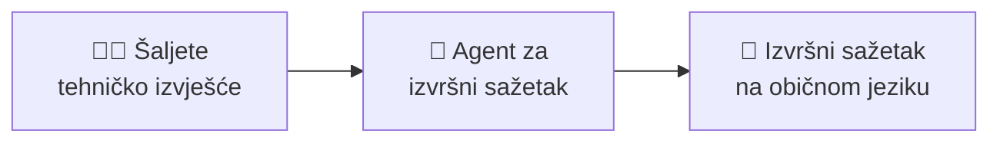

# Modul 0 - Uvod

⏱️ ~10 min

> [!WARNING]
> **Pregled i ograničenja:** [Hosted Agents](https://learn.microsoft.com/azure/foundry/agents/concepts/hosted-agents) su trenutno u **javnom pregledu** - nisu preporučeni za produkcijske zadatke. Obratite pažnju na sljedeće:
> - **Podržane regije su ograničene** - provjerite [dostupnost regija](https://learn.microsoft.com/azure/foundry/agents/concepts/hosted-agents#region-availability) prije stvaranja resursa. Ako odaberete nepodržanu regiju, implementacija će zakazati.
> - Paket `azure-ai-agentserver-agentframework` je u pretprodukciji - API-ji se mogu mijenjati između verzija.
> - Ograničenja skaliranja: hosted agenti podržavaju 0–5 replika (uključujući skaliranje do nule).
> - Neke značajke prikazane u ovom radionici mogu se mijenjati kako usluga napreduje prema GA.

## Što ćete izgraditi

U ovoj radionici izgradit ćete **"Objasni kao da sam izvršni direktor"** agenta - hostiranog AI agenta koji uzima složena tehnička izvješća i prepisuje ih kao sažete izvršne izvještaje na jednostavnom engleskom jeziku.

```mermaid
flowchart LR
    A["🧑‍💻 Šaljete\ntehničko izvješće"] --> B["🤖 Agent za\nizvršni sažetak"]
    B --> C["📝 Izvršni sažetak\nna običnom jeziku"]
```

**Agent koristi:**
- **Microsoft Agent Framework** - za logiku i strukturu agenta
- **Foundry Toolkit za VS Code** - za kreiranje strukture, lokalno testiranje i implementaciju
- **AI model** (npr. `gpt-4.1-mini/gpt-5-mini`) - za generiranje sažetaka

Do kraja ove vježbe imat ćete funkcionalnog agenta kojeg možete testirati lokalno putem Agent Inspektora, a po želji i implementirati u oblak.

---

## Što su hosted agenti?

**Hosted agent** je AI agent koji radi kao upravljana usluga u Microsoft Foundry. Umjesto da upravljate vlastitom infrastrukturom, spremate kod agenta u kontejner i Foundry upravlja skaliranjem, hostanjem i izlaganjem preko standardne HTTP točke pristupa.

| Koncept | Što znači |
|---------|--------------|
| **Agent** | Vaš Python kod koji prima korisničku poruku, poziva AI model i vraća strukturirani odgovor |
| **Hosted** | Foundry pokreće vaš kontejner umjesto vas - bez VM-ova, Kubernetes-a, ili upravljanja infrastrukturom |
| **Protokol odgovora** | Standardni HTTP API (`POST /responses`) kojem svaki klijent može pristupiti kako bi komunicirao s agentom |
| **Agent Inspector** | Lokalno korisničko sučelje za testiranje (ugrađeno u Foundry Toolkit) koje vam omogućuje chat s agentom prije implementacije |

U ovoj radionici proći ćete od nule do potpuno hostiranog agenta - ili se zaustaviti na lokalnom testiranju ako želite.

---

## Odaberite svoj put

> ⚠️ **Odaberite jedan put prije nastavka.** Vaš odabir određuje koje alate instalirati i koji moduli se primjenjuju. Kasnije možete preći s Puta B → na Put A ako nabavite pretplatu.

<strong>🅰️ Put A - Azure oblak (zahtijeva Azure pretplatu)</strong>

| | Detalji |
|---|---|
| **Za koga je?** | Imate aktivnu Azure pretplatu i možete stvarati Foundry resurse |
| **Model** | Azure OpenAI preko Foundry (npr. `gpt-4.1-mini/gpt-5-mini`) |
| **Obuhvaćeni moduli** | Svi moduli (00–07) |
| **Implementirati u oblak?** | ✅ Da - potpuna end-to-end implementacija |

<strong>🅱️ Put B - Lokalno / besplatni nivo (nije potrebna Azure pretplata)</strong>

| | Detalji |
|---|---|
| **Za koga je?** | MVP-ovi, studenti ili bilo tko bez pristupa Azure-u |
| **Model** | **Foundry Local** (besplatno, radi na vašem računalu) |
| **Obuhvaćeni moduli** | Moduli 00–04 (preskočiti implementaciju i cloud verifikaciju) |
| **Implementirati u oblak?** | ❌ Ne - samo lokalno testiranje putem Agent Inspektora |

---

## Svi putevi: Potrebni alati

Instalirajte svaki alat u nastavku. Nakon instalacije, provjerite radi li pokretanjem kontrolne naredbe.

| # | Alat | Verzija | Instalacija | Provjera (Očekivani ishod) |
|---|------|---------|---------|---------------------------|
| 1 | **Visual Studio Code** | Najnovija | [code.visualstudio.com](https://code.visualstudio.com/) | Otvara se bez pogrešaka |
| 2 | **Python** | 3.12 ili noviji| [python.org/downloads](https://www.python.org/downloads/) | `python --version` $\rightarrow$ `Python 3.12.x` |
| 3 | **Foundry Toolkit za VS Code** | Najnovija | ID proširenja: `ms-windows-ai-studio.windows-ai-studio` | Ikona Foundry u Activity Bar |
| 4 | **Python ekstenzija za VS Code** | Najnovija | ID proširenja: `ms-python.python` | Instalirano u panelu Extensions |

> [!TIP]
> **Savjeti za instalaciju:**
> - **Python PATH (Windows):** Uvijek označite **"Add Python to PATH"** na prvom ekranu instalera Pythona. Bez toga, `python` neće biti prepoznat u vašem terminalu.
> - **Više verzija Pythona:** Ako imate instalirane i Python 3.10 i 3.12, koristite `python3.12 -m venv .venv` da biste osigurali da se za virtualno okruženje koristi ispravna verzija.
> - **Docker WSL 2 (Windows):** Tijekom instalacije Docker Desktop, osigurajte da je odabrani **WSL 2 backend**. Docker s Hyper-V je sporiji i može uzrokovati probleme s izgradnjom Foundry kontejnera.
> - **Docker se ne pokreće?** Pričekajte 30–60 sekundi nakon pokretanja Docker Desktopa. Pokrenite `docker info` - ako vidite "Cannot connect to the Docker daemon," Docker se još inicijalizira.
> - **VS Code ekstenzije se ne učitavaju?** Nakon instalacije ekstenzija, ponovno učitajte prozor: `Ctrl+Shift+P` → `Developer: Reload Window`.

> **Windows korisnici:** Označite **"Add Python to PATH"** tijekom instalacije Pythona.

**Sljedeće:** [01 - Podešavanje →](01-setup.md)

---

<!-- CO-OP TRANSLATOR DISCLAIMER START -->
**Napomena**:
Ovaj dokument je preveden korištenjem AI prevoditeljskog servisa [Co-op Translator](https://github.com/Azure/co-op-translator). Iako težimo točnosti, imajte na umu da automatski prijevodi mogu sadržavati greške ili netočnosti. Izvorni dokument na izvornom jeziku treba smatrati autoritativnim izvorom. Za važne informacije preporuča se profesionalni ljudski prijevod. Nismo odgovorni za bilo kakva nesporazumevanja ili pogrešne interpretacije koje proizlaze iz korištenja ovog prijevoda.
<!-- CO-OP TRANSLATOR DISCLAIMER END -->