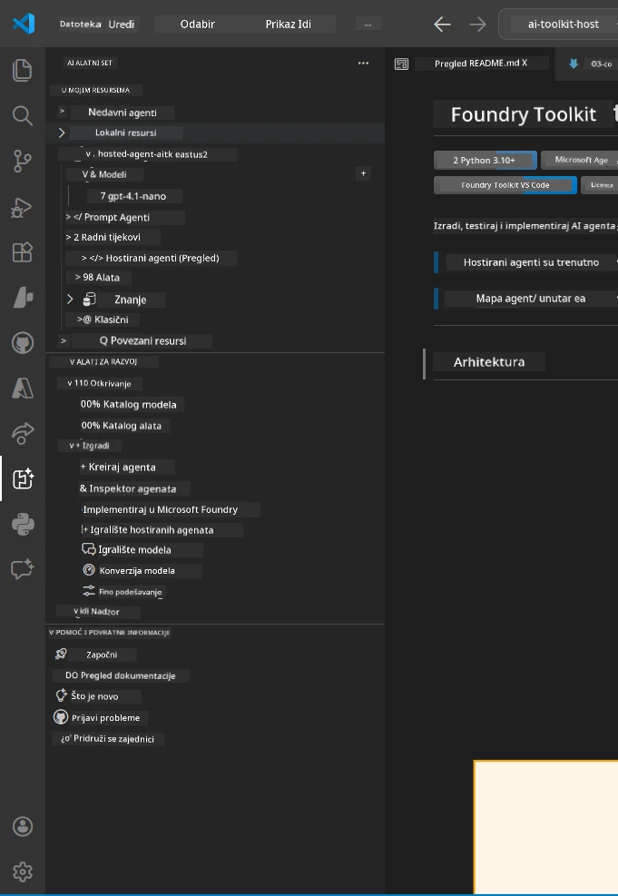
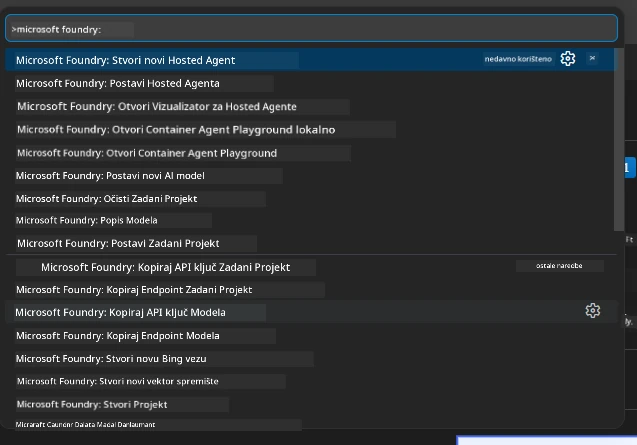

# Modul 1 - Instalirajte Foundry Toolkit i Foundry ekstenziju

Ovaj modul vodi vas kroz instalaciju i provjeru dviju glavnih VS Code ekstenzija za ovu radionicu. Ako ste ih već instalirali tijekom [Modula 0](00-prerequisites.md), koristite ovaj modul za provjeru ispravnog rada.

---

## Korak 1: Instalirajte Microsoft Foundry ekstenziju

**Microsoft Foundry za VS Code** ekstenzija je vaš glavni alat za stvaranje Foundry projekata, implementaciju modela, generiranje hostanih agenata i implementaciju izravno iz VS Codea.

1. Otvorite VS Code.
2. Pritisnite `Ctrl+Shift+X` za otvaranje panela **Extensions**.
3. U tražilicu pri vrhu unesite: **Microsoft Foundry**
4. Potražite rezultat pod nazivom **Microsoft Foundry for Visual Studio Code**.
   - Izdavač: **Microsoft**
   - ID ekstenzije: `TeamsDevApp.vscode-ai-foundry`
5. Kliknite na gumb **Install**.
6. Pričekajte da instalacija završi (vidjet ćete mali pokazivač napretka).
7. Nakon instalacije, pogledajte **Activity Bar** (vertikalnu traku ikona lijevo u VS Codeu). Trebali biste vidjeti novu **Microsoft Foundry** ikonu (izgleda kao dijamant/AI ikona).
8. Kliknite na ikonu **Microsoft Foundry** da otvorite njen bočni prikaz. Trebali biste vidjeti sekcije za:
   - **Resources** (ili Projects)
   - **Agents**
   - **Models**

> **Ako ikona ne pojavi:** Pokušajte ponovno učitati VS Code (`Ctrl+Shift+P` → `Developer: Reload Window`).

---

## Korak 2: Instalirajte Foundry Toolkit ekstenziju

**Foundry Toolkit** ekstenzija pruža [**Agent Inspector**](https://learn.microsoft.com/azure/foundry/agents/how-to/vs-code-agents-workflow-pro-code) - vizualno sučelje za lokalno testiranje i otklanjanje pogrešaka agenata - plus playground, upravljanje modelima i alate za evaluaciju.

1. U panelu Extensions (`Ctrl+Shift+X`), obrišite tražilicu i upišite: **Foundry Toolkit**
2. Pronađite **Foundry Toolkit** u rezultatima.
   - Izdavač: **Microsoft**
   - ID ekstenzije: `ms-windows-ai-studio.windows-ai-studio`
3. Kliknite **Install**.
4. Nakon instalacije, ikona **Foundry Toolkit** pojavljuje se u Activity Bar-u (izgleda kao robot/iskrica).
5. Kliknite ikonu **Foundry Toolkit** da otvorite bočni prikaz. Trebali biste vidjeti početni zaslon Foundry Toolkita s opcijama za:
   - **Models**
   - **Playground**
   - **Agents**

---

## Korak 3: Provjerite rade li obje ekstenzije

### 3.1 Provjera Microsoft Foundry ekstenzije

1. Kliknite ikonu **Microsoft Foundry** u Activity Bar-u.
2. Ako ste prijavljeni u Azure (iz Modula 0), trebali biste vidjeti svoje projekte pod **Resources**.
3. Ako se traži prijava, kliknite **Sign in** i slijedite tok autentifikacije.
4. Potvrdite da se bočni prikaz prikazuje bez pogrešaka.

### 3.2 Provjera Foundry Toolkit ekstenzije

1. Kliknite ikonu **Foundry Toolkit** u Activity Bar-u.
2. Potvrdite da se početni prikaz ili glavni panel učitavaju bez pogrešaka.
3. Još ne morate ništa konfigurirati - Agent Inspector ćemo koristiti u [Modulu 5](05-test-locally.md).

### 3.3 Provjera preko Command Palette-a

1. Pritisnite `Ctrl+Shift+P` za otvaranje Command Palette-a.
2. Upisujte **"Microsoft Foundry"** - trebali biste vidjeti naredbe poput:
   - `Microsoft Foundry: Create a New Hosted Agent`
   - `Microsoft Foundry: Deploy Hosted Agent`
   - `Microsoft Foundry: Open Model Catalog`
3. Pritisnite `Escape` za zatvaranje Command Palette-a.
4. Ponovno otvorite Command Palette i upišite **"Foundry Toolkit"** - trebali biste vidjeti naredbe poput:
   - `Foundry Toolkit: Open Agent Inspector`

> Ako ne vidite ove naredbe, moguće je da ekstenzije nisu ispravno instalirane. Pokušajte ih deinstalirati i ponovno instalirati.

---

## Što ove ekstenzije rade u ovoj radionici

| Ekstenzija | Što radi | Kada ćete je koristiti |
|-----------|-------------|-------------------|
| **Microsoft Foundry for VS Code** | Stvaranje Foundry projekata, implementacija modela, **generiranje [hostanih agenata](https://learn.microsoft.com/azure/foundry/agents/concepts/hosted-agents)** (automatski generira `agent.yaml`, `main.py`, `Dockerfile`, `requirements.txt`), implementacija u [Foundry Agent Service](https://learn.microsoft.com/azure/foundry/agents/overview) | Moduli 2, 3, 6, 7 |
| **Foundry Toolkit** | Agent Inspector za lokalno testiranje/otklanjanje pogrešaka, playground sučelje, upravljanje modelima | Moduli 5, 7 |

> **Foundry ekstenzija je najvažniji alat u ovoj radionici.** Ona pokriva cijeli životni ciklus: generiranje → konfiguriranje → implementacija → provjera. Foundry Toolkit je dodatak koji pruža vizualni Agent Inspector za lokalno testiranje.

---

### Kontrolna točka

- [ ] Microsoft Foundry ikona je vidljiva u Activity Bar-u
- [ ] Klik na ikonu otvara bočni prikaz bez pogrešaka
- [ ] Foundry Toolkit ikona je vidljiva u Activity Bar-u
- [ ] Klik na ikonu otvara bočni prikaz bez pogrešaka
- [ ] `Ctrl+Shift+P` → upisivanje "Microsoft Foundry" prikazuje dostupne naredbe
- [ ] `Ctrl+Shift+P` → upisivanje "Foundry Toolkit" prikazuje dostupne naredbe

---

**Prethodno:** [00 - Preduvjeti](00-prerequisites.md) · **Sljedeće:** [02 - Kreirajte Foundry projekt →](02-create-foundry-project.md)

---

<!-- CO-OP TRANSLATOR DISCLAIMER START -->
**Odricanje od odgovornosti**:
Ovaj dokument je preveden koristeći AI uslugu prevođenja [Co-op Translator](https://github.com/Azure/co-op-translator). Iako težimo točnosti, imajte na umu da automatski prijevodi mogu sadržavati pogreške ili netočnosti. Izvorni dokument na izvornom jeziku treba smatrati autentičnim i službenim izvorom. Za kritične informacije preporučuje se profesionalni ljudski prijevod. Ne snosimo odgovornost za bilo kakva nesporazumevanja ili pogrešne interpretacije koje proizlaze iz korištenja ovog prijevoda.
<!-- CO-OP TRANSLATOR DISCLAIMER END -->