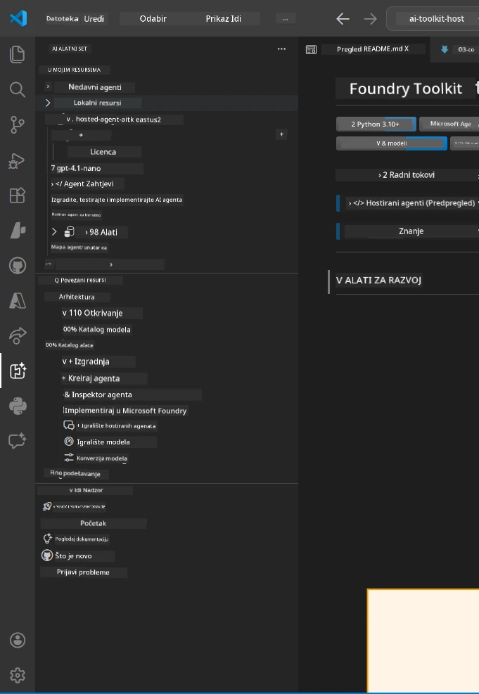
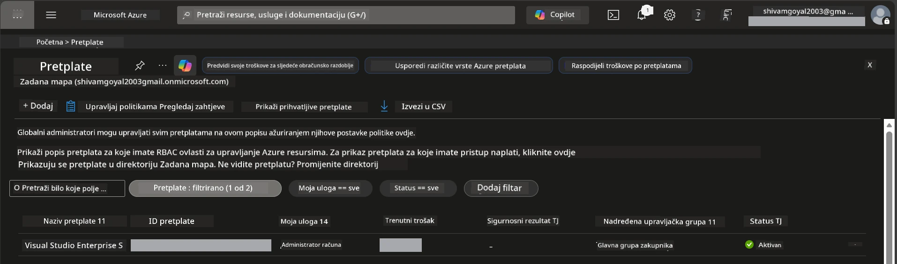
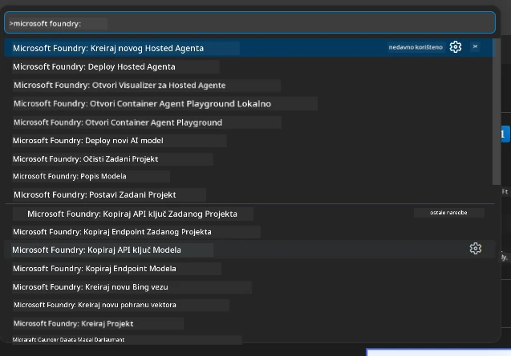
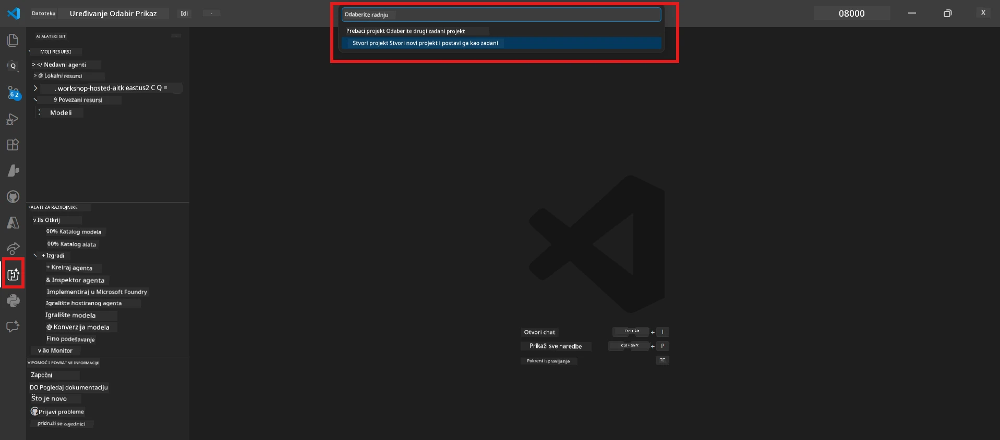
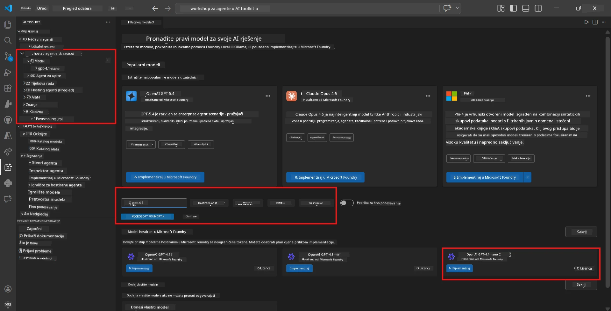
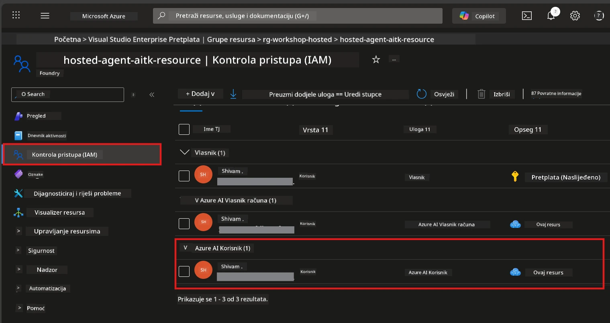

# Postavljanje: Proširenje, Projekt i Model

⏱️ ~15 min

U ovom modulu instalirate i provjeravate Foundry Toolkit proširenje, kreirate (ili se povezujete na) Foundry projekt i implementirate model koji će vaš agent koristiti.

## Korak 1: Instalirajte Foundry Toolkit

**Foundry Toolkit za VS Code** je glavno proširenje za ovu radionicu. Omogućuje kreiranje projekata, implementaciju modela, postavljanje agenta, lokalno testiranje (Agent Inspector) i implementaciju u oblak - sve preko VS Codea.

1. Otvorite VS Code zatim pritisnite `Ctrl+Shift+X` za otvaranje panela **Extensions**.
2. Pretražite **Foundry Toolkit**.
3. Instalirajte **Foundry Toolkit for VS Code** (Izdavač: Microsoft, ID: `ms-windows-ai-studio.windows-ai-studio`).
4. Nakon instalacije, **Foundry Toolkit** ikona će se pojaviti na Activity Baru (lijevi sidebar).

> *Napomena: Activity Bar može prikazivati "AI TOOLKIT" u starijim verzijama proširenja. Funkcionalnost je ista.*



## Korak 2: Postavljanje prema vašem pristupu

> **Odaberite svoj put:** Proširite donji odjeljak koji odgovara vašem postavkama. Potrebno je dovršiti samo **jedan** put.

<details>
<summary><strong>🅰️ Put A - Azure oblak (zahtijeva Azure pretplatu)</strong></summary>

### Azure CLI

1. Instalirajte s [learn.microsoft.com/cli/azure/install-azure-cli](https://learn.microsoft.com/cli/azure/install-azure-cli).
2. Provjerite: `az --version` (očekujte 2.80.0+).
3. Prijavite se: `az login`

### Opcije autentifikacije

[Microsoft Agent Framework](https://learn.microsoft.com/agent-framework/overview/) koristi [`DefaultAzureCredential`](https://learn.microsoft.com/azure/developer/python/sdk/authentication/credential-chains#defaultazurecredential-overview) koji isprobava različite metode autentifikacije redom. Odaberite onu koja odgovara vašem okruženju:

#### Opcija 1: VS Code računi (preporučeno za radionice)
1. Kliknite ikonu **Accounts** (silhueta osobe) u donjem lijevom kutu VS Codea.
2. Odaberite **Sign in to use Microsoft Foundry** (ili **Sign in with Azure**).
3. Otvara se preglednik - prijavite se s Azure računom koji ima pristup vašoj pretplati.
4. Vratite se u VS Code. Trebali biste vidjeti ime svog računa u donjem lijevom kutu.

#### Opcija 2: Azure CLI
```bash
az login
az account set --subscription "<your-subscription-id>"
```

#### Opcija 3: Service Principal (Enterprise/CI)
Za zaključana okruženja ili CI/CD pipelineove, postavite ove varijable okoline u vaš `.env` datoteku:
```env
AZURE_TENANT_ID=<your-tenant-id>
AZURE_CLIENT_ID=<your-client-id>
AZURE_CLIENT_SECRET=<your-client-secret>
```

> **Kako radi `DefaultAzureCredential`:** Prvo provjerava varijable okoline, zatim managed identity, potom VS Code prijavu, potom Azure CLI - i koristi prvu koja uspije. Pogledajte [dokumentaciju o credential chain](https://learn.microsoft.com/azure/developer/python/sdk/authentication/credential-chains#defaultazurecredential-overview).

### Azure Developer CLI (azd)

1. Instalirajte: `winget install microsoft.azd` (Windows) ili pogledajte [upute za instalaciju](https://learn.microsoft.com/azure/developer/azure-developer-cli/install-azd).
2. Provjerite: `azd version`
3. Prijavite se: `azd auth login`

### Docker Desktop (opcionalno)

Docker je potreban samo ako želite graditi kontejnere lokalno. Foundry proširenje automatski upravlja izgradnjom tijekom implementacije.

1. Instalirajte sa [docs.docker.com/get-docker](https://docs.docker.com/get-docker/).
2. Provjerite: `docker info`

### Azure pretplata i RBAC

1. Prijavite se na [portal.azure.com](https://portal.azure.com).
2. Idite na **Subscriptions** i potvrdite da je barem jedna **Active**.
3. Zabilježite vaš **Subscription ID** - trebat će vam u Modulu 01.



#### RBAC tabela scenarija

Implementacija [Hosted Agenta](https://learn.microsoft.com/azure/foundry/agents/concepts/hosted-agents) zahtijeva dopuštenja za **data action** koja standardne uloge Azure `Owner` i `Contributor` nemaju. Koristite tablicu ispod za određivanje koje uloge trebate:

| Scenarij | Potrebne uloge | Gdje ih dodijeliti |
|----------|---------------|--------------------|
| Kreiranje novog Foundry projekta | **Azure AI Owner** na Foundry resursu | Foundry resurs u Azure portalu |
| Implementacija u postojeći projekt (novi resursi) | **Azure AI Owner** + **Contributor** na pretplatu | Pretplata + Foundry resurs |
| Implementacija u potpuno konfigurirani projekt | **Reader** na računu + **Azure AI User** na projektu | Račun + Projekt u Azure portalu |
| Samo lokalno testiranje (bez implementacije) | **Azure AI User** na projektu | Projekt u Azure portalu |

> **Ključna napomena:** Azure `Owner` i `Contributor` uloge pokrivaju samo *upravljanje* (ARM operacije). Za *data actions* poput `agents/write` potrebna vam je [**Azure AI User**](https://learn.microsoft.com/azure/foundry/concepts/rbac-foundry#built-in-roles) (ili viša) uloga koja je obavezna za kreiranje i implementaciju agenata.

## Povežite ili kreirajte Foundry projekt



1. Pritisnite `Ctrl+Shift+P` → upišite **Foundry Toolkit: Create Project** → odaberite ga.
2. Iz padajućeg izbornika odaberite svoju **Azure pretplatu**.
3. Odaberite ili kreirajte **resource group** (npr. `rg-hosted-agents-workshop`).
4. Odaberite **regiju** koja podržava hosted agente: `East US`, `West US 2`, ili `Sweden Central`. Pogledajte [dostupnost regija](https://learn.microsoft.com/azure/foundry/agents/concepts/hosted-agents#region-availability).
5. Unesite ime projekta (npr. `workshop-agents`).
6. Pričekajte 2–5 minuta za kreiranje. U VS Codeu se pojavljuje obavijest o napretku.
7. Kada je gotovo, vaš projekt se pojavljuje u **Foundry Toolkit** bočnoj traci pod **MY RESOURCES**.



## Implementirajte model i dodijelite RBAC

Vašem hosted agentu je potreban AI model za generiranje odgovora.

#### Matrica odabira modela
Ovisno o vašim potrebama, možete odabrati različite razine modela:

| Model | Najbolje za | Trošak | Napomene |
|-------|-------------|--------|----------|
| `gpt-4.1` | Visokokvalitetne, nijansirane odgovore | Viši | Najbolji rezultati, preporučeno za završna testiranja |
| `gpt-4.1-mini/gpt-5-mini` | Brze iteracije, niži trošak | Niži | Pogodno za razvoj radionice i brzo testiranje |
| `gpt-4.1-nano` | Jednostavni zadaci | Najniži | Najisplativiji, ali jednostavniji odgovori |

1. Pritisnite `Ctrl+Shift+P` → **Foundry Toolkit: Open Model Catalog** (ili kliknite **Model Catalog** u sidebaru pod DEVELOPER TOOLS → Discover).
2. Pretražite katalog za **gpt-4.1**.
3. Nađite **OpenAI GPT-4.1-mini** (ili `gpt-5-mini` za bolju kvalitetu) i kliknite **Deploy**.



4. U konfiguraciji implementacije:
   - **Ime implementacije:** Ostavite zadano ili unesite vlastito ime. **Zapamtite ovo ime.**
   - **Cilj:** Odaberite **Deploy to Foundry Toolkit** → odaberite vaš projekt.
5. Kliknite **Deploy** i pričekajte 1–3 minute.

> **Preporuka:** Za radionicu koristite `gpt-4.1-mini/gpt-5-mini` - brzo, pristupačno i daje dobre rezultate.

### Zabilježite svoje vrijednosti

Nakon implementacije zabilježite ove dvije vrijednosti (trebat će vam u Modulu 03):

| Vrijednost | Gdje je pronaći |
|-----------|----------------|
| **Projekt endpoint** | Kliknite projekt u sidebaru → detaljni prikaz pokazuje URL (npr., `https://<account>.services.ai.azure.com/api/projects/<project>`) |
| **Ime implementacije modela** | Proširite projekt → **Models** → ime pokraj vašeg implementiranog modela (npr., `gpt-4.1-mini/gpt-5-mini`) |

### Dodijelite RBAC ulogu

> ⚠️ **Ovo je najčešće propušten korak.** Bez odgovarajuće uloge, implementacija u Modulu 05 će ne uspjeti.

#### Koju ulogu trebam?
Ovisno o vašem scenariju, trebate sljedeće kombinacije uloga:

| Scenarij | Potrebne uloge | Gdje ih dodijeliti |
|----------|---------------|--------------------|
| Kreiranje novog Foundry projekta | **Azure AI Owner** na Foundry resursu | Foundry resurs u Azure portalu |
| Implementacija u postojeći projekt (novi resursi) | **Azure AI Owner** + **Contributor** na pretplatu | Pretplata + Foundry resurs |
| Implementacija u potpuno konfigurirani projekt | **Reader** na računu + **Azure AI User** na projektu | Račun + Projekt u Azure portalu |

**Ključna napomena:** Azure `Owner` i `Contributor` uloge pokrivaju samo *upravljanje* dopuštenjima. Za *data actions* poput `agents/write` potrebna vam je **Azure AI User** (ili viša).

1. Otvorite [portal.azure.com](https://portal.azure.com).
2. Potražite ime svog **Foundry projekta** → kliknite rezultat tipa **"Foundry Toolkit project"** (NE roditeljski račun).
3. Kliknite **Access control (IAM)** u lijevoj navigaciji.
4. Kliknite **+ Add** → **Add role assignment**.
5. **Kartica Role:** Potražite **Azure AI User**, odaberite ga, kliknite **Next**.
6. **Kartica Members:** Odaberite **User, group, or service principal** → kliknite **+ Select members** → pronađite i odaberite sebe → kliknite **Select**.
7. Kliknite **Review + assign** → opet **Review + assign**.
8. **Pričekajte 1–2 minute** za propagaciju.

> **Zašto ova uloga?** Azure `Owner`/`Contributor` daju samo upravljačka dopuštenja. **Azure AI User** uloga daje potrebnu `agents/write` data akciju za kreiranje i implementaciju agenata. Pogledajte [Foundry RBAC dokumentaciju](https://learn.microsoft.com/azure/foundry/concepts/rbac-foundry#built-in-roles).



</details>

<details>
<summary><strong>🅱️ Put B - Lokalno / besplatni nivo (nije potrebna Azure pretplata)</strong></summary>

### Foundry Local

Foundry Local vam omogućuje da pokrenete AI modele na svom računalu - bez potrebe za oblačnim računom. Možete pristupiti Foundry Local modelima koristeći Foundry Toolkit kroz katalog modela na sljedeći način:

1. Idite na Foundry Toolkit proširenje.
2. U Foundry Toolkit navigaciji idite na **Developer Tools** > i odaberite **Model Catalog**
3. U novom prozoru odaberite **local** iz navigacijske trake.
4. Pomaknite se prema dolje do **Phi 4 Mini,** i kliknite **gumb za dodavanje**, pojavit će se skočni prozor koji pokazuje da se model preuzima.
5. Nakon što je model preuzet, možete nastaviti na sljedeći korak.

</details>

### ✅ Kontrolna točka


- [ ] `Ctrl+Shift+P` → "Foundry Toolkit" prikazuje dostupne naredbe
- [ ] Foundry Toolkit proširenje instalirano i sidebar se učitava bez grešaka
- [ ] VS Code se otvara i radi ispravno
- [ ] `python --version` prikazuje 3.10+
- [ ] Foundry Toolkit ikona vidljiva na Activity Baru VS Codea
- [ ] **Put A:** `az login` uspijeva, pretplata je aktivna
- [ ] **Put B:** Foundry Local je aktivan (`foundry local status`)
- [ ] **Put A:** Foundry projekt vidljiv u sidebaru, model implementiran, Azure AI User uloga dodijeljena
- [ ] **Put B:** Foundry Local radi s modelom
- [ ] Zabilježili ste svoj **endpoint** i **ime implementacije modela**


**Prethodno:** [00 - Preduvjeti](00-prerequisites.md) · **Slijedeće:** [02 - Kreiranje Hosted Agenta →](02-create-hosted-agent.md)

---

<!-- CO-OP TRANSLATOR DISCLAIMER START -->
**Napomena**:
Ovaj dokument je preveden korištenjem AI prevoditeljskog servisa [Co-op Translator](https://github.com/Azure/co-op-translator). Iako težimo točnosti, imajte na umu da automatski prijevodi mogu sadržavati greške ili netočnosti. Izvorni dokument na izvornom jeziku treba smatrati autoritativnim izvorom. Za važne informacije preporuča se profesionalni ljudski prijevod. Nismo odgovorni za bilo kakva nesporazumevanja ili pogrešne interpretacije koje proizlaze iz korištenja ovog prijevoda.
<!-- CO-OP TRANSLATOR DISCLAIMER END -->