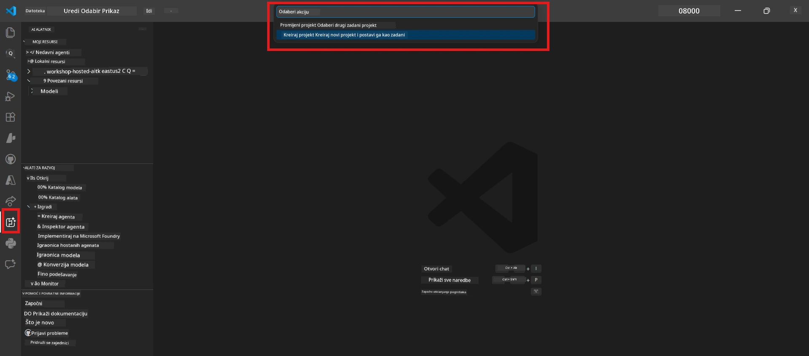
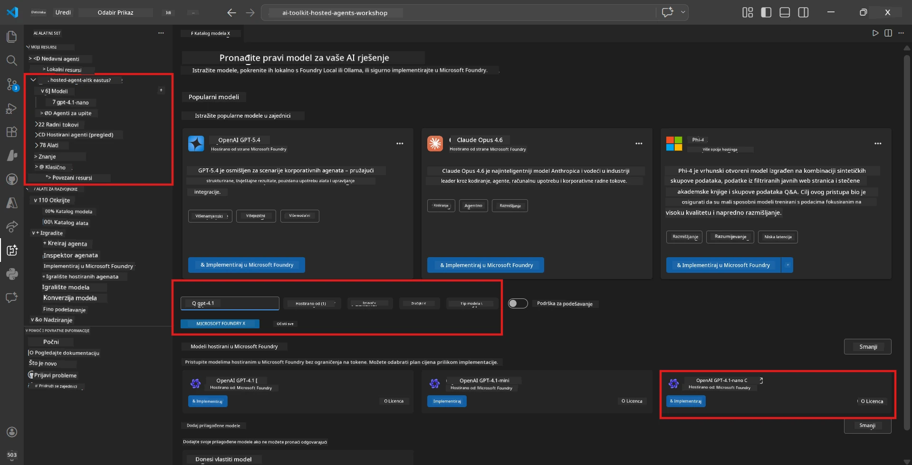
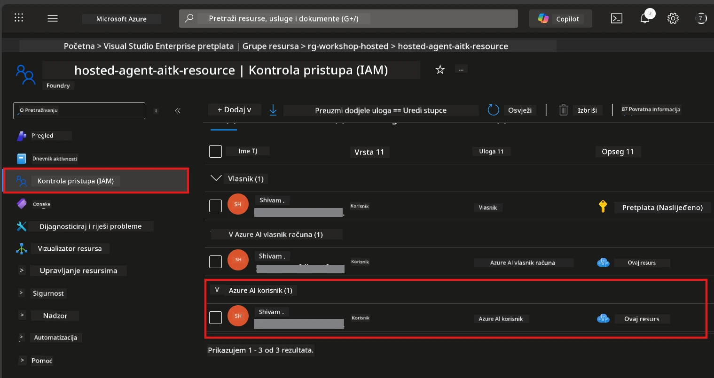

# Modul 2 - Izrada Foundry projekta i raspoređivanje modela

U ovom modulu izrađujete (ili odabirete) Microsoft Foundry projekt i raspoređujete model koji će vaš agent koristiti. Svaki je korak napisano jasno - slijedite ih redom.

> Ako već imate Foundry projekt s raspoređenim modelom, prijeđite na [Modul 3](03-create-hosted-agent.md).

---

## Korak 1: Izrada Foundry projekta iz VS Code-a

Koristit ćete Microsoft Foundry proširenje za izradu projekta bez napuštanja VS Code-a.

1. Pritisnite `Ctrl+Shift+P` za otvaranje **Command Palette**.
2. Upisite: **Microsoft Foundry: Create Project** i odaberite ga.
3. Pojavit će se padajući izbornik - odaberite svoju **Azure pretplatu** s popisa.
4. Bit ćete upitani da odaberete ili stvorite **resource group**:
   - Za stvaranje nove: upišite ime (npr. `rg-hosted-agents-workshop`) i pritisnite Enter.
   - Za korištenje postojeće: odaberite je iz padajućeg izbornika.
5. Odaberite **regiju**. **Važno:** Odaberite regiju koja podržava hostirane agente. Provjerite [dostupnost regije](https://learn.microsoft.com/azure/foundry/agents/concepts/hosted-agents#region-availability) - uobičajeni odabiri su `East US`, `West US 2` ili `Sweden Central`.
6. Unesite **ime** za Foundry projekt (npr. `workshop-agents`).
7. Pritisnite Enter i pričekajte dovršetak provisioning procesa.

> **Provisioning traje 2-5 minuta.** U donjem desnom kutu VS Code-a vidjet ćete obavijest o napretku. Nemojte zatvarati VS Code tijekom provisioning-a.

8. Kada završi, **Microsoft Foundry** bočna traka prikazat će vaš novi projekt pod **Resources**.
9. Kliknite na ime projekta da ga proširite i potvrdite da prikazuje odjeljke poput **Models + endpoints** i **Agents**.



### Alternativa: Izrada putem Foundry portala

Ako preferirate korištenje preglednika:

1. Otvorite [https://ai.azure.com](https://ai.azure.com) i prijavite se.
2. Kliknite **Create project** na početnoj stranici.
3. Unesite ime projekta, odaberite pretplatu, resource group i regiju.
4. Kliknite **Create** i pričekajte provisioning.
5. Nakon stvaranja, vratite se u VS Code – projekt bi se trebao prikazati u Foundry bočnoj traci nakon osvježavanja (kliknite ikonu za osvježavanje).

---

## Korak 2: Raspoređivanje modela

Vaš [hostirani agent](https://learn.microsoft.com/azure/foundry/agents/concepts/hosted-agents) treba Azure OpenAI model za generiranje odgovora. Sada ćete [rasporediti jedan](https://learn.microsoft.com/azure/ai-foundry/openai/how-to/create-resource#deploy-a-model).

1. Pritisnite `Ctrl+Shift+P` za otvaranje **Command Palette**.
2. Upisite: **Microsoft Foundry: Open [Model Catalog](https://learn.microsoft.com/azure/ai-foundry/openai/concepts/models)** i odaberite ga.
3. Otvorit će se pregled Model Catalogue u VS Code-u. Pregledajte ili upotrijebite tražilicu da pronađete **gpt-4.1**.
4. Kliknite na karticu modela **gpt-4.1** (ili `gpt-4.1-mini` ako želite niže troškove).
5. Kliknite **Deploy**.


6. U konfiguraciji raspoređivanja:
   - **Deployment name**: Ostavite zadano (npr. `gpt-4.1`) ili unesite prilagođeno ime. **Zapamtite ovo ime** - trebat će vam u Modulu 4.
   - **Target**: Odaberite **Deploy to Microsoft Foundry** i izaberite projekt koji ste upravo napravili.
7. Kliknite **Deploy** i pričekajte dovršetak raspoređivanja (1-3 minute).

### Odabir modela

| Model | Najbolje za | Trošak | Napomene |
|-------|-------------|--------|----------|
| `gpt-4.1` | Kvalitetni, nijansirani odgovori | Viši | Najbolji rezultati, preporučeno za konačno testiranje |
| `gpt-4.1-mini` | Brza iteracija, niži troškovi | Niži | Dobro za razvoj radionice i brzo testiranje |
| `gpt-4.1-nano` | Laganije zadatke | Najniži | Najpovoljnije, ali jednostavniji odgovori |

> **Preporuka za ovu radionicu:** Koristite `gpt-4.1-mini` za razvoj i testiranje. Brz je, jeftin i daje dobre rezultate za vježbe.

### Provjera raspoređivanja modela

1. U **Microsoft Foundry** bočnoj traci proširite svoj projekt.
2. Pogledajte pod **Models + endpoints** (ili sličan odjeljak).
3. Trebali biste vidjeti raspoređeni model (npr. `gpt-4.1-mini`) sa statusom **Succeeded** ili **Active**.
4. Kliknite na raspoređeni model da vidite njegove detalje.
5. **Zabilježite** ove dvije vrijednosti - trebat će vam u Modulu 4:

   | Postavka | Gdje je pronaći | Primjer vrijednosti |
   |----------|-----------------|--------------------|
   | **Project endpoint** | Kliknite na ime projekta u Foundry bočnoj traci. URL endpointa prikazan je u detaljima. | `https://<account>.services.ai.azure.com/api/projects/<project>` |
   | **Model deployment name** | Ime prikazano uz raspoređeni model. | `gpt-4.1-mini` |

---

## Korak 3: Dodijelite potrebne RBAC uloge

Ovo je **najčešće propušteni korak**. Bez ispravnih uloga, raspoređivanje u Modulu 6 neće uspjeti s greškom o dopuštenjima.

### 3.1 Dodijelite sebi ulogu Azure AI User

1. Otvorite preglednik i idite na [https://portal.azure.com](https://portal.azure.com).
2. U gornjoj traci za pretraživanje upišite ime svog **Foundry projekta** i kliknite na njega u rezultatima.
   - **Važno:** Navigirajte do **projektnog** resursa (tip: "Microsoft Foundry project"), **ne** do nadređenog računa/hub resursa.
3. U lijevoj navigaciji projekta kliknite **Access control (IAM)**.
4. Kliknite gumb **+ Add** na vrhu → odaberite **Add role assignment**.
5. Na kartici **Role**, potražite [**Azure AI User**](https://learn.microsoft.com/azure/foundry/concepts/rbac-foundry#built-in-roles) i odaberite ga. Kliknite **Next**.
6. Na kartici **Members**:
   - Odaberite **User, group, or service principal**.
   - Kliknite **+ Select members**.
   - Potražite svoje ime ili email, odaberite sebe i kliknite **Select**.
7. Kliknite **Review + assign** → zatim ponovno kliknite **Review + assign** za potvrdu.



### 3.2 (Opcionalno) Dodijelite ulogu Azure AI Developer

Ako trebate stvarati dodatne resurse unutar projekta ili upravljati raspoređivanjima programatski:

1. Ponovite gore navedene korake, ali u koraku 5 odaberite **Azure AI Developer**.
2. Dodijelite ovu ulogu na razini **Foundry resursa (računa)**, ne samo na razini projekta.

### 3.3 Provjerite svoje dodjele uloga

1. Na stranici **Access control (IAM)** projekta, kliknite karticu **Role assignments**.
2. Potražite svoje ime.
3. Trebali biste vidjeti barem ulogu **Azure AI User** navedenu za opseg projekta.

> **Zašto je ovo važno:** Uloga [`Azure AI User`](https://learn.microsoft.com/azure/foundry/concepts/rbac-foundry#built-in-roles) dodjeljuje akciju podataka `Microsoft.CognitiveServices/accounts/AIServices/agents/write`. Bez te uloge vidjet ćete ovu grešku tijekom raspoređivanja:
>
> ```
> Error: lacks the required data action 
> Microsoft.CognitiveServices/accounts/AIServices/agents/write 
> to perform POST /api/projects/{projectName}/assistants operation.
> ```
>
> Pogledajte [Modul 8 - Rješavanje problema](08-troubleshooting.md) za više detalja.

---

### Kontrolna točka

- [ ] Foundry projekt postoji i vidljiv je u Microsoft Foundry bočnoj traci u VS Code-u
- [ ] Najmanje jedan model je raspoređen (npr. `gpt-4.1-mini`) sa statusom **Succeeded**
- [ ] Zabilježili ste URL **project endpoint** i ime **model deployment name**
- [ ] Imate dodijeljenu ulogu **Azure AI User** na razini **projekta** (provjerite u Azure Portalu → IAM → Role assignments)
- [ ] Projekt se nalazi u [podržanoj regiji](https://learn.microsoft.com/azure/foundry/agents/concepts/hosted-agents#region-availability) za hostirane agente

---

**Prethodno:** [01 - Install Foundry Toolkit](01-install-foundry-toolkit.md) · **Sljedeće:** [03 - Create a Hosted Agent →](03-create-hosted-agent.md)

---

<!-- CO-OP TRANSLATOR DISCLAIMER START -->
**Izjava o odricanju odgovornosti**:  
Ovaj dokument preveden je korištenjem AI usluge za prevođenje [Co-op Translator](https://github.com/Azure/co-op-translator). Iako nastojimo postići točnost, imajte na umu da automatski prijevodi mogu sadržavati pogreške ili netočnosti. Izvorni dokument na izvornom jeziku treba smatrati autoritativnim izvorom. Za važne informacije preporučuje se profesionalni ljudski prijevod. Nismo odgovorni za bilo kakve nesporazume ili pogrešne interpretacije koje proizlaze iz korištenja ovog prijevoda.
<!-- CO-OP TRANSLATOR DISCLAIMER END -->