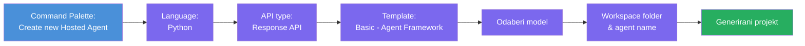
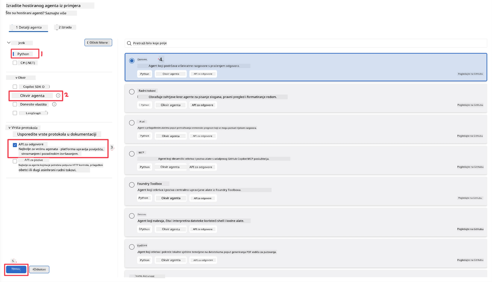
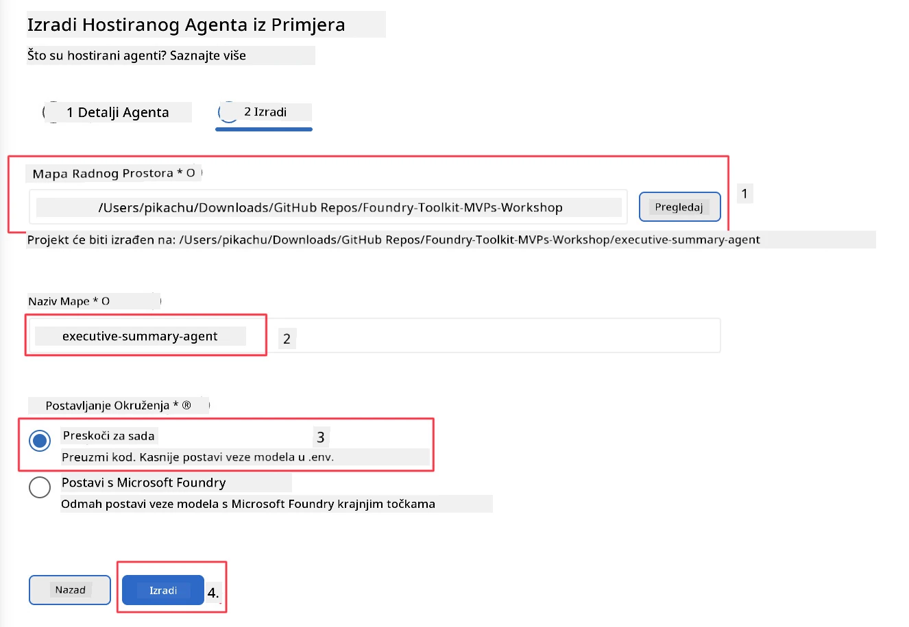

# Modul 2 - Kreirajte novog hostiranog agenta

⏱️ ~5 min

U ovom modulu koristite Foundry Toolkit za **izradu projekta hostiranog agenta pomoću scaffolda**. Scaffold generira punu strukturu projekta - `agent.yaml`, `main.py`, `Dockerfile`, `requirements.txt` i VS Code konfiguraciju za debugiranje - kako biste se mogli usredotočiti na prilagođavanje ponašanja agenta.

> **Ključni koncept:** Mapa `agent/` u ovoj vježbi je primjer onoga što Foundry Toolkit generira. Ne pišete ove datoteke od nule.

### Tijek rada čarobnjaka scaffolda



---

## Korak 1: Otvorite čarobnjak za stvaranje hostiranog agenta

1. Pritisnite `Ctrl+Shift+P` za otvaranje **Command Palette**.
2. Upisujte: **Foundry Toolkit: Create new Hosted Agent** i odaberite tu opciju.

> **Alternativa: Kreirajte preko Foundry portala**
> Ako radije koristite preglednik, možete kreirati svoj projekt na [https://ai.azure.com](https://ai.azure.com). Nakon što je projekt postavljen, vratite se u VS Code i koristite bočnu traku **Foundry Toolkit** za povezivanje s njim.

> **Alternativa:** Kliknite na ikonu **+** pored **Hosted Agents (Preview)** u bočnoj traci Foundry Toolkita.

## Korak 2: Odaberite postavke



1. U lijevom dijelu za navigaciju/izbor selektirajte sljedeće:

| Izbornik | Odabir | Napomena |
|--------|-----------|-------|
| **Jezik** | Python | Također je podržan C# |
| **Okvir** | Agent Framework | Jednostavna početna točka koristeći Agent Framework SDK |
| **Vrsta API-ja** | Response API | `POST /responses` - konverzacijski, s poviješću kojom upravlja platforma |
| **Predložak** | Basic | Jednostavna početna točka koristeći Agent Framework SDK |

2. Nakon odabira, kliknite **Next**



3. U sljedećem prozoru odaberite sljedeće:

| Izbornik | Odabir | Napomena |
|--------|-----------|-------|
| **Workspace folder** | Odaberite ciljnu mapu | npr., `/workspace/Foundry_Toolkit_for_VSCode_Lab/` ili podmapu u ovom repozitoriju |
| **Ime agenta** | Unesite ime | npr., `executive-summary-agent` |
| **Postavljanje okoline** | preskočite postavljanje za sada |  |

Kliknite **create** da biste kreirali našeg agenta. Kreirat će se nova mapa s imenom hostiranog agenta.

## Korak 3: Pregledajte generirani projekt

Nakon dovršetka scaffoldinga, provjerite vidite li ove datoteke u Exploreru (`Ctrl+Shift+E`):

```
📂 my-agent/
├── .env                ← Environment variables (placeholders)
├── .vscode/
│   ├── launch.json     ← Debug config (F5 → run + Agent Inspector)
│   └── tasks.json      ← VS Code task definitions
├── agent.yaml          ← Agent definition (kind: hosted)
├── Dockerfile          ← Container config for deployment
├── main.py             ← Agent entry point (your main code)
└── requirements.txt    ← Python dependencies
```

### Ključne datoteke objašnjene

| Datoteka | Svrha |
|------|---------|
| `agent.yaml` | Deklarira agenta kao `kind: hosted`, mapira varijable okoline, definira `/responses` protokol |
| `main.py` | Kreira `FoundryChatClient` → umotava ga u `Agent` s uputama → posluje preko `ResponsesHostServer` na portu 8088 |
| `Dockerfile` | Koristi `python:3.12-slim`, instalira ovisnosti, otkriva port 8088, pokreće `main.py` |
| `requirements.txt` | `agent-framework-foundry`, `agent-framework-foundry-hosting`, `mcp`, `debugpy` |

> **Važno:** Otvorite mapu scaffoldanog agenta izravno u VS Code-u (sama mapa `agent/`) kako bi `.vscode/launch.json` i `tasks.json` ispravno radili za F5 debugiranje.

---

### ✅ Kontrolna točka

- [ ] Scaffoldani projekt kreiran sa svim očekivanim datotekama
- [ ] `agent.yaml` prikazuje `kind: hosted` i `protocol: responses`
- [ ] `main.py` uvozi `Agent`, `FoundryChatClient`, `ResponsesHostServer`
- [ ] Mapa agenta je otvorena u VS Code-u kao korijen radnog prostora

---

**Prethodno:** [01 - Setup](01-setup.md) · **Sljedeće:** [03 - Configure & Code →](03-configure-and-code.md)

---

<!-- CO-OP TRANSLATOR DISCLAIMER START -->
**Napomena**:
Ovaj dokument je preveden korištenjem AI prevoditeljskog servisa [Co-op Translator](https://github.com/Azure/co-op-translator). Iako težimo točnosti, imajte na umu da automatski prijevodi mogu sadržavati greške ili netočnosti. Izvorni dokument na izvornom jeziku treba smatrati autoritativnim izvorom. Za važne informacije preporuča se profesionalni ljudski prijevod. Nismo odgovorni za bilo kakva nesporazumevanja ili pogrešne interpretacije koje proizlaze iz korištenja ovog prijevoda.
<!-- CO-OP TRANSLATOR DISCLAIMER END -->