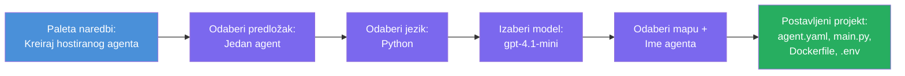

# Modul 3 - Kreirajte novog hostiranog agenta (Automatski generirano od strane Foundry ekstenzije)

U ovom modulu koristite Microsoft Foundry ekstenziju da **generirate novi [hostirani agent](https://learn.microsoft.com/azure/foundry/agents/concepts/hosted-agents) projekt**. Ekstenzija generira čitavu strukturu projekta za vas - uključujući `agent.yaml`, `main.py`, `Dockerfile`, `requirements.txt`, `.env` datoteku i VS Code debug konfiguraciju. Nakon generiranja, prilagođavate te datoteke sa uputama, alatima i konfiguracijom svog agenta.

> **Ključni koncept:** Folder `agent/` u ovom laboratorium je primjer onoga što Foundry ekstenzija generira kada pokrenete ovu naredbu za scaffold. Ne pišete ove datoteke od nule - ekstenzija ih kreira, a zatim ih mijenjate.

### Tok čarobnjaka za scaffold


---

## Korak 1: Otvorite čarobnjak za kreiranje hostiranog agenta

1. Pritisnite `Ctrl+Shift+P` da otvorite **Command Palette**.
2. Upisujte: **Microsoft Foundry: Create a New Hosted Agent** i odaberite ga.
3. Otvorit će se čarobnjak za kreiranje hostiranog agenta.

> **Alternativni put:** Do ovog čarobnjaka možete doći i preko Microsoft Foundry bočne trake → kliknite na ikonu **+** pored **Agents** ili kliknite desnim klikom i odaberite **Create New Hosted Agent**.

---

## Korak 2: Odaberite predložak

Čarobnjak će vas pitati da odaberete predložak. Vidjet ćete opcije poput:

| Predložak | Opis | Kada koristiti |
|----------|-------------|-------------|
| **Single Agent** | Jedan agent sa vlastitim modelom, uputama i opcionalnim alatima | Ovu radionicu (Lab 01) |
| **Multi-Agent Workflow** | Više agenata koji surađuju u seriji | Lab 02 |

1. Odaberite **Single Agent**.
2. Kliknite **Next** (ili će se odabir nastaviti automatski).

---

## Korak 3: Odaberite programski jezik

1. Odaberite **Python** (preporučeno za ovu radionicu).
2. Kliknite **Next**.

> **C# je također podržan** ako više volite .NET. Struktura scaffold-a je slična (koristi `Program.cs` umjesto `main.py`).

---

## Korak 4: Odaberite model

1. Čarobnjak prikazuje modele implementirane u vašem Foundry projektu (iz Modula 2).
2. Odaberite model koji ste implementirali - npr. **gpt-4.1-mini**.
3. Kliknite **Next**.

> Ako ne vidite nijedan model, vratite se na [Modul 2](02-create-foundry-project.md) i najprije implementirajte jedan.

---

## Korak 5: Odaberite lokaciju foldera i ime agenta

1. Otvara se dijalog za datoteke - odaberite **ciljni folder** gdje će se projekt kreirati. Za ovu radionicu:
   - Ako počinjete iz početka: odaberite bilo koji folder (npr. `C:\Projects\my-agent`)
   - Ako radite unutar repozitorija radionice: kreirajte novi podfolder ispod `workshop/lab01-single-agent/agent/`
2. Unesite **ime** za hostiranog agenta (npr. `executive-summary-agent` ili `my-first-agent`).
3. Kliknite **Create** (ili pritisnite Enter).

---

## Korak 6: Pričekajte da scaffold bude gotov

1. VS Code otvara **novi prozor** sa scaffoldanim projektom.
2. Pričekajte nekoliko sekundi da se projekt potpuno učita.
3. Trebali biste vidjeti sljedeće datoteke u Explorer panelu (`Ctrl+Shift+E`):

```
📂 my-first-agent/
├── .env                ← Environment variables (auto-generated with placeholders)
├── .vscode/
│   └── launch.json     ← Debug configuration (F5 to run + Agent Inspector)
├── agent.yaml          ← Agent definition (kind: hosted)
├── Dockerfile          ← Container configuration for deployment
├── main.py             ← Agent entry point (your main code file)
└── requirements.txt    ← Python dependencies
```

> **Ovo je ista struktura kao folder `agent/`** u ovom labu. Foundry ekstenzija automatski generira ove datoteke - ne morate ih ručno stvarati.

> **Napomena radionice:** U ovom repozitoriju radionice, folder `.vscode/` je na **korijenu radnog prostora** (nije unutar svakog projekta). Sadrži zajednički `launch.json` i `tasks.json` sa dvije debug konfiguracije - **"Lab01 - Single Agent"** i **"Lab02 - Multi-Agent"** - svaka sadrži ispravan `cwd` za taj lab. Kada pritisnete F5, odaberite konfiguraciju koja odgovara labu na kojem radite iz padajućeg izbornika.

---

## Korak 7: Razumite svaku generiranu datoteku

Uzmite trenutak da pregledate svaku datoteku koju je čarobnjak kreirao. Razumijevanje je važno za Modul 4 (prilagodbu).

### 7.1 `agent.yaml` - Definicija agenta

Otvorite `agent.yaml`. Izgleda ovako:

```yaml
# yaml-language-server: $schema=https://raw.githubusercontent.com/microsoft/AgentSchema/refs/heads/main/schemas/v1.0/ContainerAgent.yaml

kind: hosted
name: my-first-agent
description: >
  A hosted agent deployed to Microsoft Foundry Agent Service.
metadata:
  authors:
    - Microsoft
  tags:
    - Azure AI AgentServer
    - Microsoft Agent Framework
    - Hosted Agent
protocols:
  - protocol: responses
    version: v1
environment_variables:
  - name: AZURE_AI_PROJECT_ENDPOINT
    value: ${PROJECT_ENDPOINT}
  - name: AZURE_AI_MODEL_DEPLOYMENT_NAME
    value: ${MODEL_DEPLOYMENT_NAME}
dockerfile_path: Dockerfile
resources:
  cpu: '0.25'
  memory: 0.5Gi
```

**Ključna polja:**

| Polje | Namjena |
|-------|---------|
| `kind: hosted` | Deklarira da je ovo hostirani agent (baziran na kontejneru, implementiran u [Foundry Agent Service](https://learn.microsoft.com/azure/foundry/agents/overview)) |
| `protocols: responses v1` | Agent izlaže OpenAI-kompatibilnu `/responses` HTTP točku |
| `environment_variables` | Povezuje vrijednosti iz `.env` sa varijablama okruženja kontejnera pri implementaciji |
| `dockerfile_path` | Pokazuje na Dockerfile koji se koristi za izgradnju slike kontejnera |
| `resources` | CPU i memorijska dodjela za kontejner (0.25 CPU, 0.5Gi memorije) |

### 7.2 `main.py` - Ulazna točka agenta

Otvorite `main.py`. Ovo je glavna Python datoteka gdje se nalazi logika vašeg agenta. Scaffold uključuje:

```python
from agent_framework.azure import AzureAIAgentClient
from azure.ai.agentserver.agentframework import from_agent_framework
from azure.identity.aio import DefaultAzureCredential
```

**Ključni importi:**

| Import | Namjena |
|--------|--------|
| `AzureAIAgentClient` | Povezuje se s vašim Foundry projektom i kreira agente preko `.as_agent()` |
| [`DefaultAzureCredential`](https://learn.microsoft.com/azure/developer/python/sdk/authentication/credential-chains#defaultazurecredential-overview) | Rukuje autentifikacijom (Azure CLI, VS Code prijava, managed identity ili service principal) |
| `from_agent_framework` | Omata agenta kao HTTP server koji izlaže `/responses` end-point |

Glavni tok je:
1. Kreirajte credential → kreirajte klijenta → pozovite `.as_agent()` za dobivanje agenta (async context manager) → omotajte kao server → pokrenite ga

### 7.3 `Dockerfile` - Slika kontejnera

```dockerfile
FROM python:3.14-slim

WORKDIR /app

COPY ./ .

RUN pip install --upgrade pip && \
    if [ -f requirements.txt ]; then \
        pip install -r requirements.txt; \
    else \
        echo "No requirements.txt found" >&2; exit 1; \
    fi

EXPOSE 8088

CMD ["python", "main.py"]
```

**Ključni detalji:**
- Koristi `python:3.14-slim` kao osnovnu sliku.
- Kopira sve datoteke projekta u `/app`.
- Nadograđuje `pip`, instalira ovisnosti iz `requirements.txt` i brzo pada ako ta datoteka ne postoji.
- **Izlaže port 8088** - ovo je obavezni port za hostirane agente. Nemojte ga mijenjati.
- Pokreće agenta s `python main.py`.

### 7.4 `requirements.txt` - Ovisnosti

```
agent-framework-azure-ai==1.0.0rc3
agent-framework-core==1.0.0rc3
azure-ai-agentserver-agentframework==1.0.0b16
azure-ai-agentserver-core==1.0.0b16
debugpy
agent-dev-cli
```

| Paket | Namjena |
|---------|---------|
| `agent-framework-azure-ai` | Azure AI integracija za Microsoft Agent Framework |
| `agent-framework-core` | Osnovni runtime za izgradnju agenata (uključuje `python-dotenv`) |
| `azure-ai-agentserver-agentframework` | Runtime za hostirani agentski server za Foundry Agent Service |
| `azure-ai-agentserver-core` | Osnovne apstrakcije za serverski agent |
| `debugpy` | Podrška za Python debugging (omogućava F5 debug u VS Code) |
| `agent-dev-cli` | CLI za lokalni razvoj i testiranje agenata (koristi ga debug/run konfiguracija) |

---

## Razumijevanje protokola agenta

Hostirani agenti komuniciraju putem **OpenAI Responses API** protokola. Kada rade (lokalno ili u oblaku), agent izlaže jednu HTTP točku:

```
POST http://localhost:8088/responses
Content-Type: application/json

{
  "input": "Your prompt here",
  "stream": false
}
```

Foundry Agent Service poziva ovu točku da pošalje korisničke upite i primi odgovore agenta. To je isti protokol koji koristi OpenAI API, stoga je vaš agent kompatibilan sa bilo kojim klijentom koji podržava OpenAI Responses format.

---

### Kontrolna točka

- [ ] Čarobnjak za scaffold je uspješno završio i otvorio se **novi VS Code prozor**
- [ ] Vidite svih 5 datoteka: `agent.yaml`, `main.py`, `Dockerfile`, `requirements.txt`, `.env`
- [ ] Datoteka `.vscode/launch.json` postoji (omogućava F5 debug - u ovoj radionici je na korijenu radnog prostora s lab-specifičnim konfiguracijama)
- [ ] Prošli ste kroz svaku datoteku i razumijete njezinu svrhu
- [ ] Razumijete da je port `8088` obavezan te da `/responses` end-point predstavlja protokol

---

**Prethodno:** [02 - Create Foundry Project](02-create-foundry-project.md) · **Sljedeće:** [04 - Configure & Code →](04-configure-and-code.md)

---

<!-- CO-OP TRANSLATOR DISCLAIMER START -->
**Odricanje od odgovornosti**:  
Ovaj dokument preveden je pomoću AI usluge za prevođenje [Co-op Translator](https://github.com/Azure/co-op-translator). Iako nastojimo postići točnost, imajte na umu da automatski prijevodi mogu sadržavati pogreške ili netočnosti. Izvorni dokument na izvornom jeziku treba smatrati službenim izvorom. Za kritične informacije preporučuje se profesionalni ljudski prijevod. Nismo odgovorni za bilo kakve nesporazume ili pogrešne interpretacije koje proizlaze iz korištenja ovog prijevoda.
<!-- CO-OP TRANSLATOR DISCLAIMER END -->