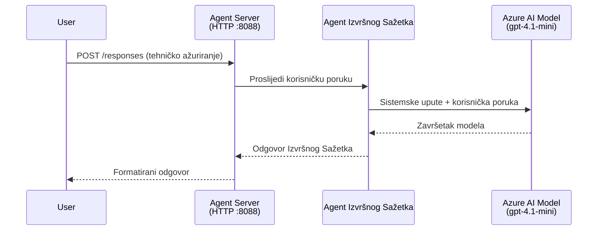
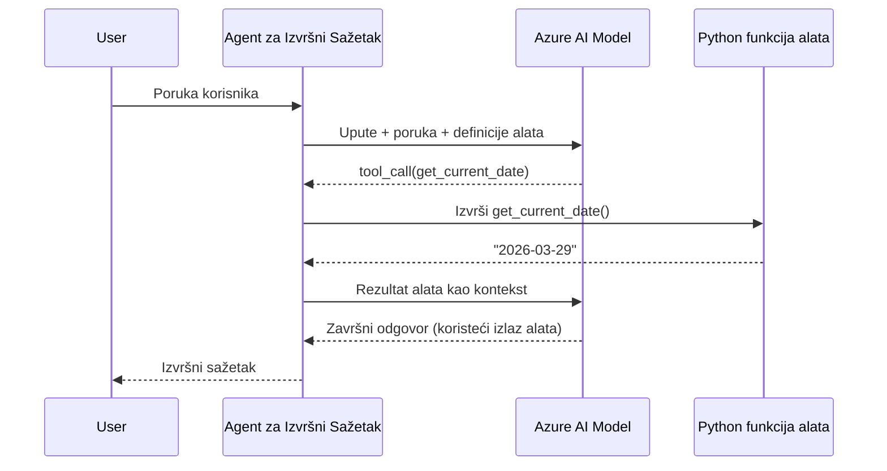

# Modul 4 - Konfigurirajte upute, okruženje i instalirajte ovisnosti

U ovom modulu, prilagođavate automatski generirane datoteke agenta iz Modula 3. Ovdje transformirate generički kostur u **svog** agenta - pisanjem uputa, postavljanjem varijabli okruženja, po želji dodavanjem alata i instaliranjem ovisnosti.

> **Podsjetnik:** Foundry proširenje automatski je generiralo vaše datoteke projekta. Sada ih mijenjate. Pogledajte mapu [`agent/`](../../../../../workshop/lab01-single-agent/agent) za kompletan radni primjer prilagođenog agenta.

---

## Kako se komponente uklapaju

### Životni ciklus zahtjeva (jedan agent)


> **S alatima:** Ako agent ima registrirane alate, model može vratiti poziv alata umjesto izravnog dovršetka. Okvir izvršava alat lokalno, vraća rezultat modelu, a model zatim generira konačni odgovor.


---

## Korak 1: Konfigurirajte varijable okruženja

Kostur je kreirao `.env` datoteku s rezerviranim vrijednostima. Trebate upisati stvarne vrijednosti iz Modula 2.

1. U svom generiranom projektu otvorite **`.env`** datoteku (nalazi se u korijenu projekta).
2. Zamijenite rezervirane vrijednosti stvarnim detaljima vašeg Foundry projekta:

   ```env
   PROJECT_ENDPOINT=https://<your-account>.services.ai.azure.com/api/projects/<your-project>
   MODEL_DEPLOYMENT_NAME=gpt-4.1-mini
   ```

3. Spremite datoteku.

### Gdje pronaći ove vrijednosti

| Vrijednost | Kako je pronaći |
|------------|-----------------|
| **Project endpoint** | Otvorite **Microsoft Foundry** bočnu traku u VS Code → kliknite na svoj projekt → URL endpointa prikazan je u detaljnom prikazu. Izgleda otprilike ovako: `https://<account-name>.services.ai.azure.com/api/projects/<project-name>` |
| **Model deployment name** | U Foundry bočnoj traci proširite svoj projekt → pogledajte pod **Models + endpoints** → ime je navedeno uz implementirani model (npr., `gpt-4.1-mini`) |

> **Sigurnost:** Nikada nemojte pohraniti `.env` datoteku u kontrolu verzija. Već je uključena u `.gitignore` prema zadanim postavkama. Ako nije, dodajte je:
> ```
> .env
> ```

### Kako varijable okruženja prolaze

Lanac mapiranja je: `.env` → `main.py` (čitano putem `os.getenv`) → `agent.yaml` (mapira na env varijable kontejnera u vrijeme implementacije).

U `main.py`, kostur čita ove vrijednosti ovako:

```python
PROJECT_ENDPOINT = os.getenv("AZURE_AI_PROJECT_ENDPOINT") or os.getenv("PROJECT_ENDPOINT")
MODEL_DEPLOYMENT_NAME = os.getenv("AZURE_AI_MODEL_DEPLOYMENT_NAME", os.getenv("MODEL_DEPLOYMENT_NAME", "gpt-4.1-mini"))
```

Prihvaćaju se i `AZURE_AI_PROJECT_ENDPOINT` i `PROJECT_ENDPOINT` (u `agent.yaml` koristi se prefiks `AZURE_AI_*`).

---

## Korak 2: Napišite upute za agenta

Ovo je najvažniji korak prilagodbe. Upute definiraju osobnost vašeg agenta, ponašanje, format izlaza i sigurnosne uvjete.

1. Otvorite `main.py` u svom projektu.
2. Pronađite niz uputa (kostur uključuje zadani/generički).
3. Zamijenite ih detaljnim, strukturiranim uputama.

### Što dobre upute uključuju

| Komponenta | Svrha | Primjer |
|------------|-------|---------|
| **Uloga** | Tko je agent i što radi | "Vi ste agent za izvršne sažetke" |
| **Publika** | Za koga su odgovori namijenjeni | "Viši rukovoditelji s ograničenim tehničkim znanjem" |
| **Definicija ulaza** | Kakve vrste upita obrađuje | "Tehnički izvještaji o incidentima, operativna ažuriranja" |
| **Format izlaza** | Točna struktura odgovora | "Izvršni sažetak: - Što se dogodilo: ... - Poslovni utjecaj: ... - Sljedeći korak: ..." |
| **Pravila** | Ograničenja i uvjeti odbijanja | "NE dodavati informacije izvan onoga što je dano" |
| **Sigurnost** | Sprječavanje zloupotrebe i halucinacija | "Ako je ulaz nejasan, zatražite pojašnjenje" |
| **Primjeri** | Parovi ulaz/izlaz za usmjeravanje ponašanja | Uključite 2-3 primjera s različitim ulazima |

### Primjer: Upute agenta za izvršni sažetak

Evo uputa koje se koriste u radionici u [`agent/main.py`](../../../../../workshop/lab01-single-agent/agent/main.py):

```python
AGENT_INSTRUCTIONS = """You are an "Explain Like I'm an Executive" agent.

Purpose:
Your job is to translate complex technical or operational information into
clear, concise, and outcome-focused summaries that can be easily understood
by non-technical executives.

Audience:
Senior leaders with limited technical background who care about impact,
risk, and what happens next.

What you must do:
- Rephrase the input so it is understandable to a non-technical audience
- Prioritize clarity, brevity, and outcomes over technical accuracy
- Remove technical jargon, logs, metrics, stack traces, and deep root-cause details
- Translate technical causes into simple cause-and-effect statements
- Explicitly call out business impact
- Always include a clear next step or action
- Maintain a neutral, factual, and calm executive tone
- Do NOT add new facts or speculate beyond the input

Standard Output Structure (always use this wording):

Executive Summary:
- What happened: <plain-language description>
- Business impact: <clear, non-technical impact>
- Next step: <clear action or mitigation>

Rules:
- Keep responses under 100 words
- Do NOT add facts beyond the input
- If input is unclear, ask for clarification
"""
```

4. Zamijenite postojeći niz uputa u `main.py` svojim prilagođenim uputama.
5. Spremite datoteku.

---

## Korak 3: (Opcionalno) Dodajte prilagođene alate

Hostirani agenti mogu izvršavati **lokalne Python funkcije** kao [alate](https://learn.microsoft.com/azure/foundry/agents/concepts/tool-catalog). Ovo je ključna prednost kôd-baziranih hostiranih agenata nad agentima koji koriste samo upite - vaš agent može pokretati proizvoljnu logiku na poslužitelju.

### 3.1 Definirajte funkciju alata

Dodajte funkciju alata u `main.py`:

```python
from agent_framework import tool

@tool
def get_current_date() -> str:
    """Returns the current date in YYYY-MM-DD format."""
    from datetime import date
    return str(date.today())
```

`@tool` dekorator pretvara standardnu Python funkciju u agentov alat. Docstring postaje opis alata koji model vidi.

### 3.2 Registrirajte alat s agentom

Kod kreiranja agenta putem `.as_agent()` kontekst menadžera, proslijedite alat u parametru `tools`:

```python
async with AzureAIAgentClient(
    project_endpoint=PROJECT_ENDPOINT,
    model_deployment_name=MODEL_DEPLOYMENT_NAME,
    credential=credential,
).as_agent(
    name="my-agent",
    instructions=AGENT_INSTRUCTIONS,
    tools=[get_current_date],
) as agent:
    server = from_agent_framework(agent)
    await server.run_async()
```

### 3.3 Kako pozivi alata funkcioniraju

1. Korisnik pošalje upit.
2. Model odlučuje treba li alat (na temelju upita, uputa i opisa alata).
3. Ako je potreban alat, okvir poziva vašu Python funkciju lokalno (unutar kontejnera).
4. Vraćena vrijednost alata šalje se natrag modelu kao kontekst.
5. Model generira konačni odgovor.

> **Alati se izvršavaju na poslužitelju** - rade unutar vašeg kontejnera, ne u korisničkom pregledniku ili modelu. To znači da imate pristup bazama podataka, API-jima, datotečnim sustavima ili bilo kojoj Python knjižnici.

---

## Korak 4: Kreirajte i aktivirajte virtualno okruženje

Prije instalacije ovisnosti, stvorite izolirano Python okruženje.

### 4.1 Kreirajte virtualno okruženje

Otvorite terminal u VS Code (`` Ctrl+` ``) i pokrenite:

```powershell
python -m venv .venv
```

Ovo će stvoriti `.venv` mapu u vašem projekt direktoriju.

### 4.2 Aktivirajte virtualno okruženje

**PowerShell (Windows):**

```powershell
.\.venv\Scripts\Activate.ps1
```

**Command Prompt (Windows):**

```cmd
.venv\Scripts\activate.bat
```

**macOS/Linux (Bash):**

```bash
source .venv/bin/activate
```

Trebali biste vidjeti `(.venv)` na početku terminalskog prompta, što znači da je virtualno okruženje aktivno.

### 4.3 Instalirajte ovisnosti

S aktiviranim virtualnim okruženjem instalirajte potrebne pakete:

```powershell
pip install -r requirements.txt
```

Ovo instalira:

| Paket | Svrha |
|--------|--------|
| `agent-framework-azure-ai==1.0.0rc3` | Azure AI integracija za [Microsoft Agent Framework](https://learn.microsoft.com/agent-framework/overview/) |
| `agent-framework-core==1.0.0rc3` | Osnovno runtime okruženje za izgradnju agenata (uključuje `python-dotenv`) |
| `azure-ai-agentserver-agentframework==1.0.0b16` | Hostirano runtime okruženje poslužitelja agenta za [Foundry Agent Service](https://learn.microsoft.com/azure/foundry/agents/overview) |
| `azure-ai-agentserver-core==1.0.0b16` | Osnovne apstrakcije poslužitelja agenta |
| `debugpy` | Python debagiranje (omogućava F5 debagiranje u VS Code) |
| `agent-dev-cli` | Lokalni razvojni CLI za testiranje agenata |

### 4.4 Provjerite instalaciju

```powershell
pip list | Select-String "agent-framework|agentserver"
```

Očekivani izlaz:
```
agent-framework-azure-ai   1.0.0rc3
agent-framework-core       1.0.0rc3
azure-ai-agentserver-agentframework 1.0.0b16
azure-ai-agentserver-core  1.0.0b16
```

---

## Korak 5: Provjerite autentifikaciju

Agent koristi [`DefaultAzureCredential`](https://learn.microsoft.com/azure/developer/python/sdk/authentication/credential-chains#defaultazurecredential-overview) koji pokušava različite metode autentifikacije u ovom redoslijedu:

1. **Varijable okruženja** - `AZURE_CLIENT_ID`, `AZURE_TENANT_ID`, `AZURE_CLIENT_SECRET` (service principal)
2. **Azure CLI** - koristi vašu `az login` sesiju
3. **VS Code** - koristi račun s kojim ste prijavljeni u VS Code
4. **Managed Identity** - koristi se pri pokretanju u Azureu (u vrijeme implementacije)

### 5.1 Provjera za lokalni razvoj

Najmanje jedna od ovih opcija treba raditi:

**Opcija A: Azure CLI (preporučeno)**

```powershell
az account show --query "{name:name, id:id}" --output table
```

Očekivano: Prikazuje ime i ID pretplate.

**Opcija B: Prijava u VS Code**

1. Pogledajte dolje lijevo u VS Code za ikonu **Accounts**.
2. Ako vidite ime svog računa, autentificirani ste.
3. Ako ne, kliknite na ikonu → **Sign in to use Microsoft Foundry**.

**Opcija C: Service principal (za CI/CD)**

```powershell
$env:AZURE_TENANT_ID = "<your-tenant-id>"
$env:AZURE_CLIENT_ID = "<your-client-id>"
$env:AZURE_CLIENT_SECRET = "<your-client-secret>"
```

### 5.2 Čest problem s autentifikacijom

Ako ste prijavljeni u više Azure računa, provjerite je li odabrana ispravna pretplata:

```powershell
az account set --subscription "<your-subscription-id>"
```

---

### Kontrolna lista

- [ ] `.env` datoteka ima valjane `PROJECT_ENDPOINT` i `MODEL_DEPLOYMENT_NAME` (ne rezervirane vrijednosti)
- [ ] Upute za agenta su prilagođene u `main.py` - definiraju ulogu, publiku, format izlaza, pravila i sigurnosne uvjete
- [ ] (Opcionalno) Prilagođeni alati su definirani i registrirani
- [ ] Virtualno okruženje je kreirano i aktivirano (`(.venv)` vidljivo u terminalnom promptu)
- [ ] `pip install -r requirements.txt` je uspješno završen bez pogrešaka
- [ ] `pip list | Select-String "azure-ai-agentserver"` pokazuje da je paket instaliran
- [ ] Autentifikacija je valjana - `az account show` vraća vašu pretplatu ILI ste prijavljeni u VS Code

---

**Prethodno:** [03 - Create Hosted Agent](03-create-hosted-agent.md) · **Dalje:** [05 - Test Locally →](05-test-locally.md)

---

<!-- CO-OP TRANSLATOR DISCLAIMER START -->
**Odricanje od odgovornosti**:
Ovaj dokument je preveden pomoću AI usluge prevođenja [Co-op Translator](https://github.com/Azure/co-op-translator). Iako nastojimo postići točnost, imajte na umu da automatski prijevodi mogu sadržavati pogreške ili netočnosti. Izvorni dokument na izvornom jeziku treba smatrati autoritativnim izvorom. Za ključne informacije preporučuje se profesionalni ljudski prijevod. Ne snosimo odgovornost za bilo kakve nesporazume ili pogrešne interpretacije koje proizađu iz korištenja ovog prijevoda.
<!-- CO-OP TRANSLATOR DISCLAIMER END -->