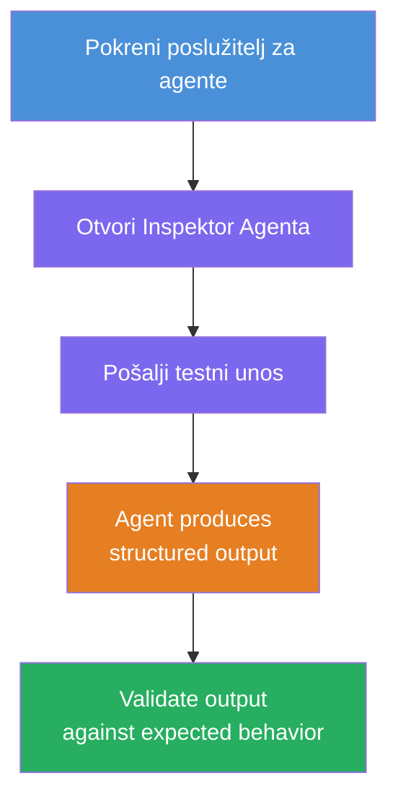
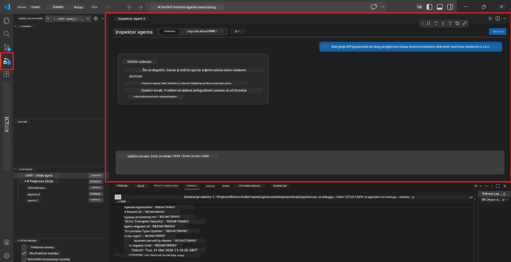
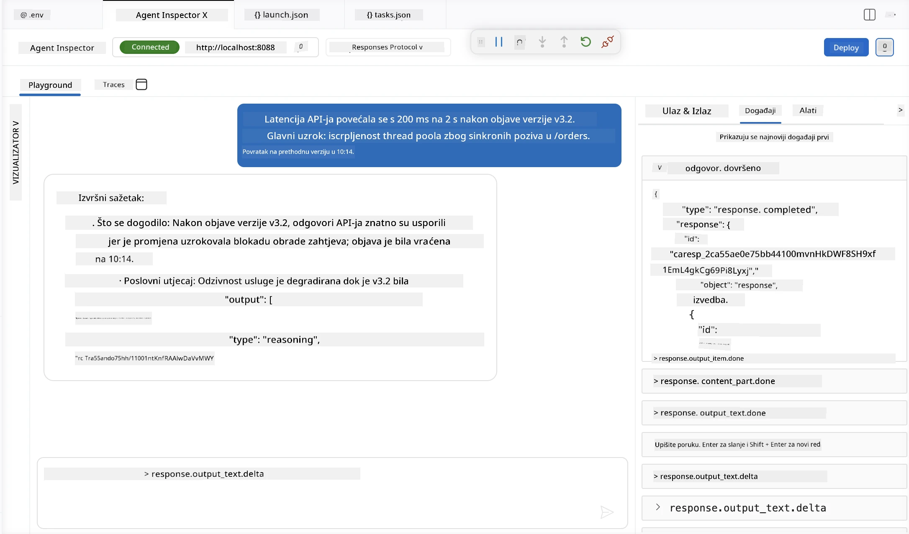

# Modul 4 - Testiraj lokalno

⏱️ ~10 min

U ovom modulu pokrenut ćete svog agenta lokalno i provjeriti radi li ispravno pomoću **testova funkcionalnosti happy-path**. Koristit ćete Agent Inspector (vizualno sučelje) ili izravne HTTP pozive kako biste potvrdili da agent proizvodi strukturirane i točne odgovore.

### Tijek lokalnog testiranja



---

## Opcija 1: Pritisnite F5 - Debug s Agent Inspectorom (preporučeno)

### Pokrenite debugger

1. Otvorite mapu **executive-summary-agent/** izravno u VS Code-u (`Datoteka → Otvori mapu`).
2. Otvorite panel **Pokreni i debugiraj** (`Ctrl+Shift+D`).
3. Iz padajućeg izbornika odaberite **Debug Local Agent Server**.
4. Pritisnite **F5** (ili kliknite ▶ Pokreni debugiranje).

> ⚠️ **Važno: Odaberite svoj Python Interpreter**
> Ako dobijete "ModuleNotFoundError" ili debugging se ne pokreće, morate reći VS Code-u da koristi vaš virtualni okoliš:
  > 1. Pritisnite `Ctrl+Shift+P` $\rightarrow$ upišite **Python: Select Interpreter**.
  > 2. Odaberite interpreter koji se nalazi u `.venv` mapi vašeg projekta (npr. `.\.venv\Scripts\python.exe` na Windowsu).
  > 3. Ponovno pokrenite debug sesiju.
> Ako i dalje dobivate greške, ručno ažurirajte svoju datoteku `tasks.json` na sljedeći način:
  > 1. Otvorite `.vscode/tasks.json` datoteku
  > 2. Pronađite naredbu s oznakom: `Run Agent/Workflow HTTP Server`
  > 3. Ažurirajte vrijednost naredbe kao: `"value": "${workspaceFolder}/.venv/bin/python",`

### Što se događa

1. HTTP poslužitelj se pokreće na `http://localhost:8088/responses`.
2. Panel **Agent Inspector** se automatski otvara - vizualno chat sučelje za testiranje.
3. Breakpointi su omogućeni u `main.py`.

Pratite Terminal za:
```
Starting executive summary hosted agent
Executive agent server running on http://localhost:8088
```

> **Ako se Agent Inspector ne otvori:** Pritisnite `Ctrl+Shift+P` → **Foundry Toolkit: Open Agent Inspector**.



> *Snimka zaslona može prikazivati stariji 'AI TOOLKIT' brand iz ranije verzije ekstenzije.*

---

## Opcija 2: Testirajte preko Terminala (alternativa)

Pokrenite agenta u jednom terminalu, šaljite zahtjeve iz drugog:

```bash
# Terminal 1: Pokreni agenta
cd executive-summary-agent/
source .venv/bin/activate
python main.py
```

```bash
# Terminal 2: Pošalji test (curl)
curl -sS -X POST http://localhost:8088/responses \
  -H "Content-Type: application/json" \
  -d '{"input": "The API latency increased due to thread pool exhaustion caused by sync calls in v3.2.", "stream": false}'
```

---

## Testovi scenarija: Happy-path funkcionalna validacija

Pokrenite **sva tri** scenarija u nastavku. Oni potvrđuju da agent daje točne, strukturirane izlaze za realistične ulaze.



### Scenarij 1: IT incident - skok latencije API-ja

**Ulaz:**
```
The API latency increased from 200ms to 2s after deploying v3.2.
Root cause: thread pool starvation from synchronous calls in /orders.
Rolled back at 10:14.
```

**Očekivano ponašanje:**
- ✅ Slijedi strukturu "Executive Summary" (Što se dogodilo / Poslovni utjecaj / Sljedeći korak)
- ✅ Nema tehničkog žargona (nema "thread pool", nema "/orders", nema "v3.2")
- ✅ Jasno navodi poslovni utjecaj (npr. korisnici su doživjeli kašnjenja)
- ✅ Uključuje sljedeći korak (npr. popravak implementiran, nadzor uspostavljen)

---

### Scenarij 2: Data Pipeline - neuspjeh ETL-a

**Ulaz:**
```
The nightly ETL job failed because the upstream schema changed. APAC dashboards show missing data.
```

**Očekivano ponašanje:**
- ✅ Sažima neuspjeh osvježavanja podataka jasnim jezikom
- ✅ Spominje utjecaj na APAC dashboard
- ✅ Uključuje korak za otklanjanje problema
- ✅ NE spominje "ETL", "shema" ili druge tehničke pojmove

---

### Scenarij 3: Sigurnost - izloženi vjerodajnici

**Ulaz:**
```
Static analysis flagged a hardcoded secret in the repository.
The secret may have been exposed in commit history.
```

**Očekivano ponašanje:**
- ✅ Opisuje sigurnosni problem vjerodajnica jezikom razumljivim izvršnoj osobi
- ✅ Ukazuje na potencijalni rizik (neovlašteni pristup)
- ✅ Navodi akciju otklanjanja problema (rotacija vjerodajnica, revizija)
- ✅ NE uključuje pojmove kao "static analysis", "commit history" ili "hardcoded"

---

## Kriteriji validacije

Za svaki scenarij provjerite:

| # | Kriterij | Uvjet prolaza |
|---|----------|---------------|
| 1 | **Struktura** | Odgovor koristi format "Executive Summary" sa sva tri stavka |
| 2 | **Jednostavan jezik** | Nema tehničkog žargona kojeg izvršna osoba ne bi razumjela |
| 3 | **Točnost** | Sažetak odražava ulaz - nema izmiješanih detalja |
| 4 | **Suženost** | Odgovor je ispod 100 riječi |
| 5 | **Sljedeći korak** | Jasno je navedena akcija ili mjera |

---

## Savjeti za debugiranje

| Problem | Rješenje |
|-------|-----|
| Agent se ne pokreće | Provjerite `.env` vrijednosti, potvrdite da je venv aktiviran, pokrenite `pip install -r requirements.txt` |
| Prazan ili generički odgovor | Pregledajte upute u `main.py` - provjerite da je format izlaza specificiran |
| Odgovor uključuje žargon | Pojačajte pravila "ukloni tehničke termine" u uputama |
| Agent Inspector se ne otvara | `Ctrl+Shift+P` → **Foundry Toolkit: Open Agent Inspector** |
| Greške modela u Terminalu | Provjerite da `AZURE_AI_MODEL_DEPLOYMENT_NAME` točno odgovara (osjetljivo na velika/mala slova) |

---

### ✅ Kontrolna točka

- [ ] Agent se pokreće lokalno bez pogrešaka
- [ ] Agent Inspector se otvara i pokazuje chat sučelje (ako se koristi F5)
- [ ] **Scenarij 1** (IT incident) - strukturirani Executive Summary, bez žargona
- [ ] **Scenarij 2** (data pipeline) - relevantan sažetak s poslovnim utjecajem
- [ ] **Scenarij 3** (sigurnosno upozorenje) - odgovarajuća komunikacija rizika
- [ ] Svi odgovori slijede definiranu strukturu izlaza

> **Spremite svoje odgovore** (kopirajte ili napravite snimku zaslona) - usporedit ćete ih s rezultatima u oblaku u Modulu 06.

---

**Prethodno:** [03 - Konfiguracija i kodiranje](03-configure-and-code.md) · **Sljedeće:** [05 - Implementacija u Foundry →](05-deploy-to-foundry.md)

---

<!-- CO-OP TRANSLATOR DISCLAIMER START -->
**Napomena**:
Ovaj dokument je preveden korištenjem AI prevoditeljskog servisa [Co-op Translator](https://github.com/Azure/co-op-translator). Iako težimo točnosti, imajte na umu da automatski prijevodi mogu sadržavati greške ili netočnosti. Izvorni dokument na izvornom jeziku treba smatrati autoritativnim izvorom. Za važne informacije preporuča se profesionalni ljudski prijevod. Nismo odgovorni za bilo kakva nesporazumevanja ili pogrešne interpretacije koje proizlaze iz korištenja ovog prijevoda.
<!-- CO-OP TRANSLATOR DISCLAIMER END -->