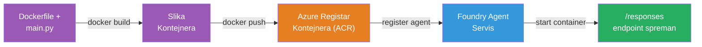
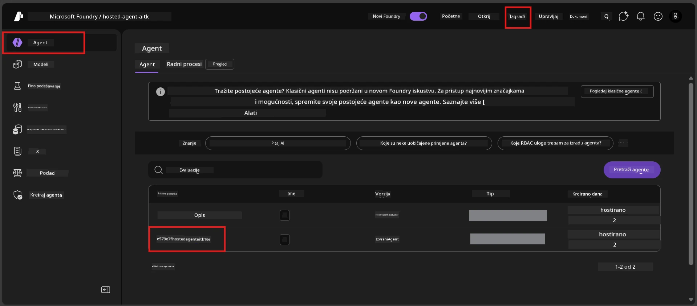

# Modul 6 - Implementacija na Foundry Agent Service

U ovom modulu implementirate svog lokalno testiranog agenta na Microsoft Foundry kao [**Hosted Agent**](https://learn.microsoft.com/azure/foundry/agents/concepts/hosted-agents). Proces implementacije gradi Docker kontejnersku sliku iz vašeg projekta, šalje je u [Azure Container Registry (ACR)](https://learn.microsoft.com/azure/container-registry/container-registry-intro) i kreira verziju hostanog agenta u [Foundry Agent Service](https://learn.microsoft.com/azure/foundry/agents/overview).

### Pipeline za implementaciju


---

## Provjera preduvjeta

Prije implementacije provjerite svaki donji stavku. Preskakanje ovih je najčešći uzrok neuspjeha implementacije.

1. **Agent prolazi lokalne testove:**
   - Dovršili ste sva 4 testa u [Modul 5](05-test-locally.md) i agent je ispravno odgovorio.

2. **Imate ulogu [Azure AI User](https://learn.microsoft.com/azure/foundry/concepts/rbac-foundry#built-in-roles):**
   - Dodijeljena je u [Modul 2, Korak 3](02-create-foundry-project.md). Ako niste sigurni, provjerite sada:
   - Azure Portal → vaš Foundry **projekt** resurs → **Access control (IAM)** → kartica **Dodjele uloga** → pretražite svoje ime → potvrdite da je navedeno **Azure AI User**.

3. **Prijavljeni ste u Azure u VS Code:**
   - Provjerite ikonu Računi u donjem lijevom kutu VS Code-a. Trebalo bi se vidjeti vaše korisničko ime.

4. **(Neobavezno) Pokrenut je Docker Desktop:**
   - Docker je potreban samo ako vam Foundry ekstenzija zazove lokalnu izgradnju. U većini slučajeva, ekstenzija automatski radi gradnje kontejnera tijekom implementacije.
   - Ako imate instaliran Docker, provjerite radi li naredbom: `docker info`

---

## Korak 1: Pokrenite implementaciju

Imate dva načina za implementaciju – oba vode do istog rezultata.

### Opcija A: Implementacija iz Agent Inspectora (preporučeno)

Ako pokrećete agenta s debuggerom (F5) i Agent Inspector je otvoren:

1. Pogledajte u **gornji desni kut** panela Agent Inspectora.
2. Kliknite na gumb **Deploy** (ikona oblaka sa strelicom prema gore ↑).
3. Otvara se čarobnjak za implementaciju.

### Opcija B: Implementacija iz Command Palette-a

1. Pritisnite `Ctrl+Shift+P` da otvorite **Command Palette**.
2. Upisujte: **Microsoft Foundry: Deploy Hosted Agent** i odaberite to.
3. Otvara se čarobnjak za implementaciju.

---

## Korak 2: Konfigurirajte implementaciju

Čarobnjak za implementaciju vas vodi kroz konfiguraciju. Ispunite svaki upitnik:

### 2.1 Odaberite ciljani projekt

1. Padajući izbornik prikazuje vaše Foundry projekte.
2. Odaberite projekt koji ste kreirali u Modulu 2 (npr. `workshop-agents`).

### 2.2 Odaberite datoteku agent kontejnera

1. Bit ćete upitani da odaberete ulaznu točku agenta.
2. Odaberite **`main.py`** (Python) – ova datoteka služi za identifikaciju vašeg agent projekta.

### 2.3 Konfigurirajte resurse

| Postavka | Preporučena vrijednost | Napomene |
|---------|------------------|-------|
| **CPU** | `0.25` | Zadano, dovoljno za radionicu. Povećajte za produkcijske učitke |
| **Memorija** | `0.5Gi` | Zadano, dovoljno za radionicu |

Ovo odgovara vrijednostima u `agent.yaml`. Možete prihvatiti zadane vrijednosti.

---

## Korak 3: Potvrdite i implementirajte

1. Čarobnjak prikazuje sažetak implementacije s:
   - Imena ciljanog projekta
   - Imena agenta (iz `agent.yaml`)
   - Datoteke kontejnera i resurse
2. Pregledajte sažetak i kliknite **Confirm and Deploy** (ili **Deploy**).
3. Pratite napredak u VS Code-u.

### Što se događa tijekom implementacije (korak po korak)

Implementacija je višekoračni proces. Pratite u VS Code **Output** panelu (odaberite "Microsoft Foundry" iz padajućeg izbornika):

1. **Docker build** – VS Code gradi Docker kontejnersku sliku iz vašeg `Dockerfile`. Vidjet ćete poruke o slojevima Dockera:
   ```
   Step 1/6 : FROM python:<version>-slim
   Step 2/6 : WORKDIR /app
   ...
   Successfully built abc123def456
   ```

2. **Docker push** – Slika se šalje u **Azure Container Registry (ACR)** povezanu s vašim Foundry projektom. Prvi put može potrajati 1-3 minute (osnovna slika je >100MB).

3. **Registracija agenta** – Foundry Agent Service kreira novog hostanog agenta (ili novu verziju ako agent već postoji). Koriste se metapodaci iz `agent.yaml`.

4. **Pokretanje kontejnera** – Kontejner se pokreće u Foundry-jevom upravljanom okruženju. Platforma dodjeljuje [sustavski upravljani identitet](https://learn.microsoft.com/azure/foundry/agents/concepts/agent-identity) i izlaže `/responses` endpoint.

> **Prva implementacija je sporija** (Docker mora poslati sve slojeve). Sljedeće implementacije su brže jer Docker kešira nepromijenjene slojeve.

---

## Korak 4: Provjerite status implementacije

Nakon što naredba za implementaciju završi:

1. Otvorite **Microsoft Foundry** bočnu traku klikom na Foundry ikonu u Activity Baru.
2. Proširite sekciju **Hosted Agents (Preview)** ispod vašeg projekta.
3. Trebali biste vidjeti ime vašeg agenta (npr. `ExecutiveAgent` ili ime iz `agent.yaml`).
4. **Kliknite na ime agenta** da ga proširite.
5. Vidjet ćete jednu ili više **verzija** (npr. `v1`).
6. Kliknite na verziju da vidite **Detalje o kontejneru**.
7. Provjerite polje **Status**:

   | Status | Značenje |
   |--------|---------|
   | **Started** ili **Running** | Kontejner je u radu i agent je spreman |
   | **Pending** | Kontejner se pokreće (čekajte 30-60 sekundi) |
   | **Failed** | Kontejner nije uspio pokrenuti se (provjerite logove - vidi ispravljanje problema dolje) |



> **Ako status "Pending" traje duže od 2 minute:** Kontejner možda preuzima osnovnu sliku. Pričekajte malo duže. Ako ostane na čekanju, provjerite logove kontejnera.

---

## Česte pogreške pri implementaciji i rješenja

### Pogreška 1: Permission denied - `agents/write`

```
Error: lacks the required data action 
Microsoft.CognitiveServices/accounts/AIServices/agents/write 
to perform POST /api/projects/{projectName}/assistants operation.
```

**Glavni razlog:** Nemate ulogu `Azure AI User` na razini **projekta**.

**Ispravljanje korak po korak:**

1. Otvorite [https://portal.azure.com](https://portal.azure.com).
2. U tražilicu upišite ime svog Foundry **projekta** i kliknite ga.
   - **Kritično:** Provjerite da ste na resursu **projekta** (vrsta: "Microsoft Foundry project"), a NE na nadređenom računu/hub resursu.
3. U lijevoj navigaciji kliknite **Access control (IAM)**.
4. Kliknite **+ Add** → **Add role assignment**.
5. Na kartici **Role**, tražite [**Azure AI User**](https://learn.microsoft.com/azure/foundry/concepts/rbac-foundry#built-in-roles) i odaberite je. Kliknite **Next**.
6. Na kartici **Members**, odaberite **User, group, or service principal**.
7. Kliknite **+ Select members**, pronađite svoje ime/email, odaberite sebe, kliknite **Select**.
8. Kliknite **Review + assign** → ponovo **Review + assign**.
9. Pričekajte 1-2 minute da se dodjela uloge propagira.
10. **Ponovno pokrenite implementaciju** iz Koraka 1.

> Uloga mora biti na opsegu **projekta**, ne samo na računu. Ovo je najčešći razlog neuspjeha implementacije.

### Pogreška 2: Docker nije pokrenut

```
Error: Docker build failed / Cannot connect to Docker daemon
```

**Rješenje:**
1. Pokrenite Docker Desktop (pronađite ga u Start izborniku ili sistemskoj traci).
2. Pričekajte da prikaže "Docker Desktop is running" (30-60 sekundi).
3. Provjerite: `docker info` u terminalu.
4. **Za Windows:** Provjerite da je omogućeno WSL 2 backend u Docker Desktop postavkama → **General** → **Use the WSL 2 based engine**.
5. Pokušajte ponovno implementaciju.

### Pogreška 3: ACR autorizacija - `AcrPullUnauthorized`

```
Error: AcrPullUnauthorized
```

**Glavni razlog:** Upravni identitet Foundry projekta nema pristup za povlačenje iz registra kontejnera.

**Rješenje:**
1. U Azure Portalu idite na svoj **[Container Registry](https://learn.microsoft.com/azure/container-registry/container-registry-intro)** (nalazi se u istoj grupi resursa kao Foundry projekt).
2. Idite na **Access control (IAM)** → **Dodaj** → **Dodaj dodjelu uloge**.
3. Odaberite ulogu **[AcrPull](https://learn.microsoft.com/azure/container-registry/container-registry-roles)**.
4. U odjeljku Members odaberite **Managed identity** → potražite upravni identitet Foundry projekta.
5. **Review + assign**.

> Ovo je obično automatski postavljeno od strane Foundry ekstenzije. Ako vidite ovu pogrešku, može značiti da automatsko postavljanje nije uspjelo.

### Pogreška 4: Neusklađenost platforme kontejnera (Apple Silicon)

Ako implementirate s Apple Silicon Mac (M1/M2/M3), kontejner mora biti izgrađen za `linux/amd64`:

```bash
docker build --platform linux/amd64 -t myagent:v1 .
```

> Foundry ekstenzija ovo automatski rješava za većinu korisnika.

---

### Kontrolna točka

- [ ] Naredba za implementaciju završila bez pogrešaka u VS Code-u
- [ ] Agent se prikazuje pod **Hosted Agents (Preview)** u Foundry bočnoj traci
- [ ] Kliknuli ste na agenta → odabrali verziju → vidjeli **Detalje o kontejneru**
- [ ] Status kontejnera pokazuje **Started** ili **Running**
- [ ] (Ako su se pojavile pogreške) Identificirali ste pogrešku, primijenili popravak i ponovo uspješno implementirali

---

**Prethodni:** [05 - Test Locally](05-test-locally.md) · **Sljedeći:** [07 - Verify in Playground →](07-verify-in-playground.md)

---

<!-- CO-OP TRANSLATOR DISCLAIMER START -->
**Odricanje od odgovornosti**:  
Ovaj dokument preveden je korištenjem AI usluge za prijevod [Co-op Translator](https://github.com/Azure/co-op-translator). Iako težimo točnosti, imajte na umu da automatski prijevodi mogu sadržavati pogreške ili netočnosti. Izvorni dokument na izvornom jeziku treba smatrati autoritativnim izvorom. Za kritične informacije preporučuje se profesionalni ljudski prijevod. Nismo odgovorni za bilo kakva nesporazuma ili pogrešne interpretacije koje proizlaze iz korištenja ovog prijevoda.
<!-- CO-OP TRANSLATOR DISCLAIMER END -->