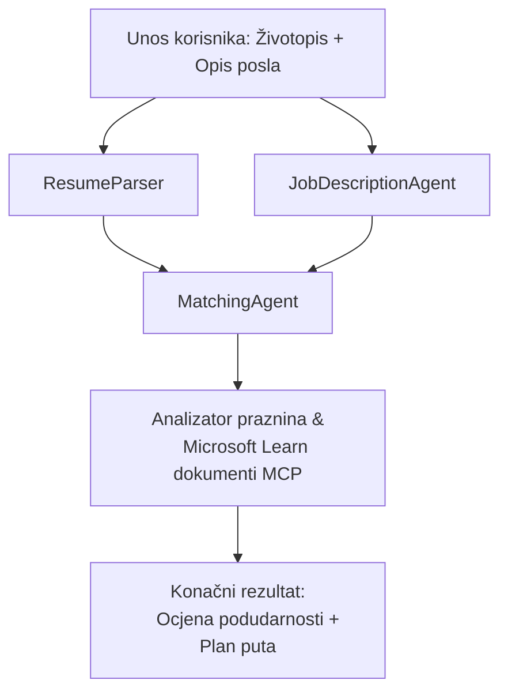

# PersonalCareerCopilot - Evaluator usklađenosti životopisa s poslom

Višestruki agentni tijek rada koji procjenjuje koliko se životopis podudara s opisom posla, a zatim generira personalizirani plan učenja za zatvaranje praznina.

---

## Agent

| Agent | Uloga | Alati |
|-------|-------|-------|
| **ResumeParser** | Izvlači strukturirane vještine, iskustvo, certifikate iz teksta životopisa | - |
| **JobDescriptionAgent** | Izvlači potrebne/preferirane vještine, iskustvo, certifikate iz opisa posla | - |
| **MatchingAgent** | Uspoređuje profil s zahtjevima → ocjena usklađenosti (0-100) + podudarajuće/nedostajuće vještine | - |
| **GapAnalyzer** | Izrađuje personalizirani plan učenja s Microsoft Learn resursima | `search_microsoft_learn_for_plan` (MCP) |

## Tijek rada


---

## Brzi početak

### 1. Postavite okruženje

```powershell
cd workshop\lab02-multi-agent\PersonalCareerCopilot
python -m venv .venv
.\.venv\Scripts\Activate.ps1          # Windows PowerShell
# source .venv/bin/activate            # macOS / Linux
pip install -r requirements.txt
```

### 2. Konfigurirajte vjerodajnice

Kopirajte primjer datoteke env i ispunite podatke o vašem Foundry projektu:

```powershell
cp .env.example .env
```

Uredite `.env`:

```env
PROJECT_ENDPOINT=https://<your-account>.services.ai.azure.com/api/projects/<your-project>
MODEL_DEPLOYMENT_NAME=gpt-4.1-mini
```

| Vrijednost | Gdje je pronaći |
|------------|-----------------|
| `PROJECT_ENDPOINT` | Microsoft Foundry bočna traka u VS Code → desni klik na projekt → **Copy Project Endpoint** |
| `MODEL_DEPLOYMENT_NAME` | Foundry bočna traka → proširite projekt → **Models + endpoints** → ime implementacije |

### 3. Pokrenite lokalno

```powershell
python -m debugpy --listen 127.0.0.1:5679 -m agentdev run main.py --verbose --port 8088
```

Ili koristite VS Code zadatak: `Ctrl+Shift+P` → **Tasks: Run Task** → **Run Lab02 HTTP Server**.

### 4. Testirajte s Agent Inspectorom

Otvorite Agent Inspector: `Ctrl+Shift+P` → **Foundry Toolkit: Open Agent Inspector**.

Zalijepite ovaj ispitni prompt:

```
Resume:
Jane Doe
Senior Software Engineer with 5 years of experience in Python, Django, and AWS.
Built microservices handling 10K+ requests/second. Led a team of 4 developers.
Certifications: AWS Solutions Architect Associate.
Education: B.S. Computer Science, State University.

Job Description:
Senior Cloud Engineer at Contoso Ltd.
Required: Python, Azure, Kubernetes, Terraform, CI/CD pipelines.
Preferred: Go, monitoring (Prometheus/Grafana), cost optimization.
Experience: 5+ years in cloud infrastructure.
Certifications: Azure Solutions Architect Expert preferred.
```

**Očekivano:** Ocjena usklađenosti (0-100), podudarajuće/nedostajuće vještine, te personalizirani plan učenja s Microsoft Learn URL-ovima.

### 5. Implementirajte u Foundry

`Ctrl+Shift+P` → **Microsoft Foundry: Deploy Hosted Agent** → odaberite projekt → potvrdite.

---

## Struktura projekta

```
PersonalCareerCopilot/
├── .env.example        ← Template for environment variables
├── .env                ← Your credentials (git-ignored)
├── agent.yaml          ← Hosted agent definition (name, resources, env vars)
├── Dockerfile          ← Container image for Foundry deployment
├── main.py             ← 4-agent workflow (instructions, MCP tool, WorkflowBuilder)
└── requirements.txt    ← Python dependencies
```

## Ključne datoteke

### `agent.yaml`

Definira hostiranog agenta za Foundry Agent Service:
- `kind: hosted` - radi kao upravljani kontejner
- `protocols: [responses v1]` - izlaže `/responses` HTTP krajnju točku
- `environment_variables` - `PROJECT_ENDPOINT` i `MODEL_DEPLOYMENT_NAME` se ubrizgavaju pri implementaciji

### `main.py`

Sadrži:
- **Upute za agente** - četiri konstante `*_INSTRUCTIONS`, jedna po agentu
- **MCP alat** - `search_microsoft_learn_for_plan()` poziva `https://learn.microsoft.com/api/mcp` preko Streamable HTTP
- **Kreiranje agenata** - `create_agents()` context manager koristeći `AzureAIAgentClient.as_agent()`
- **Dijagram tijeka rada** - `create_workflow()` koristi `WorkflowBuilder` za povezivanje agenata s fan-out/fan-in/sekvencijskim obrascima
- **Pokretanje servera** - `from_agent_framework(agent).run_async()` na portu 8088

### `requirements.txt`

| Paket | Verzija | Namjena |
|--------|---------|---------|
| `agent-framework-azure-ai` | `1.0.0rc3` | Azure AI integracija za Microsoft Agent Framework |
| `agent-framework-core` | `1.0.0rc3` | Osnovno izvršno okruženje (uključuje WorkflowBuilder) |
| `azure-ai-agentserver-agentframework` | `1.0.0b16` | Runtime za hostiranog agenta servera |
| `azure-ai-agentserver-core` | `1.0.0b16` | Osnovne apstrakcije agent servera |
| `debugpy` | najnovije | Python debugging (F5 u VS Code) |
| `agent-dev-cli` | `--pre` | Lokalni razvojni CLI + backend za Agent Inspector |

---

## Rješavanje problema

| Problem | Rješenje |
|----------|-----------|
| `RuntimeError: Missing required environment variable(s)` | Kreirajte `.env` s `PROJECT_ENDPOINT` i `MODEL_DEPLOYMENT_NAME` |
| `ModuleNotFoundError: No module named 'agent_framework'` | Aktivirajte venv i pokrenite `pip install -r requirements.txt` |
| Nema Microsoft Learn URL-ova u izlazu | Provjerite internetsku vezu prema `https://learn.microsoft.com/api/mcp` |
| Samo jedna kartica praznine (skraćeno) | Provjerite da `GAP_ANALYZER_INSTRUCTIONS` uključuje blok `CRITICAL:` |
| Port 8088 je zauzet | Zaustavite ostale servere: `netstat -ano \| findstr :8088` |

Za detaljno rješavanje problema pogledajte [Modul 8 - Rješavanje problema](../docs/08-troubleshooting.md).

---

**Cjeloviti vodič:** [Lab 02 Docs](../docs/README.md) · **Natrag na:** [Lab 02 README](../README.md) · [Početna stranica radionice](../../../README.md)

---

<!-- CO-OP TRANSLATOR DISCLAIMER START -->
**Odricanje od odgovornosti**:  
Ovaj je dokument preveden pomoću AI usluge za prevođenje [Co-op Translator](https://github.com/Azure/co-op-translator). Iako težimo točnosti, imajte na umu da automatski prijevodi mogu sadržavati pogreške ili netočnosti. Izvorni dokument na izvornom jeziku treba smatrati autoritativnim izvorom. Za kritične informacije preporuča se profesionalni ljudski prijevod. Nismo odgovorni za bilo kakve nesporazume ili pogrešna tumačenja koja proizlaze iz korištenja ovog prijevoda.
<!-- CO-OP TRANSLATOR DISCLAIMER END -->