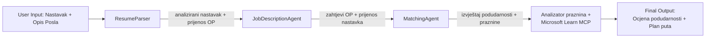

# PersonalCareerCopilot - Evaluator Usklađenosti Životopisa s Poslom

Višeagentna aplikacija fokusirana na tok rada koja procjenjuje koliko životopis odgovara opisu posla, zatim generira personalizirani plan učenja za zatvaranje praznina.

---

## Agenti

| Agent | Uloga | Alati |
|-------|------|-------|
| **ResumeParser** | Ekstrahira strukturirane vještine, iskustvo, certifikate iz teksta životopisa | - |
| **JobDescriptionAgent** | Ekstrahira potrebne/preferirane vještine, iskustvo, certifikate iz opisa posla | - |
| **MatchingAgent** | Uspoređuje profil i zahtjeve → ocjena usklađenosti (0-100) + povezane/nedostajuće vještine | - |
| **GapAnalyzer** | Izgrađuje personalizirani plan učenja s Microsoft Learn resursima | `search_microsoft_learn_for_plan` (MCP) |

## Tok rada


```mermaid
flowchart LR
    UserInput["User Input: Nastavak + Opis Posla"] --> ResumeParser
    ResumeParser -- "analizirani nastavak + prijenos OP" --> JobDescriptionAgent
    JobDescriptionAgent -- "zahtjevi OP + prijenos nastavka" --> MatchingAgent
    MatchingAgent -- "izvještaj podudarnosti + praznine" --> GapAnalyzerMCP["Analizator praznina +\nMicrosoft Learn MCP"]
    GapAnalyzerMCP --> FinalOutput["Final Output:\nOcjena podudarnosti + Plan puta"]
```

---

## Brzi početak

### 1. Postavite okruženje

Ova mapa je referentna implementacija za scaffold Lab 02 baziran na toku rada. Njen `main.py` koristi postojeće prompt blokove plus `WorkflowBuilder` za povezivanje četiri agenta.

```powershell
cd workshop\lab02-multi-agent\PersonalCareerCopilot
python -m venv .venv
.\.venv\Scripts\Activate.ps1          # Windows PowerShell
# source .venv/bin/activate            # macOS / Linux
pip install -r requirements.txt
```

### 2. Konfigurirajte vjerodajnice

Kreirajte `.env` datoteku u ovoj mapi:

```powershell
copy .env .env.bak 2>$null; echo $null > .env
```

Uredite `.env`:

```env
FOUNDRY_PROJECT_ENDPOINT=https://<your-account>.services.ai.azure.com/api/projects/<your-project>
AZURE_AI_MODEL_DEPLOYMENT_NAME=gpt-4.1-mini
```

| Vrijednost | Gdje je pronaći |
|-------|------------------|
| `FOUNDRY_PROJECT_ENDPOINT` | Foundry Toolkit bočni izbornik → klik desnim na projekt → **Copy Project Endpoint** |
| `AZURE_AI_MODEL_DEPLOYMENT_NAME` | Foundry bočni izbornik → proširi projekt → **Models + endpoints** → ime deploymenta |

### 3. Pokrenite lokalno

```powershell
python -m debugpy --listen 127.0.0.1:5679 main.py --port 8088
```

Ili koristite VS Code zadatak: `Ctrl+Shift+P` → **Tasks: Run Task** → **Run Agent HTTP Server**.

Za F5 debugiranje, koristite **Debug Local Agent HTTP Server**.

### 4. Testirajte sa Agent Inspectorom

Otvorite Agent Inspector: `Ctrl+Shift+P` → **Foundry Toolkit: Open Agent Inspector**.

Zalijepite ovaj testni prompt:

```
Resume:
Jane Doe
Senior Software Engineer with 5 years of experience in Python, Django, and AWS.
Built microservices handling 10K+ requests/second. Led a team of 4 developers.
Certifications: AWS Solutions Architect Associate.
Education: B.S. Computer Science, State University.

Job Description:
Senior Cloud Engineer at Contoso Ltd.
Required: Python, Azure, Kubernetes, Terraform, CI/CD pipelines.
Preferred: Go, monitoring (Prometheus/Grafana), cost optimization.
Experience: 5+ years in cloud infrastructure.
Certifications: Azure Solutions Architect Expert preferred.
```

**Očekivano:** Ocjena usklađenosti (0-100), povezane/nedostajuće vještine, i personalizirani plan učenja s Microsoft Learn URL-ovima.

### 5. Postavite u Foundry

`Ctrl+Shift+P` → **Foundry Toolkit: Deploy Hosted Agent** → odaberite svoj projekt → potvrdi.

---

## Struktura projekta

```
PersonalCareerCopilot/
├── .env                ← Your credentials (git-ignored)
├── agent.yaml          ← Hosted agent definition (name, resources, env vars)
├── Dockerfile          ← Container image for Foundry deployment
├── main.py             ← 4-agent workflow (instructions, MCP tool, WorkflowBuilder)
└── requirements.txt    ← Python dependencies
```

## Ključne datoteke

### `agent.yaml`

Definira hostiranog agenta za Foundry Agent Service:
- `kind: hosted` - radi kao upravljani kontejner
- `protocols` - `responses` protokol s `version: 1.0.0`, izlaže `/responses` HTTP endpoint
- `environment_variables` - ovdje je deklariran `AZURE_AI_MODEL_DEPLOYMENT_NAME`; `FOUNDRY_PROJECT_ENDPOINT` se automatski umeće prilikom deploymenta

### `main.py`

Sadrži:
- **Upute za agente** - četiri konstante `*_INSTRUCTIONS`, po jedna za svakog agenta
- **MCP alat** - `search_microsoft_learn_for_plan()` poziva `https://learn.microsoft.com/api/mcp` putem Streamable HTTP
- **Kreiranje agenata** - četiri instance `Agent()` + `AgentExecutor()` koje dijele jedan `FoundryChatClient`
- **Dijagram toka rada** - `WorkflowBuilder` povezuje agente kao sekvencijalnu liniju: ResumeParser → JD Agent → MatchingAgent → GapAnalyzer
- **Pokretanje servera** - `ResponsesHostServer` radi na portu 8088

### `requirements.txt`

| Paket | Svrha |
|---------|----------|
| `agent-framework-foundry` | Osnovni runtime: `Agent`, `AgentExecutor`, `WorkflowBuilder`, `@tool`, `FoundryChatClient` |
| `agent-framework-foundry-hosting` | `ResponsesHostServer` + Foundry hosting integracija |
| `mcp<2,>=1.24.0` | MCP klijent za GapAnalyzer (`streamable_http_client`) |
| `debugpy` | Python debuggiranje (F5 u VS Code) |

---

## Rješavanje problema

| Problem | Rješenje |
|-------|---------|
| `KeyError: 'FOUNDRY_PROJECT_ENDPOINT'` ili `KeyError: 'AZURE_AI_MODEL_DEPLOYMENT_NAME'` | Kreirajte `.env` sa postavljenim `FOUNDRY_PROJECT_ENDPOINT` i `AZURE_AI_MODEL_DEPLOYMENT_NAME` |
| `ModuleNotFoundError: No module named 'agent_framework'` | Aktivirajte venv i pokrenite `pip install -r requirements.txt` |
| Bez Microsoft Learn URL-ova u izlazu | Provjerite internetsku vezu do `https://learn.microsoft.com/api/mcp` |
| Samo 1 gap kartica (skraćena) | Provjerite da `GAP_ANALYZER_INSTRUCTIONS` uključuju `CRITICAL:` blok |
| Port 8088 zauzet | Zaustavite druge servere: `netstat -ano \| findstr :8088` |

Za detaljno rješavanje problema pogledajte [Module 8 - Troubleshooting](../docs/08-troubleshooting.md).

---

**Cjeloviti vodič:** [Lab 02 Docs](../docs/README.md) · **Natrag na:** [Lab 02 README](../README.md) · [Početna radionice](../../../README.md)

---

<!-- CO-OP TRANSLATOR DISCLAIMER START -->
**Napomena**:
Ovaj dokument je preveden korištenjem AI prevoditeljskog servisa [Co-op Translator](https://github.com/Azure/co-op-translator). Iako težimo točnosti, imajte na umu da automatski prijevodi mogu sadržavati greške ili netočnosti. Izvorni dokument na izvornom jeziku treba smatrati autoritativnim izvorom. Za važne informacije preporuča se profesionalni ljudski prijevod. Nismo odgovorni za bilo kakva nesporazumevanja ili pogrešne interpretacije koje proizlaze iz korištenja ovog prijevoda.
<!-- CO-OP TRANSLATOR DISCLAIMER END -->