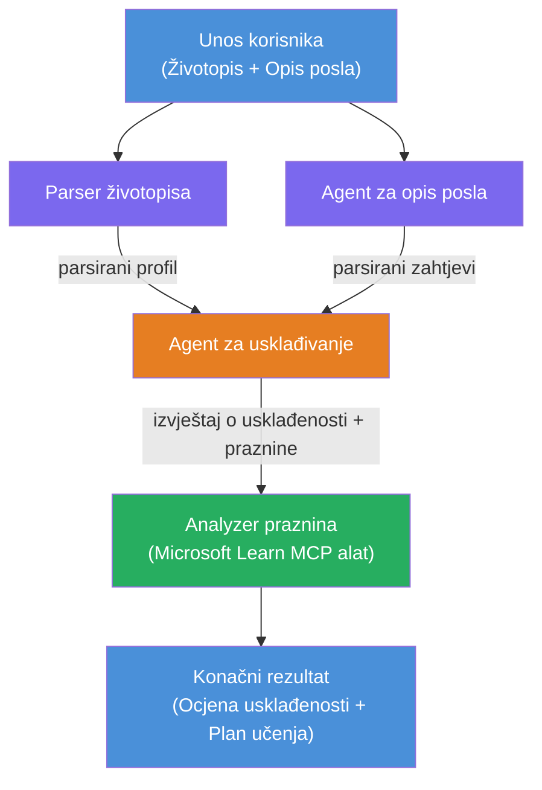

# Lab 02 - Višeagentni tijek rada: Evaluator usklađenosti životopisa i posla

---

## Što ćete izraditi

**Evaluator usklađenosti životopisa i posla** - višeagentni tijek rada gdje četiri specijalizirana agenta surađuju kako bi evaluirali koliko dobro kandidatov životopis odgovara opisu posla, a zatim generiraju personalizirani put učenja za zatvaranje praznina.

### Agentii

| Agent | Uloga |
|-------|-------|
| **Parser životopisa** | Izvlači strukturirane vještine, iskustvo, certifikate iz teksta životopisa |
| **Agent opisa posla** | Izvlači tražene/preferirane vještine, iskustvo, certifikate iz opisa posla |
| **Matching agent** | Upoređuje profil naspram zahtjeva → ocjena usklađenosti (0-100) + usklađene/nedostajuće vještine |
| **Gap Analyzer** | Izrađuje personalizirani plan učenja s resursima, vremenskim okvirima i brzim projektima za uspjeh |

### Demo tijek

Učitajte **životopis + opis posla** → dobijte **ocjenu usklađenosti + nedostajuće vještine** → primite **personalizirani plan učenja**.

### Arhitektura tijeka rada

> Ljubičasta = paralelni agenti | Narančasta = točka agregacije | Zelena = završni agent s alatima. Pogledajte [Modul 1 - Razumijevanje arhitekture](docs/01-understand-multi-agent.md) i [Modul 4 - Obrasci orkestracije](docs/04-orchestration-patterns.md) za detaljne dijagrame i tok podataka.

### Tematska područja

- Kreiranje višeagentnog tijeka rada koristeći **WorkflowBuilder**
- Definiranje uloga agenata i tijeka orkestracije (paralelno + sekvencijalno)
- Obrasci komunikacije među agentima
- Lokalno testiranje sa Agent Inspectorom
- Postavljanje višeagentnih tijekova rada na Foundry Agent Service

---

## Preduvjeti

Prvo dovršite Lab 01:

- [Lab 01 - Jedan agent](../lab01-single-agent/README.md)

---

## Započnite

Pogledajte potpune upute za postavljanje, pregled koda i naredbe za testiranje u:

- [Lab 2 Docs - Preduvjeti](docs/00-prerequisites.md)
- [Lab 2 Docs - Cijeli put učenja](docs/README.md)
- [PersonalCareerCopilot vodič za pokretanje](PersonalCareerCopilot/README.md)

## Obrasci orkestracije (agentske alternative)

Lab 2 uključuje zadani tijek **paralelno → agregator → planer**, a dokumentacija
također opisuje alternativne obrasce koji demonstriraju snažnije agentsko ponašanje:

- **Fan-out/Fan-in s ponderiranim konsenzusom**
- **Pregled/ocjena prije konačnog plana**
- **Uvjetni usmjerivač** (izbor puta temeljem ocjene usklađenosti i nedostajućih vještina)

Pogledajte [docs/04-orchestration-patterns.md](docs/04-orchestration-patterns.md).

---

**Prethodni:** [Lab 01 - Jedan agent](../lab01-single-agent/README.md) · **Natrag na:** [Početna stranica radionice](../../README.md)

---

<!-- CO-OP TRANSLATOR DISCLAIMER START -->
**Odricanje od odgovornosti**:  
Ovaj dokument preveden je pomoću AI usluge za prevođenje [Co-op Translator](https://github.com/Azure/co-op-translator). Iako težimo točnosti, imajte na umu da automatski prijevodi mogu sadržavati pogreške ili netočnosti. Izvorni dokument na izvornom jeziku treba se smatrati autoritativnim izvorom. Za kritične informacije preporučuje se profesionalni ljudski prijevod. Ne odgovaramo za bilo kakve nesporazume ili krive interpretacije koje proizlaze iz korištenja ovog prijevoda.
<!-- CO-OP TRANSLATOR DISCLAIMER END -->