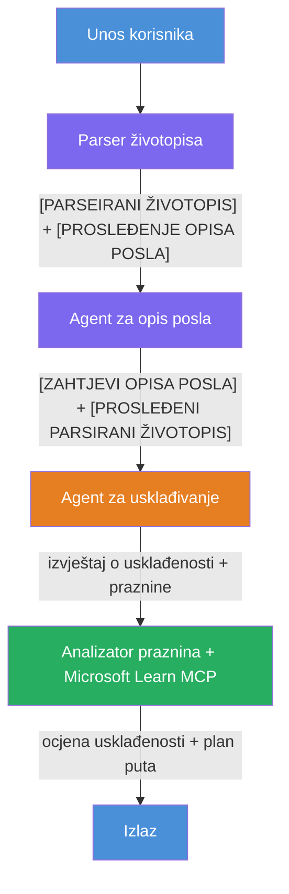

# Laboratorij 02 - Višestruki agenti u tijeku rada: Evaluator prikladnosti životopisa za posao

## Pregled

U ovom praktičnom laboratoriju izgradit ćete **workflow-prvi višestruki-agentni app** koristeći Foundry Toolkit u VS Code i implementirati ga u Microsoft Foundry Agent Service.

**Što ćete izgraditi:** Evaluator prikladnosti životopisa za posao koji analizira životopis i opis posla, ocjenjuje podudarnost i proizvodi personaliziranu cestu učenja koristeći Microsoft Learn resurse.

---

## Arhitektura

```mermaid
flowchart TD
    A["Unos korisnika"] --> B["Parser životopisa"]
    B -->|"[PARSEIRANI ŽIVOTOPIS] + [PROSLEĐENJE OPISA POSLA]"| C["Agent za opis posla"]
    C -->|"[ZAHTJEVI OPISA POSLA] + [PROSLEĐENI PARSIRANI ŽIVOTOPIS]"| D["Agent za usklađivanje"]
    D -->|izvještaj o usklađenosti + praznine| E["Analizator praznina + Microsoft Learn MCP"]
    E -->|ocjena usklađenosti + plan puta| F["Izlaz"]

    style A fill:#4A90D9,color:#fff
    style B fill:#7B68EE,color:#fff
    style C fill:#7B68EE,color:#fff
    style D fill:#E67E22,color:#fff
    style E fill:#27AE60,color:#fff
    style F fill:#4A90D9,color:#fff
```

**Kako to radi:**
1. Korisnik zalijepi životopis i opis posla.
2. **ResumeParser** parsira životopis i kopira opis posla doslovno u odjeljak `[JOB DESCRIPTION PASS-THROUGH]`.
3. **JD Agent** izvlači strukturirane zahtjeve iz proslijeđenog dijela, zatim šalje `[PARSED RESUME]` dalje kao `[PARSED RESUME PASS-THROUGH]`.
4. **MatchingAgent** uspoređuje `[PARSED RESUME PASS-THROUGH]` s `[JD REQUIREMENTS]` i proizvodi ocjenu prikladnosti.
5. **GapAnalyzer** pretvara praznine u praktični plan puta i dohvaća stvarne Microsoft Learn veze putem MCP-a.

---

## Preduvjeti

Prvo završite Laboratorij 01:

- [Laboratorij 01 - Jedan agent](../lab01-single-agent/README.md)

---

## Dio 1: Pročitajte module redom

Pogledajte cijeli put učenja u:

- [Laboratorij 2 Dokumentacija - Preduvjeti](docs/00-prerequisites.md)
- [Laboratorij 2 Dokumentacija - Cijeli put učenja](docs/README.md)
- [PersonalCareerCopilot vodič za pokretanje](PersonalCareerCopilot/README.md)

---

## Dio 2: Izgradite i testirajte tijek rada

1. Koristite Foundry Toolkit čarobnjak za postavljanje projekta temeljenog na tijeku rada.
2. Kopirajte blokove upita i graf tijeka rada iz `PersonalCareerCopilot/main.py` u svoj radni prostor.
3. Pokrenite lokalno s Agent Inspectorom i provjerite svih četvero agenata plus MCP alat.
4. Implementirajte hostiranog agenta u Foundry nakon što lokalno testiranje prođe.

---

## Obrasci orkestracije

Laboratorij 02 uključuje zadani **fan-out → fan-in → sekvencijalni** tijek, a dokumentacija također opisuje alternativne obrasce orkestracije za eksperimentiranje.

- **Fan-out/Fan-in s ponderiranim konsenzusom**
- **Pregled/recenzija prije konačne karte puta**
- **Uvjetni usmjerivač** temeljen na ocjeni prikladnosti i nedostajućim vještinama

Pogledajte [docs/04-orchestration-patterns.md](docs/04-orchestration-patterns.md).

---

**Prethodni:** [Laboratorij 01 - Jedan agent](../lab01-single-agent/README.md) · **Natrag na:** [Početna radionice](../../README.md)

---

<!-- CO-OP TRANSLATOR DISCLAIMER START -->
**Napomena**:
Ovaj dokument je preveden korištenjem AI prevoditeljskog servisa [Co-op Translator](https://github.com/Azure/co-op-translator). Iako težimo točnosti, imajte na umu da automatski prijevodi mogu sadržavati greške ili netočnosti. Izvorni dokument na izvornom jeziku treba smatrati autoritativnim izvorom. Za važne informacije preporuča se profesionalni ljudski prijevod. Nismo odgovorni za bilo kakva nesporazumevanja ili pogrešne interpretacije koje proizlaze iz korištenja ovog prijevoda.
<!-- CO-OP TRANSLATOR DISCLAIMER END -->