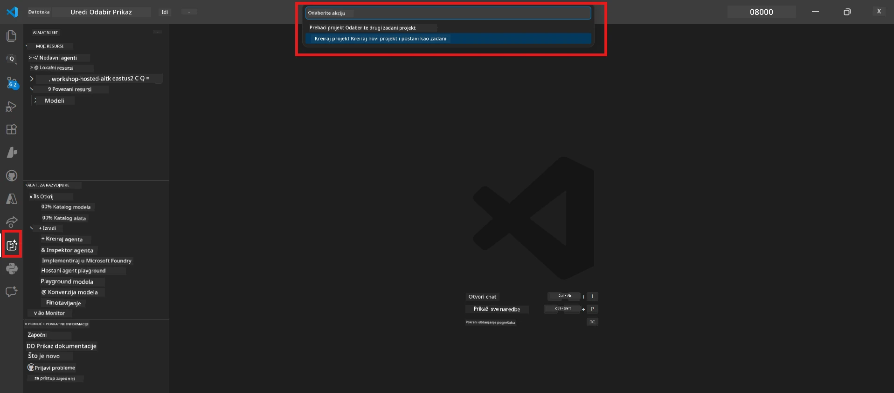

# Module 0 - Preduvjeti

Prije početka Lab 02, potvrdite da ste dovršili sljedeće. Ovaj laboratorij izravno se nadovezuje na Lab 01 - nemojte ga preskakati.

---

## 1. Dovršite Lab 01

Lab 02 pretpostavlja da ste već:

- [x] Dovršili svih 8 modula iz [Lab 01 - Jedan agent](../../lab01-single-agent/README.md)
- [x] Uspješno implementirali jednog agenta na Foundry Agent Service
- [x] Potvrdili da agent radi u lokalnom Agent Inspector i Foundry Playground

Ako niste dovršili Lab 01, vratite se i sada ga završite: [Lab 01 Docs](../../lab01-single-agent/docs/00-prerequisites.md)

---

## 2. Provjerite postojeću konfiguraciju

Svi alati iz Lab 01 još uvijek bi trebali biti instalirani i raditi. Pokrenite ove brze provjere:

### 2.1 Azure CLI

```powershell
az account show --query "{name:name, id:id}" --output table
```

Očekivano: Prikazuje naziv i ID vaše pretplate. Ako ne uspije, pokrenite [`az login`](https://learn.microsoft.com/cli/azure/authenticate-azure-cli-interactively).

### 2.2 VS Code proširenja

1. Pritisnite `Ctrl+Shift+P` → upišite **"Microsoft Foundry"** → potvrdite da vidite naredbe (npr. `Microsoft Foundry: Create a New Hosted Agent`).
2. Pritisnite `Ctrl+Shift+P` → upišite **"Foundry Toolkit"** → potvrdite da vidite naredbe (npr. `Foundry Toolkit: Open Agent Inspector`).

### 2.3 Foundry projekt i model

1. Kliknite na ikonu **Microsoft Foundry** u traci aktivnosti VS Code-a.
2. Potvrdite da je vaš projekt naveden (npr. `workshop-agents`).
3. Proširite projekt → provjerite postoji li implementirani model (npr. `gpt-4.1-mini`) sa statusom **Succeeded**.

> **Ako je vaša implementacija modela istekla:** Neki besplatni slojevi implementacija automatski isteknu. Ponovno implementirajte iz [Model Catalog](https://learn.microsoft.com/azure/foundry/foundry-models/concepts/models-sold-directly-by-azure) (`Ctrl+Shift+P` → **Microsoft Foundry: Open Model Catalog**).



### 2.4 RBAC uloge

Provjerite imate li **Azure AI User** ulogu na vašem Foundry projektu:

1. [Azure Portal](https://portal.azure.com) → vaš Foundry **projekt** resurs → **Access control (IAM)** → kartica **[Dodjele uloga](https://learn.microsoft.com/azure/foundry/concepts/rbac-foundry)**.
2. Potražite svoje ime → potvrdite da je navedeno **[Azure AI User](https://aka.ms/foundry-ext-project-role)**.

---

## 3. Razumjeti koncepte višestrukih agenata (novo za Lab 02)

Lab 02 uvodi koncepte koji nisu obuhvaćeni u Lab 01. Pročitajte ih prije nastavka:

### 3.1 Što je multi-agent tijek rada?

Umjesto da jedan agent rješava sve, **multi-agent tijek rada** dijeli posao između više specijaliziranih agenata. Svaki agent ima:

- Svoje **upute** (sistemski prompt)
- Svoju **ulogu** (za što je odgovoran)
- Opcionalne **alate** (funkcije koje može pozivati)

Agenti komuniciraju kroz **orhestracijski graf** koji definira kako podaci teku između njih.

### 3.2 WorkflowBuilder

[`WorkflowBuilder`](https://learn.microsoft.com/agent-framework/workflows/agents-in-workflows) klasa iz `agent_framework` je SDK komponenta koja povezuje agente zajedno:

```python
from agent_framework import WorkflowBuilder

workflow = (
    WorkflowBuilder(
        name="MyWorkflow",
        start_executor=agent_a,
        output_executors=[agent_d],
    )
    .add_edge(agent_a, agent_b)
    .add_edge(agent_a, agent_c)
    .add_edge(agent_b, agent_d)
    .add_edge(agent_c, agent_d)
    .build()
)
```

- **`start_executor`** - Prvi agent koji prima korisnički unos
- **`output_executors`** - Agent(i) čiji izlaz postaje konačni odgovor
- **`add_edge(source, target)`** - Definira da `target` prima izlaz od `source`

### 3.3 MCP (Model Context Protocol) alati

Lab 02 koristi **MCP alat** koji poziva Microsoft Learn API za dohvaćanje obrazovnih resursa. [MCP (Model Context Protocol)](https://modelcontextprotocol.io/introduction) je standardizirani protokol za povezivanje AI modela s vanjskim izvorima podataka i alatima.

| Pojam | Definicija |
|-------|------------|
| **MCP server** | Usluga koja izlaže alate/izvore preko [MCP protokola](https://learn.microsoft.com/azure/foundry/agents/how-to/tools/model-context-protocol) |
| **MCP klijent** | Vaš kod agenta koji se povezuje na MCP server i poziva njegove alate |
| **[Streamable HTTP](https://learn.microsoft.com/agent-framework/agents/tools/hosted-mcp-tools)** | Metoda prijenosa koja se koristi za komunikaciju s MCP serverom |

### 3.4 Kako se Lab 02 razlikuje od Lab 01

| Aspekt | Lab 01 (Jedan agent) | Lab 02 (Višestruki agent) |
|--------|----------------------|---------------------------|
| Agenti | 1 | 4 (specijalizirane uloge) |
| Orkestracija | Nijedna | WorkflowBuilder (paralelno + sekvencijalno) |
| Alati | Opcionalna `@tool` funkcija | MCP alat (poziv vanjskog API-ja) |
| Kompleksnost | Jednostavni prompt → odgovor | Životopis + Opis posla → ocjena podudarnosti → plan razvoja |
| Tok konteksta | Izravan | Predaja između agenata |

---

## 4. Struktura repozitorija radionice za Lab 02

Provjerite znate gdje se nalaze Lab 02 datoteke:

```
workshop/
└── lab02-multi-agent/
    ├── README.md                       ← Lab overview
    ├── docs/                           ← You are here
    │   ├── README.md                   ← Learning path index
    │   ├── 00-prerequisites.md         ← This file
    │   ├── 01-understand-multi-agent.md
    │   ├── ...
    │   └── 08-troubleshooting.md
    └── PersonalCareerCopilot/          ← The agent project
        ├── agent.yaml                  ← Agent definition
        ├── main.py                     ← 4-agent workflow code
        ├── Dockerfile                  ← Container configuration
        └── requirements.txt            ← Python dependencies
```

---

### Kontrolna točka

- [ ] Lab 01 je potpuno dovršen (svi moduli 8, agent implementiran i potvrđen)
- [ ] `az account show` vraća vašu pretplatu
- [ ] Microsoft Foundry i Foundry Toolkit proširenja su instalirana i odgovaraju
- [ ] Foundry projekt ima implementirani model (npr. `gpt-4.1-mini`)
- [ ] Imate **Azure AI User** ulogu na projektu
- [ ] Pročitali ste odjeljak o konceptima višestrukih agenata iznad i razumijete WorkflowBuilder, MCP i orkestraciju agenata

---

**Sljedeće:** [01 - Razumjeti arhitekturu višestrukih agenata →](01-understand-multi-agent.md)

---

<!-- CO-OP TRANSLATOR DISCLAIMER START -->
**Odricanje od odgovornosti**:  
Ovaj dokument je preveden korištenjem AI prevoditeljskog servisa [Co-op Translator](https://github.com/Azure/co-op-translator). Iako težimo točnosti, imajte na umu da automatski prijevodi mogu sadržavati pogreške ili netočnosti. Izvorni dokument na njegovom izvornom jeziku treba se smatrati autoritativnim izvorom. Za kritične informacije preporučuje se profesionalni ljudski prijevod. Ne snosimo odgovornost za bilo kakve nesporazume ili pogrešna tumačenja koja proizlaze iz korištenja ovog prijevoda.
<!-- CO-OP TRANSLATOR DISCLAIMER END -->