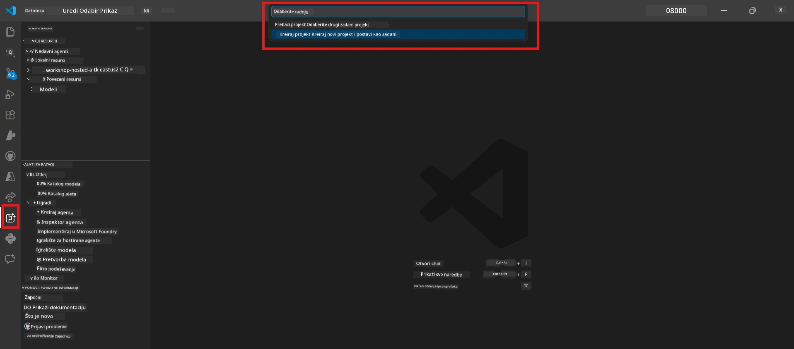

# Modul 0 - Uvod

⏱️ ~10 minuta

> [!WARNING]
> **Pregled i Ograničenja:** [Hostirani agenti](https://learn.microsoft.com/azure/foundry/agents/concepts/hosted-agents) su trenutno u **javnoj pregledu** - nisu preporučeni za produkcijske zadatke. Neke značajke prikazane u ovom radionici mogu se promijeniti kako se usluga približava GA.

## Što ćete izgraditi

U ovom laboratoriju proširujete vještine jednog agenta iz Laboratorija 01 da biste izgradili **multi-agentni tijek rada** - Evaluator usklađenosti životopisa s poslom.

Zalijepite **životopis** i **opis posla**. Četiri specijalizirana agenta obrađuju unos sekvencijalno, a zatim vraćaju:
- Ocjenu usklađenosti (0–100 s razbijanjem bodovanja)
- Popis vještina i certifikacijskih praznina
- Personaliziranu mapu učenja s pravim vezama na Microsoft Learn za svaku prazninu

**Tijek rada koristi:**
- **Microsoft Agent Framework** - `WorkflowBuilder` za sekvencijalnu orkestraciju cjevovoda
- **Foundry Toolkit za VS Code** - izgradnja, lokalno testiranje, implementacija
- **AI model** (npr., `gpt-4.1-mini`) - koristi ga svih četvero agenata
- **Microsoft Learn MCP server** - pruža prave poveznice na resurse učenja za svaku prazninu u vještinama

---

## Odaberite svoj put

> ⚠️ **Nastavite istim putem koji ste koristili u Laboratoriju 01.**

<details open>
<summary><strong>🅰️ Put A - Azure oblak (zahtijeva Azure pretplatu)</strong></summary>

| | Detalji |
|---|---|
| **Za koga je ovo?** | Završili ste Laboratorij 01 koristeći Azure pretplatu |
| **Model** | Azure OpenAI putem Foundry (npr., `gpt-4.1-mini`) |
| **Obuhvaćeni moduli** | Svi moduli (00–09) |
| **Implementacija u oblak?** | ✅ Da - potpuna end-to-end implementacija |

</details>

<details open>
<summary><strong>🅱️ Put B - Foundry lokalno (nije potrebna Azure pretplata)</strong></summary>

| | Detalji |
|---|---|
| **Za koga je ovo?** | Završili ste Laboratorij 01 koristeći Foundry lokalno |
| **Model** | Foundry lokalno (besplatno, radi na vašem računalu) |
| **Obuhvaćeni moduli** | Moduli 00–05 (preskočite 06–07 - implementacija i provjera u oblaku) |
| **Implementacija u oblak?** | ❌ Ne - samo lokalno testiranje preko Agent Inspectora |

</details>

---

## Provjera Laboratorija 01

Laboratorij 02 izravno nadograđuje Laboratorij 01. Najprije završite Laboratorij 01 prije nego što počnete ovdje.

Niste još napravili Laboratorij 01? Započnite ovdje: [Lab 01 - Uvod](../../lab01-single-agent/docs/00-prerequisites.md)

<details open>
<summary><strong>🅰️ Put A - Azure oblak</strong></summary>

```powershell
az account show --query "{name:name, id:id}" --output table
```

Ako ovo ne uspije, pokrenite `az login`. Zatim provjerite u VS Code:

1. `Ctrl+Shift+P` → upišite **Foundry Toolkit** → potvrdite pojavu naredbi.
2. Kliknite na ikonu **Foundry Toolkit** → vaš projekt i implementirani model prikazuju se kao **Succeeded**.



> **RBAC:** Dodijelili ste uloga **Foundry User** u Laboratoriju 01. Ako je potrebno ponovo dodijeliti, pogledajte [Lab 01, Modul 1](../../lab01-single-agent/docs/01-setup.md#deploy-a-model--assign-rbac). Uloga je prethodno nazvana **Azure AI User** - iste dozvole.

</details>

<details open>
<summary><strong>🅱️ Put B - Foundry lokalno</strong></summary>

```powershell
Invoke-WebRequest -Uri "http://localhost:5273/v1/health" -UseBasicParsing | Select-Object StatusCode
```

Očekivano: `StatusCode: 200`. Ako nije, ponovno pokrenite Foundry lokalno iz Foundry Toolkit bočne trake.

> Cijelo izvođenje inferencije odvija se na vašem računalu. Jedini vanjski poziv je MCP alat prema `https://learn.microsoft.com/api/mcp`.

</details>

---

## Novosti u Laboratoriju 02

| | Laboratorij 01 | Laboratorij 02 |
|--|--------|--------|
| Agenti | 1 | 4 (povezani s WorkflowBuilder) |
| Predložak za izgradnju | Osnovni - Agent Framework | Radni tokovi - Agent Framework |
| Novi paket | - | `mcp` |
| Orkestracija | Jedan konverzacijski agent | Sekvencijalni pipeline (WorkflowBuilder) |
| Novi alat | - | `search_microsoft_learn_for_plan` (MCP) |

---

**Dalje:** [01 - Razumjeti arhitekturu →](01-understand-multi-agent.md)

---

<!-- CO-OP TRANSLATOR DISCLAIMER START -->
**Napomena**:
Ovaj dokument je preveden korištenjem AI prevoditeljskog servisa [Co-op Translator](https://github.com/Azure/co-op-translator). Iako težimo točnosti, imajte na umu da automatski prijevodi mogu sadržavati greške ili netočnosti. Izvorni dokument na izvornom jeziku treba smatrati autoritativnim izvorom. Za važne informacije preporuča se profesionalni ljudski prijevod. Nismo odgovorni za bilo kakva nesporazumevanja ili pogrešne interpretacije koje proizlaze iz korištenja ovog prijevoda.
<!-- CO-OP TRANSLATOR DISCLAIMER END -->