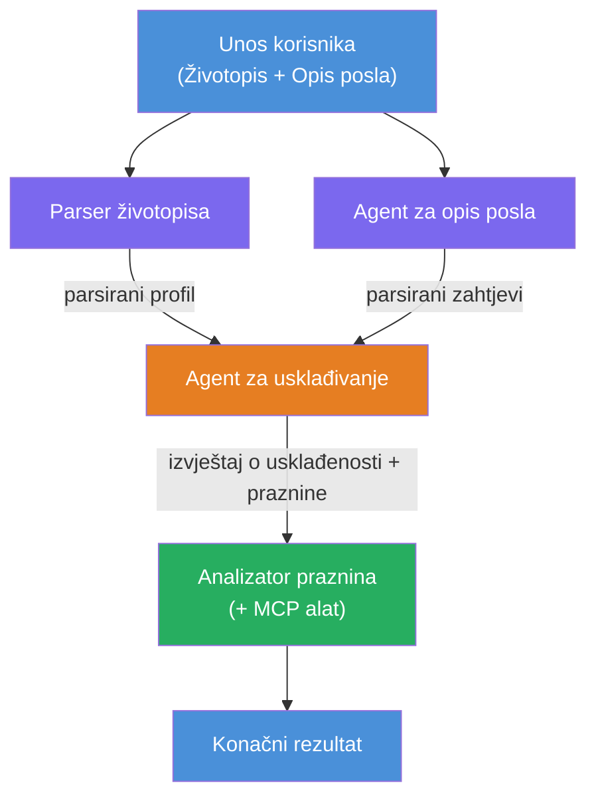
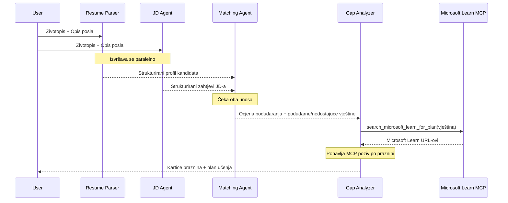
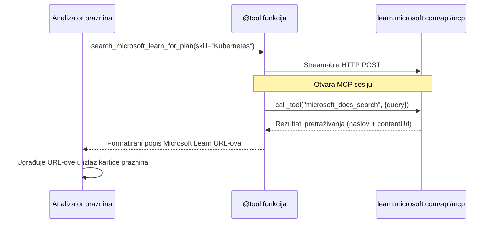

# Modul 1 - Razumijevanje višestruke agentne arhitekture

U ovom modulu učite arhitekturu Procjenjivača usklađenosti životopisa i radnog mjesta prije nego što napišete bilo kakav kod. Razumijevanje dijagrama orkestracije, uloga agenata i toka podataka ključno je za otklanjanje pogrešaka i proširenje [višestrukih agentnih tijekova rada](https://learn.microsoft.com/azure/architecture/ai-ml/idea/multiple-agent-workflow-automation).

---

## Problem koji se rješava

Usklađivanje životopisa s opisom posla uključuje više različitih vještina:

1. **Parsiranje** - Izvlačenje strukturiranih podataka iz nestrukturiranog teksta (životopis)
2. **Analiza** - Izvlačenje zahtjeva iz opisa posla
3. **Usporedba** - Ocjenjivanje usklađenosti između ta dva
4. **Planiranje** - Izgradnja plana učenja za zatvaranje praznina

Jedan agent koji obavlja sva četiri zadatka u jednom upitu često proizvodi:
- Nepotpuno izvlačenje (žuri s parsiranjem da bi došao do ocjene)
- Plitko ocjenjivanje (bez dokaza i analize)
- Generičke planove učenja (neprilagođene specifičnim prazninama)

Podjelom na **četiri specijalizirana agenta**, svaki se fokusira na svoj zadatak s posebnim uputama, proizvodeći kvalitetniji rezultat u svakoj fazi.

---

## Četiri agenta

Svaki agent je potpuni [Microsoft Foundry](https://learn.microsoft.com/azure/foundry/agents/concepts/hosted-agents) agent kreiran preko `AzureAIAgentClient.as_agent()`. Dijele isti model implementacije, ali imaju različite upute i (opcionalno) različite alate.

| # | Ime agenta | Uloga | Ulaz | Izlaz |
|---|-----------|-------|-------|--------|
| 1 | **ResumeParser** | Izvlači strukturiran profil iz teksta životopisa | Neobrađeni tekst životopisa (od korisnika) | Profil kandidata, Tehničke vještine, Meke vještine, Certifikati, Iskustvo u domeni, Postignuća |
| 2 | **JobDescriptionAgent** | Izvlači strukturirane zahtjeve iz opisa posla | Neobrađeni tekst opisa posla (od korisnika, proslijeđen preko ResumeParser-a) | Pregled uloge, Potrebne vještine, Poželjne vještine, Iskustvo, Certifikati, Obrazovanje, Odgovornosti |
| 3 | **MatchingAgent** | Izračunava ocjenu usklađenosti temeljenu na dokazima | Izlazi iz ResumeParser-a + JobDescriptionAgent-a | Ocjena usklađenosti (0-100 s razradom), Usklađene vještine, Nedostajuće vještine, Praznine |
| 4 | **GapAnalyzer** | Gradi personalizirani plan učenja | Izlaz iz MatchingAgent-a | Kartice praznina (po vještini), Redoslijed učenja, Vremenski okvir, Resursi sa Microsoft Learn |

---

## Dijagram orkestracije

Tijek rada koristi **paralelno širenje (fan-out)** nakon čega slijedi **sekvencijalna agregacija**:


> **Legenda:** Ljubičasta = paralelni agenti, Narančasta = točka agregacije, Zelena = završni agent s alatima

### Kako teče podatak


1. **Korisnik šalje** poruku koja sadrži životopis i opis posla.
2. **ResumeParser** prima sav korisnički unos i izvlači strukturirani profil kandidata.
3. **JobDescriptionAgent** prima korisnički unos paralelno i izvlači strukturirane zahtjeve.
4. **MatchingAgent** prima izlaze iz **oba** ResumeParser-a i JobDescriptionAgent-a (okvir čeka da oba završe prije nego što pokrene MatchingAgent).
5. **GapAnalyzer** prima izlaz MatchingAgent-a i poziva **Microsoft Learn MCP alat** da dohvatiti stvarne resurse za učenje za svaku prazninu.
6. **Konačni izlaz** je odgovor GapAnalyzer-a, koji uključuje ocjenu usklađenosti, kartice praznina i kompletan plan učenja.

### Zašto je paralelno širenje važno

ResumeParser i JobDescriptionAgent rade **paralelno** jer ni jedan ne ovisi o drugom. Ovo:
- Smanjuje ukupno vrijeme čekanja (oba rade istovremeno, a ne sekvencijalno)
- Prirodna je podjela (parsiranje životopisa vs. parsiranje opisa posla su neovisni zadaci)
- Pokazuje čest obrazac u višestrukim agentima: **širenje (fan-out) → agregacija → akcija**

---

## WorkflowBuilder u kodu

Evo kako gornji dijagram preslikava pozive API-ja [`WorkflowBuilder`](https://learn.microsoft.com/agent-framework/workflows/agents-in-workflows) u `main.py`:

```python
from agent_framework import WorkflowBuilder

workflow = (
    WorkflowBuilder(
        name="ResumeJobFitEvaluator",
        start_executor=resume_parser,       # Prvi agent koji prima unos korisnika
        output_executors=[gap_analyzer],     # Završni agent čiji se rezultat vraća
    )
    .add_edge(resume_parser, jd_agent)      # ResumeParser → Agent za opis poslova
    .add_edge(resume_parser, matching_agent) # ResumeParser → Agent za usklađivanje
    .add_edge(jd_agent, matching_agent)      # Agent za opis poslova → Agent za usklađivanje
    .add_edge(matching_agent, gap_analyzer)  # Agent za usklađivanje → Analizator praznina
    .build()
)
```

**Razumijevanje veza:**

| Veza | Što znači |
|-------|-----------|
| `resume_parser → jd_agent` | JD Agent prima izlaz ResumeParser-a |
| `resume_parser → matching_agent` | MatchingAgent prima izlaz ResumeParser-a |
| `jd_agent → matching_agent` | MatchingAgent također prima izlaz JD Agenta (čeka oba) |
| `matching_agent → gap_analyzer` | GapAnalyzer prima izlaz MatchingAgent-a |

Kako `matching_agent` ima **dva dolazna ruba** (`resume_parser` i `jd_agent`), okvir automatski čeka da oba završe prije nego što pokrene MatchingAgent.

---

## MCP alat

Agent GapAnalyzer ima jedan alat: `search_microsoft_learn_for_plan`. Ovo je **[MCP alat](https://learn.microsoft.com/agent-framework/agents/tools/hosted-mcp-tools)** koji poziva Microsoft Learn API za dohvat kuriranih resursa za učenje.

### Kako radi

```python
@tool
async def search_microsoft_learn_for_plan(
    skill: str, role: str = "", max_results: int = 5
) -> str:
    """Search Microsoft Learn MCP and return curated official links."""
    # Povezuje se na https://learn.microsoft.com/api/mcp putem Streamable HTTP-a
    # Poziva alat 'microsoft_docs_search' na MCP poslužitelju
    # Vraća formatiranu listu Microsoft Learn URL-ova
```

### Tijek poziva MCP-a


1. GapAnalyzer odlučuje da treba resurse za učenje za određenu vještinu (npr. "Kubernetes")
2. Okvir poziva `search_microsoft_learn_for_plan(skill="Kubernetes")`
3. Funkcija otvara [Streamable HTTP](https://learn.microsoft.com/agent-framework/agents/tools/hosted-mcp-tools) konekciju na `https://learn.microsoft.com/api/mcp`
4. Poziva alat `microsoft_docs_search` na [MCP serveru](https://learn.microsoft.com/azure/foundry/agents/how-to/tools/model-context-protocol)
5. MCP server vraća rezultate pretraživanja (naslov + URL)
6. Funkcija formatira rezultate i vraća ih kao niz znakova
7. GapAnalyzer koristi vraćene URL-ove u svom izlazu kartica praznina

### Očekivani MCP zapisi

Kad se alat pokrene, vidjet ćete zapisnike poput:

```
GET https://learn.microsoft.com/api/mcp → 405 (Method Not Allowed)
POST https://learn.microsoft.com/api/mcp → 200
DELETE https://learn.microsoft.com/api/mcp → 405 (Method Not Allowed)
```

**Ovo je normalno.** MCP klijent tijekom inicijalizacije šalje GET i DELETE zahtjeve – očekivano je da oni vrate 405. Sam alat koristi POST i vraća 200. Brinite samo ako POST zahtjevi ne uspiju.

---

## Uzorak stvaranja agenta

Svaki agent se kreira korištenjem **asinhronog kontekstnog menadžera [`AzureAIAgentClient.as_agent()`](https://learn.microsoft.com/python/api/overview/azure/ai-agents-readme)**. Ovo je Foundry SDK obrazac za kreiranje agenata koji se automatski čiste:

```python
async with (
    get_credential() as credential,
    AzureAIAgentClient(
        project_endpoint=PROJECT_ENDPOINT,
        model_deployment_name=MODEL_DEPLOYMENT_NAME,
        credential=credential,
    ).as_agent(
        name="ResumeParser",
        instructions=RESUME_PARSER_INSTRUCTIONS,
    ) as resume_parser,
    # ... ponovite za svakog agenta ...
):
    # Sva 4 agenta ovdje postoje
    workflow = create_workflow(resume_parser, jd_agent, matching_agent, gap_analyzer)
```

**Ključne točke:**
- Svaki agent dobiva svoj vlastiti primjerak `AzureAIAgentClient` (SDK zahtijeva da ime agenta bude ograničeno klijentu)
- Svi agenti dijele iste `credential`, `PROJECT_ENDPOINT` i `MODEL_DEPLOYMENT_NAME`
- `async with` blok osigurava da se svi agenti očiste kad se server zaustavi
- GapAnalyzer dodatno prima `tools=[search_microsoft_learn_for_plan]`

---

## Pokretanje servera

Nakon kreiranja agenata i izgradnje tijeka rada, server se pokreće:

```python
from azure.ai.agentserver.agentframework import from_agent_framework

agent = create_workflow(resume_parser, jd_agent, matching_agent, gap_analyzer)
await from_agent_framework(agent).run_async()
```

`from_agent_framework()` omotava tijek rada kao HTTP server i izlaže endpoint `/responses` na portu 8088. Ovo je isti obrazac kao u Laboratoriju 01, ali "agent" je sada cijeli [dijagram tijeka](https://learn.microsoft.com/agent-framework/workflows/as-agents).

---

### Kontrolna točka

- [ ] Razumijete arhitekturu s 4 agenta i ulogu svakog agenata
- [ ] Možete pratiti tok podataka: Korisnik → ResumeParser → (paralelno) JD Agent + MatchingAgent → GapAnalyzer → Izlaz
- [ ] Razumijete zašto MatchingAgent čeka oba ResumeParser i JD Agenta (dva dolazna ruba)
- [ ] Razumijete MCP alat: što radi, kako se poziva, i da su GET 405 zapisi normalni
- [ ] Razumijete obrazac `AzureAIAgentClient.as_agent()` i zašto svaki agent ima vlastiti primjerak klijenta
- [ ] Možete pročitati kod `WorkflowBuilder` i povezati ga s vizualnim dijagramom

---

**Prethodni:** [00 - Preduvjeti](00-prerequisites.md) · **Sljedeći:** [02 - Postavljanje višestrukog agentnog projekta →](02-scaffold-multi-agent.md)

---

<!-- CO-OP TRANSLATOR DISCLAIMER START -->
**Izjava o odricanju:**  
Ovaj dokument preveden je koristeći AI uslugu prevođenja [Co-op Translator](https://github.com/Azure/co-op-translator). Iako težimo točnosti, imajte na umu da automatski prijevodi mogu sadržavati pogreške ili netočnosti. Izvorni dokument na izvornom jeziku treba smatrati službenim izvorom. Za kritične informacije preporučuje se profesionalni ljudski prijevod. Ne snosimo odgovornost za bilo kakva nesporazuma ili kriva tumačenja koja proizlaze iz korištenja ovog prijevoda.
<!-- CO-OP TRANSLATOR DISCLAIMER END -->