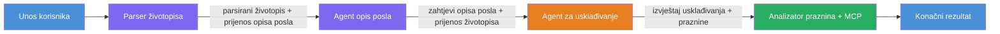

# Modul 1 - Razumjeti arhitekturu

⏱️ ~5 min

Prije nego što napišete bilo kakav kod, evo brzog pregleda što gradite i kako to funkcionira.

---

## Što gradite

Zalijepite **životopis** i **opis posla**. Radni tok vraća:

- Rezultatsku ocjenu pristajanja (0–100 s razradom)
- Popis nedostataka vještina i certifikata
- Personaliziranu učnu mapu s poveznicama na Microsoft Learn za svaki nedostatak

---

## Četiri agenta

Jedan agent koji pokušava istovremeno parsirati, ocijeniti i planirati obično žuri i daje plitke rezultate. Podjela posla na četiri specijalizirana agenta daje bolje rezultate:

| Agent | Što radi |
|-------|-------------|
| **ResumeParser** | Parsira životopis; kopira opis posla doslovno u `[JOB DESCRIPTION PASS-THROUGH]` za daljnje agente |
| **JobDescriptionAgent** | Izvlači zahtjeve opisa posla iz prosljeđene sekcije; prosljeđuje `[PARSED RESUME]` kao `[PARSED RESUME PASS-THROUGH]` |
| **MatchingAgent** | Uspoređuje označene dijelove; proizvodi ocjenu pristajanja od 0 do 100 i popis nedostataka |
| **GapAnalyzer** | Izrađuje učnu mapu; pretražuje Microsoft Learn za svaki nedostatak |

---

## Orkestracijski graf

Radni tok je **sekvencijalni pipeline** - svaki agent prosljeđuje svoj izlaz sljedećem:


```mermaid
flowchart LR
    A["Unos korisnika"] --> B["Parser životopisa"]
    B -- "parsirani životopis + prijenos opisa posla" --> C["Agent opis posla"]
    C -- "zahtjevi opisa posla + prijenos životopisa" --> D["Agent za usklađivanje"]
    D -- "izvještaj usklađivanja + praznine" --> E["Analizator praznina + MCP"]
    E --> F["Konačni rezultat"]

    style A fill:#4A90D9,color:#fff
    style B fill:#7B68EE,color:#fff
    style C fill:#7B68EE,color:#fff
    style D fill:#E67E22,color:#fff
    style E fill:#27AE60,color:#fff
    style F fill:#4A90D9,color:#fff
```

1. **ResumeParser** prima korisnički unos, parsira životopis i kopira opis posla u `[JOB DESCRIPTION PASS-THROUGH]`.
2. **JD Agent** izvlači strukturirane zahtjeve i prosljeđuje `[PARSED RESUME PASS-THROUGH]` naprijed.
3. **MatchingAgent** uspoređuje oba dijela i proizvodi ocjenu pristajanja i popis nedostataka.
4. **GapAnalyzer** izrađuje mapu i za svaki nedostatak poziva alat Microsoft Learn MCP.

---

## Kako se to preslikava u kod

U `main.py`, opisujete ovaj graf s `WorkflowBuilder`:

```python
workflow_agent = (
    WorkflowBuilder(
        start_executor=resume_executor,       # prvi agent koji prima korisnički unos
        output_executors=[gap_executor],      # zadnji agent - njegov izlaz je odgovor
    )
    .add_edge(resume_executor, jd_executor)       # ResumeParser → JD Agent
    .add_edge(jd_executor, matching_executor)     # JD Agent → MatchingAgent
    .add_edge(matching_executor, gap_executor)    # MatchingAgent → GapAnalyzer
    .build()
    .as_agent()
)
```

Svaki `Agent` je umotan u `AgentExecutor`. Pozivi `add_edge()` definiraju strogo sekvencijalni pipeline - svaki agent prima samo izlaz svog neposrednog prethodnika.

> `context_mode="last_agent"` znači da svaki izvršitelj vidi samo izlaz svog neposrednog prethodnika. ResumeParser i JD Agent prosljeđuju podatke unaprijed u označenim sekcijama tako da svaki sljedeći agent ima točno ono što mu treba.

---

## MCP alat

GapAnalyzer ima jedan alat: `search_microsoft_learn_for_plan`. Povezuje se na `https://learn.microsoft.com/api/mcp` i vraća stvarne poveznice na Microsoft Learn za svaki nedostatak vještine.

Kad se alat pokrene, vidjet ćete ove zapise – sve je očekivano:

```
GET  https://learn.microsoft.com/api/mcp → 405   ← connection probe, normal
POST https://learn.microsoft.com/api/mcp → 200   ← actual tool call
DELETE https://learn.microsoft.com/api/mcp → 405 ← cleanup probe, normal
```

Brinite se samo ako `POST` vrati pogrešku.

---

**Prethodno:** [00 - Preduvjeti](00-prerequisites.md) · **Sljedeće:** [02 - Postavljanje projekta →](02-scaffold-multi-agent.md)

---

<!-- CO-OP TRANSLATOR DISCLAIMER START -->
**Napomena**:
Ovaj dokument je preveden korištenjem AI prevoditeljskog servisa [Co-op Translator](https://github.com/Azure/co-op-translator). Iako težimo točnosti, imajte na umu da automatski prijevodi mogu sadržavati greške ili netočnosti. Izvorni dokument na izvornom jeziku treba smatrati autoritativnim izvorom. Za važne informacije preporuča se profesionalni ljudski prijevod. Nismo odgovorni za bilo kakva nesporazumevanja ili pogrešne interpretacije koje proizlaze iz korištenja ovog prijevoda.
<!-- CO-OP TRANSLATOR DISCLAIMER END -->