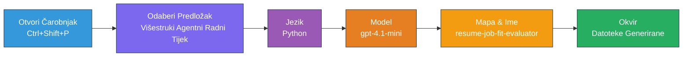
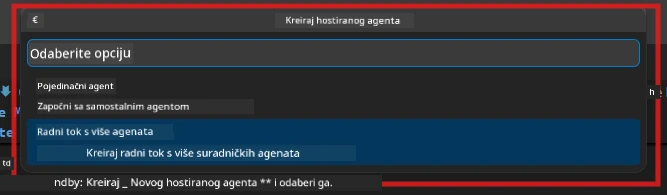

# Modul 2 - Postavljanje Višestrukog Agenta Projekta

U ovom modulu koristite [Microsoft Foundry ekstenziju](https://marketplace.visualstudio.com/items?itemName=TeamsDevApp.vscode-ai-foundry) za **postavljanje multi-agent radnog toka projekta**. Ekstenzija generira cijelu strukturu projekta - `agent.yaml`, `main.py`, `Dockerfile`, `requirements.txt`, `.env` i konfiguraciju za otklanjanje pogrešaka. Zatim prilagođavate ove datoteke u Modulima 3 i 4.

> **Napomena:** Mapu `PersonalCareerCopilot/` u ovom laboratoriju je kompletan, funkcionalan primjer prilagođenog multi-agent projekta. Možete izgraditi novi projekt (preporučeno za učenje) ili direktno proučiti postojeći kod.

---

## Korak 1: Otvorite Čarobnjaka za Kreiranje Hostiranog Agenta


1. Pritisnite `Ctrl+Shift+P` za otvaranje **Command Palette**.
2. Upišite: **Microsoft Foundry: Create a New Hosted Agent** i odaberite.
3. Otvara se čarobnjak za kreiranje hostiranog agenta.

> **Alternativa:** Kliknite na ikonu **Microsoft Foundry** u Activity Bar → kliknite na ikonu **+** pored **Agents** → **Create New Hosted Agent**.

---

## Korak 2: Odaberite Multi-Agent Workflow šablonu

Čarobnjak vas pita da odaberete šablonu:

| Šablona | Opis | Kada koristiti |
|----------|-------------|-------------|
| Single Agent | Jedan agent s uputama i opcionalnim alatima | Lab 01 |
| **Multi-Agent Workflow** | Više agenata koji surađuju putem WorkflowBuildera | **Ovaj laboratorij (Lab 02)** |

1. Odaberite **Multi-Agent Workflow**.
2. Kliknite **Next**.



---

## Korak 3: Odaberite programski jezik

1. Odaberite **Python**.
2. Kliknite **Next**.

---

## Korak 4: Odaberite svoj model

1. Čarobnjak prikazuje modele implementirane u vašem Foundry projektu.
2. Odaberite isti model koji ste koristili u Lab 01 (npr. **gpt-4.1-mini**).
3. Kliknite **Next**.

> **Savjet:** [`gpt-4.1-mini`](https://learn.microsoft.com/azure/foundry/foundry-models/concepts/models-sold-directly-by-azure#gpt-41-series) se preporučuje za razvoj - brz je, jeftin i dobro rukuje višestrukim agentima u radnom toku. Za konačnu produkcijsku implementaciju prebacite se na `gpt-4.1` ako želite kvalitetniji izlaz.

---

## Korak 5: Odaberite lokaciju mape i ime agenta

1. Otvara se dijalog za odabir datoteke. Odaberite ciljanu mapu:
   - Ako radite s repozitorijem radionice: navigirajte do `workshop/lab02-multi-agent/` i kreirajte novu podmapu
   - Ako započinjete iznova: odaberite bilo koju mapu
2. Unesite **ime** za hostiranog agenta (npr. `resume-job-fit-evaluator`).
3. Kliknite **Create**.

---

## Korak 6: Pričekajte da završite postavljanje

1. VS Code otvara novi prozor (ili ažurira trenutni prozor) sa postavljenim projektom.
2. Trebali biste vidjeti ovu strukturu datoteka:

```
resume-job-fit-evaluator/
├── .env                ← Environment variables (placeholders)
├── .vscode/
│   └── launch.json     ← Debug configuration
├── agent.yaml          ← Agent definition (kind: hosted)
├── Dockerfile          ← Container configuration
├── main.py             ← Multi-agent workflow code (scaffold)
└── requirements.txt    ← Python dependencies
```

> **Napomena radionice:** U repozitoriju radionice, `.vscode/` mapa je u **root direktoriju radnog prostora** s dijeljenim `launch.json` i `tasks.json`. Konfiguracije za otklanjanje pogrešaka za Lab 01 i Lab 02 su obje uključene. Kada pritisnete F5, odaberite **"Lab02 - Multi-Agent"** iz padajućeg izbornika.

---

## Korak 7: Razumijevanje postavljenih datoteka (specifičnosti multi-agenta)

Radni okvir za višestruke agente razlikuje se od radnog okvira za jednog agenta u nekoliko ključnih stvari:

### 7.1 `agent.yaml` - Definicija agenta

```yaml
kind: hosted
name: resume-job-fit-evaluator
description: >
  A multi-agent workflow that evaluates resume-to-job fit.
metadata:
  authors:
    - Microsoft
  tags:
    - Multi-Agent Workflow
    - Resume Evaluator
protocols:
  - protocol: responses
    version: v1
environment_variables:
  - name: PROJECT_ENDPOINT
    value: ${PROJECT_ENDPOINT}
  - name: MODEL_DEPLOYMENT_NAME
    value: ${MODEL_DEPLOYMENT_NAME}
```

**Ključna razlika od Lab 01:** Sekcija `environment_variables` može uključivati dodatne varijable za MCP krajnje točke ili druge konfiguracije alata. `name` i `description` odražavaju slučaj upotrebe sa višestrukim agentima.

### 7.2 `main.py` - Kod radnog toka za multi-agente

Radni okvir uključuje:
- **Više nizova uputa za agente** (po jedna konstanta za svakog agenta)
- **Više [`AzureAIAgentClient.as_agent()`](https://learn.microsoft.com/python/api/overview/azure/ai-agents-readme) upravitelja konteksta** (po jedan za svakog agenta)
- **[`WorkflowBuilder`](https://learn.microsoft.com/agent-framework/workflows/agents-in-workflows)** za povezivanje agenata
- **`from_agent_framework()`** za posluživanje radnog toka kao HTTP endpointa

```python
from agent_framework import WorkflowBuilder, tool
from agent_framework.azure import AzureAIAgentClient
from azure.ai.agentserver.agentframework import from_agent_framework
```

Dodatni import [`WorkflowBuilder`](https://learn.microsoft.com/agent-framework/workflows/agents-in-workflows) je novost u odnosu na Lab 01.

### 7.3 `requirements.txt` - Dodatne ovisnosti

Multi-agent projekt koristi iste osnovne pakete kao Lab 01, plus MCP povezane pakete:

```
agent-framework-azure-ai==1.0.0rc3
agent-framework-core==1.0.0rc3
azure-ai-agentserver-agentframework==1.0.0b16
azure-ai-agentserver-core==1.0.0b16
debugpy
agent-dev-cli --pre
```

> **Važna napomena o verziji:** Paket `agent-dev-cli` zahtijeva zastavicu `--pre` u `requirements.txt` za instalaciju najnovije preview verzije. Ovo je potrebno za kompatibilnost Agent Inspectora s `agent-framework-core==1.0.0rc3`. Pogledajte [Modul 8 - Rješavanje problema](08-troubleshooting.md) za detalje o verzijama.

| Paket | Verzija | Svrha |
|---------|---------|---------|
| [`agent-framework-azure-ai`](https://learn.microsoft.com/agent-framework/overview/) | `1.0.0rc3` | Integracija Azure AI za [Microsoft Agent Framework](https://github.com/microsoft/agent-framework) |
| [`agent-framework-core`](https://learn.microsoft.com/agent-framework/overview/) | `1.0.0rc3` | Osnovno runtime okruženje (uključuje WorkflowBuilder) |
| `azure-ai-agentserver-agentframework` | `1.0.0b16` | Runtime za hostirani agent server |
| `azure-ai-agentserver-core` | `1.0.0b16` | Osnovne apstrakcije servera agenta |
| `debugpy` | najnovije | Python debugging (F5 u VS Code) |
| `agent-dev-cli` | `--pre` | Lokalni razvojni CLI + backend za Agent Inspector |

### 7.4 `Dockerfile` - Isto kao u Lab 01

Dockerfile je identičan onom iz Lab 01 - kopira datoteke, instalira ovisnosti iz `requirements.txt`, izlaže port 8088 i pokreće `python main.py`.

```dockerfile
FROM python:3.14-slim
WORKDIR /app
COPY ./ .
RUN pip install --upgrade pip && \
    if [ -f requirements.txt ]; then \
        pip install -r requirements.txt; \
    else \
      echo "No requirements.txt found" >&2; exit 1; \
    fi
EXPOSE 8088
CMD ["python", "main.py"]
```

---

### Kontrolna točka

- [ ] Čarobnjak za postavljanje završen → nova struktura projekta je vidljiva
- [ ] Vidite sve datoteke: `agent.yaml`, `main.py`, `Dockerfile`, `requirements.txt`, `.env`
- [ ] `main.py` uključuje `WorkflowBuilder` import (potvrđuje da je odabrana multi-agent šablona)
- [ ] `requirements.txt` uključuje i `agent-framework-core` i `agent-framework-azure-ai`
- [ ] Razumijete kako se multi-agent radni okvir razlikuje od jednog agenta (više agenata, WorkflowBuilder, MCP alati)

---

**Prethodno:** [01 - Razumijevanje višeagentne arhitekture](01-understand-multi-agent.md) · **Sljedeće:** [03 - Konfiguracija agenata i okoline →](03-configure-agents.md)

---

<!-- CO-OP TRANSLATOR DISCLAIMER START -->
**Odricanje od odgovornosti**:
Ovaj dokument je preveden pomoću AI usluge za prijevod [Co-op Translator](https://github.com/Azure/co-op-translator). Iako nastojimo postići točnost, imajte na umu da automatski prijevodi mogu sadržavati pogreške ili netočnosti. Izvorni dokument na izvornom jeziku treba smatrati autoritativnim izvornikom. Za važne informacije preporučuje se stručni ljudski prijevod. Nismo odgovorni za bilo kakva nesporazuma ili pogrešna tumačenja koja proizlaze iz korištenja ovog prijevoda.
<!-- CO-OP TRANSLATOR DISCLAIMER END -->