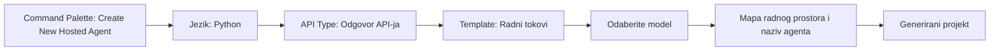
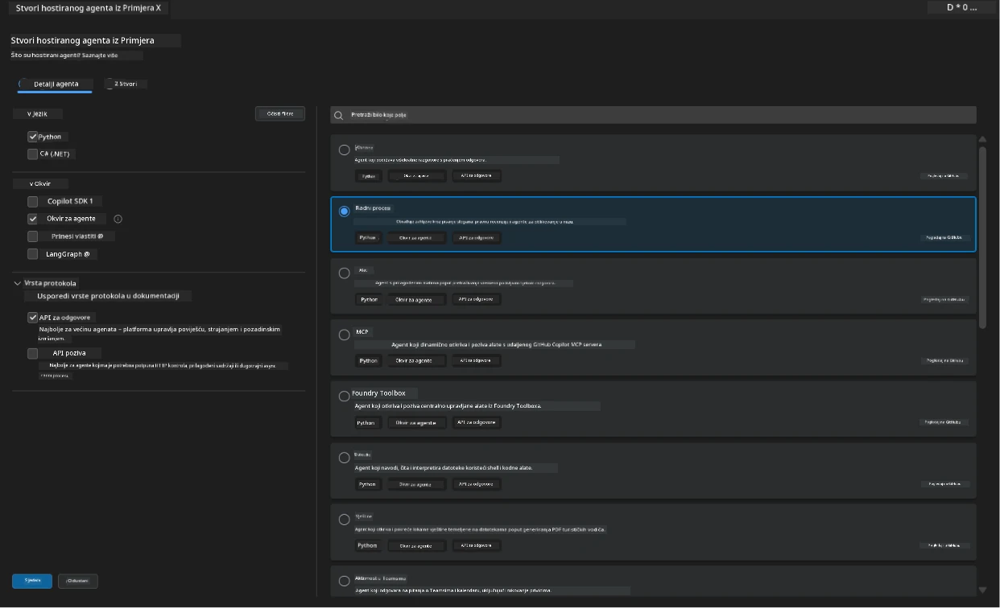
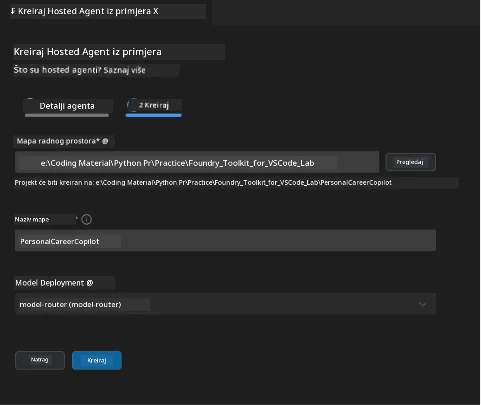

# Modul 2 - Postavljanje višestrukog agentskog projekta

⏱️ ~5 min

U ovom modulu koristite [Foundry Toolkit za VS Code](https://aka.ms/foundrytk) za **postavljanje višestrukog agentskog projekta**. Čarobnjak generira `agent.yaml`, `main.py`, `Dockerfile`, `requirements.txt`, `.env`, i VS Code konfiguraciju za debugiranje - tako da se možete usredotočiti na povezivanje tijeka rada sa 4 agenta u Modulu 3.

> **Ključni pojam:** Postavljanje je radni kostur s jednim agentom. Zamjenjujete logiku privremenog sadržaja s grafom `WorkflowBuilder` u Modulu 3. Ne pišete osnovni kod od nule.

> **Referentna implementacija:** [`PersonalCareerCopilot/`](../../../../../workshop/lab02-multi-agent/PersonalCareerCopilot) je cjelovit radni primjer. Koristite ga za usporedbu svog rada tijekom procesa.

### Tijek rada čarobnjaka za postavljanje


```mermaid
flowchart LR
    A[Command Palette: Create New Hosted Agent] --> B[Jezik: Python]
    B --> C[API Type: Odgovor API-ja]
    C --> D[Template: Radni tokovi]
    D --> E[Odaberite model]
    E --> F[Mapa radnog prostora i naziv agenta]
    F --> G[Generirani projekt]
```

---

## Korak 1: Otvorite čarobnjak za stvaranje hostiranog agenta

1. Pritisnite `Ctrl+Shift+P` da otvorite **Command Palette**.
2. Upisajte: **Foundry Toolkit: Create a New Hosted Agent** i odaberite to.
3. Čarobnjak se otvara na kartici **Agent Details**.

> **Alternativa:** Kliknite ikonu **Foundry Toolkit** na traci aktivnosti → kliknite ikonu **+** pored **Hosted Agents** → **Create New Hosted Agent**.

---

## Korak 2: Odaberite postavke



1. U lijevom dijelu za navigaciju/izbor odaberite sljedeće:

| Izbornik | Izbor | Napomene |
|--------|-----------|-------|
| **Jezik** | Python | C# (.NET) je također podržan |
| **Okvir** | Agent Framework | Omogućuje `Agent`, `AgentExecutor`, `WorkflowBuilder` |
| **Vrsta API-ja** | Response API | `POST /responses` - povijest upravljana od strane platforme, podrška za streaming |
| **Predložak** | **Workflows** | Procesira zahtjeve kroz više agenata u nizu |

2. Kada odaberete, kliknite **Next**



3. U sljedećem prozoru odaberite sljedeće:

| Izbornik | Izbor | Napomene |
|--------|-----------|-------|
| **Mapa radnog prostora** | Pregledajte do ciljne mape | npr. `workshop/lab02-multi-agent/` u ovom repozitoriju |
| **Ime agenta** | `PersonalCareerCopilot` | Ovo postaje ime direktorija projekta |
| **Raspored modela** | Odaberite svoj implementirani model | npr. `gpt-4.1-mini` iz Lab 01 |

4. Kliknite **Create** da postavite projekt. VS Code generira datoteke i otvara mapu.

> **Savjet:** [`gpt-4.1-mini`](https://learn.microsoft.com/azure/foundry/foundry-models/concepts/models-sold-directly-by-azure#gpt-41-series) dobro balansira brzinu i kvalitetu za razvoj višestrukih agenata.

---

## Korak 3: Pregledajte generirani projekt

Nakon dovršetka postavljanja, provjerite da vidite ove datoteke u Exploreru (`Ctrl+Shift+E`):

```
📂 <your-agent-name>/
├── .azdignore          ← Files excluded from Azure Developer CLI deployments
├── .dockerignore       ← Files excluded from Docker builds
├── .env                ← Environment variables (placeholders - fill in Module 3)
├── .vscode/
│   ├── launch.json     ← Debug config (F5 → run + Agent Inspector)
│   └── tasks.json      ← VS Code task definitions
├── agent.yaml          ← Agent definition (kind: hosted, protocol: responses)
├── Dockerfile          ← Container config for deployment
├── main.py             ← Stub agent entry point (replace with WorkflowBuilder in Module 3)
└── requirements.txt    ← Python dependencies
```

> **Važno:** Otvorite ovaj postavljeni direktorij direktno u VS Codeu kako bi `.vscode/launch.json` i `tasks.json` ispravno funkcionirali za debug s F5.

### Objašnjenje ključnih datoteka

| Datoteka | Svrha |
|------|---------|
| `agent.yaml` | Deklarira `kind: hosted`, mapira varijable okoline, definira `/responses` protokol |
| `main.py` | Kostur: jedan `FoundryChatClient` → `Agent` → `ResponsesHostServer`. U Modul 3 to mijenjate s 4 agenta + `WorkflowBuilder` |
| `Dockerfile` | `python:3.12-slim`, instalira `requirements.txt`, otvara port 8088, pokreće `python main.py` |
| `requirements.txt` | `agent-framework-foundry`, `agent-framework-foundry-hosting`, `mcp<2,>=1.24.0`, `debugpy` |

> **Referenca:** Pogledajte [`PersonalCareerCopilot/agent.yaml`](../../../../../workshop/lab02-multi-agent/PersonalCareerCopilot/agent.yaml) i [`PersonalCareerCopilot/requirements.txt`](../../../../../workshop/lab02-multi-agent/PersonalCareerCopilot/requirements.txt) za kompletan generirani sadržaj.

---

### ✅ Kontrolna točka

- [ ] Završeno postavljanje čarobnjaka - nova mapa projekta vidljiva u Exploreru
- [ ] Sve očekivane datoteke prisutne: `agent.yaml`, `main.py`, `Dockerfile`, `requirements.txt`, `.env`
- [ ] `agent.yaml` prikazuje `kind: hosted` i `protocol: responses`
- [ ] `main.py` uvozi `Agent`, `FoundryChatClient`, `ResponsesHostServer`
- [ ] Postavljeni direktorij otvoren je kao korijen radnog prostora u VS Codeu
- [ ] Razumijete da je `main.py` kostur - `WorkflowBuilder` se dodaje u Modulu 3

---

**Prethodno:** [01 - Razumijevanje višestruke agentske arhitekture](01-understand-multi-agent.md) · **Sljedeće:** [03 - Konfiguracija agenata i okruženja →](03-configure-agents.md)

---

<!-- CO-OP TRANSLATOR DISCLAIMER START -->
**Napomena**:
Ovaj dokument je preveden korištenjem AI prevoditeljskog servisa [Co-op Translator](https://github.com/Azure/co-op-translator). Iako težimo točnosti, imajte na umu da automatski prijevodi mogu sadržavati greške ili netočnosti. Izvorni dokument na izvornom jeziku treba smatrati autoritativnim izvorom. Za važne informacije preporuča se profesionalni ljudski prijevod. Nismo odgovorni za bilo kakva nesporazumevanja ili pogrešne interpretacije koje proizlaze iz korištenja ovog prijevoda.
<!-- CO-OP TRANSLATOR DISCLAIMER END -->