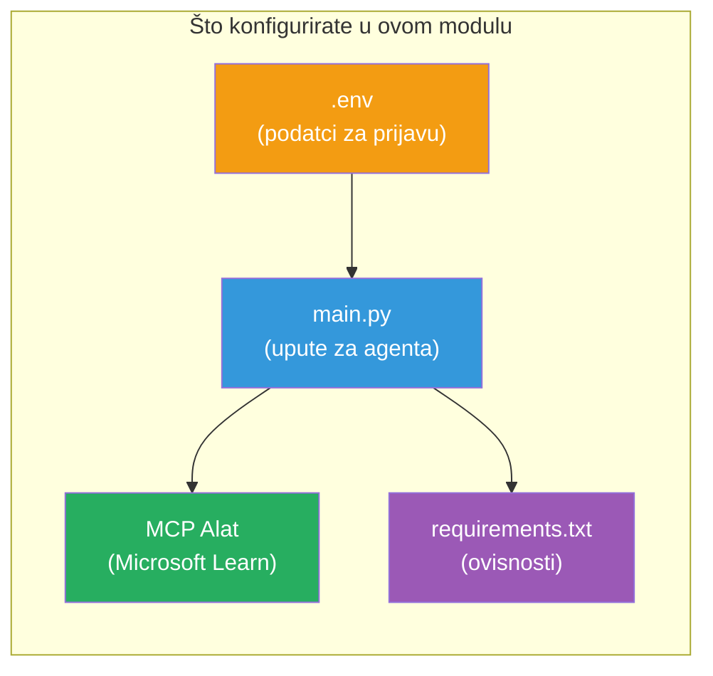

# Modul 3 - Konfiguriranje agenata, MCP alata i okruženja

U ovom modulu prilagodit ćete strukturirani projekt s više agenata. Napisat ćete upute za svih četvero agenata, postaviti MCP alat za Microsoft Learn, konfigurirati varijable okruženja i instalirati ovisnosti.


> **Referenca:** Potpuni radni kod nalazi se u [`PersonalCareerCopilot/main.py`](../../../../../workshop/lab02-multi-agent/PersonalCareerCopilot/main.py). Koristite ga kao referencu dok izrađujete vlastiti.

---

## Korak 1: Konfigurirajte varijable okruženja

1. Otvorite datoteku **`.env`** u korijenu svog projekta.
2. Ispunite detalje svog Foundry projekta:

   ```env
   PROJECT_ENDPOINT=https://<your-account>.services.ai.azure.com/api/projects/<your-project>
   MODEL_DEPLOYMENT_NAME=gpt-4.1-mini
   ```

3. Spremite datoteku.

### Gdje pronaći ove vrijednosti

| Vrijednost | Kako je pronaći |
|------------|-----------------|
| **Project endpoint** | Microsoft Foundry bočna traka → kliknite svoj projekt → URL krajnje točke u prikazu detalja |
| **Model deployment name** | Foundry bočna traka → proširite projekt → **Models + endpoints** → naziv pored implementiranog modela |

> **Sigurnost:** Nikada ne predajte `.env` u verzijski kontrolni sustav. Dodajte ga u `.gitignore` ako već nije tamo.

### Mapiranje varijabli okruženja

Multi-agent `main.py` čita i standardne i specifične nazive varijabli okruženja za radionicu:

```python
PROJECT_ENDPOINT = os.getenv("AZURE_AI_PROJECT_ENDPOINT") or os.getenv("PROJECT_ENDPOINT")
MODEL_DEPLOYMENT_NAME = os.getenv(
    "AZURE_AI_MODEL_DEPLOYMENT_NAME",
    os.getenv("MODEL_DEPLOYMENT_NAME", "gpt-4.1-mini"),
)
MICROSOFT_LEARN_MCP_ENDPOINT = os.getenv(
    "MICROSOFT_LEARN_MCP_ENDPOINT", "https://learn.microsoft.com/api/mcp"
)
```

MCP endpoint ima smisleno zadanu vrijednost - ne morate ga postavljati u `.env` osim ako ga ne želite prebrisati.

---

## Korak 2: Napišite upute za agente

Ovo je najvažniji korak. Svaki agent treba pažljivo izrađene upute koje definiraju njegovu ulogu, format izlaza i pravila. Otvorite `main.py` i stvorite (ili modificirajte) konstante za upute.

### 2.1 Agent za parsiranje životopisa

```python
RESUME_PARSER_INSTRUCTIONS = """\
You are the Resume Parser.
Extract resume text into a compact, structured profile for downstream matching.

Output exactly these sections:
1) Candidate Profile
2) Technical Skills (grouped categories)
3) Soft Skills
4) Certifications & Awards
5) Domain Experience
6) Notable Achievements

Rules:
- Use only explicit or strongly implied evidence.
- Do not invent skills, titles, or experience.
- Keep concise bullets; no long paragraphs.
- If input is not a resume, return a short warning and request resume text.
"""
```

**Zašto ove sekcije?** MatchingAgent treba strukturirane podatke za ocjenjivanje. Dosljedne sekcije omogućuju pouzdan prijenos između agenata.

### 2.2 Agent za opis posla

```python
JOB_DESCRIPTION_INSTRUCTIONS = """\
You are the Job Description Analyst.
Extract a structured requirement profile from a JD.

Output exactly these sections:
1) Role Overview
2) Required Skills
3) Preferred Skills
4) Experience Required
5) Certifications Required
6) Education
7) Domain / Industry
8) Key Responsibilities

Rules:
- Keep required vs preferred clearly separated.
- Only use what the JD states; do not invent hidden requirements.
- Flag vague requirements briefly.
- If input is not a JD, return a short warning and request JD text.
"""
```

**Zašto odvojiti obavezno i poželjno?** MatchingAgent koristi različite težine za svaku (Obavezne vještine = 40 bodova, Poželjne vještine = 10 bodova).

### 2.3 Matching Agent

```python
MATCHING_AGENT_INSTRUCTIONS = """\
You are the Matching Agent.
Compare parsed resume output vs JD output and produce an evidence-based fit report.

Scoring (100 total):
- Required Skills 40
- Experience 25
- Certifications 15
- Preferred Skills 10
- Domain Alignment 10

Output exactly these sections:
1) Fit Score (with breakdown math)
2) Matched Skills
3) Missing Skills
4) Partially Matched
5) Experience Alignment
6) Certification Gaps
7) Overall Assessment

Rules:
- Be objective and evidence-only.
- Keep partial vs missing separate.
- Keep Missing Skills precise; it feeds roadmap planning.
"""
```

**Zašto eksplicitno ocjenjivanje?** Ponavljajuće ocjenjivanje omogućuje usporedbu pokretanja i otklanjanje pogrešaka. Skala od 100 bodova je jednostavna za korisnike.

### 2.4 Agent za analizu praznina

```python
GAP_ANALYZER_INSTRUCTIONS = """\
You are the Gap Analyzer and Roadmap Planner.
Create a practical upskilling plan from the matching report.

Microsoft Learn MCP usage (required):
- For EVERY High and Medium priority gap, call tool `search_microsoft_learn_for_plan`.
- Use returned Learn links in Suggested Resources.
- Prefer Microsoft Learn for free resources.

CRITICAL: You MUST produce a SEPARATE detailed gap card for EVERY skill listed in
the Missing Skills and Certification Gaps sections of the matching report. Do NOT
skip or combine gaps. Do NOT summarize multiple gaps into one card.

Output format:
1) Personalized Learning Roadmap for [Role Title]
2) One DETAILED card per gap (produce ALL cards, not just the first):
   - Skill
   - Priority (High/Medium/Low)
   - Current Level
   - Target Level
   - Suggested Resources (include Learn URL from tool results)
   - Estimated Time
   - Quick Win Project
3) Recommended Learning Order (numbered list)
4) Timeline Summary (week-by-week)
5) Motivational Note

Rules:
- Produce every gap card before writing the summary sections.
- Keep it specific, realistic, and actionable.
- Tailor to candidate's existing stack.
- If fit >= 80, focus on polish/interview readiness.
- If fit < 40, be honest and provide a staged path.
"""
```

**Zašto naglasak na "CRITICAL"?** Bez eksplicitnih uputa za proizvodnju SVIH kartica praznina, model obično generira samo 1-2 kartice i sažima ostale. "CRITICAL" blok sprječava to skraćivanje.

---

## Korak 3: Definirajte MCP alat

GapAnalyzer koristi alat koji poziva [Microsoft Learn MCP server](https://learn.microsoft.com/azure/foundry/agents/how-to/tools/model-context-protocol). Dodajte ovo u `main.py`:

```python
import json
from agent_framework import tool
from mcp.client.session import ClientSession
from mcp.client.streamable_http import streamable_http_client

@tool
async def search_microsoft_learn_for_plan(
    skill: str, role: str = "", max_results: int = 5
) -> str:
    """Search Microsoft Learn MCP and return curated official links for roadmap planning."""
    query = " ".join(part for part in [skill, role, "learning path module"] if part).strip()
    query = query or "job skills learning path"

    try:
        async with streamable_http_client(MICROSOFT_LEARN_MCP_ENDPOINT) as (
            read_stream, write_stream, _,
        ):
            async with ClientSession(read_stream, write_stream) as session:
                await session.initialize()
                result = await session.call_tool(
                    "microsoft_docs_search", {"query": query}
                )

        if not result.content:
            return (
                "No results returned from Microsoft Learn MCP. "
                "Fallback: https://learn.microsoft.com/training/support/catalog-api"
            )

        payload_text = getattr(result.content[0], "text", "")
        data = json.loads(payload_text) if payload_text else {}
        items = data.get("results", [])[:max(1, min(max_results, 10))]

        if not items:
            return f"No direct Microsoft Learn results found for '{skill}'."

        lines = [f"Microsoft Learn resources for '{skill}':"]
        for i, item in enumerate(items, start=1):
            title = item.get("title") or item.get("url") or "Microsoft Learn Resource"
            url = item.get("url") or item.get("link") or ""
            lines.append(f"{i}. {title} - {url}".rstrip(" -"))
        return "\n".join(lines)
    except Exception as ex:
        return (
            f"Microsoft Learn MCP lookup unavailable. Reason: {ex}. "
            "Fallbacks: https://learn.microsoft.com/api/mcp"
        )
```

### Kako alat funkcionira

| Korak | Što se događa |
|-------|---------------|
| 1 | GapAnalyzer odlučuje da mu trebaju resursi za vještinu (npr. "Kubernetes") |
| 2 | Okvir poziva `search_microsoft_learn_for_plan(skill="Kubernetes")` |
| 3 | Funkcija otvara [Streamable HTTP](https://learn.microsoft.com/agent-framework/agents/tools/hosted-mcp-tools) vezu na `https://learn.microsoft.com/api/mcp` |
| 4 | Poziva `microsoft_docs_search` na [MCP serveru](https://learn.microsoft.com/azure/foundry/agents/how-to/tools/model-context-protocol) |
| 5 | MCP server vraća rezultate pretraživanja (naslov + URL) |
| 6 | Funkcija formatira rezultate kao numeriranu listu |
| 7 | GapAnalyzer uključi URL-ove u karticu praznina |

### MCP ovisnosti

MCP klijentske knjižnice su uključene tranzitivno putem [`agent-framework-core`](https://learn.microsoft.com/agent-framework/overview/). Ne morate ih zasebno dodavati u `requirements.txt`. Ako imate pogreške pri uvozu, provjerite:

```powershell
pip list | Select-String "mcp"
```

Očekivano: `mcp` paket je instaliran (verzija 1.x ili novija).

---

## Korak 4: Spajanje agenata i tijeka rada

### 4.1 Kreirajte agente s upraviteljima konteksta

```python
from contextlib import asynccontextmanager

@asynccontextmanager
async def create_agents():
    async with (
        get_credential() as credential,
        AzureAIAgentClient(
            project_endpoint=PROJECT_ENDPOINT,
            model_deployment_name=MODEL_DEPLOYMENT_NAME,
            credential=credential,
        ).as_agent(
            name="ResumeParser",
            instructions=RESUME_PARSER_INSTRUCTIONS,
        ) as resume_parser,
        AzureAIAgentClient(
            project_endpoint=PROJECT_ENDPOINT,
            model_deployment_name=MODEL_DEPLOYMENT_NAME,
            credential=credential,
        ).as_agent(
            name="JobDescriptionAgent",
            instructions=JOB_DESCRIPTION_INSTRUCTIONS,
        ) as jd_agent,
        AzureAIAgentClient(
            project_endpoint=PROJECT_ENDPOINT,
            model_deployment_name=MODEL_DEPLOYMENT_NAME,
            credential=credential,
        ).as_agent(
            name="MatchingAgent",
            instructions=MATCHING_AGENT_INSTRUCTIONS,
        ) as matching_agent,
        AzureAIAgentClient(
            project_endpoint=PROJECT_ENDPOINT,
            model_deployment_name=MODEL_DEPLOYMENT_NAME,
            credential=credential,
        ).as_agent(
            name="GapAnalyzer",
            instructions=GAP_ANALYZER_INSTRUCTIONS,
            tools=[search_microsoft_learn_for_plan],
        ) as gap_analyzer,
    ):
        yield resume_parser, jd_agent, matching_agent, gap_analyzer
```

**Ključne točke:**
- Svaki agent ima svoju vlastitu `AzureAIAgentClient` instancu
- Samo GapAnalyzer dobiva `tools=[search_microsoft_learn_for_plan]`
- `get_credential()` vraća [`ManagedIdentityCredential`](https://learn.microsoft.com/python/api/overview/azure/identity-readme#managed-identity-support) u Azureu, [`DefaultAzureCredential`](https://learn.microsoft.com/azure/developer/python/sdk/authentication/credential-chains#defaultazurecredential-overview) lokalno

### 4.2 Izgradite graf tijeka rada

```python
def create_workflow(resume_parser, jd_agent, matching_agent, gap_analyzer):
    workflow = (
        WorkflowBuilder(
            name="ResumeJobFitEvaluator",
            start_executor=resume_parser,
            output_executors=[gap_analyzer],
        )
        .add_edge(resume_parser, jd_agent)
        .add_edge(resume_parser, matching_agent)
        .add_edge(jd_agent, matching_agent)
        .add_edge(matching_agent, gap_analyzer)
        .build()
    )
    return workflow.as_agent()
```

> Pogledajte [Workflows as Agents](https://learn.microsoft.com/agent-framework/workflows/as-agents) da biste razumjeli `.as_agent()` obrazac.

### 4.3 Pokrenite poslužitelj

```python
async def main() -> None:
    validate_configuration()
    async with create_agents() as (resume_parser, jd_agent, matching_agent, gap_analyzer):
        agent = create_workflow(resume_parser, jd_agent, matching_agent, gap_analyzer)
        from azure.ai.agentserver.agentframework import from_agent_framework
        await from_agent_framework(agent).run_async()

if __name__ == "__main__":
    asyncio.run(main())
```

---

## Korak 5: Kreirajte i aktivirajte virtualno okruženje

### 5.1 Kreirajte okruženje

```powershell
cd workshop\lab02-multi-agent\PersonalCareerCopilot
python -m venv .venv
```

### 5.2 Aktivirajte ga

**PowerShell (Windows):**
```powershell
.\.venv\Scripts\Activate.ps1
```

**macOS/Linux:**
```bash
source .venv/bin/activate
```

### 5.3 Instalirajte ovisnosti

```powershell
pip install -r requirements.txt
```

> **Napomena:** Linija `agent-dev-cli --pre` u `requirements.txt` osigurava da se instalira najnovija preview verzija. To je potrebno za kompatibilnost s `agent-framework-core==1.0.0rc3`.

### 5.4 Provjerite instalaciju

```powershell
pip list | Select-String "agent-framework|agentserver|agent-dev"
```

Očekivani izlaz:
```
agent-dev-cli                  0.0.1b260316
agent-framework-azure-ai       1.0.0rc3
agent-framework-core            1.0.0rc3
azure-ai-agentserver-agentframework 1.0.0b16
azure-ai-agentserver-core      1.0.0b16
```

> **Ako `agent-dev-cli` prikazuje stariju verziju** (npr. `0.0.1b260119`), Agent Inspector neće raditi i pojavit će se pogreške 403/404. Nadogradite: `pip install agent-dev-cli --pre --upgrade`

---

## Korak 6: Provjerite autentifikaciju

Pokrenite istu provjeru autentifikacije kao u Laboratoriju 01:

```powershell
az account show --query "{name:name, id:id}" --output table
```

Ako ovo ne uspije, pokrenite [`az login`](https://learn.microsoft.com/cli/azure/authenticate-azure-cli-interactively).

Za tijekove rada s više agenata, sva četvorica dijele isti akreditiv. Ako autentifikacija uspije za jednoga, uspijeva za sve.

---

### Kontrolna točka

- [ ] `.env` sadrži valjane vrijednosti `PROJECT_ENDPOINT` i `MODEL_DEPLOYMENT_NAME`
- [ ] Sve 4 konstante s uputama za agente definirane su u `main.py` (ResumeParser, JD Agent, MatchingAgent, GapAnalyzer)
- [ ] MCP alat `search_microsoft_learn_for_plan` je definiran i registriran za GapAnalyzer
- [ ] `create_agents()` stvara sva 4 agenta sa zasebnim `AzureAIAgentClient` instancama
- [ ] `create_workflow()` gradi točan graf pomoću `WorkflowBuilder`
- [ ] Virtualno okruženje je kreirano i aktivirano (`(.venv)` vidljivo)
- [ ] `pip install -r requirements.txt` završava bez pogrešaka
- [ ] `pip list` prikazuje sve očekivane pakete u ispravnim verzijama (rc3 / b16)
- [ ] `az account show` vraća vaš pretplatnički nalog

---

**Prethodno:** [02 - Scaffold Multi-Agent Project](02-scaffold-multi-agent.md) · **Sljedeće:** [04 - Orchestration Patterns →](04-orchestration-patterns.md)

---

<!-- CO-OP TRANSLATOR DISCLAIMER START -->
**Odricanje od odgovornosti**:  
Ovaj dokument je preveden koristeći AI prevodilačku uslugu [Co-op Translator](https://github.com/Azure/co-op-translator). Iako težimo točnosti, imajte na umu da automatski prijevodi mogu sadržavati pogreške ili netočnosti. Izvorni dokument na njegovom izvornom jeziku smatra se autoritativnim izvorom. Za ključne informacije preporučuje se profesionalni ljudski prijevod. Ne snosimo odgovornost za bilo kakva nesporazuma ili pogrešne interpretacije koje proizlaze iz korištenja ovog prijevoda.
<!-- CO-OP TRANSLATOR DISCLAIMER END -->