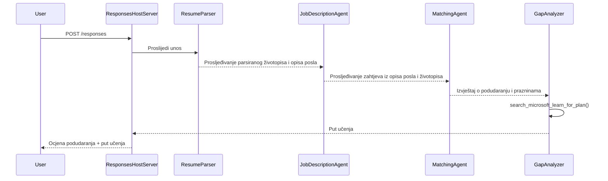

# Modul 3 - Konfiguriranje uputa, okoline i instalacija ovisnosti

⏱️ ~15 min

U ovom modulu pretvarate izloženi predložak u **vaš** višestruki radni tijek - postavljanjem varijabli okoline, pisanjem uputa za agente, dodavanjem MCP alata, povezivanjem grafa tijeka rada i instaliranjem ovisnosti.

> **Referenca:** Cjelokupni funkcionalni kod nalazi se u [`PersonalCareerCopilot/main.py`](../../../../../workshop/lab02-multi-agent/PersonalCareerCopilot/main.py). Koristite ga kao referencu pri izgradnji vlastitog grafa tijeka rada i blokova prompta.

---

## Kako se četiri agenta povezuju


```mermaid
sequenceDiagram
    participant User
    participant Server as ResponsesHostServer
    participant RP as ResumeParser
    participant JD as JobDescriptionAgent
    participant MA as MatchingAgent
    participant GA as GapAnalyzer

    User->>Server: POST /responses
    Server->>RP: Proslijedi unos
    RP-->>JD: Prosljeđivanje parsiranog životopisa i opisa posla
    JD-->>MA: Prosljeđivanje zahtjeva iz opisa posla i životopisa
    MA-->>GA: Izvještaj o podudaranju i prazninama
    GA->>GA: search_microsoft_learn_for_plan()
    GA-->>Server: Put učenja
    Server-->>User: Ocjena podudaranja + put učenja
```

---

## Korak 1: Konfigurirajte varijable okoline

1. Otvorite **`.env`** datoteku u korijenu vašeg projekta (koju je kreirao čarobnjak za predložak).
2. Zamijenite mjesta za unos stvarnim vrijednostima iz Laboratorija 01.

<details open>
<summary><strong>🅰️ Put A - Foundry pretplata</strong></summary>

```env
FOUNDRY_PROJECT_ENDPOINT=https://<your-account>.services.ai.azure.com/api/projects/<your-project>
AZURE_AI_MODEL_DEPLOYMENT_NAME=gpt-4.1-mini
```

> **Gdje pronaći vrijednosti:** Pogledajte [Laboratorij 01, Modul 1](../../lab01-single-agent/docs/01-setup.md#deploy-a-model--assign-rbac).

</details>

<details open>
<summary><strong>🅱️ Put B - Foundry lokalno</strong></summary>

```env
FOUNDRY_PROJECT_ENDPOINT=http://localhost:5273/v1
AZURE_AI_MODEL_DEPLOYMENT_NAME=phi-4-mini
```

> Sve izvođenje zaključivanja odvija se na vašem računalu - nijedan podatak ne napušta uređaj. Pokrenite `foundry model list` za potvrdu točnog aliasa modela. Jedini odlazni zahtjev je poziv MCP alata na `https://learn.microsoft.com/api/mcp`.

> **Gdje pronaći vrijednosti:** Pogledajte [Laboratorij 01, Modul 1 - lokalni put](../../lab01-single-agent/docs/01-setup.md#step-2-set-up-based-on-your-access).

</details>

> **Sigurnost:** Nikada ne pohranjujte `.env` u kontrolu verzija. Trebao bi već biti u `.gitignore`.

---

## Korak 2: Napišite upute za agente

Upute definiraju ulogu svakog agenta, format izlaza i pravila. Otvorite `main.py` i definirajte (ili zamijenite) četiri konstante uputa - cijeli tekst se nalazi u [`PersonalCareerCopilot/main.py`](../../../../../workshop/lab02-multi-agent/PersonalCareerCopilot/main.py).

### 2.1 `RESUME_PARSER_INSTRUCTIONS`
Parsira životopis u strukturirani profil kandidata **i** kopira opis posla doslovno u `[JOB DESCRIPTION PASS-THROUGH]`. Oba označena dijela moraju se pojaviti u izlazu.

> **Zašto pass-through?** S `context_mode="last_agent"`, ResumeParser je **jedini** agent koji vidi izvorni korisnički zahtjev. Ako ne kopira opis posla dalje, sljedeći agenti ga nikada ne vide.

### 2.2 `JOB_DESCRIPTION_INSTRUCTIONS`
Čita `[PARSED RESUME]` i `[JOB DESCRIPTION PASS-THROUGH]` iz izlaza ResumeParser-a. Izlazi `[JD REQUIREMENTS]` (strukturirani zahtevi) i `[PARSED RESUME PASS-THROUGH]` (doslovna kopija životopisa za MatchingAgent).

### 2.3 `MATCHING_AGENT_INSTRUCTIONS`
Čita `[JD REQUIREMENTS]` i `[PARSED RESUME PASS-THROUGH]`. Izrađuje izvještaj o podudarnosti s ocjenom (0–100) s matematičkim razlaganjem, pronađenim vještinama, nedostajućim vještinama i usklađivanjem iskustva.

### 2.4 `GAP_ANALYZER_INSTRUCTIONS`
Čita izvještaj o podudarnosti. Za **svaku** nedostajuću vještinu poziva `search_microsoft_learn_for_plan` za dohvaćanje resursa Microsoft Learn. Stvara detaljnu karticu razlike po vještini plus tjedni plan učenja.

---

## Korak 3: Dodajte MCP alat

GapAnalyzer poziva [Microsoft Learn MCP server](https://learn.microsoft.com/azure/foundry/agents/how-to/tools/model-context-protocol) za dohvaćanje stvarnih resursa učenja za svaki jaz u vještinama. Cijela funkcija `search_microsoft_learn_for_plan` nalazi se u [`PersonalCareerCopilot/main.py`](../../../../../workshop/lab02-multi-agent/PersonalCareerCopilot/main.py).

Registrirajte alat na GapAnalyzeru prilikom kreiranja agenta:

```python
gap_analyzer = Agent(
    client=client,
    instructions=GAP_ANALYZER_INSTRUCTIONS,
    name="GapAnalyzer",
    tools=[search_microsoft_learn_for_plan],
)
```

> Pogledajte [`PersonalCareerCopilot/main.py`](../../../../../workshop/lab02-multi-agent/PersonalCareerCopilot/main.py) za cjelokupni `WorkflowBuilder` graf s `FoundryChatClient`, `AgentExecutor` i svim pozivima `add_edge()`.

---

## Korak 4: Kreirajte virtualno okruženje i instalirajte ovisnosti

> ⚠️ **Nemojte preskakati ovaj korak.** Bez instaliranih ovisnosti, F5 ispravljanje pogrešaka neće uspjeti.

### 4.1 Kreirajte virtualno okruženje

```powershell
python -m venv .venv
```

### 4.2 Aktivirajte ga

| OS | Naredba |
|----|---------|
| **Windows (PowerShell)** | `.\.venv\Scripts\Activate.ps1` |
| **Windows (CMD)** | `.venv\Scripts\activate.bat` |
| **macOS / Linux** | `source .venv/bin/activate` |

Trebali biste vidjeti `(.venv)` u vašem terminalskom promptu.

### 4.3 Instalirajte ovisnosti

```powershell
pip install -r requirements.txt
```

### 4.4 Potvrdite

```powershell
pip list | Select-String "agent-framework|mcp|debugpy"
```

Očekivano: trebaju biti navedeni `agent-framework-foundry`, `agent-framework-foundry-hosting`, `mcp` i `debugpy`.

---

## Korak 5: Potvrdite autentikaciju

<details open>
<summary><strong>🅰️ Put A - Azure vjerodajnice</strong></summary>

```powershell
az account show --query "{name:name, id:id}" --output table
```

Ako ne uspije, pokrenite [`az login`](https://learn.microsoft.com/cli/azure/authenticate-azure-cli-interactively).

Sva četiri agenta dijele jedan `FoundryChatClient` i jedan `DefaultAzureCredential`. Ako autentikacija radi za jednog, radi za sve.

</details>

<details open>
<summary><strong>🅱️ Put B - Foundry lokalno</strong></summary>

Za lokalno testiranje nije potrebna autentikacija.

</details>

---

### ✅ Provjerna točka

> Nemojte nastaviti na Modul 04 dok: **(1)** `(.venv)` nije vidljiv u promptu I **(2)** `pip install -r requirements.txt` nije uspješno dovršen.

- [ ] `.env` sadrži valjani endpoint i ime deploya modela (ne mjesta za unos)
- [ ] Sve 4 konstante uputa za agente definirane u `main.py` (ResumeParser, JD Agent, MatchingAgent, GapAnalyzer)
- [ ] MCP alat `search_microsoft_learn_for_plan` definiran i registriran na GapAnalyzeru
- [ ] Kreirani su `FoundryChatClient` + 4 `Agent` + 4 `AgentExecutor` objekti u `main()`
- [ ] `WorkflowBuilder` gradi ispravan sekvencijski graf sa svim 3 `add_edge()` poziva
- [ ] Virtualno okruženje kreirano i aktivirano (`(.venv)` vidljiv u promptu)
- [ ] `pip install -r requirements.txt` dovršen bez grešaka
- [ ] **Put A:** `az account show` uspješan ILI ikona računa u VS Code prikazuje prijavljeni račun

---

**Prethodno:** [02 - Scaffold Multi-Agent Project](02-scaffold-multi-agent.md) · **Sljedeće:** [04 - Obrasci orkestracije →](04-orchestration-patterns.md)

---

<!-- CO-OP TRANSLATOR DISCLAIMER START -->
**Napomena**:
Ovaj dokument je preveden korištenjem AI prevoditeljskog servisa [Co-op Translator](https://github.com/Azure/co-op-translator). Iako težimo točnosti, imajte na umu da automatski prijevodi mogu sadržavati greške ili netočnosti. Izvorni dokument na izvornom jeziku treba smatrati autoritativnim izvorom. Za važne informacije preporuča se profesionalni ljudski prijevod. Nismo odgovorni za bilo kakva nesporazumevanja ili pogrešne interpretacije koje proizlaze iz korištenja ovog prijevoda.
<!-- CO-OP TRANSLATOR DISCLAIMER END -->