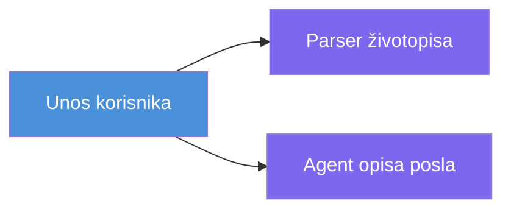
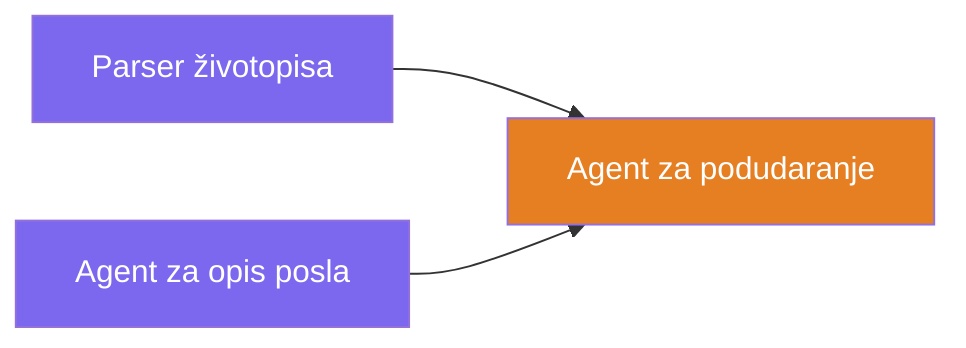
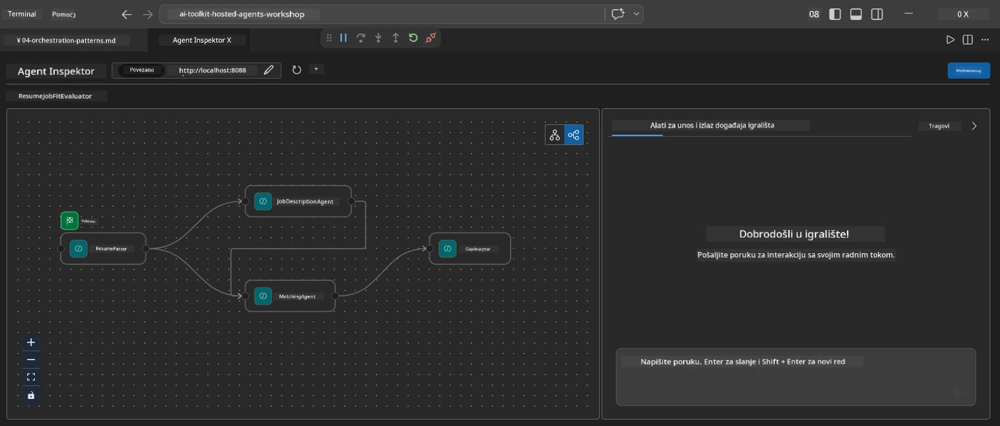
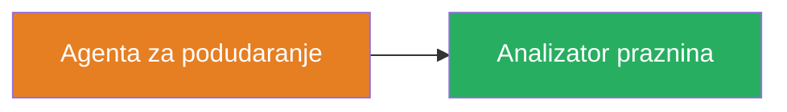
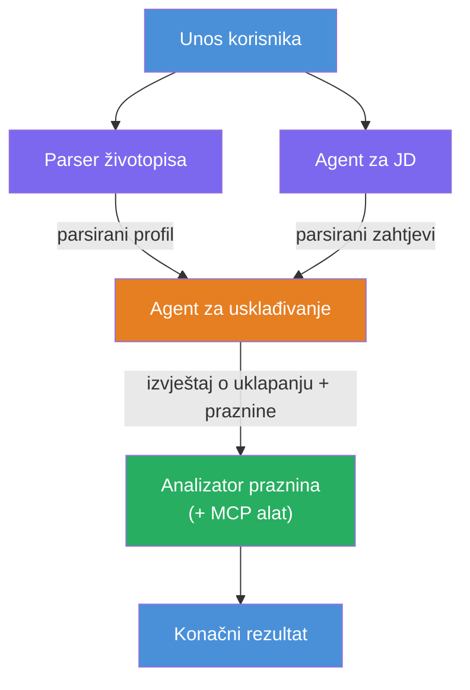
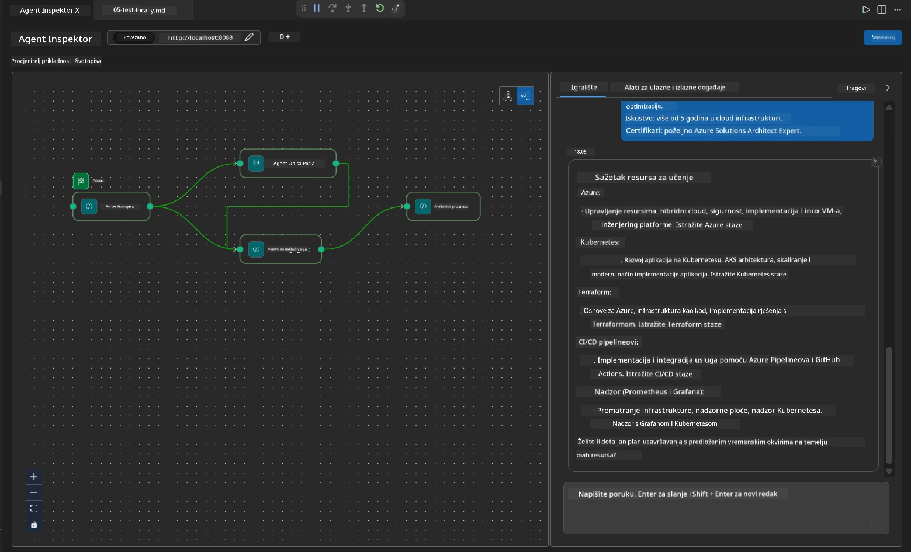

# Modul 4 - Obrasci orkestracije

U ovom modulu istražujete obrasce orkestracije korištene u Resume Job Fit Evaluatoru i učite kako čitati, mijenjati i proširivati graf radnog tijeka. Razumijevanje ovih obrazaca ključno je za otklanjanje problema u protoku podataka i izgradnju vlastitih [workflowa s više agenata](https://learn.microsoft.com/agent-framework/workflows/).

---

## Obrasci 1: Fan-out (paralelno razdvajanje)

Prvi obrazac u workflowu je **fan-out** - jedan ulaz se istovremeno šalje više agentima.


U kodu se to događa zato što je `resume_parser` `start_executor` - on prvo prima korisničku poruku. Zatim, budući da `jd_agent` i `matching_agent` imaju veze iz `resume_parser`, okvir usmjerava izlaz `resume_parser` na oba agenta:

```python
.add_edge(resume_parser, jd_agent)         # Rezultat ResumeParsera → JD Agent
.add_edge(resume_parser, matching_agent)   # Rezultat ResumeParsera → MatchingAgent
```

**Zašto ovo radi:** ResumeParser i JD Agent obrađuju različite aspekte istog ulaza. Pokretanje paralelno smanjuje ukupnu latenciju u usporedbi s pokretanjem sekvencijalno.

### Kada koristiti fan-out

| Slučaj upotrebe | Primjer |
|-----------------|---------|
| Neovisni podzadatci | Parsiranje životopisa naspram parsiranja JD-a |
| Redundancija / glasanje | Dva agenta analiziraju iste podatke, treći bira najbolji odgovor |
| Višeformatski izlaz | Jedan agent generira tekst, drugi strukturirani JSON |

---

## Obrasci 2: Fan-in (agregacija)

Drugi obrazac je **fan-in** - višestruki izlazi agenata se prikupljaju i šalju jednom idućem agentu.


U kodu:

```python
.add_edge(resume_parser, matching_agent)   # Izlaz ResumeParser → MatchingAgent
.add_edge(jd_agent, matching_agent)        # Izlaz JD Agenta → MatchingAgent
```

**Ključno ponašanje:** Kada agent ima **dva ili više ulaznih veza**, okvir automatski čeka **sve** prethodne agente da završe prije nego što pokrene sljedećeg agenta. MatchingAgent ne počinje dok ResumeParser i JD Agent nisu dovršili.

### Što MatchingAgent prima

Okvir spaja (konkatenira) izlaze svih prethodnih agenata. Ulaz MatchingAgenta izgleda ovako:

```
[ResumeParser output]
---
Candidate Profile:
  Name: Jane Doe
  Technical Skills: Python, Azure, Kubernetes, ...
  ...

[JobDescriptionAgent output]
---
Role Overview: Senior Cloud Engineer
Required Skills: Python, Azure, Terraform, ...
...
```

> **Napomena:** Točan format konkatenacije ovisi o verziji okvira. Upute za agenta trebaju biti napisane tako da podrže kako strukturirani, tako i nestrukturirani izlaz prethodnih agenata.



---

## Obrasci 3: Sekvencijalni lanac

Treći obrazac je **sekvencijalno povezivanje** - izlaz jednog agenta izravno ide u sljedećeg.


U kodu:

```python
.add_edge(matching_agent, gap_analyzer)    # Izlaz MatchingAgent → GapAnalyzer
```

Ovo je najjednostavniji obrazac. GapAnalyzer prima rezultat uklapanja od MatchingAgenta, usklađene/nedostajuće vještine i praznine. Zatim poziva [MCP alat](https://learn.microsoft.com/azure/foundry/agents/how-to/tools/model-context-protocol) za svaku prazninu kako bi dohvatili Microsoft Learn resurse.

---

## Cijeli graf

Kombinirajući sva tri obrasca dobivamo puni workflow:


### Vremenska linija izvođenja

```mermaid
gantt
    title Vremenska Crta Izvršenja Agenta
    dateFormat X
    axisFormat %s

    section Paralelno
    Parser životopisa   :rp, 0, 3
    JD Agent            :jd, 0, 2

    section Sekvencijalno
    Agent za podudaranje:ma, 3, 5
    Analizator praznina :ga, 5, 9
```


> Ukupno vrijeme prema satu je približno `max(ResumeParser, JD Agent) + MatchingAgent + GapAnalyzer`. GapAnalyzer je obično najsporiji jer poziva MCP alat više puta (jednom po praznini).

---

## Čitanje koda WorkflowBuilder-a

Evo kompletne funkcije `create_workflow()` iz `main.py`, s bilješkama:

```python
def create_workflow(resume_parser, jd_agent, matching_agent, gap_analyzer):
    workflow = (
        WorkflowBuilder(
            name="ResumeJobFitEvaluator",

            # Prvi agent koji prima korisnički unos
            start_executor=resume_parser,

            # Agent(i) čiji izlaz postaje konačni odgovor
            output_executors=[gap_analyzer],
        )
        # Razgrananje: Izlaz ResumeParsera ide i JD Agentu i MatchingAgentu
        .add_edge(resume_parser, jd_agent)
        .add_edge(resume_parser, matching_agent)

        # Spajanje: MatchingAgent čeka i ResumeParser i JD Agent
        .add_edge(jd_agent, matching_agent)

        # Sekvencijalno: Izlaz MatchingAgenta ide u GapAnalyzer
        .add_edge(matching_agent, gap_analyzer)

        .build()
    )
    return workflow.as_agent()
```

### Sažetak veza

| # | Veza | Obrasci | Efekt |
|---|------|----------|--------|
| 1 | `resume_parser → jd_agent` | Fan-out | JD Agent prima ResumeParserov izlaz (plus originalni korisnički ulaz) |
| 2 | `resume_parser → matching_agent` | Fan-out | MatchingAgent prima ResumeParserov izlaz |
| 3 | `jd_agent → matching_agent` | Fan-in | MatchingAgent također prima izlaz JD Agenta (čeka oba) |
| 4 | `matching_agent → gap_analyzer` | Sekvencijalno | GapAnalyzer prima izvještaj o uklapanju i popis praznina |

---

## Mijenjanje grafa

### Dodavanje novog agenta

Za dodavanje petog agenta (npr. **InterviewPrepAgent** koji generira pitanja za intervju na temelju analize praznina):

```python
# 1. Definirajte upute
INTERVIEW_PREP_INSTRUCTIONS = """\
You are the Interview Prep Agent.
Given a gap analysis and fit report, generate 10 targeted interview questions
the candidate should prepare for.
"""

# 2. Kreirajte agenta (unutar async with bloka)
AzureAIAgentClient(
    project_endpoint=PROJECT_ENDPOINT,
    model_deployment_name=MODEL_DEPLOYMENT_NAME,
    credential=credential,
).as_agent(
    name="InterviewPrepAgent",
    instructions=INTERVIEW_PREP_INSTRUCTIONS,
) as interview_prep,

# 3. Dodajte veze u create_workflow()
.add_edge(matching_agent, interview_prep)   # prima izvještaj o prilagodbi
.add_edge(gap_analyzer, interview_prep)     # također prima gap kartice

# 4. Ažurirajte output_executors
output_executors=[interview_prep],  # sada konačni agent
```

### Promjena redoslijeda izvršavanja

Da bi JD Agent radio **nakon** ResumeParser-a (sekvencijalno umjesto paralelno):

```python
# Ukloni: .add_edge(resume_parser, jd_agent)  ← već postoji, zadrži ga
# Ukloni implicitno paralelno izvršavanje tako da jd_agent NE prima izravno unos korisnika
# start_executor prvo šalje resume_parseru, a jd_agent dobiva
# izlaz resume_parsera putem veze. To ih čini sekvencijalnima.
```

> **Važno:** `start_executor` je jedini agent koji prima neobrađeni korisnički ulaz. Svi ostali agenti primaju izlaz s njihovih prethodnih veza. Ako želite da agent također primi sirovi korisnički ulaz, mora imati vezu od `start_executor`.

---

## Česte pogreške u grafu

| Pogreška | Simptom | Popravak |
|----------|---------|----------|
| Nedostaje veza do `output_executors` | Agent radi, ali je izlaz prazan | Osigurajte da postoji put od `start_executor` do svakog agenta u `output_executors` |
| Cirkularna ovisnost | Beskonačna petlja ili istekao vremenski limit | Provjerite da nijedan agent ne vraća podatke prethodnom agentu |
| Agent u `output_executors` bez ulazne veze | Prazan izlaz | Dodajte barem jednu `add_edge(source, taj_agent)` |
| Više `output_executors` bez fan-in | Izlaz sadrži samo odgovor jednog agenta | Koristite jednog output agenta koji agregira ili prihvatite više izlaza |
| Nedostaje `start_executor` | `ValueError` prilikom gradnje | Uvijek specificirajte `start_executor` u `WorkflowBuilder()` |

---

## Otklanjanje pogrešaka u grafu

### Korištenje Agent Inspector-a

1. Pokrenite agenta lokalno (F5 ili terminal - pogledajte [Modul 5](05-test-locally.md)).
2. Otvorite Agent Inspector (`Ctrl+Shift+P` → **Foundry Toolkit: Open Agent Inspector**).
3. Pošaljite testnu poruku.
4. U panelu odgovora Inspektora potražite **streaming output** - prikazuje doprinos svakog agenta redom.



### Korištenje zapisivanja logova

Dodajte logiranje u `main.py` za praćenje protoka podataka:

```python
import logging
logger = logging.getLogger("resume-job-fit")

# U create_workflow(), nakon izgradnje:
logger.info("Workflow graph built with edges: RP→JD, RP→MA, JD→MA, MA→GA")
```

Poslužiteljski zapisi pokazuju redoslijed izvršavanja agenata i pozive MCP alata:

```
INFO:resume-job-fit:Starting Resume -> Job Fit Evaluator HTTP server...
INFO:resume-job-fit:Server running on http://localhost:8088
INFO:agent_framework:Executing agent: ResumeParser
INFO:agent_framework:Executing agent: JobDescriptionAgent
INFO:agent_framework:Waiting for upstream agents: ResumeParser, JobDescriptionAgent
INFO:agent_framework:Executing agent: MatchingAgent
INFO:agent_framework:Executing agent: GapAnalyzer
INFO:agent_framework:Tool call: search_microsoft_learn_for_plan(skill="Kubernetes")
POST https://learn.microsoft.com/api/mcp → 200
INFO:agent_framework:Tool call: search_microsoft_learn_for_plan(skill="Terraform")
POST https://learn.microsoft.com/api/mcp → 200
```

---

### Kontrolna točka

- [ ] Možete prepoznati tri obrasca orkestracije u workflowu: fan-out, fan-in i sekvencijalni lanac
- [ ] Razumijete da agenti s više ulaznih veza čekaju da svi prethodni agenti završe
- [ ] Možete čitati `WorkflowBuilder` kod i povezati svaki `add_edge()` poziv s vizualnim grafom
- [ ] Razumijete vremensku liniju izvršavanja: paralelni agenti rade prvo, zatim agregacija, zatim sekvencijalno
- [ ] Znate kako dodati novog agenta u graf (definirati upute, kreirati agenta, dodati veze, ažurirati izlaz)
- [ ] Možete prepoznati česte pogreške u grafu i njihove simptome

---

**Prethodni:** [03 - Configuriranje agenata i okoline](03-configure-agents.md) · **Sljedeći:** [05 - Testiranje lokalno →](05-test-locally.md)

---

<!-- CO-OP TRANSLATOR DISCLAIMER START -->
**Odricanje od odgovornosti**:
Ovaj dokument je preveden pomoću AI usluge za prevođenje [Co-op Translator](https://github.com/Azure/co-op-translator). Iako težimo točnosti, molimo vas da imate na umu da automatski prijevodi mogu sadržavati pogreške ili netočnosti. Izvorni dokument na izvornom jeziku treba smatrati autoritativnim izvorom. Za kritične informacije preporučuje se profesionalni ljudski prijevod. Ne snosimo odgovornost za bilo kakva nerazumijevanja ili pogrešne interpretacije proizašle iz korištenja ovog prijevoda.
<!-- CO-OP TRANSLATOR DISCLAIMER END -->