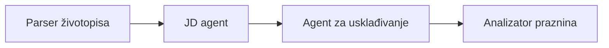
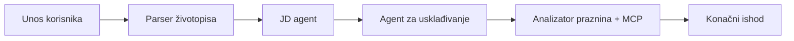

# Modul 4 - Obrasci orkestracije

⏱️ ~10 min

U ovom modulu istražujete obrasce orkestracije korištene u Resume Job Fit Evaluatoru i učite kako čitati, mijenjati i proširivati graf toka rada. Razumijevanje ovih obrazaca ključno je za otklanjanje poteškoća u protoku podataka i za izgradnju vlastitih [višestrukih agenata radnih tokova](https://learn.microsoft.com/agent-framework/workflows/).

---

## Obrazac 1: Sekvencijalni lanac

Osnovni obrazac u radu toka je **sekvencijalni lanac** - izlaz svakog agenta izravno ulazi u sljedećeg.


```mermaid
flowchart LR
    RP[Parser životopisa] --> JD[JD agent]
    JD --> MA[Agent za usklađivanje]
    MA --> GA[Analizator praznina]
```

U kodu, svaki poziv `add_edge()` stvara jedan korak u lancu:

```python
.add_edge(resume_executor, jd_executor)       # Rezultat ResumeParser → JD Agent
.add_edge(jd_executor, matching_executor)     # Rezultat JD Agent → MatchingAgent
.add_edge(matching_executor, gap_executor)    # Rezultat MatchingAgent → GapAnalyzer
```

> **Zašto sekvencijalni, a ne fan-out/fan-in?** `WorkflowBuilder` koristi **OR-semantiku** za ulazne bridove: izvršitelj nizvodno se pokreće čim **bilo koji** prethodnik završi. Ako bi `matching_executor` imao dva ulazna brida (od `resume_executor` i `jd_executor`), aktivirao bi se dva puta - jednom kada ResumeParser završi i opet kada JD Agent završi - što bi dovelo do dvostrukog pokretanja GapAnalyzer-a i dvostrukog pojavljivanja izlaza. Sekvencijalni lanac to u potpunosti izbjegava.

## Obrazac 2: Prosljeđivanje sadržaja

Budući da `context_mode="last_agent"` znači da svaki izvršitelj vidi samo **izlaz svog izravnog prethodnika**, agenti u sekvencijalnom lancu moraju eksplicitno prosljeđivati podatke koji su potrebni nizvodnim agentima.

U ovom radnom toku:
- **ResumeParser** kopira JD doslovno u `[JOB DESCRIPTION PASS-THROUGH]` (kako bi ga JD Agent mogao pronaći).
- **JD Agent** kopira `[PARSED RESUME]` doslovno u `[PARSED RESUME PASS-THROUGH]` (kako bi MatchingAgent mogao usporediti oba profila).

```
ResumeParser output
└─ [PARSED RESUME]               ← extracted by JD Agent
└─ [JOB DESCRIPTION PASS-THROUGH] ← extracted by JD Agent

JD Agent output
└─ [JD REQUIREMENTS]             ← extracted by MatchingAgent
└─ [PARSED RESUME PASS-THROUGH]  ← extracted by MatchingAgent
```

Svaki prijenosni dio mora biti kopiran **doslovno** - sažimanje ili parafraziranje prekida nizvodnog agenta koji ovisi o njemu.

---

## Potpuni graf

Kombinacija obrazaca sekvencijalnog lanca i prosljeđivanja sadržaja daje cjelokupni radni tok:


```mermaid
flowchart LR
    U[Unos korisnika] --> RP[Parser životopisa]
    RP --> JD[JD agent]
    JD --> MA[Agent za usklađivanje]
    MA --> GA[Analizator praznina + MCP]
    GA --> O[Konačni ishod]
```

Agent Inspector prikazuje istu strukturu grafa kada agent radi lokalno. Pogledajte [Modul 5 - Testiranje lokalno](05-test-locally.md) za snimke zaslona.

---

## Čitanje koda WorkflowBuilder-a

Cijela funkcija `create_workflow()` nalazi se u [`PersonalCareerCopilot/main.py`](../../../../../workshop/lab02-multi-agent/PersonalCareerCopilot/main.py). Tri poziva `add_edge()` grade sekvencijalnu liniju:

| # | Brid | Učinak |
|---|------|--------|
| 1 | `resume_executor → jd_executor` | JD Agent prima `[PARSED RESUME]` + `[JOB DESCRIPTION PASS-THROUGH]` |
| 2 | `jd_executor → matching_executor` | MatchingAgent prima `[JD REQUIREMENTS]` + `[PARSED RESUME PASS-THROUGH]` |
| 3 | `matching_executor → gap_executor` | GapAnalyzer prima izvještaj o uklapanju + popis praznina |

---

## Mijenjanje grafa

### Dodavanje novog agenta

Za dodavanje petog agenta (npr. **InterviewPrepAgent** nakon GapAnalyzer):

1. Definirajte konstantu `INTERVIEW_PREP_INSTRUCTIONS`.
2. Kreirajte `Agent` + `AgentExecutor` objekte (isti obrazac kao kod postojeća četiri).
3. Dodajte `.add_edge(gap_executor, interview_exec)` u `WorkflowBuilder`.
4. Ažurirajte `output_executors=[interview_exec]`.

> **Važno:** `start_executor` je jedini agent koji prima sirovi korisnički unos. Svi ostali agenti primaju izlaz sa svojeg uzlaznog brida.

---

## Česte pogreške u grafu

| Pogreška | Simptom | Popravak |
|---------|---------|-----|
| Nedostaje brid do `output_executors` | Agent radi, ali izlaz je prazan | Osigurajte da postoji put od `start_executor` do svakog agenta u `output_executors` |
| Cirkularna ovisnost | Beskonačna petlja ili timeout | Provjerite da nijedan agent ne šalje izlaz natrag uzlaznom agentu |
| Agent u `output_executors` bez ulaznog brida | Prazan izlaz | Dodajte barem jedan `add_edge(izvor, taj_agent)` |
| Višestruki `output_executors` bez fan-ina | Izlaz sadrži samo odgovor jednog agenta | Koristite jednog izlaznog agenta koji agregira ili prihvatite višestruke izlaze |
| Nedostaje `start_executor` | `ValueError` pri izgradnji | Uvijek navedite `start_executor` u `WorkflowBuilder()` |

---

## Otklanjanje pogrešaka u grafu

### Korištenje Agent Inspectora

1. Pokrenite agenta lokalno pritiskom na F5.
2. Otvorite Agent Inspector (`Ctrl+Shift+P` → **Foundry Toolkit: Open Agent Inspector**).
3. Pošaljite testnu poruku.
4. U panelu odgovora Inspectora tražite **izlaz u streamingu** - prikazuje doprinos svakog agenta redom.


### Korištenje zapisivanja (logging)

Dodajte zapisivanje u `main.py` za praćenje protoka podataka:

```python
import logging
logger = logging.getLogger("resume-job-fit")

# U main(), nakon izgradnje tijeka rada:
logger.info("Workflow graph built with edges: RP→JD, JD→MA, MA→GA")
```

Dnevnici poslužitelja prikazuju redoslijed izvršavanja agenta i pozive MCP alata:

```
INFO:agent_framework:Executing agent: ResumeParser
INFO:agent_framework:Executing agent: JobDescriptionAgent
INFO:agent_framework:Executing agent: MatchingAgent
INFO:agent_framework:Executing agent: GapAnalyzer
INFO:agent_framework:Tool call: search_microsoft_learn_for_plan(skill="Kubernetes")
POST https://learn.microsoft.com/api/mcp → 200
INFO:agent_framework:Tool call: search_microsoft_learn_for_plan(skill="Terraform")
POST https://learn.microsoft.com/api/mcp → 200
```

---

### Kontrolna točka

- [ ] Možete identificirati dva obrasca orkestracije u radnom toku: sekvencijalni lanac i prosljeđivanje sadržaja
- [ ] Razumijete zašto `context_mode="last_agent"` zahtijeva eksplicitan prijenos podataka među agentima
- [ ] Možete pročitati kod `WorkflowBuilder` i povezati svaki poziv `add_edge()` s vizualnim grafom
- [ ] Znate kako dodati novog agenta na kraj lanca
- [ ] Možete identificirati česte pogreške u grafu i njihove simptome

---

**Prethodni:** [03 - Konfiguracija agenata i okoline](03-configure-agents.md) · **Sljedeći:** [05 - Testiranje lokalno →](05-test-locally.md)

---

<!-- CO-OP TRANSLATOR DISCLAIMER START -->
**Napomena**:
Ovaj dokument je preveden korištenjem AI prevoditeljskog servisa [Co-op Translator](https://github.com/Azure/co-op-translator). Iako težimo točnosti, imajte na umu da automatski prijevodi mogu sadržavati greške ili netočnosti. Izvorni dokument na izvornom jeziku treba smatrati autoritativnim izvorom. Za važne informacije preporuča se profesionalni ljudski prijevod. Nismo odgovorni za bilo kakva nesporazumevanja ili pogrešne interpretacije koje proizlaze iz korištenja ovog prijevoda.
<!-- CO-OP TRANSLATOR DISCLAIMER END -->