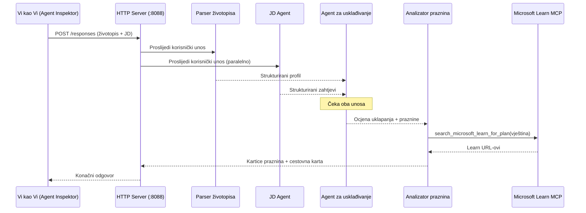
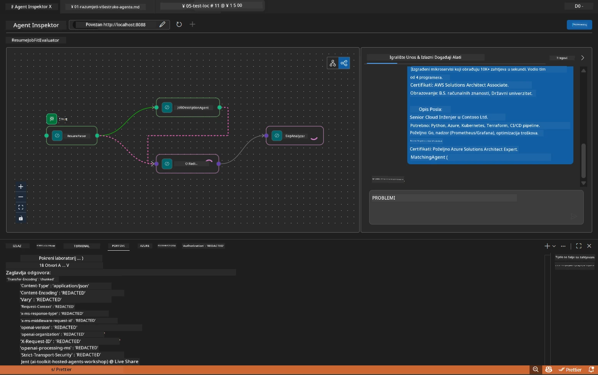

# Modul 5 - Testiranje lokalno (Više agenata)

U ovom modulu pokrećete višestruki agentni tijek rada lokalno, testirate ga pomoću Agent Inspectora i provjeravate rade li svi četvoro agenata i MCP alat ispravno prije implementacije na Foundry.

### Što se događa tijekom lokalnog pokretanja testa


---

## Korak 1: Pokrenite poslužitelj agenta

### Opcija A: Korištenje VS Code zadatka (preporučeno)

1. Pritisnite `Ctrl+Shift+P` → upišite **Tasks: Run Task** → odaberite **Run Lab02 HTTP Server**.
2. Zadatak pokreće poslužitelj s debugpy vezanim na port `5679` i agentom na portu `8088`.
3. Pričekajte da se u izlazu prikaže:

```
INFO:resume-job-fit:Starting Resume -> Job Fit Evaluator HTTP server...
INFO:resume-job-fit:Server running on http://localhost:8088
```

### Opcija B: Ručno korištenje terminala

```powershell
cd workshop\lab02-multi-agent\PersonalCareerCopilot
```

Aktivirajte virtualno okruženje:

**PowerShell (Windows):**
```powershell
.\.venv\Scripts\Activate.ps1
```

**macOS/Linux:**
```bash
source .venv/bin/activate
```

Pokrenite poslužitelj:

```powershell
python -m debugpy --listen 127.0.0.1:5679 -m agentdev run main.py --verbose --port 8088
```

### Opcija C: Korištenje F5 (debug način)

1. Pritisnite `F5` ili idite na **Run and Debug** (`Ctrl+Shift+D`).
2. Odaberite konfiguraciju pokretanja **Lab02 - Multi-Agent** iz padajućeg izbornika.
3. Poslužitelj se pokreće s punom podrškom za prekidne točke.

> **Savjet:** Debug način vam omogućuje postavljanje prekidnih točaka unutar `search_microsoft_learn_for_plan()` za pregled MCP odgovora, ili unutar instrukcija agenta da vidite što svaki agent prima.

---

## Korak 2: Otvorite Agent Inspector

1. Pritisnite `Ctrl+Shift+P` → upišite **Foundry Toolkit: Open Agent Inspector**.
2. Agent Inspector se otvara u pregledniku na `http://localhost:5679`.
3. Trebali biste vidjeti sučelje agenta spremno za prihvat poruka.

> **Ako se Agent Inspector ne otvara:** Provjerite je li poslužitelj potpuno pokrenut (vidite zapis "Server running"). Ako je port 5679 zauzet, pogledajte [Modul 8 - Rješavanje problema](08-troubleshooting.md).

---

## Korak 3: Pokrenite osnovne testove

Pokrenite ova tri testa redom. Svaki test provjerava sve veći dio tijeka rada.

### Test 1: Osnovni CV + opis posla

Zalijepite sljedeće u Agent Inspector:

```
Resume:
Jane Doe
Senior Software Engineer with 5 years of experience in Python, Django, and AWS.
Built microservices handling 10K+ requests/second. Led a team of 4 developers.
Certifications: AWS Solutions Architect Associate.
Education: B.S. Computer Science, State University.

Job Description:
Senior Cloud Engineer at Contoso Ltd.
Required: Python, Azure, Kubernetes, Terraform, CI/CD pipelines.
Preferred: Go, monitoring (Prometheus/Grafana), cost optimization.
Experience: 5+ years in cloud infrastructure.
Certifications: Azure Solutions Architect Expert preferred.
```

**Očekivana struktura izlaza:**

Odgovor bi trebao sadržavati izlaz od svih četiriju agenata zaredom:

1. **Izlaz Resume Parsera** - Strukturirani profil kandidata sa vještinama grupiranim po kategorijama
2. **Izlaz JD Agenta** - Strukturirani zahtjevi s odvojenim obaveznim i poželjnim vještinama
3. **Izlaz Matching Agenta** - Ocjena uspješnosti (0-100) s razlaganjem, usklađenim vještinama, nedostajućim vještinama, prazninama
4. **Izlaz Gap Analyzer-a** - Pojedinačne kartice praznina za svaku nedostajuću vještinu, svaka s Microsoft Learn URL-ovima



### Što provjeriti u Testu 1

| Provjera | Očekivano | Prošlo? |
|----------|------------|---------|
| Odgovor sadrži ocjenu uspješnosti | Broj između 0-100 s razlaganjem | |
| Navedene usklađene vještine | Python, CI/CD (djelomično), itd. | |
| Navedene nedostajuće vještine | Azure, Kubernetes, Terraform, itd. | |
| Kartice praznina postoje za svaku nedostajuću vještinu | Jedna kartica po vještini | |
| Prisustvo Microsoft Learn URL-ova | Pravi linkovi `learn.microsoft.com` | |
| Nema poruka o grešci u odgovoru | Čist strukturirani izlaz | |

### Test 2: Provjerite izvršenje MCP alata

Dok Test 1 traje, provjerite **server terminal** za MCP zapise:

```
GET https://learn.microsoft.com/api/mcp → 405 (Method Not Allowed)
POST https://learn.microsoft.com/api/mcp → 200
DELETE https://learn.microsoft.com/api/mcp → 405 (Method Not Allowed)
```

| Zapis u logu | Značenje | Očekivano? |
|--------------|-----------|------------|
| `GET ... → 405` | MCP klijent testira GET tijekom inicijalizacije | Da - normalno |
| `POST ... → 200` | Stvarni poziv alatu Microsoft Learn MCP poslužitelju | Da - ovo je stvarni poziv |
| `DELETE ... → 405` | MCP klijent testira DELETE tijekom čišćenja | Da - normalno |
| `POST ... → 4xx/5xx` | Poziv alatu nije uspio | Ne - vidi [Rješavanje problema](08-troubleshooting.md) |

> **Ključna napomena:** Linije `GET 405` i `DELETE 405` su **očekivano ponašanje**. Brinite samo ako `POST` pozivi vraćaju statusne kodove različite od 200.

### Test 3: Rubni slučaj - kandidat s visokom ocjenom uspješnosti

Zalijepite CV koji vrlo dobro odgovara opisu posla kako biste provjerili kako GapAnalyzer rukuje scenarijima visokog podudaranja:

```
Resume:
Alex Chen
Senior Cloud Engineer with 7 years of experience.
Skills: Python, Azure (AKS, Functions, DevOps), Kubernetes, Terraform, CI/CD (GitHub Actions, Azure Pipelines), Go, Prometheus, Grafana, cost optimization.
Certifications: Azure Solutions Architect Expert, Azure DevOps Engineer Expert.
Led infrastructure migration to Azure for 3 enterprise clients.
Education: M.S. Computer Science, Tech University.

Job Description:
Senior Cloud Engineer at Contoso Ltd.
Required: Python, Azure, Kubernetes, Terraform, CI/CD pipelines.
Preferred: Go, monitoring (Prometheus/Grafana), cost optimization.
Experience: 5+ years in cloud infrastructure.
Certifications: Azure Solutions Architect Expert preferred.
```

**Očekivano ponašanje:**
- Ocjena uspješnosti trebala bi biti **80+** (većina vještina se poklapa)
- Kartice praznina trebale bi se fokusirati na dotjerivanje/pripremu za intervju, a ne na osnovno učenje
- Upute GapAnalyzer-a kažu: "Ako je uspješnost >= 80, fokusirajte se na dotjerivanje/pripremu za intervju"

---

## Korak 4: Provjerite potpunost izlaza

Nakon izvršenih testova, provjerite zadovoljava li izlaz ove kriterije:

### Kontrolni popis strukture izlaza

| Sekcija | Agent | Prisutan? |
|---------|-------|-----------|
| Profil kandidata | Resume Parser | |
| Tehničke vještine (grupirane) | Resume Parser | |
| Pregled uloge | JD Agent | |
| Obavezne vs. poželjne vještine | JD Agent | |
| Ocjena uspješnosti s razlaganjem | Matching Agent | |
| Usklađene / Nedostajuće / Djelomične vještine | Matching Agent | |
| Kartica praznina po nedostajućoj vještini | Gap Analyzer | |
| Microsoft Learn URL-ovi u karticama praznina | Gap Analyzer (MCP) | |
| Redoslijed učenja (numeriran) | Gap Analyzer | |
| Sažetak vremenskog okvira | Gap Analyzer | |

### Uobičajeni problemi u ovoj fazi

| Problem | Uzrok | Rješenje |
|---------|--------|----------|
| Samo 1 kartica praznina (ostatak skraćen) | Upute GapAnalyzer-a nedostaju CRITICAL blok | Dodajte `CRITICAL:` odlomak u `GAP_ANALYZER_INSTRUCTIONS` - vidi [Modul 3](03-configure-agents.md) |
| Nema Microsoft Learn URL-ova | MCP endpoint nije dostupan | Provjerite internetsku vezu. Provjerite `MICROSOFT_LEARN_MCP_ENDPOINT` u `.env` da je `https://learn.microsoft.com/api/mcp` |
| Prazan odgovor | `PROJECT_ENDPOINT` ili `MODEL_DEPLOYMENT_NAME` nisu postavljeni | Provjerite vrijednosti u `.env`. Pokrenite `echo $env:PROJECT_ENDPOINT` u terminalu |
| Ocjena uspješnosti je 0 ili nedostaje | MatchingAgent nije primio dolazne podatke | Provjerite da postoje `add_edge(resume_parser, matching_agent)` i `add_edge(jd_agent, matching_agent)` u `create_workflow()` |
| Agent se pokrene, ali odmah izlazi | Greška pri uvozu ili nedostaje ovisnost | Ponovno pokrenite `pip install -r requirements.txt`. Provjerite terminal za tragove pogrešaka |
| Greška `validate_configuration` | Nedostaju varijable okoline | Kreirajte `.env` s `PROJECT_ENDPOINT=<your-endpoint>` i `MODEL_DEPLOYMENT_NAME=<your-model>` |

---

## Korak 5: Testirajte sa svojim podacima (opcionalno)

Pokušajte zalijepiti svoj vlastiti CV i stvarni opis posla. Ovo pomaže provjeriti:

- Agenti obrađuju različite formate CV-ja (kronološki, funkcionalni, hibridni)
- JD Agent obrađuje različite stilove opisa posla (nabrajanja, paragrafe, strukturirano)
- MCP alat vraća relevantne resurse za stvarne vještine
- Kartice praznina su prilagođene vašoj specifičnoj pozadini

> **Napomena o privatnosti:** Tijekom lokalnog testiranja vaši podaci ostaju na vašem računalu i šalju se samo vašem Azure OpenAI deploymentu. Ne bilježe se niti spremaju u infrastrukturi radionice. Koristite zamjenska imena ako želite (npr., "Jane Doe" umjesto pravog imena).

---

### Kontrolna lista

- [ ] Poslužitelj je uspješno pokrenut na portu `8088` (log prikazuje "Server running")
- [ ] Agent Inspector je otvoren i povezan s agentom
- [ ] Test 1: Kompletan odgovor s ocjenom uspješnosti, usklađenim/nedostajućim vještinama, karticama praznina i Microsoft Learn URL-ovima
- [ ] Test 2: MCP zapisi pokazuju `POST ... → 200` (pozivi alatu su uspjeli)
- [ ] Test 3: Kandidat s visokom ocjenom dobiva ocjenu 80+ s preporukama fokusiranim na dotjerivanje
- [ ] Sve kartice praznina prisutne (jedna po nedostajućoj vještini, nema skraćenja)
- [ ] Nema pogrešaka ili tragova u server terminalu

---

**Prethodno:** [04 - Obrasci orkestracije](04-orchestration-patterns.md) · **Sljedeće:** [06 - Implementacija na Foundry →](06-deploy-to-foundry.md)

---

<!-- CO-OP TRANSLATOR DISCLAIMER START -->
**Izjava o odricanju odgovornosti**:  
Ovaj dokument preveden je korištenjem AI usluge za prijevod [Co-op Translator](https://github.com/Azure/co-op-translator). Iako nastojimo postići točnost, imajte na umu da automatski prijevodi mogu sadržavati pogreške ili netočnosti. Izvorni dokument na izvornom jeziku treba smatrati autoritativnim izvorom. Za kritične informacije preporučuje se profesionalni ljudski prijevod. Nismo odgovorni za bilo kakva nesporazuma ili pogrešna tumačenja koja proizlaze iz upotrebe ovog prijevoda.
<!-- CO-OP TRANSLATOR DISCLAIMER END -->