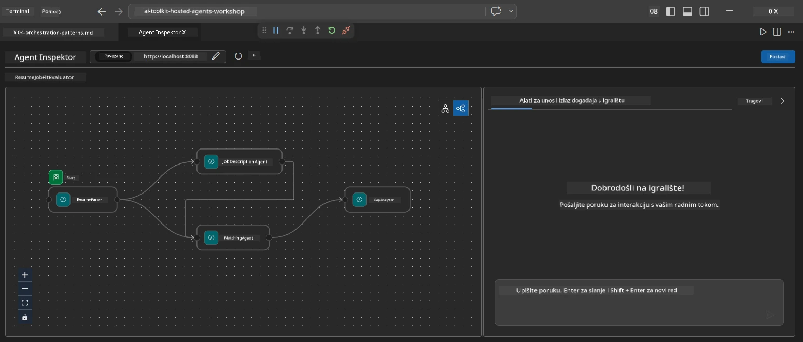
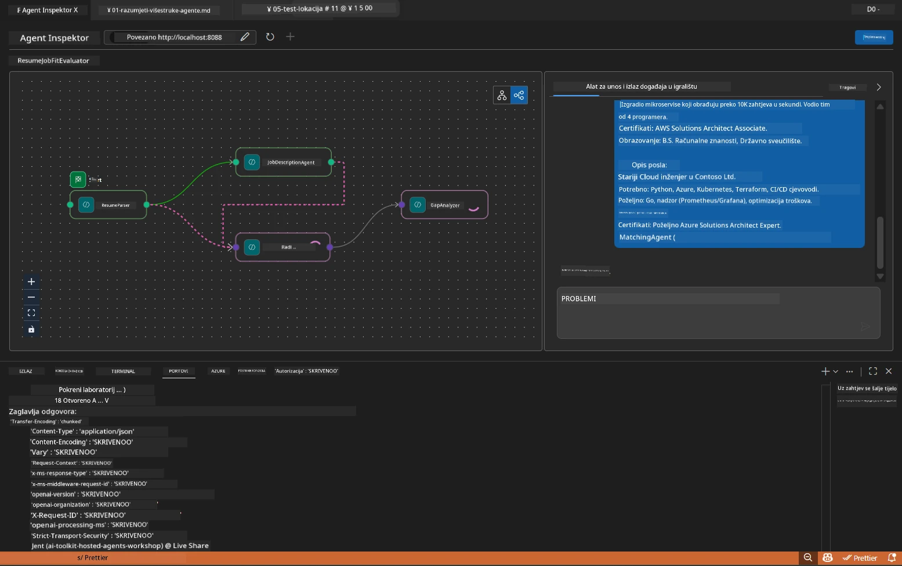
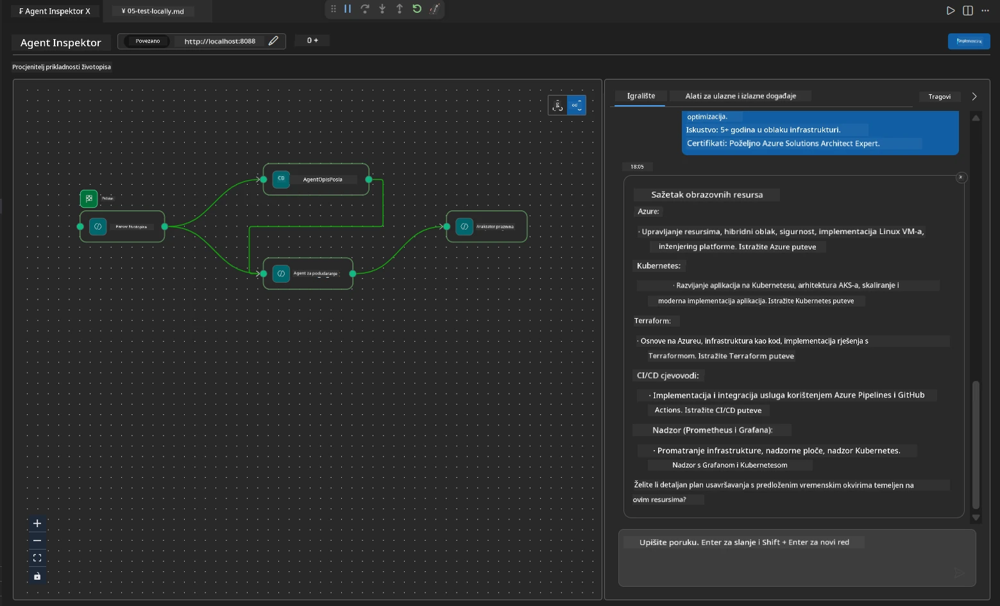

# Modul 5 - Testiraj lokalno

⏱️ ~15 min

U ovom modulu, pokrenut ćete višestruki agentni tijek rada lokalno, testirati ga s Agent Inspectorom i provjeriti rade li ispravno svi četiri agenta i MCP alat prije implementacije.

---

## Korak 1: Pokrenite agent server

### Opcija A: Korištenje VS Code zadatka (preporučeno)

1. Otvorite `workshop/lab02-multi-agent/PersonalCareerCopilot/` kao svoj VS Code direktorij.
2. Pritisnite `Ctrl+Shift+P` → upišite **Tasks: Run Task** → odaberite **Run Agent HTTP Server**.
3. Zadatak pokreće server s debugpy koji je povezan na port `5679` i agenta na port `8088`.
4. Pričekajte da se prikaže izlaz:

```
INFO:resume-job-fit:Starting Resume -> Job Fit Evaluator HTTP server...
INFO:resume-job-fit:Server running on http://localhost:8088
```

### Opcija B: Korištenje F5 (debug način)

1. Pritisnite `F5` → odaberite **Debug Local Agent HTTP Server**.
2. Server se pokreće s potpunom podrškom za breakpointe - korisno za pregled MCP odgovora ili izlaza agenata.

---

## Korak 2: Otvorite Agent Inspector

1. Pritisnite `Ctrl+Shift+P` → upišite **Foundry Toolkit: Open Agent Inspector**.
2. Agent Inspector se otvara kao VS Code panel povezan na `http://localhost:8088`.
3. Trebali biste vidjeti sučelje agenta spremno za prihvat poruka.



> **Ako Agent Inspector ne otvara:** Provjerite je li server potpuno pokrenut (vidite zapis "Server running"). Ako je port 5679 zauzet, pogledajte [Modul 8 - Rješavanje problema](08-troubleshooting.md).

---

## Korak 2b: (Opcionalno) Otvorite Workflow Visualizer

Foundry Toolkit uključuje real-time **Workflow Visualizer** koji prikazuje kako agenti međusobno djeluju dok se graf izvršava. Ovo je osobito korisno za višestruko agentni debugging.

1. Pritisnite `Ctrl+Shift+P` → upišite **Foundry Toolkit: Open Visualizer for Hosted Agents**.
2. Otvara se novi VS Code tab s prikazom uživo izvršavanja grafa.
3. Kako šaljete poruke u Agent Inspectoru, visualizer se automatski ažurira - zelene čvorove označavaju dovršene agente, a animirane veze pokazuju protok podataka između njih.

> **Konflikt porta:** Ako je port visualizera već zauzet, promijenite ga u VS Code Settings → **Extensions** → **Microsoft Foundry Configuration** → **Hosted Agents: Visualizer Port**.

---

## Korak 3: Pokrenite osnovne testove

Pokrenite ova tri testa redom. Svaki test provjerava postupno više tijeka rada.

### Test 1: Osnovni životopis + opis posla

Zalijepite sljedeće u Agent Inspector:

```
Resume:
Jane Doe
Senior Software Engineer with 5 years of experience in Python, Django, and AWS.
Built microservices handling 10K+ requests/second. Led a team of 4 developers.
Certifications: AWS Solutions Architect Associate.
Education: B.S. Computer Science, State University.

Job Description:
Senior Cloud Engineer at Contoso Ltd.
Required: Python, Azure, Kubernetes, Terraform, CI/CD pipelines.
Preferred: Go, monitoring (Prometheus/Grafana), cost optimization.
Experience: 5+ years in cloud infrastructure.
Certifications: Azure Solutions Architect Expert preferred.
```

**Očekivana struktura izlaza:**

Odgovor treba sadržavati izlaze svih četiri agenta u nizu:

1. **Izlaz parsera životopisa** - Dva označena odjeljka: `[PARSED RESUME]` (profil kandidata s grupiranim vještinama) i `[JOB DESCRIPTION PASS-THROUGH]` (doslovni tekst JD koji se prosljeđuje JD Agentu)
2. **Izlaz JD Agenta** - Strukturirani zahtjevi s odvojenim obaveznim i poželjnim vještinama
3. **Izlaz Matching Agenta** - Score uklapanja (0-100) s razradom, usklađenim vještinama, nedostajućim vještinama, prazninama
4. **Izlaz Gap Analyzer** - Pojedinačne kartice praznina za svaku nedostajuću vještinu, svaka s Microsoft Learn URL-ovima





### Što provjeriti u Testu 1

| Provjera | Očekivano | Prošlo? |
|---------|------------|----------|
| Odgovor sadrži score uklapanja | Broj između 0-100 sa detaljima | |
| Popis usklađenih vještina | Python, CI/CD (djelomično), itd. | |
| Popis nedostajućih vještina | Azure, Kubernetes, Terraform, itd. | |
| Kartice praznina postoje za svaku nedostajuću vještinu | Jedna kartica po vještini | |
| Prisustvo Microsoft Learn URL-ova | Pravi `learn.microsoft.com` linkovi | |
| Nema poruka o pogreškama u odgovoru | Čist strukturirani izlaz | |

### Test 2: Edge slučaj - kandidat s visokim uklapanjem

Zalijepite životopis koji je vrlo blizu JD da provjerite kako GapAnalyzer obrađuje scenarije visokog uklapanja:

```
Resume:
Alex Chen
Senior Cloud Engineer with 7 years of experience.
Skills: Python, Azure (AKS, Functions, DevOps), Kubernetes, Terraform, CI/CD (GitHub Actions, Azure Pipelines), Go, Prometheus, Grafana, cost optimization.
Certifications: Azure Solutions Architect Expert, Azure DevOps Engineer Expert.
Led infrastructure migration to Azure for 3 enterprise clients.
Education: M.S. Computer Science, Tech University.

Job Description:
Senior Cloud Engineer at Contoso Ltd.
Required: Python, Azure, Kubernetes, Terraform, CI/CD pipelines.
Preferred: Go, monitoring (Prometheus/Grafana), cost optimization.
Experience: 5+ years in cloud infrastructure.
Certifications: Azure Solutions Architect Expert preferred.
```

**Očekivano ponašanje:**
- Score uklapanja treba biti **80+** (većina vještina se podudara)
- Kartice praznina trebaju se fokusirati na doradu/pripremu za intervju umjesto na osnovno učenje
- Upute GapAnalyzera kažu: "Ako je uklapanje >= 80, fokusiraj se na doradu/pripremu za intervju"

---

## Korak 4: Testirajte sa svojim podacima (opcionalno)

Pokušajte zalijepiti svoj životopis i stvarni opis posla. Ovo pomaže potvrditi:

- Agent obrađuju različite formate životopisa (kronološki, funkcionalni, hibridni)
- JD Agent obrađuje različite stilove JD-a (nabrojano, odlomci, strukturirano)
- MCP alat vraća relevantne resurse za stvarne vještine
- Kartice praznina su personalizirane prema vašoj specifičnoj pozadini

> **Privatnost - Put A (Foundry cloud):** Tekst životopisa i JD-a šalje se u vašu Azure OpenAI implementaciju radi zaključivanja. Ne bilježi ga niti ne pohranjuje infrastruktura radionice. Koristite zamjenska imena (npr. "Jane Doe") ako želite.
>
> **Privatnost - Put B (Foundry Local):** Sva četiri agenta za zaključivanje rade u potpunosti na vašem uređaju. Vaš tekst životopisa i opisa poslova **nikada ne napušta vaš uređaj**. Jedini odlazni poziv je MCP alat koji dohvaća resurse s `https://learn.microsoft.com/api/mcp`; taj upit sadrži samo naziv vještine, ne vaše osobne podatke.

---

### Provjera

- [ ] Server je uspješno pokrenut na portu `8088` (log prikazuje "Server running")
- [ ] Agent Inspector je otvoren i povezan s agentom
- [ ] Test 1: Kompletan odgovor sa scoreom uklapanja, usklađenim/nedostajućim vještinama, karticama praznina i Microsoft Learn URL-ovima
- [ ] Test 2: Kandidat s visokim uklapanjem dobiva score 80+ s preporukama fokusiranim na doradu
- [ ] Sve kartice praznina prisutne (jedna po nedostajućoj vještini, bez skraćivanja)
- [ ] Nema pogrešaka ili stack trace-ova u terminalu servera

---

**Prethodni:** [04 - Orchestration Patterns](04-orchestration-patterns.md) · **Sljedeći:** [06 - Deploy to Foundry →](06-deploy-to-foundry.md)

---

<!-- CO-OP TRANSLATOR DISCLAIMER START -->
**Napomena**:
Ovaj dokument je preveden korištenjem AI prevoditeljskog servisa [Co-op Translator](https://github.com/Azure/co-op-translator). Iako težimo točnosti, imajte na umu da automatski prijevodi mogu sadržavati greške ili netočnosti. Izvorni dokument na izvornom jeziku treba smatrati autoritativnim izvorom. Za važne informacije preporuča se profesionalni ljudski prijevod. Nismo odgovorni za bilo kakva nesporazumevanja ili pogrešne interpretacije koje proizlaze iz korištenja ovog prijevoda.
<!-- CO-OP TRANSLATOR DISCLAIMER END -->