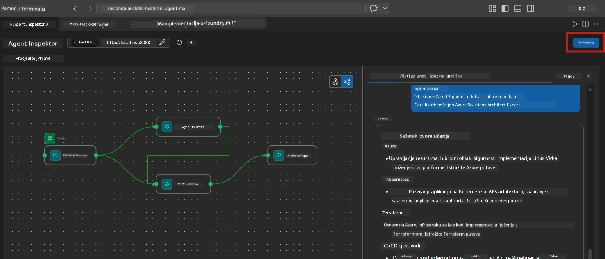
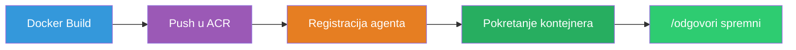
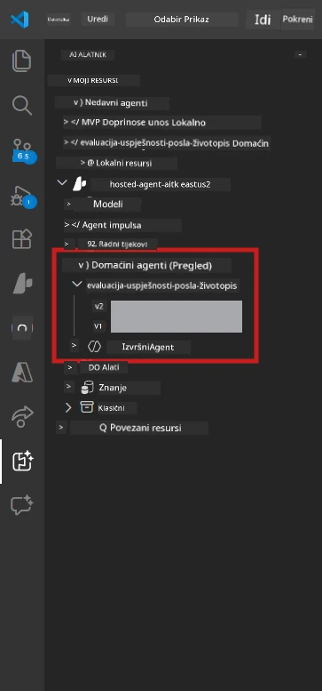

# Modul 6 - Objavi na Foundry Agent Service

U ovom modulu objavljujete svoju lokalno testiranu multi-agent radnu proceduru na [Microsoft Foundry](https://learn.microsoft.com/azure/foundry/agents/concepts/hosted-agents) kao **Hostirani agent**. Proces objave gradi Docker kontejnersku sliku, gura je u [Azure Container Registry (ACR)](https://learn.microsoft.com/azure/container-registry/container-registry-intro) i kreira verziju hostiranog agenta u [Foundry Agent Service](https://learn.microsoft.com/azure/foundry/agents/how-to/publish-agent).

> **Ključna razlika u odnosu na Lab 01:** Proces objave je identičan. Foundry tretira vašu multi-agent radnu proceduru kao jednog hostiranog agenta - složenost je unutar kontejnera, ali površina objave je isti `/responses` endpoint.

---

## Provjera preduvjeta

Prije objave provjerite svaki od dolje navedenih stavki:

1. **Agent prolazi lokalne osnovne testove:**
   - Završili ste sva 3 testa u [Modulu 5](05-test-locally.md) i radni proces je proizveo kompletan izlaz sa gap karticama i Microsoft Learn URL-ovima.

2. **Imate [Azure AI User](https://learn.microsoft.com/azure/foundry/concepts/rbac-foundry) ulogu:**
   - Dodijeljeno u [Lab 01, Modul 2](../../lab01-single-agent/docs/02-create-foundry-project.md). Provjerite:
   - [Azure Portal](https://portal.azure.com) → vaš Foundry **projekt** resurs → **Kontrola pristupa (IAM)** → **Dodjele uloga** → potvrdite da je **[Azure AI User](https://aka.ms/foundry-ext-project-role)** naveden za vaš račun.

3. **Prijavljeni ste u Azure u VS Code:**
   - Provjerite ikonu Računa u donjem lijevom kutu VS Codea. Trebalo bi vidjeti ime vašeg računa.

4. **`agent.yaml` ima ispravne vrijednosti:**
   - Otvorite `PersonalCareerCopilot/agent.yaml` i provjerite:
     ```yaml
     environment_variables:
       - name: PROJECT_ENDPOINT
         value: ${PROJECT_ENDPOINT}
       - name: MODEL_DEPLOYMENT_NAME
         value: ${MODEL_DEPLOYMENT_NAME}
     ```
   - Moraju odgovarati varijablama okoline koje čita vaš `main.py`.

5. **`requirements.txt` ima ispravne verzije:**
   ```
   agent-framework-azure-ai==1.0.0rc3
   agent-framework-core==1.0.0rc3
   azure-ai-agentserver-agentframework==1.0.0b16
   azure-ai-agentserver-core==1.0.0b16
   debugpy
   agent-dev-cli --pre
   ```

---

## Korak 1: Pokrenite objavu

### Opcija A: Objavite iz Agent Inspector-a (preporučeno)

Ako je agent pokrenut putem F5 s otvorenim Agent Inspector-om:

1. Pogledajte **gornji desni kut** panela Agent Inspector.
2. Kliknite na gumb **Deploy** (ikona oblaka sa strelicom prema gore ↑).
3. Otvorit će se čarobnjak za objavu.



### Opcija B: Objavite iz Command Palette-a

1. Pritisnite `Ctrl+Shift+P` da otvorite **Command Palette**.
2. Ukucajte: **Microsoft Foundry: Deploy Hosted Agent** i odaberite.
3. Otvorit će se čarobnjak za objavu.

---

## Korak 2: Konfigurirajte objavu

### 2.1 Odaberite ciljani projekt

1. Padajući izbornik prikazuje vaše Foundry projekte.
2. Odaberite projekt koji ste koristili tijekom radionice (npr., `workshop-agents`).

### 2.2 Odaberite datoteku agenta u kontejneru

1. Bit ćete upitani da odaberete ulaznu točku agenta.
2. Navigirajte do `workshop/lab02-multi-agent/PersonalCareerCopilot/` i odaberite **`main.py`**.

### 2.3 Konfigurirajte resurse

| Postavka | Preporučena vrijednost | Napomene |
|---------|-----------------------|----------|
| **CPU** | `0.25` | Zadano. Multi-agent radne procedure ne trebaju više CPU jer su pozivi modela I/O vezani |
| **Memorija** | `0.5Gi` | Zadano. Povećajte na `1Gi` ako dodajete alate za obradu velikih podataka |

---

## Korak 3: Potvrdite i objavite

1. Čarobnjak prikazuje sažetak objave.
2. Pregledajte i kliknite **Confirm and Deploy**.
3. Pratite tijek u VS Codeu.

### Što se događa tijekom objave

Pogledajte VS Code **Output** panel (odaberite opciju "Microsoft Foundry"):


1. **Docker build** - Gradi kontejner iz `Dockerfile`:
   ```
   Step 1/6 : FROM python:3.14-slim
   Step 2/6 : WORKDIR /app
   ...
   Successfully built abc123def456
   ```

2. **Docker push** - Gura sliku u ACR (1-3 minute pri prvoj objavi).

3. **Registracija agenta** - Foundry kreira hostiranog agenta koristeći `agent.yaml` metapodatke. Ime agenta je `resume-job-fit-evaluator`.

4. **Pokretanje kontejnera** - Kontejner se pokreće u Foundry upravljanoj infrastrukturi sa sistemski upravljanim identitetom.

> **Prva objava traje duže** (Docker gura sve slojeve). Naknadne objave koriste keširane slojeve i brže su.

### Napomene specifične za multi-agenta

- **Sva četiri agenta su unutar jednog kontejnera.** Foundry vidi jednog hostiranog agenta. Graf WorkflowBuilder se izvršava interno.
- **MCP pozivi idu van.** Kontejner treba pristup internetu za `https://learn.microsoft.com/api/mcp`. Foundry upravljana infrastruktura to omogućuje po defaultu.
- **[Managed Identity](https://learn.microsoft.com/python/api/overview/azure/identity-readme#managed-identity-support).** U hostiranom okruženju `get_credential()` u `main.py` vraća `ManagedIdentityCredential()` (jer je `MSI_ENDPOINT` postavljen). To je automatski.

---

## Korak 4: Provjerite status objave

1. Otvorite **Microsoft Foundry** bočnu traku (kliknite ikonu Foundry u Activity Baru).
2. Proširite **Hosted Agents (Preview)** ispod vašeg projekta.
3. Pronađite **resume-job-fit-evaluator** (ili ime vašeg agenta).
4. Kliknite na ime agenta → proširite verzije (npr., `v1`).
5. Kliknite na verziju → provjerite **Container Details** → **Status**:



| Status | Značenje |
|--------|----------|
| **Started** / **Running** | Kontejner radi, agent je spreman |
| **Pending** | Kontejner se pokreće (pričekajte 30-60 sekundi) |
| **Failed** | Kontejner nije uspio krenuti (provjerite zapise - vidi dolje) |

> **Pokretanje multi-agenta traje dulje** nego za jednog agenta jer kontejner kreira 4 instance agenta pri pokretanju. "Pending" do 2 minute je normalno.

---

## Uobičajene pogreške pri objavi i rješenja

### Pogreška 1: Permission denied - `agents/write`

```
Error: lacks the required data action 
Microsoft.CognitiveServices/accounts/AIServices/agents/write
```

**Rješenje:** Dodijelite **[Azure AI User](https://learn.microsoft.com/azure/foundry/concepts/rbac-foundry)** ulogu na razini **projekta**. Pogledajte [Modul 8 - Rješavanje problema](08-troubleshooting.md) za upute korak po korak.

### Pogreška 2: Docker nije pokrenut

```
Error: Docker build failed / Cannot connect to Docker daemon
```

**Rješenje:**
1. Pokrenite Docker Desktop.
2. Pričekajte dok ne piše "Docker Desktop is running".
3. Provjerite: `docker info`
4. **Windows:** Provjerite je li WSL 2 backend omogućen u postavkama Docker Desktopa.
5. Pokušajte ponovo.

### Pogreška 3: pip install ne uspijeva tijekom Docker build-a

```
Error: Could not find a version that satisfies the requirement agent-dev-cli
```

**Rješenje:** `--pre` zastavica u `requirements.txt` se drugačije obrađuje u Dockeru. Provjerite da vaš `requirements.txt` ima:
```
agent-dev-cli --pre
```

Ako Docker i dalje ne uspijeva, napravite `pip.conf` ili proslijedite `--pre` putem build argumenta. Pogledajte [Modul 8](08-troubleshooting.md).

### Pogreška 4: MCP alat ne radi u hostiranom agentu

Ako Gap Analyzer prestane proizvoditi Microsoft Learn URL-ove nakon objave:

**Uzrok:** Mrežna politika može blokirati izlazni HTTPS iz kontejnera.

**Rješenje:**
1. Obično to nije problem u zadanoj Foundry konfiguraciji.
2. Ako se dogodi, provjerite ima li virtualna mreža Foundry projekta NSG koji blokira izlazni HTTPS.
3. MCP alat ima ugrađene rezervne URL-ove, pa će agent i dalje proizvoditi izlaz (bez živih URL-ova).

---

### Kontrolna lista

- [ ] Naredba za objavu završila bez grešaka u VS Code-u
- [ ] Agent se pojavljuje pod **Hosted Agents (Preview)** u Foundry bočnoj traci
- [ ] Ime agenta je `resume-job-fit-evaluator` (ili vaše odabrano ime)
- [ ] Status kontejnera pokazuje **Started** ili **Running**
- [ ] (Ako su greške) Identificirali ste grešku, primijenili rješenje i uspješno ponovo objavili

---

**Prethodno:** [05 - Test Locally](05-test-locally.md) · **Sljedeće:** [07 - Verify in Playground →](07-verify-in-playground.md)

---

<!-- CO-OP TRANSLATOR DISCLAIMER START -->
**Odricanje od odgovornosti**:
Ovaj dokument je preveden koristeći AI uslugu prijevoda [Co-op Translator](https://github.com/Azure/co-op-translator). Iako težimo točnosti, molimo imajte na umu da automatski prijevodi mogu sadržavati pogreške ili netočnosti. Izvorni dokument na izvornom jeziku treba smatrati službenim izvorom. Za kritične informacije preporučuje se profesionalni ljudski prijevod. Ne odgovaramo za bilo kakve nesporazume ili pogrešna tumačenja proizašla iz upotrebe ovog prijevoda.
<!-- CO-OP TRANSLATOR DISCLAIMER END -->