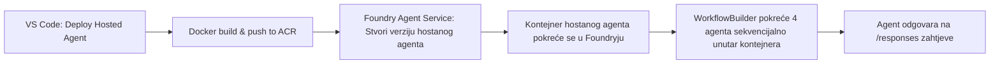
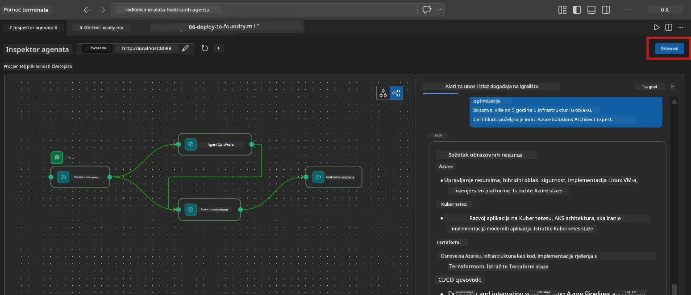
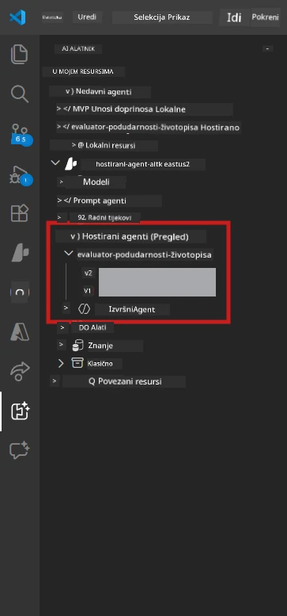

# Modul 6 - Implementacija u Foundry Agent Service

⏱️ ~10 min

U ovom modulu implementirate svoj lokalno testirani višelagentski tijek rada na [Microsoft Foundry](https://learn.microsoft.com/azure/foundry/agents/concepts/hosted-agents) kao **Hosted Agent**. Proces implementacije gradi Docker container image, šalje ga u [Azure Container Registry (ACR)](https://learn.microsoft.com/azure/container-registry/container-registry-intro) i stvara verziju hostanog agenta u [Foundry Agent Service](https://learn.microsoft.com/azure/foundry/agents/how-to/publish-agent).

> **Ključna razlika od Laboratorija 01:** Proces implementacije je identičan. Foundry tretira vaš višelagentski tijek rada kao jednog hostanog agenta - složenost je unutar containera, ali površina implementacije je ista `/responses` endpoint.

### Cjevovod implementacije


```mermaid
flowchart LR
    A[VS Code: Deploy Hosted Agent] --> B[Docker build & push to ACR]
    B --> C[Foundry Agent Service: Stvori verziju hostanog agenta]
    C --> D[Kontejner hostanog agenta pokreće se u Foundryju]
    D --> E[WorkflowBuilder pokreće 4 agenta sekvencijalno unutar kontejnera]
    E --> F[Agent odgovara na /responses zahtjeve]
```

---

## Provjera preduvjeta

Prije implementacije provjerite svaki od sljedećih stavki:

1. **Agent prolazi lokalne osnovne testove:**
   - Završili ste sva 3 testa u [Modulu 5](05-test-locally.md) i tijek rada je proizveo kompletne rezultate s karticama nedostataka i Microsoft Learn URL-ovima.

2. **Imate ulogu [Foundry User](https://learn.microsoft.com/azure/foundry/concepts/rbac-foundry)** (za implementaciju vam je minimalno potrebna uloga **Foundry Project Manager** na razini projekta):

   > **Napomena:** Foundry RBAC uloge su nedavno preimenovane - **Foundry User**, **Foundry Owner** i **Foundry Project Manager** ranije su bile poznate kao Azure AI User, Azure AI Owner i Azure AI Project Manager. ID i dozvole uloga ostaju nepromijenjeni.

   - Provjerite u [Azure Portalu](https://portal.azure.com) → svoj Foundry **project** resurs → **Access control (IAM)** → **Role assignments** → potvrdite da je **Foundry User** (ili viša) navedena za vaš račun.

3. **Prijavljeni ste u Azure u VS Code-u:**
   - Pogledajte ikonu računa u donjem lijevom kutu VS Code-a. Trebalo bi se vidjeti vaše korisničko ime.

4. **`agent.yaml` ima ispravne vrijednosti:**
   - Otvorite `PersonalCareerCopilot/agent.yaml` i provjerite:
     ```yaml
     environment_variables:
       - name: AZURE_AI_MODEL_DEPLOYMENT_NAME
         value: ${AZURE_AI_MODEL_DEPLOYMENT_NAME}
     ```
   - `FOUNDRY_PROJECT_ENDPOINT` nije naveden ovdje - Foundry ga ubrizgava pri izvođenju. Samo `AZURE_AI_MODEL_DEPLOYMENT_NAME` treba biti deklariran.

5. **`requirements.txt` ima ispravne verzije:**
   ```
   agent-framework-foundry
   agent-framework-foundry-hosting
   mcp<2,>=1.24.0
   debugpy
   ```

---

## Korak 1: Pokrenite implementaciju

### Opcija A: Implementirajte iz Agent Inspectora (preporučeno)

Ako je agent pokrenut putem F5 s otvorenim Agent Inspectorom:

1. Pogledajte **gornji desni kut** panela Agent Inspectora.
2. Kliknite na dugme **Deploy** (ikona oblaka s strelicom prema gore ↑).
3. Otvara se čarobnjak za implementaciju.



### Opcija B: Implementirajte preko Command Palette

1. Pritisnite `Ctrl+Shift+P` za otvaranje **Command Palette**.
2. Upisite: **Foundry Toolkit: Deploy Hosted Agent** i odaberite ga.
3. Otvara se čarobnjak za implementaciju.

---

## Korak 2: Konfigurirajte implementaciju

### 2.1 Odaberite ciljanu projektnu instancu

1. Padajući izbornik prikazuje vaše Foundry projekte.
2. Odaberite projekt koji ste koristili tijekom radionice (npr., `workshop-agents`).

### 2.2 Odaberite datoteku agenta unutar containera

1. Bit ćete upitani da odaberete ulaznu točku za agenta.
2. Navigirajte do `workshop/lab02-multi-agent/PersonalCareerCopilot/` i odaberite **`main.py`**.

### 2.3 Konfigurirajte resurse

| Postavka | Preporučena vrijednost | Bilješke |
|---------|-----------------------|----------|
| **Deployment Method** | **Container** (preporučeno) ili **Code** | Container gradi Docker image; Code šalje izvorni kod kao ZIP (preview) |
| **Container Registry** | **Default ACR** | Foundry kreira i upravlja njime za vas |
| **CPU** | `0.25` | Zadano. Višelagentski tijekovi ne trebaju više CPU jer su pozivi modelu I/O ograničeni |
| **Memory** | `0.5Gi` | Zadano. Povećajte na `1Gi` ako dodate alate za obradu velikih podataka |

---

## Korak 3: Potvrdite i implementirajte

1. Čarobnjak prikazuje sažetak implementacije.
2. Pregledajte i kliknite **Confirm and Deploy**.
3. Pratite napredak u VS Code-u.

### Što se događa tijekom implementacije

Pratite VS Code **Output** panel (odaberite padajući izbornik "Microsoft Foundry"):

1. **Docker build** - Gradi container iz vašeg `Dockerfile`
   ```
   Step 1/6 : FROM python:3.12-slim
   Step 2/6 : WORKDIR /app
   ...
   Successfully built abc123def456
   ```

2. **Docker push** - Šalje sliku u ACR (1-3 minute kod prve implementacije).

3. **Registracija agenta** - Foundry stvara hostanog agenta koristeći metapodatke iz `agent.yaml`. Ime agenta je `resume-job-fit-evaluator`.

4. **Pokretanje containera** - Container se pokreće u Foundry-jevom upravljanom infrastrukturnom okruženju sa sistemski upravljanim identitetom.

> **Prva implementacija je sporija** (Docker šalje sve slojeve). Naknadne implementacije koriste keširane slojeve i brže su.

### Napomene specifične za višelagentske sustave

- **Sva četiri agenta su unutar jednog containera.** Foundry vidi jednog hostanog agenta. WorkflowBuilder graf se izvršava interno.
- **MCP pozivi izlaze van.** Container treba pristup internetu da bi dohvatili `https://learn.microsoft.com/api/mcp`. Foundryjeva upravljana infrastruktura to osigurava prema zadanim postavkama.
- **[Upravljani identitet](https://learn.microsoft.com/azure/foundry/agents/concepts/agent-identity).** Foundry automatski kreira **poseban Entra identitet po agentu** za svakog hostanog agenta pri implementaciji. U hostiranom okruženju, `DefaultAzureCredential` automatski rješava ovaj identitet agenta - nije potrebna ručna konfiguracija upravljanog identiteta.

---

## Korak 4: Provjerite status implementacije

1. Otvorite **Microsoft Foundry** bočnu traku (kliknite na Foundry ikonu u Activity Baru).
2. Proširite **Hosted Agents (Preview)** unutar svog projekta.
3. Pronađite **resume-job-fit-evaluator** (ili ime vašeg agenta).
4. Kliknite na ime agenta → proširite verzije (npr., `v1`).
5. Kliknite na verziju → provjerite **Container Details** → **Status**:



| Status | Značenje |
|--------|----------|
| **active** | Agent radi i spreman je za primanje zahtjeva |
| **creating** | Container se pokreće (pričekajte 30–60 sekundi) |
| **failed** | Container nije uspio pokrenuti se (provjerite logove - vidi dolje) |

> **Napomena:** VS Code bočna traka može prikazivati oznake poput "Running" ili "Started" dok API status u pozadini koristi `active`/`creating`. Oba prikaza označavaju isto stanje.

> **Pokretanje više agenata traje dulje** nego kod jednog agenta jer container prilikom pokretanja stvara 4 agent instance. `creating` do 2 minute je normalno.

---

## Uobičajene pogreške pri implementaciji i rješenja

### Pogreška 1: Permission denied - `agents/write`

```
Error: lacks the required data action 
Microsoft.CognitiveServices/accounts/AIServices/agents/write
```

**Popravak:** Dodijelite ulogu **[Foundry User](https://learn.microsoft.com/azure/foundry/concepts/rbac-foundry)** (ranije **Azure AI User**) na **razini projekta**. Pogledajte [Modul 8 - Rješavanje problema](08-troubleshooting.md) za detaljne upute.

### Pogreška 2: Docker nije pokrenut

```
Error: Docker build failed / Cannot connect to Docker daemon
```

**Popravak:**
1. Pokrenite Docker Desktop.
2. Pričekajte dok se ne prikaže "Docker Desktop is running".
3. Provjerite: `docker info`
4. **Windows:** Provjerite je li WSL 2 backend omogućena u Docker Desktop postavkama.
5. Pokušajte ponovno.

### Pogreška 3: pip install pada tijekom Docker builda

```
Error: Could not find a version that satisfies the requirement agent-framework-foundry
```

**Popravak:** Provjerite da `requirements.txt` odgovara:
```
agent-framework-foundry
agent-framework-foundry-hosting
mcp<2,>=1.24.0
debugpy
```

Ako build i dalje pada, vaša Docker mreža može blokirati PyPI. Provjerite postavke proxy-a u `docker info`.

### Pogreška 4: MCP alat ne radi u hostanom agentu

Ako Gap Analyzer prestane proizvoditi Microsoft Learn URL-ove nakon implementacije:

**Uzrok:** Mrežna politika može blokirati odlazni HTTPS iz containera.

**Popravak:**
1. Ovo obično nije problem s Foundry-jevom zadano konfiguracijom.
2. Ako se dogodi, provjerite ima li Foundry projekt virtualnu mrežu s NSG-om koji blokira odlazni HTTPS.
3. MCP alat ima ugrađene rezervne URL-ove, pa agent ipak proizvodi izlaz (bez aktivnih URL-ova).

---

### Kontrolna točka

- [ ] Naredba implementacije je završena bez pogrešaka u VS Code-u
- [ ] Agent se pojavljuje pod **Hosted Agents (Preview)** u Foundry bočnoj traci
- [ ] Ime agenta je `resume-job-fit-evaluator` (ili vaše odabrano ime)
- [ ] Status containera prikazuje **Started** ili **Running**
- [ ] (Ako ima pogrešaka) Identificirali ste pogrešku, primijenili popravak i ponovno uspješno implementirali

---

**Prethodni:** [05 - Testirajte lokalno](05-test-locally.md) · **Sljedeći:** [07 - Provjera u Playgroundu →](07-verify-in-playground.md)

---

<!-- CO-OP TRANSLATOR DISCLAIMER START -->
**Napomena**:
Ovaj dokument je preveden korištenjem AI prevoditeljskog servisa [Co-op Translator](https://github.com/Azure/co-op-translator). Iako težimo točnosti, imajte na umu da automatski prijevodi mogu sadržavati greške ili netočnosti. Izvorni dokument na izvornom jeziku treba smatrati autoritativnim izvorom. Za važne informacije preporuča se profesionalni ljudski prijevod. Nismo odgovorni za bilo kakva nesporazumevanja ili pogrešne interpretacije koje proizlaze iz korištenja ovog prijevoda.
<!-- CO-OP TRANSLATOR DISCLAIMER END -->