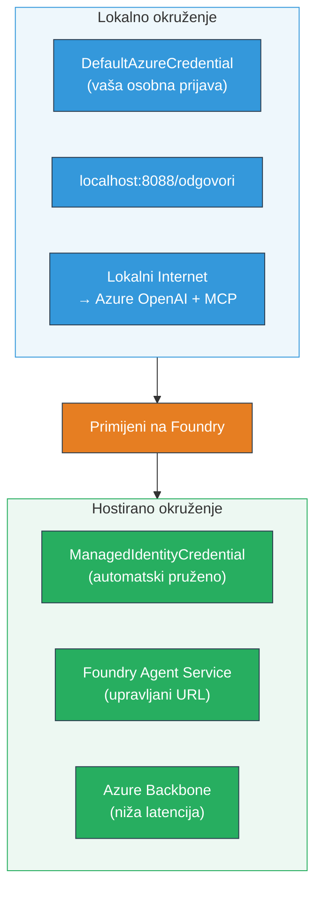

# Modul 7 - Verifikacija u Playgroundu

U ovom modulu testirate svoj implementirani višestruki agentni tijek rada u **VS Code** i na **[Foundry portalu](https://ai.azure.com)**, potvrđujući da agent funkcionira identično kao i pri lokalnom testiranju.

---

## Zašto verifikacija nakon implementacije?

Vaš višestruki agentni tijek rada savršeno je radio lokalno, zašto opet testirati? Hostano okruženje razlikuje se na nekoliko načina:


| Razlika | Lokalno | Hostano |
|---------|---------|---------|
| **Identitet** | [`DefaultAzureCredential`](https://learn.microsoft.com/azure/developer/python/sdk/authentication/credential-chains#defaultazurecredential-overview) (vaša osobna prijava) | [`ManagedIdentityCredential`](https://learn.microsoft.com/python/api/overview/azure/identity-readme#managed-identity-support) (automatski provisionirano) |
| **Endpoint** | `http://localhost:8088/responses` | [Foundry Agent Service](https://learn.microsoft.com/azure/foundry/agents/concepts/hosted-agents) endpoint (upravljani URL) |
| **Mreža** | Lokalno računalo → Azure OpenAI + MCP outbound | Azure backbone (niža latencija između servisa) |
| **MCP konektivnost** | Lokalni internet → `learn.microsoft.com/api/mcp` | Izlaz iz kontejnera → `learn.microsoft.com/api/mcp` |

Ako je bilo koja varijabla okruženja netočno konfigurirana, RBAC se razlikuje ili je MCP outbound blokiran, ovo ćete otkriti upravo ovdje.

---

## Opcija A: Testiranje u VS Code Playgroundu (preporučeno prvo)

[Foundry ekstenzija](https://marketplace.visualstudio.com/items?itemName=TeamsDevApp.vscode-ai-foundry) uključuje integrirani Playground koji vam omogućuje razgovor s vašim implementiranim agentom bez napuštanja VS Code-a.

### Korak 1: Idite do vašeg hostanog agenta

1. Kliknite na ikonu **Microsoft Foundry** u VS Code **Activity Bar** (lijeva bočna traka) da otvorite Foundry panel.
2. Proširite spojeni projekt (npr. `workshop-agents`).
3. Proširite **Hosted Agents (Preview)**.
4. Trebali biste vidjeti ime vašeg agenta (npr. `resume-job-fit-evaluator`).

### Korak 2: Odaberite verziju

1. Kliknite na ime agenta za prikaz verzija.
2. Kliknite na verziju koju ste implementirali (npr. `v1`).
3. Otvara se **panel s detaljima** koji prikazuje informacije o kontejneru.
4. Provjerite je li status **Started** ili **Running**.

### Korak 3: Otvorite Playground

1. U panelu s detaljima kliknite gumb **Playground** (ili desni klik na verziju → **Open in Playground**).
2. Otvara se sučelje za chat u kartici VS Code-a.

### Korak 4: Pokrenite vaše osnovne testove

Koristite iste 3 testova iz [Modula 5](05-test-locally.md). Upišite svaku poruku u input box Playgrounnda i pritisnite **Send** (ili **Enter**).

#### Test 1 - Cijeli životopis + JD (standardni tijek)

Zalijepite prompt za cijeli životopis + JD iz Modula 5, Testa 1 (Jane Doe + Senior Cloud Engineer u Contoso Ltd).

**Očekivano:**
- Ocjena podudarnosti s matematičkim razlaganjem (skala do 100 bodova)
- Sekcija podudaranih vještina
- Sekcija nedostajućih vještina
- **Jedna kartica za nedostatke po svakoj nedostajućoj vještini** s Microsoft Learn URL-ovima
- Plan učenja s vremenskom linijom

#### Test 2 - Brzi kratki test (minimalni unos)

```
RESUME: 3 years Python developer, knows Django and PostgreSQL, no cloud experience.

JOB: Cloud DevOps Engineer requiring AWS, Kubernetes, Terraform, CI/CD. 5 years needed.
```

**Očekivano:**
- Niža ocjena podudarnosti (< 40)
- Iskrena procjena s faznim planom učenja
- Više kartica za nedostatke (AWS, Kubernetes, Terraform, CI/CD, manjak iskustva)

#### Test 3 - Kandidat s visokom podudarnosti

```
RESUME:
10 years Azure Cloud Architect. AZ-305 certified. Expert in AKS, Terraform, Azure DevOps, 
Azure Functions, Helm, Prometheus, Grafana, Python, Go. Led platform team of 8.

JOB:
Senior Cloud Engineer. Required: AKS, Terraform, Azure DevOps, Python. Preferred: Helm, Go.
5+ years experience. AZ-305 preferred.
```

**Očekivano:**
- Visoka ocjena podudarnosti (≥ 80)
- Fokus na spremnost za intervju i usavršavanje
- Malo ili nimalo kartica za nedostatke
- Kratki vremenski okvir usmjeren na pripremu

### Korak 5: Usporedite s lokalnim rezultatima

Otvorite svoje bilješke ili karticu preglednika iz Modula 5 gdje ste spremili lokalne odgovore. Za svaki test provjerite:

- Ima li odgovor **istu strukturu** (ocjena podudarnosti, kartice za nedostatke, plan)?
- Slijedi li **istu rubriku bodovanja** (razlaganje unutar 100 bodova)?
- Jesu li **Microsoft Learn URL-ovi** i dalje prisutni u karticama za nedostatke?
- Postoji li **jedna kartica za nedostatke po svakoj nedostajućoj vještini** (nije skraćeno)?

> **Male razlike u formulaciji su normalne** - model je nedeterminističan. Fokusirajte se na strukturu, dosljednost bodovanja i korištenje MCP alata.

---

## Opcija B: Testiranje na Foundry portalu

[Foundry portal](https://ai.azure.com) pruža web-based playground koristan za dijeljenje s kolegama ili dionicima.

### Korak 1: Otvorite Foundry portal

1. Otvorite preglednik i idite na [https://ai.azure.com](https://ai.azure.com).
2. Prijavite se istim Azure računom kojeg ste koristili tijekom radionice.

### Korak 2: Idite u svoj projekt

1. Na početnoj stranici potražite **Recent projects** na lijevoj bočnoj traci.
2. Kliknite ime svog projekta (npr. `workshop-agents`).
3. Ako ne vidite projekt, kliknite **All projects** i potražite ga.

### Korak 3: Pronađite vaš implementirani agent

1. U lijevoj navigaciji projekta kliknite **Build** → **Agents** (ili potražite odjeljak **Agents**).
2. Trebali biste vidjeti popis agenata. Pronađite svog implementiranog agenta (npr. `resume-job-fit-evaluator`).
3. Kliknite na ime agenta da otvorite stranicu s detaljima.

### Korak 4: Otvorite Playground

1. Na stranici za detalje agenta, pogledajte na vrh alatne trake.
2. Kliknite **Open in playground** (ili **Try in playground**).
3. Otvara se sučelje za chat.

### Korak 5: Pokrenite iste osnovne testove

Ponovite sva 3 testa iz sekcije VS Code Playground gore. Usporedite svaki odgovor s lokalnim rezultatima (Modul 5) i rezultatima iz VS Code Playgrounda (Opcija A gore).

---

## Specifična verifikacija za višestruke agente

Osim osnovne ispravnosti, provjerite sljedeća ponašanja specifična za višestruke agente:

### Izvršavanje MCP alata

| Provjera | Kako provjeriti | Uvjet prolaza |
|----------|-----------------|---------------|
| MCP pozivi uspješni | Kartice za nedostatke sadrže `learn.microsoft.com` URL-ove | Pravi URL-ovi, ne fallback poruke |
| Više MCP poziva | Svaki nedostatak visokog/srednjeg prioriteta ima resurse | Ne samo prva kartica za nedostatak |
| MCP fallback radi | Ako URL-ovi nedostaju, provjerite fallback tekst | Agent i dalje proizvodi kartice za nedostatke (s ili bez URL-ova) |

### Koordinacija agenata

| Provjera | Kako provjeriti | Uvjet prolaza |
|----------|-----------------|---------------|
| Sva 4 agenta su pokrenuta | Izlaz sadrži ocjenu podudarnosti I kartice za nedostatke | Ocjenu daje MatchingAgent, kartice GapAnalyzer |
| Paralelno grananje | Vrijeme odgovora je razumno (< 2 min) | Ako > 3 min, paralelno izvršavanje možda ne radi |
| Integritet protoka podataka | Kartice za nedostatke referenciraju vještine iz izvještaja podudarnosti | Nema haluciniranih vještina koje nisu u JD-u |

---

## Rubrika za validaciju

Koristite ovu rubriku za procjenu ponašanja višestrukog agentnog tijeka rada u hostanom okruženju:

| # | Kriterij | Uvjet prelaska | Prolaz? |
|---|----------|----------------|---------|
| 1 | **Funkcionalna ispravnost** | Agent odgovara na životopis + JD s ocjenom i analizom nedostataka | |
| 2 | **Dosljednost bodovanja** | Ocjena koristi skalu do 100 bodova s razlaganjem | |
| 3 | **Potpunost kartica za nedostatke** | Jedna kartica za svaku nedostajuću vještinu (nije skraćeno ili kombinirano) | |
| 4 | **Integracija MCP alata** | Kartice za nedostatke sadrže prave Microsoft Learn URL-ove | |
| 5 | **Strukturna dosljednost** | Struktura izlaza odgovara lokalnim i hostanim rezultatima | |
| 6 | **Vrijeme odziva** | Hostani agent odgovara unutar 2 minute za punu procjenu | |
| 7 | **Nema grešaka** | Nema HTTP 500 pogrešaka, timeouta ili praznih odgovora | |

> „Prolaz“ znači da su sva 7 kriterija ispunjena za sva 3 osnovna testa u barem jednom playgroundu (VS Code ili Portal).

---

## Rješavanje problema s playgroundom

| Simptom | Vjerojatan uzrok | Popravak |
|---------|------------------|----------|
| Playground se ne učitava | Status kontejnera nije "Started" | Vratite se na [Modul 6](06-deploy-to-foundry.md), provjerite status implementacije. Pričekajte ako je "Pending" |
| Agent vraća prazan odgovor | Naziv implementacije modela ne odgovara | Provjerite `agent.yaml` → `environment_variables` → `MODEL_DEPLOYMENT_NAME` je isti kao implementirani model |
| Agent vraća poruku o grešci | Nedostaje dozvola [RBAC](https://learn.microsoft.com/azure/foundry/concepts/rbac-foundry) | Dodijelite **[Azure AI User](https://aka.ms/foundry-ext-project-role)** na razini projekta |
| Nema Microsoft Learn URL-ova u karticama | MCP outbound je blokiran ili MCP server nije dostupan | Provjerite može li kontejner dosegnuti `learn.microsoft.com`. Pogledajte [Modul 8](08-troubleshooting.md) |
| Samo 1 kartica za nedostatke (skraćeno) | Upute GapAnalyzer nemaju "CRITICAL" blok | Pregledajte [Modul 3, Korak 2.4](03-configure-agents.md) |
| Ocjena podudarnosti se znatno razlikuje od lokalne | Drugi model ili upute su implementirani | Usporedite env varijable u `agent.yaml` s lokalnim `.env`. Ponovno implementirajte po potrebi |
| "Agent nije pronađen" u Portalu | Implementacija se još propagira ili nije uspjela | Pričekajte 2 minute, osvježite. Ako i dalje nedostaje, ponovno implementirajte iz [Modula 6](06-deploy-to-foundry.md) |

---

### Kontrolna lista

- [ ] Testiran agent u VS Code Playgroundu - svi 3 osnovna testa prošla
- [ ] Testiran agent u [Foundry Portalu](https://ai.azure.com) Playgroundu - svi 3 osnovna testa prošla
- [ ] Odgovori su strukturno dosljedni lokalnom testiranju (ocjena podudarnosti, kartice za nedostatke, plan)
- [ ] Microsoft Learn URL-ovi su prisutni u karticama (MCP alat radi u hostanom okruženju)
- [ ] Jedna kartica za svaku nedostajuću vještinu (bez skraćivanja)
- [ ] Nema grešaka ili timeouta tijekom testiranja
- [ ] Završena rubrika validacije (sva 7 kriterija prolazi)

---

**Prethodni:** [06 - Deploy to Foundry](06-deploy-to-foundry.md) · **Sljedeći:** [08 - Troubleshooting →](08-troubleshooting.md)

---

<!-- CO-OP TRANSLATOR DISCLAIMER START -->
**Odricanje od odgovornosti**:
Ovaj je dokument preveden korištenjem AI usluge za prevođenje [Co-op Translator](https://github.com/Azure/co-op-translator). Iako nastojimo postići točnost, imajte na umu da automatizirani prijevodi mogu sadržavati pogreške ili netočnosti. Izvorni dokument na svom izvornom jeziku treba smatrati autoritativnim izvorom. Za kritične informacije preporučuje se profesionalni ljudski prijevod. Ne snosimo odgovornost za bilo kakve nesporazume ili pogrešne interpretacije nastale korištenjem ovog prijevoda.
<!-- CO-OP TRANSLATOR DISCLAIMER END -->