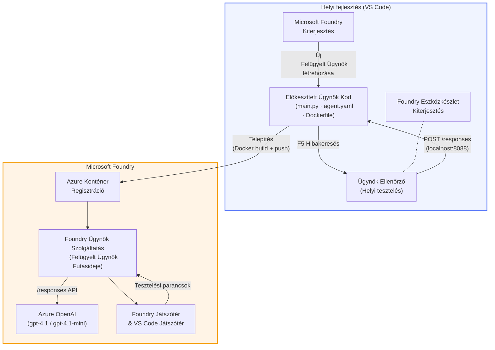

# Foundry Toolkit + Foundry Hosted Agents Műhely

[](https://www.python.org/)
[](https://github.com/microsoft/agents)
[](https://learn.microsoft.com/azure/ai-foundry/agents/concepts/hosted-agents/)
[](https://ai.azure.com/)
[](https://learn.microsoft.com/azure/ai-services/openai/)
[](https://learn.microsoft.com/cli/azure/install-azure-cli)
[](https://learn.microsoft.com/azure/developer/azure-developer-cli/install-azd)
[](https://www.docker.com/)
[](https://marketplace.visualstudio.com/items?itemName=ms-windows-ai-studio.windows-ai-studio)
[](LICENSE)

Építsen, teszteljen és telepítsen MI ügynököket a **Microsoft Foundry Agent Service**-hez **Hosted Agents** formájában – teljes egészében a VS Code-ból a **Microsoft Foundry kiterjesztés** és a **Foundry Toolkit** használatával.

> **A Hosted Agents jelenleg előzetes verzióban érhetők el.** A támogatott régiók korlátozottak - lásd a [régió elérhetőségét](https://learn.microsoft.com/azure/foundry/agents/concepts/hosted-agents#region-availability).

> Minden laborban az `agent/` mappa a **Foundry kiterjesztés által automatikusan generált**, ezt követően testreszabhatja a kódot, helyileg tesztelhet, majd telepíthet.

### 🌐 Többnyelvű támogatás

#### GitHub Action által támogatott (Automatikus és Mindig naprakész)

<!-- CO-OP TRANSLATOR LANGUAGES TABLE START -->
[Arab](../ar/README.md) | [Bangla](../bn/README.md) | [Bolgár](../bg/README.md) | [Burmai (Myanmar)](../my/README.md) | [Kínai (egyszerűsített)](../zh-CN/README.md) | [Kínai (hagyományos, Hong Kong)](../zh-HK/README.md) | [Kínai (hagyományos, Makaó)](../zh-MO/README.md) | [Kínai (hagyományos, Tajvan)](../zh-TW/README.md) | [Horvát](../hr/README.md) | [Cseh](../cs/README.md) | [Dán](../da/README.md) | [Holland](../nl/README.md) | [Észt](../et/README.md) | [Finn](../fi/README.md) | [Francia](../fr/README.md) | [Német](../de/README.md) | [Görög](../el/README.md) | [Héber](../he/README.md) | [Hindi](../hi/README.md) | [Magyar](./README.md) | [Indonéz](../id/README.md) | [Olasz](../it/README.md) | [Japán](../ja/README.md) | [Kannada](../kn/README.md) | [Khmer](../km/README.md) | [Koreai](../ko/README.md) | [Litván](../lt/README.md) | [Maláj](../ms/README.md) | [Malayalam](../ml/README.md) | [Marathi](../mr/README.md) | [Nepáli](../ne/README.md) | [Nigériai pidgin](../pcm/README.md) | [Norvég](../no/README.md) | [Perzsa (Fárszi)](../fa/README.md) | [Lengyel](../pl/README.md) | [Portugál (Brazília)](../pt-BR/README.md) | [Portugál (Portugália)](../pt-PT/README.md) | [Pandzsábi (Gurmukhi)](../pa/README.md) | [Román](../ro/README.md) | [Orosz](../ru/README.md) | [Szerb (cirill)](../sr/README.md) | [Szlovák](../sk/README.md) | [Szlovén](../sl/README.md) | [Spanyol](../es/README.md) | [Szuahéli](../sw/README.md) | [Svéd](../sv/README.md) | [Tagalog (Filippínó)](../tl/README.md) | [Tamil](../ta/README.md) | [Telugu](../te/README.md) | [Thai](../th/README.md) | [Török](../tr/README.md) | [Ukrán](../uk/README.md) | [Urdu](../ur/README.md) | [Vietnami](../vi/README.md)

> **Inkább helyben klónozná?**
>
> Ez a tároló több mint 50 nyelvi fordítást tartalmaz, amelyek jelentősen megnövelik a letöltési méretet. Ha fordítások nélkül szeretné klónozni, használja a sparse checkout-ot:
>
> **Bash / macOS / Linux:**
> ```bash
> git clone --filter=blob:none --sparse https://github.com/microsoft-foundry/Foundry_Toolkit_for_VSCode_Lab.git
> cd Foundry_Toolkit_for_VSCode_Lab
> git sparse-checkout set --no-cone '/*' '!translations' '!translated_images'
> ```
>
> **CMD (Windows):**
> ```cmd
> git clone --filter=blob:none --sparse https://github.com/microsoft-foundry/Foundry_Toolkit_for_VSCode_Lab.git
> cd Foundry_Toolkit_for_VSCode_Lab
> git sparse-checkout set --no-cone "/*" "!translations" "!translated_images"
> ```
>
> Ez mindent megad, amire szüksége van a kurzus elvégzéséhez, sokkal gyorsabb letöltéssel.
<!-- CO-OP TRANSLATOR LANGUAGES TABLE END -->

---

## Architektúra


**Folyamat:** A Foundry kiterjesztés létrehozza az ügynököt → Ön testreszabja a kódot és utasításokat → helyileg teszt a Agent Inspectorral → telepít a Foundry-be (Docker image pusholva az ACR-be) → ellenőrzi a Playground-ban.

---

## Mit fog építeni

| Labor | Leírás | Állapot |
|-----|-------------|--------|
| **Labor 01 - Egyszemélyes Ügynök** | Építse meg az **„Magyarázd el, mintha vállalati vezető lennék”** ügynököt, tesztelje helyileg, majd telepítse a Foundry-be | ✅ Elérhető |
| **Labor 02 - Többügynökös munkafolyamat** | Építse meg a **„Önéletrajz → Munkaalkalmasság értékelő”** ügynököt - 4 ügynök együttműködve pontozza az önéletrajz illeszkedését és készít tanulási tervet | ✅ Elérhető |

---

## Ismerkedjen meg az Executive ügynökkel

Ebben a műhelyben megépíti az **„Magyarázd el, mintha vállalati vezető lennék”** ügynököt – egy MI ügynököt, amely a nehezen érthető technikai zsargont átalakítja nyugodt, igazgatósági szintű összefoglalóvá. Mert legyünk őszinték, senki sem akar a felsővezetésben hallani olyanokról, hogy „szálkészlet kimerülés szinkron hívások miatt, amelyek a v3.2-ben jelentek meg.”

Ezt az ügynököt egy túl sok eset után építettem, amikor a tökéletesen megírt hibaanalízis reakciója az volt: *„Szóval... le van-e az oldal vagy sem?”*

### Hogyan működik

Ad egy technikai frissítést. Visszaad egy vezetői összefoglalót – három pontban, zsargon nélkül, stack trace-ek nélkül, létezési szorongás nélkül. Csak az, **mi történt**, **üzleti hatás**, és a **következő lépés**.

### Nézze meg működés közben

**Ön mondja:**
> „Az API késleltetés nőtt a szálkészlet kimerülése miatt, amelyet a v3.2-ben bevezetett szinkron hívások okoztak.”

**Az ügynök válasza:**

> **Vezetői összefoglaló:**
> - **Mi történt:** A legutóbbi kiadás után a rendszer lassult.
> - **Üzleti hatás:** Néhány felhasználó késedelmet tapasztalt a szolgáltatás használata közben.
> - **Következő lépés:** A változtatást visszavonták, és javítást készítenek elő az ismételt telepítés előtt.

### Miért ez az ügynök?

Ez egy egyszerű, egypurpose (egyetlen célú) ügynök – tökéletes a hosted agent munkafolyamat végpontok közötti végigjárásához anélkül, hogy komplex eszköztárakba keveredne. És őszintén? Minden mérnöki csapatnak kellene egy ilyen.

---

## Műhely struktúrája

```
📂 Foundry_Toolkit_for_VSCode_Lab/
├── 📄 README.md                      ← You are here
├── 📂 ExecutiveAgent/                ← Standalone hosted agent project
│   ├── agent.yaml
│   ├── Dockerfile
│   ├── main.py
│   └── requirements.txt
└── 📂 workshop/
    ├── 📂 lab01-single-agent/        ← Full lab: docs + agent code
    │   ├── README.md                 ← Hands-on lab instructions
    │   ├── 📂 docs/                  ← Step-by-step tutorial modules
    │   │   ├── 00-prerequisites.md
    │   │   ├── 01-install-foundry-toolkit.md
    │   │   ├── 02-create-foundry-project.md
    │   │   ├── 03-create-hosted-agent.md
    │   │   ├── 04-configure-and-code.md
    │   │   ├── 05-test-locally.md
    │   │   ├── 06-deploy-to-foundry.md
    │   │   ├── 07-verify-in-playground.md
    │   │   └── 08-troubleshooting.md
    │   └── 📂 agent/                 ← Reference solution (auto-scaffolded by Foundry extension)
    │       ├── agent.yaml
    │       ├── Dockerfile
    │       ├── main.py
    │       └── requirements.txt
    └── 📂 lab02-multi-agent/         ← Resume → Job Fit Evaluator
        ├── README.md                 ← Hands-on lab instructions (end-to-end)
        ├── 📂 docs/                  ← Step-by-step tutorial modules
        │   ├── 00-prerequisites.md
        │   ├── 01-understand-multi-agent.md
        │   ├── 02-scaffold-multi-agent.md
        │   ├── 03-configure-agents.md
        │   ├── 04-orchestration-patterns.md
        │   ├── 05-test-locally.md
        │   ├── 06-deploy-to-foundry.md
        │   ├── 07-verify-in-playground.md
        │   └── 08-troubleshooting.md
        └── 📂 PersonalCareerCopilot/ ← Reference solution (multi-agent workflow)
            ├── agent.yaml
            ├── Dockerfile
            ├── main.py
            └── requirements.txt
```

> **Megjegyzés:** Az `agent/` mappa minden laborban azt tartalmazza, amit a **Microsoft Foundry kiterjesztés** generál, amikor a Parancs palettán futtatja a `Microsoft Foundry: Create a New Hosted Agent` parancsot. A fájlokat ezután testreszabja az ügynök utasításaival, eszközeivel és konfigurációjával. Az 01-es labor végigvezeti Önöket ezen az újrateremtésen nulláról.

---

## Kezdés

### 1. Klónozza a tárolót

```bash
git clone https://github.com/microsoft-foundry/Foundry_Toolkit_for_VSCode_Lab.git
cd Foundry_Toolkit_for_VSCode_Lab
```

### 2. Állítson be egy Python virtuális környezetet

```bash
python -m venv venv
```

Aktiválja:

- **Windows (PowerShell):**
  ```powershell
  .\venv\Scripts\Activate.ps1
  ```
- **macOS / Linux:**
  ```bash
  source venv/bin/activate
  ```

### 3. Telepítse a függőségeket

```bash
pip install -r workshop/lab01-single-agent/agent/requirements.txt
```

### 4. Állítsa be a környezeti változókat

Másolja az agent mappában található `.env` minta fájlt és töltse ki saját értékekkel:

```bash
cp workshop/lab01-single-agent/agent/.env.example workshop/lab01-single-agent/agent/.env
```

Szerkessze a `workshop/lab01-single-agent/agent/.env` fájlt:

```env
AZURE_AI_PROJECT_ENDPOINT=https://<your-account>.services.ai.azure.com/api/projects/<your-project>
MODEL_DEPLOYMENT_NAME=<your-model-deployment-name>
```

### 5. Kövesse a műhely laborokat

Minden labor önálló, saját modulokkal. Kezdje a **Labor 01-gyel** az alapok elsajátításához, majd térjen át a **Labor 02-re** a többügynökös munkafolyamatokhoz.

#### Labor 01 - Egyszemélyes ügynök ([teljes utasítások](workshop/lab01-single-agent/README.md))

| # | Modul | Link |
|---|--------|------|
| 1 | Előfeltételek elolvasása | [00-prerequisites.md](workshop/lab01-single-agent/docs/00-prerequisites.md) |
| 2 | Foundry Toolkit és Foundry kiterjesztés telepítése | [01-install-foundry-toolkit.md](workshop/lab01-single-agent/docs/01-install-foundry-toolkit.md) |
| 3 | Foundry projekt létrehozása | [02-create-foundry-project.md](workshop/lab01-single-agent/docs/02-create-foundry-project.md) |
| 4 | Hosted agent létrehozása | [03-create-hosted-agent.md](workshop/lab01-single-agent/docs/03-create-hosted-agent.md) |
| 5 | Utasítások és környezet beállítása | [04-configure-and-code.md](workshop/lab01-single-agent/docs/04-configure-and-code.md) |
| 6 | Helyi tesztelés | [05-test-locally.md](workshop/lab01-single-agent/docs/05-test-locally.md) |
| 7 | Telepítés Foundry-be | [06-deploy-to-foundry.md](workshop/lab01-single-agent/docs/06-deploy-to-foundry.md) |
| 8 | Ellenőrzés a Playgroundban | [07-verify-in-playground.md](workshop/lab01-single-agent/docs/07-verify-in-playground.md) |
| 9 | Hibakeresés | [08-troubleshooting.md](workshop/lab01-single-agent/docs/08-troubleshooting.md) |

#### Labor 02 - Többügynökös munkafolyamat ([teljes utasítások](workshop/lab02-multi-agent/README.md))

| # | Modul | Link |
|---|--------|------|
| 1 | Előfeltételek (Labor 02) | [00-prerequisites.md](workshop/lab02-multi-agent/docs/00-prerequisites.md) |
| 2 | Többügynökös architektúra megértése | [01-understand-multi-agent.md](workshop/lab02-multi-agent/docs/01-understand-multi-agent.md) |
| 3 | Többügynökös projekt scaffoldolása | [02-scaffold-multi-agent.md](workshop/lab02-multi-agent/docs/02-scaffold-multi-agent.md) |
| 4 | Ügynökök és környezet konfigurálása | [03-configure-agents.md](workshop/lab02-multi-agent/docs/03-configure-agents.md) |
| 5 | Ütemezési minták | [04-orchestration-patterns.md](workshop/lab02-multi-agent/docs/04-orchestration-patterns.md) |
| 6 | Helyi tesztelés (többügynökös) | [05-test-locally.md](workshop/lab02-multi-agent/docs/05-test-locally.md) |
| 7 | Telepítés Foundry-ra | [06-deploy-to-foundry.md](workshop/lab02-multi-agent/docs/06-deploy-to-foundry.md) |
| 8 | Ellenőrzés a playgroundban | [07-verify-in-playground.md](workshop/lab02-multi-agent/docs/07-verify-in-playground.md) |
| 9 | Hibakeresés (több ügynök) | [08-troubleshooting.md](workshop/lab02-multi-agent/docs/08-troubleshooting.md) |

---

## Karbantartó

<table>
<tr>
    <td align="center"><a href="https://github.com/ShivamGoyal03">
        <br />
        <sub><b>Shivam Goyal</b></sub>
    </a><br />
    </td>
</tr>
</table>

---

## Szükséges engedélyek (gyors referencia)

| Forgatókönyv | Szükséges szerepkörök |
|----------|---------------|
| Új Foundry projekt létrehozása | **Azure AI Owner** a Foundry erőforráson |
| Telepítés meglévő projekthez (új erőforrások) | **Azure AI Owner** + **Contributor** az előfizetésen |
| Teljesen konfigurált projekthez való telepítés | **Reader** a fiókon + **Azure AI User** a projekten |

> **Fontos:** Az Azure `Owner` és `Contributor` szerepkörök csak *kezelői* engedélyeket tartalmaznak, nem *fejlesztői* (adatműveleti) jogosultságokat. Az ügynökök építéséhez és telepítéséhez **Azure AI User** vagy **Azure AI Owner** szükséges.

---

## Hivatkozások

- [Gyors kezdés: Első hosztolt ügynök telepítése (VS Code)](https://learn.microsoft.com/azure/foundry/agents/quickstarts/quickstart-hosted-agent)
- [Mik azok a hosztolt ügynökök?](https://learn.microsoft.com/azure/foundry/agents/concepts/hosted-agents)
- [Hosztolt ügynök munkafolyamatok létrehozása VS Code-ban](https://learn.microsoft.com/azure/foundry/agents/how-to/vs-code-agents-workflow-pro-code)
- [Hosztolt ügynök telepítése](https://learn.microsoft.com/azure/foundry/agents/how-to/deploy-hosted-agent)
- [RBAC a Microsoft Foundry-hoz](https://learn.microsoft.com/azure/foundry/concepts/rbac-foundry)
- [Architecture Review Agent minta](https://github.com/Azure-Samples/agent-architecture-review-sample) - Valós hosztolt ügynök MCP eszközökkel, Excalidraw diagramokkal és dupla telepítéssel

---

## Licenc

[MIT](../../LICENSE)

---

<!-- CO-OP TRANSLATOR DISCLAIMER START -->
**Felelősségkizárás**:  
Ez a dokumentum az AI fordító szolgáltatás, a [Co-op Translator](https://github.com/Azure/co-op-translator) segítségével készült. Bár törekszünk a pontosságra, kérjük, vegye figyelembe, hogy az automatikus fordítások hibákat vagy pontatlanságokat tartalmazhatnak. Az eredeti dokumentum az anyanyelvén tekintendő kötelező érvényű forrásnak. Kritikus információk esetén profi emberi fordítást javasolt igénybe venni. Nem vállalunk felelősséget az ebből a fordításból származó félreértésekért vagy félreértelmezésekért.
<!-- CO-OP TRANSLATOR DISCLAIMER END -->