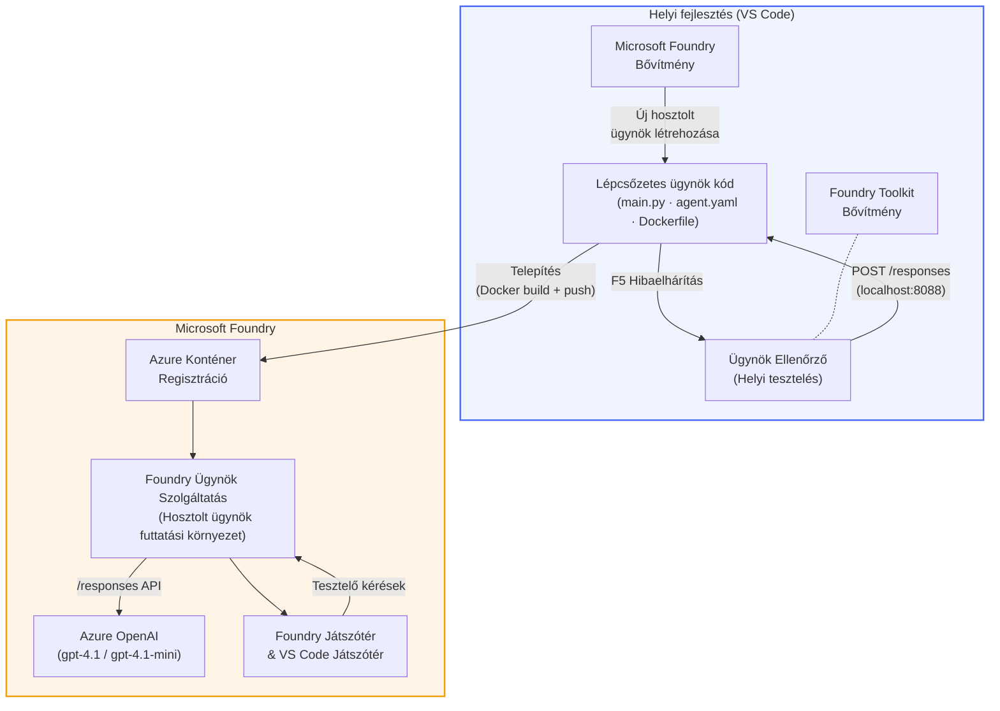

# Foundry Toolkit + Foundry Hosted Agents Workshop

[](https://www.python.org/)
[](https://github.com/microsoft/agents)
[](https://learn.microsoft.com/azure/ai-foundry/agents/concepts/hosted-agents/)
[](https://ai.azure.com/)
[](https://learn.microsoft.com/azure/ai-services/openai/)
[](https://learn.microsoft.com/cli/azure/install-azure-cli)
[](https://learn.microsoft.com/azure/developer/azure-developer-cli/install-azd)
[](https://www.docker.com/)
[](https://marketplace.visualstudio.com/items?itemName=ms-windows-ai-studio.windows-ai-studio)
[](LICENSE)

Építsen, teszteljen és telepítsen MI ügynököket a **Microsoft Foundry Agent Service**-hez mint **Hosztolt ügynökök** – teljes mértékben a VS Code-ból a **Microsoft Foundry bővítmény** és a **Foundry Toolkit** használatával.

> **A hosztolt ügynökök jelenleg előzetes verzióban vannak.** A támogatott régiók korlátozottak – lásd [régió elérhetőség](https://learn.microsoft.com/azure/foundry/agents/concepts/hosted-agents#region-availability).

> A `agent/` mappa minden laboron belül **automatikusan felépül** a Foundry bővítmény által – ezt követően testreszabhatja a kódot, helyben tesztelhet, majd telepíthet.

<!-- CO-OP TRANSLATOR LANGUAGES TABLE START -->
[Arabic](../ar/README.md) | [Bengali](../bn/README.md) | [Bulgarian](../bg/README.md) | [Burmese (Myanmar)](../my/README.md) | [Chinese (Simplified)](../zh-CN/README.md) | [Chinese (Traditional, Hong Kong)](../zh-HK/README.md) | [Chinese (Traditional, Macau)](../zh-MO/README.md) | [Chinese (Traditional, Taiwan)](../zh-TW/README.md) | [Croatian](../hr/README.md) | [Czech](../cs/README.md) | [Danish](../da/README.md) | [Dutch](../nl/README.md) | [Estonian](../et/README.md) | [Finnish](../fi/README.md) | [French](../fr/README.md) | [German](../de/README.md) | [Greek](../el/README.md) | [Hebrew](../he/README.md) | [Hindi](../hi/README.md) | [Hungarian](./README.md) | [Indonesian](../id/README.md) | [Italian](../it/README.md) | [Japanese](../ja/README.md) | [Kannada](../kn/README.md) | [Khmer](../km/README.md) | [Korean](../ko/README.md) | [Lithuanian](../lt/README.md) | [Malay](../ms/README.md) | [Malayalam](../ml/README.md) | [Marathi](../mr/README.md) | [Nepali](../ne/README.md) | [Nigerian Pidgin](../pcm/README.md) | [Norwegian](../no/README.md) | [Persian (Farsi)](../fa/README.md) | [Polish](../pl/README.md) | [Portuguese (Brazil)](../pt-BR/README.md) | [Portuguese (Portugal)](../pt-PT/README.md) | [Punjabi (Gurmukhi)](../pa/README.md) | [Romanian](../ro/README.md) | [Russian](../ru/README.md) | [Serbian (Cyrillic)](../sr/README.md) | [Slovak](../sk/README.md) | [Slovenian](../sl/README.md) | [Spanish](../es/README.md) | [Swahili](../sw/README.md) | [Swedish](../sv/README.md) | [Tagalog (Filipino)](../tl/README.md) | [Tamil](../ta/README.md) | [Telugu](../te/README.md) | [Thai](../th/README.md) | [Turkish](../tr/README.md) | [Ukrainian](../uk/README.md) | [Urdu](../ur/README.md) | [Vietnamese](../vi/README.md)

> **Inkábban helyben klónozná?**
>
> Ez a tárház több mint 50 nyelvi fordítást tartalmaz, ami jelentősen megnöveli a letöltési méretet. Ha fordítások nélkül kívánja klónozni, használja a sparse checkout-ot:
>
> **Bash / macOS / Linux:**
> ```bash
> git clone --filter=blob:none --sparse https://github.com/microsoft-foundry/Foundry_Toolkit_for_VSCode_Lab.git
> cd Foundry_Toolkit_for_VSCode_Lab
> git sparse-checkout set --no-cone '/*' '!translations' '!translated_images'
> ```
>
> **CMD (Windows):**
> ```cmd
> git clone --filter=blob:none --sparse https://github.com/microsoft-foundry/Foundry_Toolkit_for_VSCode_Lab.git
> cd Foundry_Toolkit_for_VSCode_Lab
> git sparse-checkout set --no-cone "/*" "!translations" "!translated_images"
> ```
>
> Így mindent megkap, amire szüksége van a kurzus teljesítéséhez, sokkal gyorsabb letöltéssel.
<!-- CO-OP TRANSLATOR LANGUAGES TABLE END -->

---

## Felépítés


**Folyamat:** A Foundry bővítmény felépíti az ügynököt → Ön testreszabja a kódot és az utasításokat → helyben tesztel az Agent Inspectorral → telepít a Foundry-ba (Docker kép feltöltése az ACR-be) → ellenőrzés a Playgroundban.

---

## Amit építeni fog

| Lab | Leírás | Állapot |
|-----|-------------|--------|
| **Lab 01 - Egyetlen ügynök** | Építse meg az **"Magyarázza el úgy, mintha vezető lennék" ügynököt**, tesztelje helyben, és telepítse a Foundry-ba | ✅ Elérhető |
| **Lab 02 - Többügynökös munkafolyamat** | Építse meg a **"Önéletrajz → Munkaalkalmasság értékelő"** - 4 ügynök együttműködik az önéletrajz illeszkedésének pontozásában és tanulási terv generálásában | ✅ Elérhető |

---

## Ismerje meg a Vezetői Ügynököt

Ebben a workshopban megépíti az **"Magyarázza el úgy, mintha vezető lennék" ügynököt** – egy MI ügynököt, amely a bonyolult műszaki zsargont nyugodt, igazgatósági értekezlet-re kész összefoglalókká fordítja le. Mert legyünk őszinték, senki sem akar a vezetésben arról hallani, hogy "szálmedence kimerülés lépett fel a szinkron hívások miatt, amelyeket a v3.2 hozott be."

Ezt az ügynököt egy túl sok eset után készítettem, amikor a tökéletesen megírt post-mortememre azt kaptam válaszul: *"Szóval... az oldal le van állva, vagy sem?"*

### Hogyan működik

Megad egy technikai frissítést. Ez visszadob egy vezetői összefoglalót – három pontban, zsargon nélkül, stack trace nélkül, és lételméleti félelem nélkül. Csak azt, hogy **mi történt**, **üzleti hatás**, és a **következő lépés**.

### Lássa működés közben

**Ön mondja:**
> "Az API késleltetése megnövekedett a szálmedence kimerülése miatt, amit a v3.2-ben bevezetett szinkron hívások okoztak."

**Az ügynök válasza:**

> **Vezetői Összefoglaló:**
> - **Mi történt:** A legújabb kiadás után a rendszer lassult.
> - **Üzleti hatás:** Egyes felhasználók késéseket tapasztaltak a szolgáltatás használata közben.
> - **Következő lépés:** A változtatás vissza lett vonva, és egy javítás készül az újratelepítés előtt.

### Miért ez az ügynök?

Ez egy halál egyszerű, egyetlen célú ügynök – tökéletes arra, hogy végigkövesse a hosztolt ügynökök munkafolyamatát anélkül, hogy bonyolult eszközláncokba bonyolódna. És őszintén? Minden mérnöki csapatnak kellene egy ilyen.

---

## Workshop felépítése

```
📂 Foundry_Toolkit_for_VSCode_Lab/
├── 📄 README.md                      ← You are here
├── 📂 ExecutiveAgent/                ← Standalone hosted agent project
│   ├── agent.yaml
│   ├── Dockerfile
│   ├── main.py
│   └── requirements.txt
└── 📂 workshop/
    ├── 📂 lab01-single-agent/        ← Full lab: docs + agent code
    │   ├── README.md                 ← Hands-on lab instructions
    │   ├── 📂 docs/                  ← Step-by-step tutorial modules
    │   │   ├── 00-prerequisites.md
    │   │   ├── 01-install-foundry-toolkit.md
    │   │   ├── 02-create-foundry-project.md
    │   │   ├── 03-create-hosted-agent.md
    │   │   ├── 04-configure-and-code.md
    │   │   ├── 05-test-locally.md
    │   │   ├── 06-deploy-to-foundry.md
    │   │   ├── 07-verify-in-playground.md
    │   │   └── 08-troubleshooting.md
    │   └── 📂 agent/                 ← Reference solution (auto-scaffolded by Foundry extension)
    │       ├── agent.yaml
    │       ├── Dockerfile
    │       ├── main.py
    │       └── requirements.txt
    └── 📂 lab02-multi-agent/         ← Resume → Job Fit Evaluator
        ├── README.md                 ← Hands-on lab instructions (end-to-end)
        ├── 📂 docs/                  ← Step-by-step tutorial modules
        │   ├── 00-prerequisites.md
        │   ├── 01-understand-multi-agent.md
        │   ├── 02-scaffold-multi-agent.md
        │   ├── 03-configure-agents.md
        │   ├── 04-orchestration-patterns.md
        │   ├── 05-test-locally.md
        │   ├── 06-deploy-to-foundry.md
        │   ├── 07-verify-in-playground.md
        │   └── 08-troubleshooting.md
        └── 📂 PersonalCareerCopilot/ ← Reference solution (multi-agent workflow)
            ├── agent.yaml
            ├── Dockerfile
            ├── main.py
            └── requirements.txt
```

> **Megjegyzés:** Az `agent/` mappa minden laboron belül az, amit a **Microsoft Foundry bővítmény** generál, amikor futtatja a `Microsoft Foundry: Create a New Hosted Agent` parancsot a parancspalettán. A fájlokat aztán testreszabja az ügynök utasításaival, eszközeivel és konfigurációjával. Az 01-es labor végigvezeti Önt ennek újragenerálásán a nulláról.

---

## Kezdés

### 1. Klónozza a tárházat

```bash
git clone https://github.com/microsoft-foundry/Foundry_Toolkit_for_VSCode_Lab.git
cd Foundry_Toolkit_for_VSCode_Lab
```

### 2. Állítson be egy Python virtuális környezetet

```bash
python -m venv venv
```

Aktiválja:

- **Windows (PowerShell):**
  ```powershell
  .\venv\Scripts\Activate.ps1
  ```
- **macOS / Linux:**
  ```bash
  source venv/bin/activate
  ```

### 3. Telepítse a függőségeket

```bash
pip install -r workshop/lab01-single-agent/agent/requirements.txt
```

### 4. Konfigurálja a környezeti változókat

Másolja az agent mappán belül található .env minta fájlt, és töltse ki az értékeit:

```bash
cp workshop/lab01-single-agent/agent/.env.example workshop/lab01-single-agent/agent/.env
```

Szerkessze a `workshop/lab01-single-agent/agent/.env` fájlt:

```env
AZURE_AI_PROJECT_ENDPOINT=https://<your-account>.services.ai.azure.com/api/projects/<your-project>
MODEL_DEPLOYMENT_NAME=<your-model-deployment-name>
```

### 5. Kövesse a workshop laborokat

Minden labor önálló, saját modulokkal. Kezdje az **01-es laborral**, hogy megismerje az alapokat, majd folytassa a **02-es laborral** a többügynökös munkafolyamatokhoz.

#### 01-es labor - Egyetlen ügynök ([teljes utasítások](workshop/lab01-single-agent/README.md))

| # | Modul | Link |
|---|--------|------|
| 1 | Olvassa el az előfeltételeket | [00-prerequisites.md](workshop/lab01-single-agent/docs/00-prerequisites.md) |
| 2 | Telepítse a Foundry Toolkit-et és a Foundry bővítményt | [01-install-foundry-toolkit.md](workshop/lab01-single-agent/docs/01-install-foundry-toolkit.md) |
| 3 | Hozzon létre egy Foundry projektet | [02-create-foundry-project.md](workshop/lab01-single-agent/docs/02-create-foundry-project.md) |
| 4 | Hozzon létre egy hosztolt ügynököt | [03-create-hosted-agent.md](workshop/lab01-single-agent/docs/03-create-hosted-agent.md) |
| 5 | Konfigurálja az utasításokat és a környezetet | [04-configure-and-code.md](workshop/lab01-single-agent/docs/04-configure-and-code.md) |
| 6 | Tesztelje helyben | [05-test-locally.md](workshop/lab01-single-agent/docs/05-test-locally.md) |
| 7 | Telepítse a Foundry-ba | [06-deploy-to-foundry.md](workshop/lab01-single-agent/docs/06-deploy-to-foundry.md) |
| 8 | Ellenőrizze a playgroundban | [07-verify-in-playground.md](workshop/lab01-single-agent/docs/07-verify-in-playground.md) |
| 9 | Hibakeresés | [08-troubleshooting.md](workshop/lab01-single-agent/docs/08-troubleshooting.md) |

#### 02-es labor - Többügynökös munkafolyamat ([teljes utasítások](workshop/lab02-multi-agent/README.md))

| # | Modul | Link |
|---|--------|------|
| 1 | Előfeltételek (02-es labor) | [00-prerequisites.md](workshop/lab02-multi-agent/docs/00-prerequisites.md) |
| 2 | Ismerje meg a többügynökös architektúrát | [01-understand-multi-agent.md](workshop/lab02-multi-agent/docs/01-understand-multi-agent.md) |
| 3 | Scaffoldolja a többügynökös projektet | [02-scaffold-multi-agent.md](workshop/lab02-multi-agent/docs/02-scaffold-multi-agent.md) |
| 4 | Konfigurálja az ügynököket és a környezetet | [03-configure-agents.md](workshop/lab02-multi-agent/docs/03-configure-agents.md) |
| 5 | Orkesztrációs minták | [04-orchestration-patterns.md](workshop/lab02-multi-agent/docs/04-orchestration-patterns.md) |
| 6 | Tesztelje helyben (többügynökös) | [05-test-locally.md](workshop/lab02-multi-agent/docs/05-test-locally.md) |
| 7 | Telepítés a Foundry-ba | [06-deploy-to-foundry.md](workshop/lab02-multi-agent/docs/06-deploy-to-foundry.md) |
| 8 | Ellenőrzés a playground-ban | [07-verify-in-playground.md](workshop/lab02-multi-agent/docs/07-verify-in-playground.md) |
| 9 | Hibakeresés (több ügynök) | [08-troubleshooting.md](workshop/lab02-multi-agent/docs/08-troubleshooting.md) |

---

## Karbantartó

<table>
<tr>
    <td align="center"><a href="https://github.com/ShivamGoyal03">
        <br />
        <sub><b>Shivam Goyal</b></sub>
    </a><br />
    </td>
</tr>
</table>

---

## Szükséges engedélyek (gyors referencia)

| Forgatókönyv | Szükséges szerepkörök |
|--------------|----------------------|
| Új Foundry projekt létrehozása | **Azure AI Owner** a Foundry erőforráson |
| Telepítés meglévő projektre (új erőforrások) | **Azure AI Owner** + **Contributor** az előfizetésen |
| Telepítés teljesen konfigurált projektre | **Reader** a fiókon + **Azure AI User** a projekten |

> **Fontos:** Az Azure `Owner` és `Contributor` szerepkörök csak *kezelési* engedélyeket tartalmaznak, nem *fejlesztési* (adatműveleti) jogosultságokat. Ügynökök építéséhez és telepítéséhez **Azure AI User** vagy **Azure AI Owner** szükséges.

---

## Hivatkozások

- [Gyorsstart: Az első hosztolt ügynök telepítése (VS Code)](https://learn.microsoft.com/azure/foundry/agents/quickstarts/quickstart-hosted-agent)
- [Mik azok a hosztolt ügynökök?](https://learn.microsoft.com/azure/foundry/agents/concepts/hosted-agents)
- [Hosztolt ügynöki munkafolyamatok létrehozása VS Code-ban](https://learn.microsoft.com/azure/foundry/agents/how-to/vs-code-agents-workflow-pro-code)
- [Hosztolt ügynök telepítése](https://learn.microsoft.com/azure/foundry/agents/how-to/deploy-hosted-agent)
- [RBAC a Microsoft Foundry-hoz](https://learn.microsoft.com/azure/foundry/concepts/rbac-foundry)
- [Architektúra felülvizsgálati ügynök példa](https://github.com/Azure-Samples/agent-architecture-review-sample) - Valós hosztolt ügynök MCP eszközökkel, Excalidraw diagramokkal és kettős telepítéssel

---

## Licenc

[MIT](../../LICENSE)

---

<!-- CO-OP TRANSLATOR DISCLAIMER START -->
**Nyilatkozat**:
Ezt a dokumentumot az AI fordító szolgáltatás [Co-op Translator](https://github.com/Azure/co-op-translator) segítségével fordítottuk. Bár törekszünk a pontosságra, kérjük vegye figyelembe, hogy az automatikus fordítások tartalmazhatnak hibákat vagy pontatlanságokat. Az eredeti, anyanyelvi dokumentumot kell tekinteni a hiteles forrásnak. Kritikus információk esetén szakmai emberi fordítást javaslunk. Nem vállalunk felelősséget a fordítás használatából eredő félreértésekért vagy helytelen értelmezésekért.
<!-- CO-OP TRANSLATOR DISCLAIMER END -->