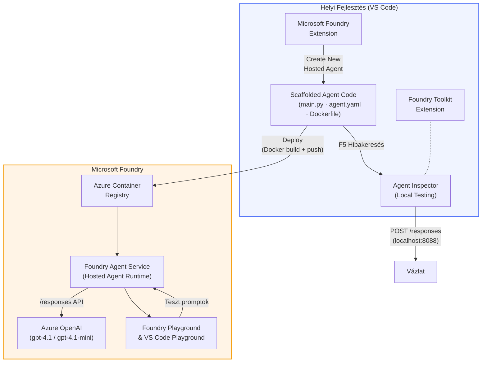

# Foundry Toolkit + Foundry Hosted Agents Műhely

[](https://www.python.org/)
[](https://github.com/microsoft/agents)
[](https://learn.microsoft.com/azure/foundry/agents/concepts/hosted-agents)
[](https://ai.azure.com/)
[](https://learn.microsoft.com/azure/ai-services/openai/)
[](https://learn.microsoft.com/cli/azure/install-azure-cli)
[](https://learn.microsoft.com/azure/developer/azure-developer-cli/install-azd)
[](https://www.docker.com/)
[](https://marketplace.visualstudio.com/items?itemName=ms-windows-ai-studio.windows-ai-studio)
[](LICENSE)

AI ügynökök építése, tesztelése és telepítése a **Microsoft Foundry Agent Service**-hez **Hosted Agents**-ként – teljes egészében a VS Code-ból, a **Microsoft Foundry kiterjesztés** és a **Foundry Toolkit** segítségével.

> **A Hosted Agents jelenleg előnézetben vannak.** A támogatott régiók korlátozottak – lásd a [régió elérhetőséget](https://learn.microsoft.com/azure/foundry/agents/concepts/hosted-agents#region-availability).

> A `agent/` mappa minden laborban a Foundry kiterjesztés által **automatikusan generált** – ezt követően testreszabod a kódot, helyben teszteled, majd telepíted.

### 🌐 Többnyelvű támogatás

#### GitHub Action által támogatott (Automatikus és Mindig naprakész)

<!-- CO-OP TRANSLATOR LANGUAGES TABLE START -->
[Arabic](../ar/README.md) | [Bengali](../bn/README.md) | [Bulgarian](../bg/README.md) | [Burmese (Myanmar)](../my/README.md) | [Chinese (Simplified)](../zh-CN/README.md) | [Chinese (Traditional, Hong Kong)](../zh-HK/README.md) | [Chinese (Traditional, Macau)](../zh-MO/README.md) | [Chinese (Traditional, Taiwan)](../zh-TW/README.md) | [Croatian](../hr/README.md) | [Czech](../cs/README.md) | [Danish](../da/README.md) | [Dutch](../nl/README.md) | [Estonian](../et/README.md) | [Finnish](../fi/README.md) | [French](../fr/README.md) | [German](../de/README.md) | [Greek](../el/README.md) | [Hebrew](../he/README.md) | [Hindi](../hi/README.md) | [Hungarian](./README.md) | [Indonesian](../id/README.md) | [Italian](../it/README.md) | [Japanese](../ja/README.md) | [Kannada](../kn/README.md) | [Khmer](../km/README.md) | [Korean](../ko/README.md) | [Lithuanian](../lt/README.md) | [Malay](../ms/README.md) | [Malayalam](../ml/README.md) | [Marathi](../mr/README.md) | [Nepali](../ne/README.md) | [Nigerian Pidgin](../pcm/README.md) | [Norwegian](../no/README.md) | [Persian (Farsi)](../fa/README.md) | [Polish](../pl/README.md) | [Portuguese (Brazil)](../pt-BR/README.md) | [Portuguese (Portugal)](../pt-PT/README.md) | [Punjabi (Gurmukhi)](../pa/README.md) | [Romanian](../ro/README.md) | [Russian](../ru/README.md) | [Serbian (Cyrillic)](../sr/README.md) | [Slovak](../sk/README.md) | [Slovenian](../sl/README.md) | [Spanish](../es/README.md) | [Swahili](../sw/README.md) | [Swedish](../sv/README.md) | [Tagalog (Filipino)](../tl/README.md) | [Tamil](../ta/README.md) | [Telugu](../te/README.md) | [Thai](../th/README.md) | [Turkish](../tr/README.md) | [Ukrainian](../uk/README.md) | [Urdu](../ur/README.md) | [Vietnamese](../vi/README.md)

> **Jobban kedveled a helyi klónozást?**
>
> Ez a tároló több mint 50 nyelvi fordítást tartalmaz, ami jelentősen megnöveli a letöltési méretet. Ha lefordítások nélkül szeretnél klónozni, használd a sparse checkout-ot:
>
> **Bash / macOS / Linux:**
> ```bash
> git clone --filter=blob:none --sparse https://github.com/microsoft-foundry/Foundry_Toolkit_for_VSCode_Lab.git
> cd Foundry_Toolkit_for_VSCode_Lab
> git sparse-checkout set --no-cone '/*' '!translations' '!translated_images'
> ```
>
> **CMD (Windows):**
> ```cmd
> git clone --filter=blob:none --sparse https://github.com/microsoft-foundry/Foundry_Toolkit_for_VSCode_Lab.git
> cd Foundry_Toolkit_for_VSCode_Lab
> git sparse-checkout set --no-cone "/*" "!translations" "!translated_images"
> ```
>
> Ez mindent megad, amire szükséged van a tanfolyam teljesítéséhez, jelentősen gyorsabb letöltéssel.
<!-- CO-OP TRANSLATOR LANGUAGES TABLE END -->

---

## Architektúra


```mermaid
flowchart TB
    subgraph Local["Helyi Fejlesztés (VS Code)"]
        direction TB
        FE["Microsoft Foundry
        Extension"]
        FoundryToolkit["Foundry Toolkit
        Extension"]
        Scaffold["Scaffolded Agent Code
        (main.py · agent.yaml · Dockerfile)"]
        Inspector["Agent Inspector
        (Local Testing)"]
        FE -- "Create New
        Hosted Agent" --> Scaffold
        Scaffold -- "F5 Hibakeresés" --> Inspector
        FoundryToolkit -.- Inspector
    end

    subgraph Cloud["Microsoft Foundry"]
        direction TB
        ACR["Azure Container
        Registry"]
        AgentService["Foundry Agent Service
        (Hosted Agent Runtime)"]
        Model["Azure OpenAI
        (gpt-4.1 / gpt-4.1-mini)"]
        Playground["Foundry Playground
        & VS Code Playground"]
        ACR --> AgentService
        AgentService -- "/responses API" --> Model
        AgentService --> Playground
    end

    Scaffold -- "Deploy
    (Docker build + push)" --> ACR
    Inspector -- "POST /responses
    (localhost:8088)" --> Vázlat
    Playground -- "Teszt promptok" --> AgentService

    style Local fill:#f0f4ff,stroke:#4a6cf7,stroke-width:2px
    style Cloud fill:#fff4e6,stroke:#f59e0b,stroke-width:2px
```

**Folyamat:** A Foundry kiterjesztés generálja az ügynököt → te testreszabod a kódot és az utasításokat → helyben teszteled az Agent Inspectorral → telepíted a Foundry-be (Docker image feltöltve az ACR-be) → ellenőrzöd a Playground-ban.

---

## Amit építeni fogsz

| Labor | Leírás | Állapot |
|-----|-------------|--------|
| **Labor 01 - Egyetlen ügynök** | Építsd meg az **"Magyarázd el, mintha vezető lennék" ügynököt**, teszteld helyben, és telepítsd a Foundry-be | ✅ Elérhető |
| **Labor 02 - Több ügynökös munkafolyamat** | Építsd meg a **"Önéletrajz → Munkaalkalmassági értékelő"** rendszert - 4 ügynök együttműködik az önéletrajz pontozására és egy tanulási útvonal létrehozására | ✅ Elérhető |

---

## Ismerd meg az Executive ügynököt

Ebben a műhelyben megépíted az **"Magyarázd el, mintha vezető lennék" ügynököt** – egy AI ügynököt, amely az összetett műszaki zsargont nyugodt, igazgatósági értekezletre alkalmas összefoglalóvá alakítja. Mert őszintén szólva senki sem akar hallani a "szálkészlet kimerülésről, amit a v3.2 által bevezetett szinkron hívások okoztak."

Ezt az ügynököt egy-egy olyan eset után készítettem, amikor a hibajelentésemre ez volt a reakció: *"Tehát... az oldal épp le van állva vagy sem?"*

### Hogyan működik

Adsz neki egy műszaki frissítést. Ő visszadob egy vezetői összefoglalót - három pontban, zsargon nélkül, veremnyom nélkül, létezési félelem nélkül. Csak azt, **mi történt**, **üzleti hatás**, és **következő lépés**.

### Nézd meg működés közben

**Te mondod:**
> "Az API válaszideje megnőtt a szálkészlet kimerülése miatt, amit a v3.2-ben bevezetett szinkron hívások okoztak."

**Az ügynök válasza:**

> **Vezetői összefoglaló:**
> - **Mi történt:** A legutóbbi kiadás után a rendszer lassult.
> - **Üzleti hatás:** Néhány felhasználónál késések léptek fel a szolgáltatás használata közben.
> - **Következő lépés:** A változtatás vissza lett vonva, és javítás készül az újratelepítés előtt.

### Miért ez az ügynök?

Egyszerű, egyfunkciós ügynök – tökéletes arra, hogy végigkövesd a Hosted Agent folyamatot bonyolult eszközkészlet nélkül. És őszintén? Minden mérnöki csapatnak szüksége lenne egy ilyenre.

---

## Műhely felépítése

```
📂 Foundry_Toolkit_for_VSCode_Lab/
├── 📄 README.md                      ← You are here
└── 📂 workshop/
    ├── 📂 lab01-single-agent/        ← Full lab: docs + agent code
    │   ├── README.md                 ← Hands-on lab instructions
    │   ├── 📂 docs/                  ← Step-by-step tutorial modules
    │   │   ├── 00-prerequisites.md
    │   │   ├── 01-setup.md
    │   │   ├── 02-create-hosted-agent.md
    │   │   ├── 03-configure-and-code.md
    │   │   ├── 04-test-locally.md
    │   │   ├── 05-deploy-to-foundry.md
    │   │   ├── 06-verify-in-playground.md
    │   │   ├── 07-summary.md
    │   │   └── 08-troubleshooting.md
    │   └── 📂 agent/                 ← Reference solution (auto-scaffolded by Foundry extension)
    │       ├── agent.yaml
    │       ├── Dockerfile
    │       ├── main.py
    │       └── requirements.txt
    └── 📂 lab02-multi-agent/         ← Resume → Job Fit Evaluator
        ├── README.md                 ← Hands-on lab instructions (end-to-end)
        ├── 📂 docs/                  ← Step-by-step tutorial modules
        │   ├── 00-prerequisites.md
        │   ├── 01-understand-multi-agent.md
        │   ├── 02-scaffold-multi-agent.md
        │   ├── 03-configure-agents.md
        │   ├── 04-orchestration-patterns.md
        │   ├── 05-test-locally.md
        │   ├── 06-deploy-to-foundry.md
        │   ├── 07-verify-in-playground.md
        │   └── 08-troubleshooting.md
        └── 📂 PersonalCareerCopilot/ ← Reference solution (multi-agent workflow)
            ├── agent.yaml
            ├── Dockerfile
            ├── main.py
            └── requirements.txt
```

> **Megjegyzés:** A `agent/` mappa minden laborban azt tartalmazza, amit a **Microsoft Foundry kiterjesztés** generál, amikor a Parancspalettáról a `Microsoft Foundry: Create a New Hosted Agent` parancsot futtatod. Az állományokat aztán testreszabod az ügynököd utasításaival, eszközeivel és konfigurációjával. Az 01-es labor végigvezet ezen, hogyan lehet ezt nulláról megcsinálni.

---

## Kezdés

### 1. Klónozd a repót

```bash
git clone https://github.com/microsoft-foundry/Foundry_Toolkit_for_VSCode_Lab.git
cd Foundry_Toolkit_for_VSCode_Lab
```

### 2. Állíts be egy Python virtuális környezetet

```bash
python -m venv venv
```

Aktiváld:

- **Windows (PowerShell):**
  ```powershell
  .\venv\Scripts\Activate.ps1
  ```
- **macOS / Linux:**
  ```bash
  source venv/bin/activate
  ```

### 3. Telepítsd a függőségeket

```bash
pip install -r workshop/lab01-single-agent/agent/requirements.txt
```

### 4. Állítsd be a környezeti változókat

Másold le az példa `.env` fájlt az agent mappán belül, és töltsd ki az értékeiddel:

```bash
cp workshop/lab01-single-agent/agent/.env.example workshop/lab01-single-agent/agent/.env
```

Szerkeszd a `workshop/lab01-single-agent/agent/.env` fájlt:

```env
AZURE_AI_PROJECT_ENDPOINT=https://<your-account>.services.ai.azure.com/api/projects/<your-project>
AZURE_AI_MODEL_DEPLOYMENT_NAME=<your-model-deployment-name>
```

### 5. Kövesd a műhely labrólabor útmutatóját

Minden labor önálló modulokkal rendelkezik. Kezdd a **Labor 01-gyel** az alapok elsajátításához, majd haladj a **Labor 02**-re a többügynökös munkafolyamatokért.

#### Labor 01 - Egy Ügynök ([teljes útmutató](workshop/lab01-single-agent/README.md))

| # | Modul | Link |
|---|--------|------|
| 1 | Olvasd el az előfeltételeket | [00-prerequisites.md](workshop/lab01-single-agent/docs/00-prerequisites.md) |
| 2 | Telepítsd a Foundry Toolkit-et és a Foundry kiterjesztést | [01-setup.md](workshop/lab01-single-agent/docs/01-setup.md) |
| 3 | Hozz létre egy Foundry projektet | [01-setup.md](workshop/lab01-single-agent/docs/01-setup.md) |
| 4 | Hozz létre egy hosted agentet | [02-create-hosted-agent.md](workshop/lab01-single-agent/docs/02-create-hosted-agent.md) |
| 5 | Állítsd be az utasításokat és a környezetet | [03-configure-and-code.md](workshop/lab01-single-agent/docs/03-configure-and-code.md) |
| 6 | Teszteld helyben | [04-test-locally.md](workshop/lab01-single-agent/docs/04-test-locally.md) |
| 7 | Telepítsd a Foundry-be | [05-deploy-to-foundry.md](workshop/lab01-single-agent/docs/05-deploy-to-foundry.md) |
| 8 | Ellenőrizd a playground-ban | [06-verify-in-playground.md](workshop/lab01-single-agent/docs/06-verify-in-playground.md) |
| 9 | Hibakeresés | [08-troubleshooting.md](workshop/lab01-single-agent/docs/08-troubleshooting.md) |

#### Labor 02 - Több Ügynökös Munkafolyamat ([teljes útmutató](workshop/lab02-multi-agent/README.md))

| # | Modul | Link |
|---|--------|------|
| 1 | Előfeltételek (Labor 02) | [00-prerequisites.md](workshop/lab02-multi-agent/docs/00-prerequisites.md) |
| 2 | Ismerd meg a több-ügynökös architektúrát | [01-understand-multi-agent.md](workshop/lab02-multi-agent/docs/01-understand-multi-agent.md) |
| 3 | Készítsd el a több-ügynökös projekt alapját | [02-scaffold-multi-agent.md](workshop/lab02-multi-agent/docs/02-scaffold-multi-agent.md) |
| 4 | Állítsd be az ügynököket és a környezetet | [03-configure-agents.md](workshop/lab02-multi-agent/docs/03-configure-agents.md) |
| 5 | Orkesztrációs minták | [04-orchestration-patterns.md](workshop/lab02-multi-agent/docs/04-orchestration-patterns.md) |
| 6 | Teszteld helyben (több ügynök) | [05-test-locally.md](workshop/lab02-multi-agent/docs/05-test-locally.md) |

| 7 | Telepítés Foundry-ba | [06-deploy-to-foundry.md](workshop/lab02-multi-agent/docs/06-deploy-to-foundry.md) |
| 8 | Ellenőrzés playgroundban | [07-verify-in-playground.md](workshop/lab02-multi-agent/docs/07-verify-in-playground.md) |
| 9 | Hibakeresés (többagentes) | [08-troubleshooting.md](workshop/lab02-multi-agent/docs/08-troubleshooting.md) |

---

## Karbantartó

<table>
<tr>
    <td align="center"><a href="https://github.com/ShivamGoyal03">
        <br />
        <sub><b>Shivam Goyal</b></sub>
    </a><br />
    </td>
</tr>
</table>

---

## Szükséges engedélyek (gyors hivatkozás)

| Forgatókönyv | Szükséges szerepkörök |
|----------|---------------|
| Új Foundry projekt létrehozása | **Azure AI Owner** a Foundry erőforráson |
| Telepítés meglévő projekthez (új erőforrások) | **Azure AI Owner** + **Contributor** az előfizetésen |
| Teljesen konfigurált projekthez történő telepítés | **Reader** a fiókon + **Azure AI User** a projekten |

> **Fontos:** Az Azure `Owner` és `Contributor` szerepkörök csak *kezelői* engedélyeket tartalmaznak, nem *fejlesztői* (adatműveleti) engedélyeket. Ügynökök felépítéséhez és telepítéséhez **Azure AI User** vagy **Azure AI Owner** szükséges.

---

## Hivatkozások

- [Gyorsindítás: Az első hosztolt ügynök telepítése (VS Code)](https://learn.microsoft.com/azure/foundry/agents/quickstarts/quickstart-hosted-agent)
- [Mik azok a hosztolt ügynökök?](https://learn.microsoft.com/azure/foundry/agents/concepts/hosted-agents)
- [Hosztolt ügynök munkafolyamatok létrehozása VS Code-ban](https://learn.microsoft.com/azure/foundry/agents/how-to/vs-code-agents-workflow-pro-code)
- [Hosztolt ügynök telepítése](https://learn.microsoft.com/azure/foundry/agents/how-to/deploy-hosted-agent)
- [RBAC a Microsoft Foundry-hoz](https://learn.microsoft.com/azure/foundry/concepts/rbac-foundry)
- [Architektúra-ellenőrző ügynök mintapéldája](https://github.com/Azure-Samples/agent-architecture-review-sample) - Valós hosztolt ügynök MCP eszközökkel, Excalidraw diagramokkal és dupla telepítéssel

---


## Licenc

[MIT](../../LICENSE)

---

<!-- CO-OP TRANSLATOR DISCLAIMER START -->
**Jogi nyilatkozat**:
Ez a dokumentum az AI fordítási szolgáltatás, a [Co-op Translator](https://github.com/Azure/co-op-translator) segítségével készült. Bár az pontosságra törekszünk, kérjük, vegye figyelembe, hogy az automatikus fordítások hibákat vagy pontatlanságokat tartalmazhatnak. Az eredeti dokumentum az anyanyelvén tekintendő hiteles forrásnak. Fontos információk esetén professzionális emberi fordítást javasolunk. Nem vállalunk felelősséget semmilyen félreértésért vagy téves értelmezésért, amely ebből a fordításból ered.
<!-- CO-OP TRANSLATOR DISCLAIMER END -->