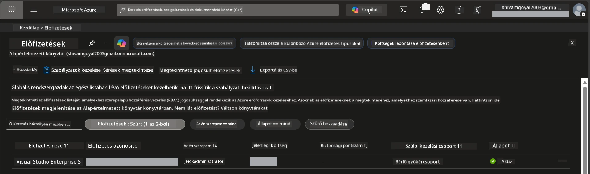

# Modul 0 - Előfeltételek

Mielőtt elkezdené a műhelyt, győződjön meg arról, hogy az alábbi eszközök, hozzáférések és környezet készen állnak. Kövesse az alábbi lépéseket - ne ugorjon előre.

---

## 1. Azure fiók és előfizetés

### 1.1 Hozza létre vagy ellenőrizze Azure előfizetését

1. Nyisson meg egy böngészőt, és navigáljon a [https://azure.microsoft.com/free/](https://azure.microsoft.com/free/) oldalra.
2. Ha még nincs Azure fiókja, kattintson a **Start free** gombra, és kövesse a regisztrációs folyamatot. Szüksége lesz Microsoft fiókra (vagy hozzon létre egyet), valamint hitelkártyára a személyazonosság ellenőrzéséhez.
3. Ha már van fiókja, jelentkezzen be a [https://portal.azure.com](https://portal.azure.com) oldalon.
4. A portálon kattintson a bal oldali navigációs sávban a **Subscriptions** lapra (vagy keressen rá a "Subscriptions" kifejezésre a felső keresősávban).
5. Ellenőrizze, hogy legalább egy **Active** előfizetés látható. Jegyezze fel az **Subscription ID** értékét - később szüksége lesz rá.



### 1.2 Értse meg a szükséges RBAC szerepköröket

A [Hosted Agent](https://learn.microsoft.com/azure/foundry/agents/concepts/hosted-agents) telepítéséhez olyan **adatműveleti** jogosultságok szükségesek, amelyek a standard Azure `Owner` és `Contributor` szerepkörökből **nem** részei. A következő [szerepkör kombinációk](https://learn.microsoft.com/azure/foundry/concepts/rbac-foundry#built-in-roles) egyikére lesz szüksége:

| Forgatókönyv | Szükséges szerepkörök | Hol kell hozzárendelni őket |
|--------------|----------------------|-----------------------------|
| Új Foundry projekt létrehozása | **Azure AI Owner** a Foundry erőforráson | Foundry erőforrás az Azure Portalban |
| Telepítés meglévő projekthez (új erőforrások) | **Azure AI Owner** + **Contributor** az előfizetésen | Előfizetés + Foundry erőforrás |
| Telepítés teljesen konfigurált projekthez | **Reader** a fiókon + **Azure AI User** a projekten | Fiók + Projekt az Azure Portalban |

> **Kulcspont:** Az Azure `Owner` és `Contributor` szerepkörök csak *kezelési* jogosultságokat fednek le (ARM műveletek). Az *adatműveletekhez*, például az `agents/write` jogosultsághoz, amely az agentek létrehozásához és telepítéséhez szükséges, [**Azure AI User**](https://learn.microsoft.com/azure/foundry/concepts/rbac-foundry#built-in-roles) (vagy magasabb) szerepkörre van szükség. Ezeket a szerepköröket a [2. modulban](02-create-foundry-project.md) fogja hozzárendelni.

---

## 2. Helyi eszközök telepítése

Telepítse az alábbi eszközöket. Telepítés után ellenőrizze, hogy működnek a megadott parancsokkal.

### 2.1 Visual Studio Code

1. Nyissa meg a [https://code.visualstudio.com/](https://code.visualstudio.com/) webhelyet.
2. Töltse le a telepítőt az operációs rendszeréhez (Windows/macOS/Linux).
3. Futtassa a telepítőt alapértelmezett beállításokkal.
4. Indítsa el a VS Code-ot, hogy megbizonyosodjon a sikeres indításról.

### 2.2 Python 3.10+

1. Nyissa meg a [https://www.python.org/downloads/](https://www.python.org/downloads/) oldalt.
2. Töltse le a Python 3.10-es vagy újabb verzióját (ajánlott: 3.12+).
3. **Windows:** A telepítés során az első képernyőn jelölje be az **"Add Python to PATH"** opciót.
4. Nyisson egy terminált és ellenőrizze:

   ```powershell
   python --version
   ```

   Várt kimenet: `Python 3.10.x` vagy újabb verzió.

### 2.3 Azure CLI

1. Látogasson el a [https://learn.microsoft.com/cli/azure/install-azure-cli](https://learn.microsoft.com/cli/azure/install-azure-cli) oldalra.
2. Kövesse az operációs rendszerének megfelelő telepítési útmutatót.
3. Ellenőrizze:

   ```powershell
   az --version
   ```

   Várt kimenet: `azure-cli 2.80.0` vagy újabb verzió.

4. Jelentkezzen be:

   ```powershell
   az login
   ```

### 2.4 Azure Developer CLI (azd)

1. Nyissa meg a [https://learn.microsoft.com/azure/developer/azure-developer-cli/install-azd](https://learn.microsoft.com/azure/developer/azure-developer-cli/install-azd) oldalt.
2. Kövesse az operációs rendszerének megfelelő telepítési útmutatót. Windowson:

   ```powershell
   winget install microsoft.azd
   ```

3. Ellenőrizze:

   ```powershell
   azd version
   ```

   Várt kimenet: `azd version 1.x.x` vagy újabb verzió.

4. Jelentkezzen be:

   ```powershell
   azd auth login
   ```

### 2.5 Docker Desktop (opcionális)

A Dockert csak akkor kell telepíteni, ha a konténer képet helyben szeretné építeni és tesztelni a telepítés előtt. A Foundry bővítmény automatikusan kezeli a konténer építést a telepítés során.

1. Látogasson el a [https://docs.docker.com/get-docker/](https://docs.docker.com/get-docker/) oldalra.
2. Töltse le és telepítse a Docker Desktopot az operációs rendszeréhez.
3. **Windows:** Bizonyosodjon meg arról, hogy a telepítés során a WSL 2 hátteret választja.
4. Indítsa el a Docker Desktopot és várjon, amíg az ikon a tálcán meg nem jeleníti, hogy a **"Docker Desktop is running"** állapot.
5. Nyisson egy terminált és ellenőrizze:

   ```powershell
   docker info
   ```

   Ez a parancs Docker rendszer információkat kell, hogy hibák nélkül megjelenítsen. Ha a `Cannot connect to the Docker daemon` üzenetet látja, várjon pár másodpercet, hogy a Docker teljesen elinduljon.

---

## 3. VS Code bővítmények telepítése

Három bővítményt kell telepítenie. Telepítse őket **a műhely megkezdése előtt**.

### 3.1 Microsoft Foundry VS Code-hoz

1. Nyissa meg a VS Code-ot.
2. Nyomja meg a `Ctrl+Shift+X` billentyűkombinációt a Bővítmények panel megnyitásához.
3. A keresőmezőbe írja be: **"Microsoft Foundry"**.
4. Keresse meg a **Microsoft Foundry for Visual Studio Code** bővítményt (kiadó: Microsoft, ID: `TeamsDevApp.vscode-ai-foundry`).
5. Kattintson a **Install** gombra.
6. A telepítés után meg kell jelennie a **Microsoft Foundry** ikonnak az Aktivitás sávban (bal oldali sáv).

### 3.2 Foundry Toolkit

1. A Bővítmények panelen (`Ctrl+Shift+X`) keressen rá a **"Foundry Toolkit"** kifejezésre.
2. Keresse meg a **Foundry Toolkit** bővítményt (kiadó: Microsoft, ID: `ms-windows-ai-studio.windows-ai-studio`).
3. Kattintson a **Install** gombra.
4. A **Foundry Toolkit** ikon megjelenik az Aktivitás sávban.

### 3.3 Python

1. A Bővítmények panelen keresse a **"Python"** kifejezést.
2. Keresse meg a **Python** bővítményt (kiadó: Microsoft, ID: `ms-python.python`).
3. Kattintson a **Install** gombra.

---

## 4. Bejelentkezés Azure-ba a VS Code-ból

A [Microsoft Agent Framework](https://learn.microsoft.com/agent-framework/overview/) a hitelesítéshez a [`DefaultAzureCredential`](https://learn.microsoft.com/azure/developer/python/sdk/authentication/credential-chains#defaultazurecredential-overview) osztályt használja. Szükséges, hogy be legyen jelentkezve Azure-ba a VS Code-ban.

### 4.1 Bejelentkezés VS Code-on keresztül

1. Nézze meg a VS Code bal alsó sarkát, és kattintson a **Fiókok** ikonra (ember sziluett).
2. Kattintson a **Sign in to use Microsoft Foundry** (vagy **Sign in with Azure**) gombra.
3. Megnyílik egy böngészőablak - jelentkezzen be azzal az Azure fiókkal, amely hozzáfér az előfizetéséhez.
4. Térjen vissza a VS Code-hoz. A bal alsó sarokban meg kell jelennie a fiók nevének.

### 4.2 (Opcionális) Bejelentkezés Azure CLI-n keresztül

Ha telepítette az Azure CLI-t és a CLI-alapú hitelesítést részesíti előnyben:

```powershell
az login
```

Ez megnyit egy böngészőt a bejelentkezéshez. Bejelentkezés után állítsa be a megfelelő előfizetést:

```powershell
az account set --subscription "<your-subscription-id>"
```

Ellenőrizze:

```powershell
az account show --query "{name:name, id:id, state:state}" --output table
```

Látnia kell az előfizetés nevét, azonosítóját és `Enabled` állapotát.

### 4.3 (Alternatív) Szolgáltatás principal hitelesítés

CI/CD vagy megosztott környezetekben állítsa be az alábbi környezeti változókat:

```powershell
$env:AZURE_TENANT_ID = "<your-tenant-id>"
$env:AZURE_CLIENT_ID = "<your-client-id>"
$env:AZURE_CLIENT_SECRET = "<your-client-secret>"
```

---

## 5. Áttekintési korlátozások

A folytatás előtt legyen tisztában a jelenlegi korlátozásokkal:

- A [**Hosted Agents**](https://learn.microsoft.com/azure/foundry/agents/concepts/hosted-agents) jelenleg **nyilvános előnézetben** van - nem ajánlott éles munkákhoz.
- A támogatott régiók korlátozottak - ellenőrizze a [régió elérhetőségét](https://learn.microsoft.com/azure/foundry/agents/concepts/hosted-agents#region-availability) az erőforrások létrehozása előtt. Ha nem támogatott régiót választ, a telepítés sikertelen lesz.
- Az `azure-ai-agentserver-agentframework` csomag pre-release (`1.0.0b16`) verzió, az API-k változhatnak.
- Méretezési korlátok: a hosted agentek 0-5 replika támogatott (beleértve a skálázást nullára is).

---

## 6. Átvizsgálási lista

Futtassa végig az alábbiakat. Ha bármelyik lépés hibát jelez, térjen vissza és javítsa.

- [ ] A VS Code hibamentesen megnyílik
- [ ] Python 3.10+ a PATH-ban (`python --version` kiírja a `3.10.x` vagy magasabb verziót)
- [ ] Azure CLI telepítve van (`az --version` kiírja a `2.80.0` vagy magasabb verziót)
- [ ] Azure Developer CLI telepítve van (`azd version` kiírja a verzió információkat)
- [ ] Microsoft Foundry bővítmény telepítve van (ikon látható az Aktivitás sávban)
- [ ] Foundry Toolkit bővítmény telepítve van (ikon látható az Aktivitás sávban)
- [ ] Python bővítmény telepítve van
- [ ] Be van jelentkezve Azure-ba a VS Code-ban (ellenőrizze a Fiókok ikont, bal alsó sarok)
- [ ] `az account show` visszaadja az előfizetését
- [ ] (Opcionális) A Docker Desktop fut (`docker info` hibamentesen megjeleníti a rendszerinformációkat)

### Ellenőrző pont

Nyissa meg a VS Code Aktivitás sávját, és ellenőrizze, hogy mind a **Foundry Toolkit**, mind a **Microsoft Foundry** oldalsáv nézetek láthatók-e. Kattintson mindegyikre, hogy megbizonyosodjon arról, hibamentesen betöltődnek.

---

**Következő:** [01 - Telepítse a Foundry Toolkitet & Foundry bővítményt →](01-install-foundry-toolkit.md)

---

<!-- CO-OP TRANSLATOR DISCLAIMER START -->
**Nyilatkozat**:  
Ez a dokumentum az AI fordító szolgáltatás, a [Co-op Translator](https://github.com/Azure/co-op-translator) segítségével készült. Bár pontosságra törekszünk, kérjük, vegye figyelembe, hogy az automatikus fordítások tartalmazhatnak hibákat vagy pontatlanságokat. Az eredeti dokumentum a saját nyelvén tekintendő hiteles forrásnak. Kritikus információk esetén professzionális emberi fordítás ajánlott. Nem vállalunk felelősséget az ebből a fordításból eredő félreértésekért vagy téves értelmezésekért.
<!-- CO-OP TRANSLATOR DISCLAIMER END -->