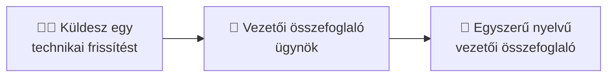

# Modul 0 - Bevezetés

⏱️ ~10 perc

> [!WARNING]
> **Előzetes verzió & Korlátozások:** A [Hosted Agents](https://learn.microsoft.com/azure/foundry/agents/concepts/hosted-agents) jelenleg **nyilvános előnézetben** vannak – nem ajánlott éles terhelésekhez. Legyél tudatában a következőknek:
> - **A támogatott régiók korlátozottak** – az erőforrások létrehozása előtt nézd meg a [régió elérhetőségét](https://learn.microsoft.com/azure/foundry/agents/concepts/hosted-agents#region-availability). Ha nem támogatott régiót választasz, a telepítés sikertelen lesz.
> - Az `azure-ai-agentserver-agentframework` csomag előzetes verzió – az API-k verziók között változhatnak.
> - Méretezési korlátok: a hosted agentek 0–5 replikát támogatnak (beleértve a skálázást nullára).
> - Néhány ebben a workshopban bemutatott funkció változhat, ahogy a szolgáltatás eléri a GA állapotot.

## Amit építeni fogsz

Ebben a workshopban egy **„Magyarázd el, mint egy vezetőnek”** ügynököt építesz – egy hosztolt AI ügynököt, amely a bonyolult technikai frissítéseket egyszerű, angol nyelvű vezetői összefoglalókká alakítja át.

```mermaid
flowchart LR
    A["🧑‍💻 Küldesz egy\ntechnikai frissítést"] --> B["🤖 Vezetői összefoglaló\nügynök"]
    B --> C["📝 Egyszerű nyelvű\nvezetői összefoglaló"]
```

**Az ügynök használja:**
- **Microsoft Agent Framework** - az ügynök logikájához és struktúrájához
- **Foundry Toolkit for VS Code** - a helyi keretezéshez, teszteléshez és telepítéshez
- **Egy AI modellt** (pl. `gpt-4.1-mini/gpt-5-mini`) - az összefoglalók generálásához

A labor végére olyan működő ügynököd lesz, amelyet helyileg tesztelhetsz az Agent Inspectorral, és opcionálisan felhőre telepíthetsz.

---

## Mik azok a hosztolt ügynökök?

A **hosztolt ügynök** egy AI ügynök, amely a Microsoft Foundry által kezelt szolgáltatásként fut. Ahelyett, hogy a saját infrastruktúrádat kezeled, a kódodat konténerbe csomagolod, és a Foundry kezeli a skálázást, üzemeltetést, valamint egy szabványos HTTP végponttal teszi elérhetővé.

| Fogalom | Jelentése |
|---------|--------------|
| **Ügynök** | A Python kódod, amely fogadja a felhasználói üzenetet, meghív egy AI modellt, és strukturált választ ad |
| **Hosztolt** | A Foundry futtatja a konténeredet helyetted – nincs VM, nincs Kubernetes, nincs infrastruktúra menedzsment |
| **Válasz protokoll** | Egy szabványos HTTP API (`POST /responses`), amit bármely kliens hívhat az interakcióhoz az ügynökkel |
| **Agent Inspector** | Egy helyi tesztelő felület (a Foundry Toolkit része), amellyel az ügynökkel cseveghetsz mielőtt telepítenéd |

Ebben a workshopban nulláról teljesen hosztolt ügynököt építesz – vagy megállhatsz a helyi tesztelésnél, ha szeretnéd.

---

## Válaszd ki az utadat

> ⚠️ **Válassz egy utat, mielőtt továbblépsz.** A választásod meghatározza, milyen eszközöket telepíts és mely modulok vonatkoznak rád. Később át lehet váltani B útról A útra, ha van előfizetésed.

<strong>🅰️ A út - Azure felhő (Azure előfizetés szükséges)</strong>

| | Részletek |
|---|---|
| **Kiknek szól?** | Van aktív Azure előfizetésed és tudsz Foundry erőforrásokat létrehozni |
| **Modell** | Azure OpenAI Foundry-n keresztül (pl. `gpt-4.1-mini/gpt-5-mini`) |
| **Foglalt modulok** | Minden modul (00–07) |
| **Fel Lehet Telepíteni Felhőbe?** | ✅ Igen – teljes, végpontok közti telepítés |

<strong>🅱️ B út - Helyi / ingyenes szint (nem szükséges Azure előfizetés)</strong>

| | Részletek |
|---|---|
| **Kiknek szól?** | MVP-k, diákok vagy bárki Azure hozzáférés nélkül |
| **Modell** | **Foundry Local** (ingyenes, a gépeden fut) |
| **Foglalt modulok** | 00–04 modulok (kihagyva telepítés és felhő ellenőrzés) |
| **Fel Lehet Telepíteni Felhőbe?** | ❌ Nem – csak helyi tesztelés az Agent Inspectorral |

---

## Minden út: szükséges eszközök

Telepítsd az alábbi eszközöket. A telepítés után ellenőrizd, hogy működnek a ellenőrző parancs futtatásával.

| # | Eszköz | Verzió | Telepítés | Ellenőrzés (Várt kimenet) |
|---|------|---------|---------|---------------------------|
| 1 | **Visual Studio Code** | Legfrissebb | [code.visualstudio.com](https://code.visualstudio.com/) | Hibamentes indulás |
| 2 | **Python** | 3.12 vagy újabb | [python.org/downloads](https://www.python.org/downloads/) | `python --version` $\rightarrow$ `Python 3.12.x` |
| 3 | **Foundry Toolkit for VS Code** | Legfrissebb | Bővítmény ID: `ms-windows-ai-studio.windows-ai-studio` | Foundry ikon az aktivitássávban |
| 4 | **Python bővítmény VS Code-hoz** | Legfrissebb | Bővítmény ID: `ms-python.python` | Telepítve a Bővítmények panelen |

> [!TIP]
> **Telepítési profi tippek:**
> - **Python PATH (Windows):** A Python telepítő első képernyőjén mindig pipáld be a **"Add Python to PATH"** opciót. Enélkül a `python` parancs nem lesz elérhető a terminálban.
> - **Több Python verzió:** Ha van Python 3.10 és 3.12 is telepítve, használd a `python3.12 -m venv .venv` parancsot a virtuális környezethez, hogy a megfelelő verzió legyen aktiválva.
> - **Docker WSL 2 (Windows):** A Docker Desktop telepítésekor válaszd a **WSL 2 backend** opciót. A Hyper-V-s Docker lassabb és problémás lehet a Foundry konténerépítéseknél.
> - **Nem indul a Docker?** Várj 30–60 másodpercet a Docker Desktop indítása után. Futtasd a `docker info` parancsot – ha azt látod, hogy "Cannot connect to the Docker daemon," akkor a Docker még inicializálódik.
> - **VS Code bővítmények nem töltődnek be?** A bővítmények telepítése után töltsd újra az ablakot: `Ctrl+Shift+P` → `Developer: Reload Window`.

> **Windows felhasználók:** Python telepítésekor pipáld be a **"Add Python to PATH"** opciót.

**Következő:** [01 - Setup →](01-setup.md)

---

<!-- CO-OP TRANSLATOR DISCLAIMER START -->
**Jogi nyilatkozat**:
Ez a dokumentum az AI fordítási szolgáltatás, a [Co-op Translator](https://github.com/Azure/co-op-translator) segítségével készült. Bár az pontosságra törekszünk, kérjük, vegye figyelembe, hogy az automatikus fordítások hibákat vagy pontatlanságokat tartalmazhatnak. Az eredeti dokumentum az anyanyelvén tekintendő hiteles forrásnak. Fontos információk esetén professzionális emberi fordítást javasolunk. Nem vállalunk felelősséget semmilyen félreértésért vagy téves értelmezésért, amely ebből a fordításból ered.
<!-- CO-OP TRANSLATOR DISCLAIMER END -->