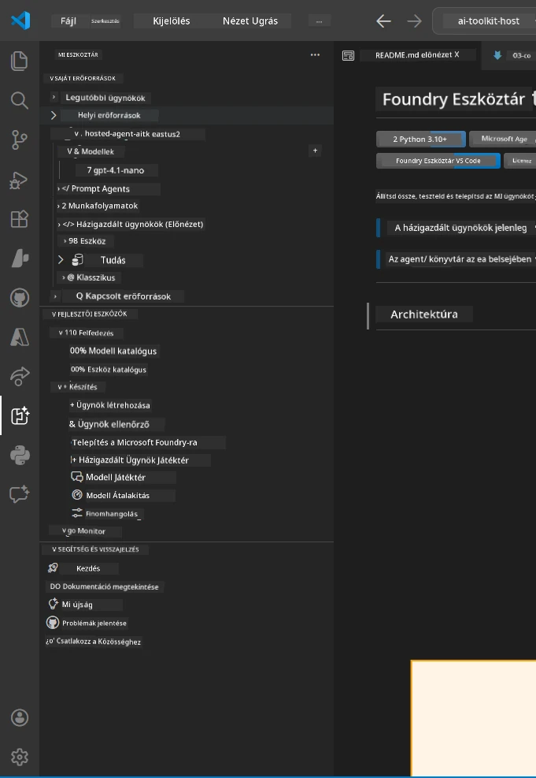
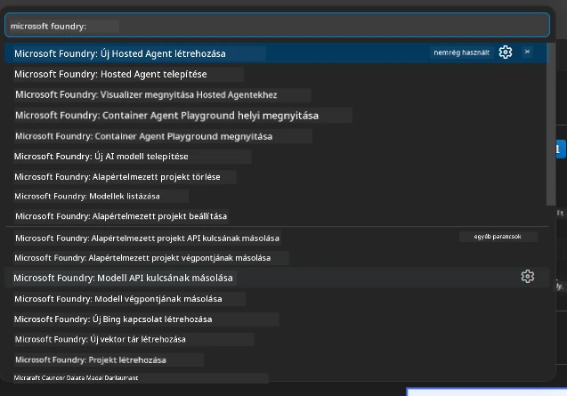

# Modul 1 - Foundry Toolkit és Foundry Bővítmény Telepítése

Ez a modul végigvezet a két kulcsfontosságú VS Code bővítmény telepítésén és ellenőrzésén ehhez a workshophoz. Ha már telepítetted őket a [0. Modul](00-prerequisites.md) során, használd ezt a modult, hogy ellenőrizd, helyesen működnek-e.

---

## 1. lépés: A Microsoft Foundry Bővítmény Telepítése

A **Microsoft Foundry for VS Code** bővítmény a fő eszközöd Foundry projektek létrehozásához, modellek telepítéséhez, hosztolt ügynökök előkészítéséhez és közvetlen telepítéshez a VS Code-ból.

1. Nyisd meg a VS Code-ot.
2. Nyomd meg a `Ctrl+Shift+X` billentyűket az **Extensions** panel megnyitásához.
3. Az ablak tetején lévő keresőmezőbe írd be: **Microsoft Foundry**
4. Keresd meg a következő találatot: **Microsoft Foundry for Visual Studio Code**.
   - Kiadó: **Microsoft**
   - Bővítményazonosító: `TeamsDevApp.vscode-ai-foundry`
5. Kattints a **Install** gombra.
6. Várd meg a telepítés befejeződését (egy kis folyamatjelzőt látsz).
7. A telepítés után nézd meg az **Activity Bar**-t (a bal oldalon lévő függőleges ikon sáv). Meg kell jelennie egy új **Microsoft Foundry** ikonnak (diamant/AI ikonra hasonlít).
8. Kattints a **Microsoft Foundry** ikonra az oldalsáv megnyitásához. Láthatsz szakaszokat:
   - **Resources** (vagy Projects)
   - **Agents**
   - **Models**

> **Ha nem jelenik meg az ikon:** Próbáld meg újratölteni a VS Code-ot (`Ctrl+Shift+P` → `Developer: Reload Window`).

---

## 2. lépés: A Foundry Toolkit Bővítmény Telepítése

A **Foundry Toolkit** bővítmény biztosítja az [**Agent Inspector**](https://learn.microsoft.com/azure/foundry/agents/how-to/vs-code-agents-workflow-pro-code) vizuális felületet az ügynökök helyi teszteléséhez és hibakereséséhez, valamint játszóteret, modellkezelést és értékelő eszközöket.

1. Az Extensions panelen (`Ctrl+Shift+X`) töröld a keresőmezőt, majd írd be: **Foundry Toolkit**
2. Keresd meg a találatok között a **Foundry Toolkit**-et.
   - Kiadó: **Microsoft**
   - Bővítményazonosító: `ms-windows-ai-studio.windows-ai-studio`
3. Kattints a **Install** gombra.
4. A telepítés után megjelenik a **Foundry Toolkit** ikon az Activity Bar-ban (robot/csillogás ikonra hasonlít).
5. Kattints a **Foundry Toolkit** ikonra az oldalsáv megnyitásához. Látnod kell a Foundry Toolkit üdvözlő képernyőjét a következő opciókkal:
   - **Models**
   - **Playground**
   - **Agents**

---

## 3. lépés: Ellenőrizd, hogy mindkét bővítmény működik

### 3.1 A Microsoft Foundry Bővítmény Ellenőrzése

1. Kattints a **Microsoft Foundry** ikonra az Activity Bar-on.
2. Ha be vagy jelentkezve az Azure-ba (a 0. Modul alapján), akkor a projektjeidnek meg kell jelenniük a **Resources** alatt.
3. Ha bejelentkezést kér, kattints a **Sign in** gombra és kövesd az azonosítási lépéseket.
4. Győződj meg róla, hogy hibák nélkül látod az oldalsávot.

### 3.2 A Foundry Toolkit Bővítmény Ellenőrzése

1. Kattints a **Foundry Toolkit** ikonra az Activity Bar-on.
2. Győződj meg róla, hogy az üdvözlő nézet vagy fő panel hibák nélkül töltődik be.
3. Még nem kell semmit konfigurálni – az Agent Inspector-t a [5. Modulban](05-test-locally.md) fogjuk használni.

### 3.3 Ellenőrzés a Parancs Palettán keresztül

1. Nyomd meg a `Ctrl+Shift+P` billentyűket a Parancs Paletta megnyitásához.
2. Írd be: **"Microsoft Foundry"** - látnod kell parancsokat, például:
   - `Microsoft Foundry: Create a New Hosted Agent`
   - `Microsoft Foundry: Deploy Hosted Agent`
   - `Microsoft Foundry: Open Model Catalog`
3. Nyomd meg az `Escape`-t a Parancs Paletta bezárásához.
4. Nyisd meg újra a Parancs Palettát, és írd be: **"Foundry Toolkit"** - látnod kell parancsokat, például:
   - `Foundry Toolkit: Open Agent Inspector`

> Ha nem látod ezeket a parancsokat, lehet, hogy a bővítmények nem települtek helyesen. Próbáld meg eltávolítani majd újratelepíteni őket.

---

## Mit csinálnak ezek a bővítmények a workshopban

| Bővítmény | Mire jó | Mikor fogod használni |
|-----------|---------|----------------------|
| **Microsoft Foundry for VS Code** | Foundry projektek létrehozása, modellek telepítése, **hosztolt ügynökök előkészítése [hosted agents](https://learn.microsoft.com/azure/foundry/agents/concepts/hosted-agents)** (auto-generálja az `agent.yaml`, `main.py`, `Dockerfile`, `requirements.txt` fájlokat), telepítés a [Foundry Agent Service-be](https://learn.microsoft.com/azure/foundry/agents/overview) | 2., 3., 6., 7. modul |
| **Foundry Toolkit** | Agent Inspector helyi teszteléshez/hibakereséshez, játszótér felület, modellkezelés | 5., 7. modul |

> **A Foundry bővítmény a legfontosabb eszköz ebben a workshopban.** Végigvezeti az egész folyamatot: generálás → konfigurálás → telepítés → ellenőrzés. A Foundry Toolkit a helyi teszteléshez nyújt vizuális Agent Inspectort.

---

### Ellenőrző lista

- [ ] A Microsoft Foundry ikon látható az Activity Bar-on
- [ ] Rákattintva megnyílik az oldalsáv hibák nélkül
- [ ] A Foundry Toolkit ikon látható az Activity Bar-on
- [ ] Rákattintva megnyílik az oldalsáv hibák nélkül
- [ ] `Ctrl+Shift+P` → "Microsoft Foundry" beírásával elérhetők a parancsok
- [ ] `Ctrl+Shift+P` → "Foundry Toolkit" beírásával elérhetők a parancsok

---

**Előző:** [00 - Előfeltételek](00-prerequisites.md) · **Következő:** [02 - Foundry Projekt Létrehozása →](02-create-foundry-project.md)

---

<!-- CO-OP TRANSLATOR DISCLAIMER START -->
**Felelősségkizárás**:  
Ez a dokumentum az AI fordító szolgáltatás, a [Co-op Translator](https://github.com/Azure/co-op-translator) segítségével készült. Bár az pontosságra törekszünk, kérjük, vegye figyelembe, hogy az automatikus fordítások tartalmazhatnak hibákat vagy pontatlanságokat. Az eredeti dokumentum a saját nyelvén tekintendő hiteles forrásnak. Kritikus információk esetén szakmai emberi fordítást javasolunk. Nem vállalunk felelősséget a fordítás használatából eredő esetleges félreértésekért vagy félreértelmezésekért.
<!-- CO-OP TRANSLATOR DISCLAIMER END -->