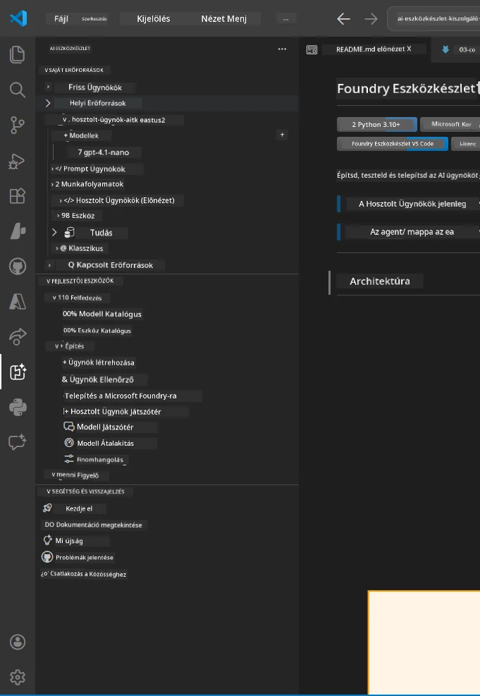
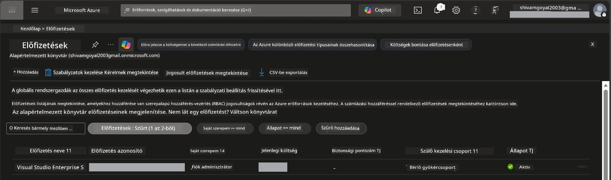
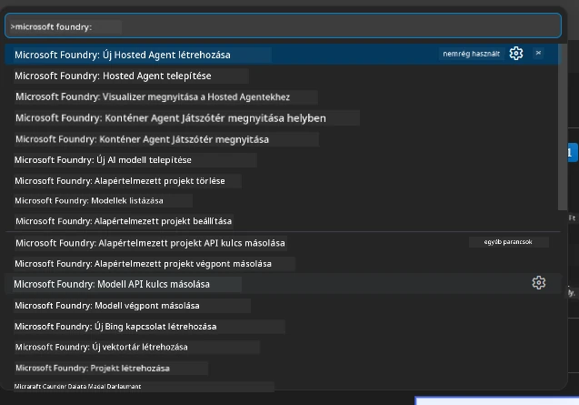
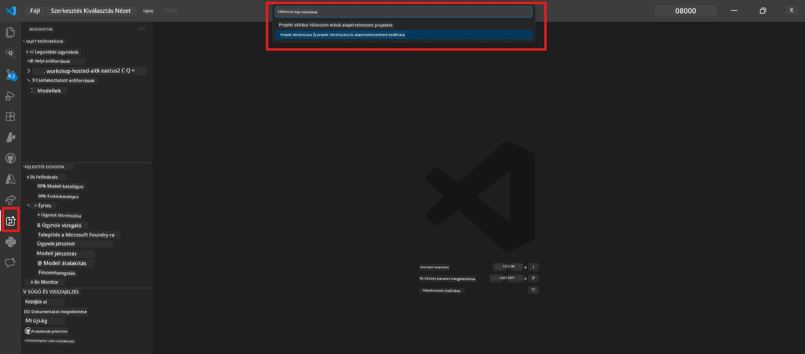
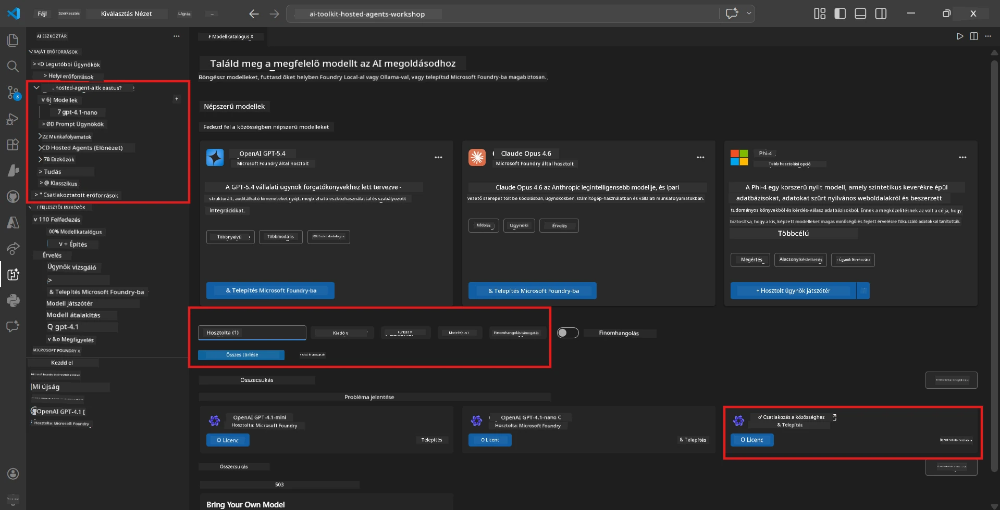
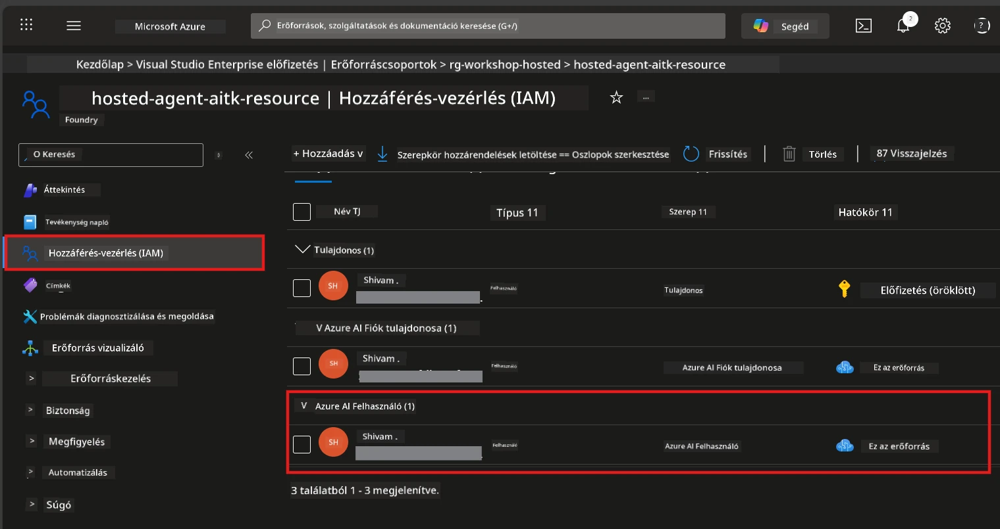

# Beállítás: Bővítmény, Projekt és Modell

⏱️ ~15 perc

Ebben a modulban telepíti és ellenőrzi a Foundry Toolkit bővítményt, létrehoz (vagy csatlakozik) egy Foundry projekthez, és telepít egy modellt, amelyet az ügynöke fog használni.

## 1. lépés: Foundry Toolkit telepítése

A **Foundry Toolkit for VS Code** az elsődleges bővítmény ehhez a műhelyhez. Projekt létrehozást, modell telepítést, ügynök sablonokat, helyi tesztelést (Agent Inspector), és felhőbe történő telepítést biztosít - mindezt a VS Code-on keresztül.

1. Nyissa meg a VS Code-ot, majd nyomja meg a `Ctrl+Shift+X` billentyűket az **Extensions** panel megnyitásához.
2. Keresse meg a **Foundry Toolkit**-et.
3. Telepítse a **Foundry Toolkit for VS Code** (Kiadó: Microsoft, Azonosító: `ms-windows-ai-studio.windows-ai-studio`) bővítményt.
4. A telepítés után a **Foundry Toolkit** ikon megjelenik az Activity Bar-on (bal oldali sáv).

> *Megjegyzés: Régebbi bővítményverziókban az Activity Bar "AI TOOLKIT" szöveget jelenítheti meg. A funkciók ugyanazok.*



## 2. lépés: Beállítás az elérés szerint

> **Válaszd ki az utadat:** Bontsd ki azt a szakaszt, amely megfelel a beállításodnak. Csak **egy** utat kell végigcsinálnod.

<details>
<summary><strong>🅰️ A útvonal - Azure felhő (Azure előfizetés szükséges)</strong></summary>

### Azure CLI

1. Telepítse a [learn.microsoft.com/cli/azure/install-azure-cli](https://learn.microsoft.com/cli/azure/install-azure-cli) oldalról.
2. Ellenőrzés: `az --version` (elvárt 2.80.0+).
3. Jelentkezzen be: `az login`

### Hitelesítési lehetőségek

A [Microsoft Agent Framework](https://learn.microsoft.com/agent-framework/overview/) a [`DefaultAzureCredential`](https://learn.microsoft.com/azure/developer/python/sdk/authentication/credential-chains#defaultazurecredential-overview) metódust használja, ami több hitelesítési módot próbál meg egymás után. Válassza azt, amelyik legjobban illik a környezetéhez:

#### 1. lehetőség: VS Code fiókok (ajánlott műhelyekhez)
1. Kattintson az **Accounts** ikonra (személy sziluett) a VS Code bal alsó sarkában.
2. Válassza a **Sign in to use Microsoft Foundry** (vagy **Sign in with Azure**) lehetőséget.
3. Megnyílik egy böngészőablak – jelentkezzen be az Azure előfizetéshez tartozó fiókkal.
4. Térjen vissza a VS Code-ba. Az alsó bal sarokban látnia kell a fiók nevét.

#### 2. lehetőség: Azure CLI
```bash
az login
az account set --subscription "<your-subscription-id>"
```

#### 3. lehetőség: Szolgáltatási főfelhasználó (vállalati/CI)
Zárt környezetekben vagy CI/CD folyamatokban állítsa be az alábbi környezeti változókat a `.env` fájlban:
```env
AZURE_TENANT_ID=<your-tenant-id>
AZURE_CLIENT_ID=<your-client-id>
AZURE_CLIENT_SECRET=<your-client-secret>
```

> **Hogyan működik a `DefaultAzureCredential`:** Először a környezeti változókat próbálja, majd a kezelt identitást, aztán a VS Code bejelentkezést, majd az Azure CLI-t – és amelyik sikerrel jár először, azt használja. Lásd [hitelesítési lánc dokumentáció](https://learn.microsoft.com/azure/developer/python/sdk/authentication/credential-chains#defaultazurecredential-overview).

### Azure Developer CLI (azd)

1. Telepítés: `winget install microsoft.azd` (Windows) vagy olvassa el a [telepítési útmutatót](https://learn.microsoft.com/azure/developer/azure-developer-cli/install-azd).
2. Ellenőrzés: `azd version`
3. Jelentkezzen be: `azd auth login`

### Docker Desktop (opcionális)

A Docker csak akkor szükséges, ha helyben akar konténereket építeni. A Foundry bővítmény automatikusan kezeli az építéseket a telepítés során.

1. Telepítés a [docs.docker.com/get-docker](https://docs.docker.com/get-docker/) oldalról.
2. Ellenőrzés: `docker info`

### Azure előfizetés és RBAC

1. Jelentkezzen be a [portal.azure.com](https://portal.azure.com) címen.
2. Lépjen a **Subscriptions** részhez, és ellenőrizze, hogy legalább egy előfizetés **Aktív** legyen.
3. Jegyezze fel az **Előfizetés azonosítóját** – szüksége lesz rá a 01-es modulban.



#### RBAC forgatókönyv táblázat

A [Hosted Agent](https://learn.microsoft.com/azure/foundry/agents/concepts/hosted-agents) telepítéséhez olyan **adatműveleti** jogosultságokra van szükség, amelyeket a szokásos Azure `Owner` és `Contributor` szerepkörök **nem** tartalmaznak. Az alábbi táblázat segít meghatározni, hogy mely szerepkörökre van szükség:

| Forgatókönyv | Szükséges szerepkörök | Hol kell hozzárendelni |
|----------|---------------|----------------------|
| Új Foundry projekt létrehozása | **Azure AI Owner** a Foundry erőforráson | Foundry erőforrás az Azure Portálon |
| Telepítés meglévő projekthez (új erőforrások) | **Azure AI Owner** + **Contributor** az előfizetésen | Előfizetés + Foundry erőforrás |
| Teljesen konfigurált projekthez való telepítés | **Reader** a fiókon + **Azure AI User** a projekten | Fiók + Projekt az Azure Portálon |
| Csak helyi tesztelés (nincs telepítés) | **Azure AI User** a projekten | Projekt az Azure Portálon |

> **Fontos:** Az Azure `Owner` és `Contributor` szerepek csak a *kezelési* jogosultságokat (ARM műveletek) fedik le. Az ügynökök létrehozásához és telepítéséhez szükséges *adatműveletekhez* [**Azure AI User**](https://learn.microsoft.com/azure/foundry/concepts/rbac-foundry#built-in-roles) (vagy magasabb) szerepkörre van szükség.

## Csatlakozás vagy új Foundry projekt létrehozása



1. Nyomja meg a `Ctrl+Shift+P` billentyűket → írja be, hogy **Foundry Toolkit: Create Project** → válassza ki.
2. Válassza ki az **Azure előfizetését** a legördülő menüből.
3. Válasszon ki vagy hozzon létre egy **erőforráscsoportot** (pl. `rg-hosted-agents-workshop`).
4. Válasszon olyan **régiót**, amely támogatja a hosted agenteket: `East US`, `West US 2` vagy `Sweden Central`. Lásd [régió elérhetőség](https://learn.microsoft.com/azure/foundry/agents/concepts/hosted-agents#region-availability).
5. Adjon meg egy projekt nevet (pl. `workshop-agents`).
6. Várjon 2–5 percet az előkészítésre. Egy folyamatjelző értesítés jelenik meg a VS Code-ban.
7. Ha kész, a projekt megjelenik a **Foundry Toolkit** oldalsávban a **SAJÁT ERŐFORRÁSOK** alatt.



## Modell telepítése és RBAC hozzárendelése

A hosted agentjének szüksége van egy AI modellre a válaszok generálásához.

#### Modell kiválasztási mátrix
Az igényeitől függően különböző modellszintek közül választhat:

| Modell | Legjobb célra | Költség | Megjegyzések |
|-------|----------|------|-------|
| `gpt-4.1` | Magas minőségű, árnyalt válaszok | Magasabb | Legjobb eredmények, javasolt a végső teszteléshez |
| `gpt-4.1-mini/gpt-5-mini` | Gyors iteráció, alacsonyabb költség | Alacsonyabb | Jó műhelyfejlesztéshez és gyors teszteléshez |
| `gpt-4.1-nano` | Könnyű feladatok | Legalacsonyabb | Legköltséghatékonyabb, egyszerűbb válaszok |

1. Nyomja meg a `Ctrl+Shift+P` → **Foundry Toolkit: Open Model Catalog** (vagy kattintson a **Model Catalog** opcióra az oldalsávban a FEJLESZTŐ ESZKÖZÖK → Felfedezés alatt).
2. Keresés a katalógusban **gpt-4.1** modellek után.
3. Keresse meg az **OpenAI GPT-4.1-mini** (vagy a jobb minőségű `gpt-5-mini`) modellt, és kattintson a **Deploy** gombra.



4. A telepítési konfigurációban:
   - **Telepítés neve:** Hagyja az alapértelmezettet vagy adjon meg egy egyéni nevet. **Jegyezze meg ezt a nevet.**
   - **Cél:** Válassza a **Deploy to Foundry Toolkit** opciót → válassza ki a projektjét.
5. Kattintson a **Deploy** gombra, és várjon 1–3 percet.

> **Ajánlás:** A műhelyhez használja a `gpt-4.1-mini/gpt-5-mini` modelleket - gyors, megfizethető és jó eredményeket produkál.

### Jegyezze fel az értékeit

A telepítés után jegyezze fel az alábbi két értéket (szüksége lesz rájuk a 03-as modulban):

| Érték | Hol találja meg |
|-------|-----------------|
| **Projekt végpont** | Kattintson a projektre az oldalsávban → a részletes nézet megjeleníti az URL-t (pl. `https://<account>.services.ai.azure.com/api/projects/<project>`) |
| **Modell telepítés neve** | Bontsa ki a projektet → **Modellek** → a telepített modell neve (pl. `gpt-4.1-mini/gpt-5-mini`) |

### RBAC szerepkör hozzárendelése

> ⚠️ **Ez a leggyakrabban kihagyott lépés.** A helyes szerepkör nélkül az 05-ös modulban a telepítés meghiúsul.

#### Melyik szerepkörre van szükségem?
Forgatókönyvtől függően a következő szerepkör kombinációkra lehet szükség:

| Forgatókönyv | Szükséges szerepkörök | Hol kell hozzárendelni |
|----------|---------------|----------------------|
| Új Foundry projekt létrehozása | **Azure AI Owner** a Foundry erőforráson | Foundry erőforrás az Azure Portálon |
| Telepítés meglévő projekthez (új erőforrások) | **Azure AI Owner** + **Contributor** az előfizetésen | Előfizetés + Foundry erőforrás |
| Teljesen konfigurált projekthez való telepítés | **Reader** a fiókon + **Azure AI User** a projekten | Fiók + Projekt az Azure Portálon |

**Fontos:** Az Azure `Owner` és `Contributor` szerepek csak a *kezelési* jogosultságokat fedik le. Az ügynökök létrehozásához és telepítéséhez szükséges *adatműveletekhez* az **Azure AI User** (vagy magasabb) szerepkör szükséges.

1. Nyissa meg a [portal.azure.com](https://portal.azure.com) oldalt.
2. Keresse meg a **Foundry projekt** nevét → kattintson a **"Foundry Toolkit project"** típusú találatra (NB: ne a felsőbb szintű fiókra).
3. Kattintson a bal oldali menüben az **Access control (IAM)** opcióra.
4. Kattintson a **+ Hozzáadás** → **Szerepkör hozzárendelés hozzáadása** lehetőségre.
5. **Szerepkör fül:** Keresse meg az **Azure AI User** szerepkört, válassza ki, majd kattintson a **Tovább** gombra.
6. **Tagok fül:** Válassza a **Felhasználó, csoport vagy szolgáltatási főfelhasználó** lehetőséget → kattintson a **+ Tagok kiválasztása** gombra → keresse meg és válassza ki magát → kattintson a **Kiválasztás** gombra.
7. Kattintson az **Áttekintés + hozzárendelés** gombra → ismét kattintson az **Áttekintés + hozzárendelés** gombra.
8. **Várjon 1–2 percet** a változások érvényesüléséhez.

> **Miért erre a szerepre van szükség?** Az Azure `Owner`/`Contributor` csak kezelési jogosultságokat ad. Az **Azure AI User** szerepkör biztosítja az ügynök létrehozásához és telepítéséhez szükséges `agents/write` adat műveleti jogosultságot. Lásd a [Foundry RBAC dokumentációt](https://learn.microsoft.com/azure/foundry/concepts/rbac-foundry#built-in-roles).



</details>

<details>
<summary><strong>🅱️ B útvonal - Helyi / ingyenes szint (nem szükséges Azure előfizetés)</strong></summary>

### Foundry Local

A Foundry Local lehetővé teszi, hogy AI modelleket futtasson a saját gépén – nem szükséges felhőfiók. A Foundry Local modellek elérhetők a Foundry Toolkit-en keresztül, a modell katalógusból az alábbi módon:

1. Menjen a Foundry Toolkit bővítményhez.
2. A Foundry Toolkit navigációban lépjen a **Fejlesztői eszközök** > és válassza a **Modell katalógus** opciót.
3. Az új ablakban válassza ki a navigációs sávon a **helyi (local)** opciót.
4. Görgessen le a **Phi 4 Mini** modellhez, és kattintson a **hozzáadás** gombra; megjelenik egy értesítés, hogy a modell letöltés alatt áll.
5. Amint a modell letöltődött, folytathatja a következő lépéssel.

</details>

### ✅ Ellenőrző pont


- [ ] `Ctrl+Shift+P` → "Foundry Toolkit" megjeleníti a rendelkezésre álló parancsokat
- [ ] Foundry Toolkit bővítmény telepítve és az oldalsáv hiba nélkül betöltődik
- [ ] VS Code megnyílik és megfelelően működik
- [ ] `python --version` 3.10+ verziót mutat
- [ ] Foundry Toolkit ikon látható a VS Code Activity Bar-ban
- [ ] **A út:** `az login` sikeres, előfizetés aktív
- [ ] **B út:** Foundry Local fut (`foundry local status`)
- [ ] **A út:** Foundry projekt látható az oldalsávban, modell telepítve, Azure AI User szerepkör hozzárendelve
- [ ] **B út:** Foundry Local fut egy modellel
- [ ] Feljegyezte a **végpontját** és a **modell telepítés nevét**


**Előző:** [00 - Előfeltételek](00-prerequisites.md) · **Következő:** [02 - Hosted Agent létrehozása →](02-create-hosted-agent.md)

---

<!-- CO-OP TRANSLATOR DISCLAIMER START -->
**Jogi nyilatkozat**:
Ez a dokumentum az AI fordítási szolgáltatás, a [Co-op Translator](https://github.com/Azure/co-op-translator) segítségével készült. Bár az pontosságra törekszünk, kérjük, vegye figyelembe, hogy az automatikus fordítások hibákat vagy pontatlanságokat tartalmazhatnak. Az eredeti dokumentum az anyanyelvén tekintendő hiteles forrásnak. Fontos információk esetén professzionális emberi fordítást javasolunk. Nem vállalunk felelősséget semmilyen félreértésért vagy téves értelmezésért, amely ebből a fordításból ered.
<!-- CO-OP TRANSLATOR DISCLAIMER END -->