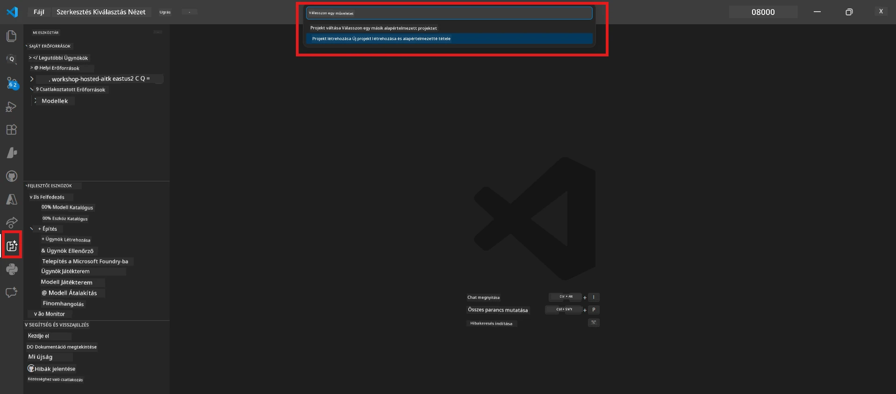
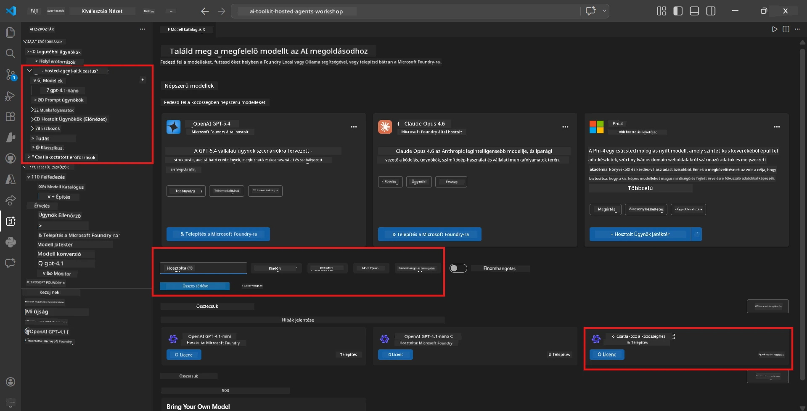
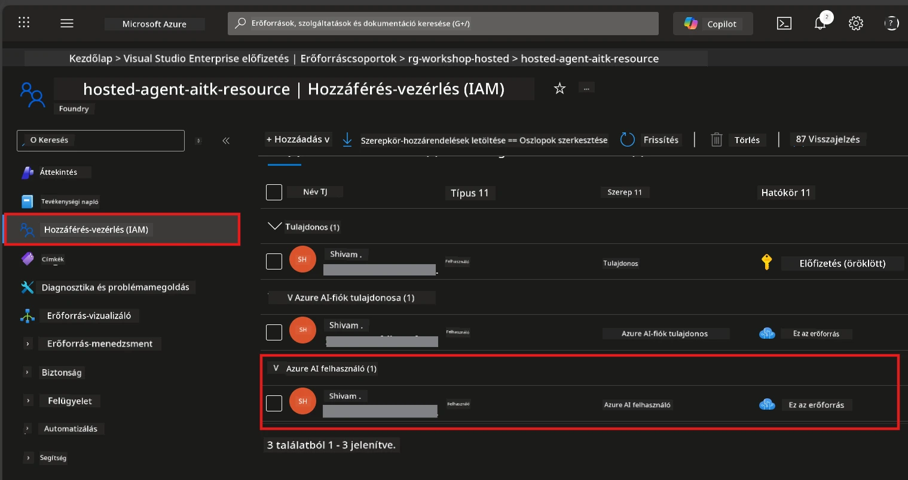

# Modul 2 - Foundry projekt létrehozása és modell telepítése

Ebben a modulban létrehozol (vagy kiválasztasz) egy Microsoft Foundry projektet, és telepítesz egy modellt, amelyet az ügynököd fog használni. Minden lépést részletesen leírtunk – kövesd őket sorrendben.

> Ha már van egy Foundry projekted telepített modellel, ugorj a [3. modulra](03-create-hosted-agent.md).

---

## 1. lépés: Foundry projekt létrehozása VS Code-ból

A Microsoft Foundry bővítményt fogod használni, hogy projektet hozz létre anélkül, hogy elhagynád a VS Code-ot.

1. Nyomd meg a `Ctrl+Shift+P` billentyűket a **Parancs paletta** megnyitásához.
2. Írd be: **Microsoft Foundry: Create Project** és válaszd ki.
3. Egy legördülő menü jelenik meg – válaszd ki az **Azure előfizetésedet** a listából.
4. Kiválasztásra vagy létrehozásra kér a **resource group** (erőforráscsoport) számára:
   - Új létrehozásához: írj be egy nevet (pl. `rg-hosted-agents-workshop`), majd nyomj Entert.
   - Meglévő használatához: válaszd ki a legördülőből.
5. Válassz egy **régiót**. **Fontos:** Olyan régiót válassz, amely támogatja a hosztolt ügynököket. Nézd meg a [régiók rendelkezésre állását](https://learn.microsoft.com/azure/foundry/agents/concepts/hosted-agents#region-availability) – gyakori választások: `East US`, `West US 2` vagy `Sweden Central`.
6. Írj be egy **nevet** a Foundry projekthez (pl. `workshop-agents`).
7. Nyomj Entert, és várd meg, amíg a létrehozás befejeződik.

> **A létrehozás 2-5 percet vesz igénybe.** Egy folyamatjelző értesítést fogsz látni a VS Code jobb alsó sarkában. Ne zárd be a VS Code-ot a létrehozás során.

8. Amikor kész, a **Microsoft Foundry** oldalsávban megjelenik az új projekted a **Resources** alatt.
9. Kattints a projekt nevére a kibontáshoz, és ellenőrizd, hogy látszanak-e a **Models + endpoints** és az **Agents** szekciók.



### Alternatív megoldás: Foundry portálon keresztül

Ha inkább böngészőben szeretnél dolgozni:

1. Nyisd meg a [https://ai.azure.com](https://ai.azure.com) oldalt, és jelentkezz be.
2. Kattints a főoldalon a **Create project** gombra.
3. Add meg a projekt nevét, válaszd ki az előfizetésedet, az erőforráscsoportot és a régiót.
4. Kattints a **Create** gombra, és várd meg a létrehozás befejeződését.
5. Amint kész, térj vissza a VS Code-ba – a projektnek meg kell jelennie a Foundry oldalsávban frissítés után (kattints a frissítés ikonra).

---

## 2. lépés: Modell telepítése

A [hosztolt ügynököd](https://learn.microsoft.com/azure/foundry/agents/concepts/hosted-agents) egy Azure OpenAI modellre van szüksége a válaszok generálásához. Most [telepítesz egyet](https://learn.microsoft.com/azure/ai-foundry/openai/how-to/create-resource#deploy-a-model).

1. Nyomd meg a `Ctrl+Shift+P` billentyűket a **Parancs paletta** megnyitásához.
2. Írd be: **Microsoft Foundry: Open [Model Catalog](https://learn.microsoft.com/azure/ai-foundry/openai/concepts/models)** és válaszd ki.
3. Megnyílik a Modell katalógus nézet a VS Code-ban. Böngészd vagy használd a keresősávot, és keresd meg a **gpt-4.1** modellt.
4. Kattints a **gpt-4.1** modell kártyájára (vagy `gpt-4.1-mini` ha alacsonyabb költséget szeretnél).
5. Kattints a **Deploy** gombra.


6. A telepítési beállításoknál:
   - **Deployment name**: Hagyd az alapértelmezettet (pl. `gpt-4.1`) vagy adj meg egy egyedi nevet. **Ezt a nevet jegyezd meg** – szükséged lesz rá a 4. modulban.
   - **Target**: Válaszd a **Deploy to Microsoft Foundry** lehetőséget, és válaszd ki az előzőleg létrehozott projektedet.
7. Kattints a **Deploy** gombra, és várd meg a telepítés befejeződését (1-3 perc).

### Modell kiválasztása

| Modell          | Legjobb erre                  | Költség | Megjegyzés                                     |
|-----------------|------------------------------|---------|------------------------------------------------|
| `gpt-4.1`       | Magas minőségű, részletes válaszok | Magasabb | Legjobb eredmények, ajánlott végső teszteléshez |
| `gpt-4.1-mini`  | Gyors iteráció, alacsonyabb költség | Alacsonyabb | Jó a műhelyi fejlesztéshez és gyors tesztekhez |
| `gpt-4.1-nano`  | Könnyű feladatok             | Legalacsonyabb | Legköltséghatékonyabb, de egyszerűbb válaszokat ad |

> **Ajánlás erre a műhelyre:** Használd a `gpt-4.1-mini` modellt fejlesztéshez és teszteléshez. Gyors, olcsó, és jó eredményeket ad a gyakorlatokhoz.

### Ellenőrizd a modell telepítését

1. A **Microsoft Foundry** oldalsávban bontsd ki a projekted.
2. Nézd meg a **Models + endpoints** (vagy hasonló) szekciót.
3. Meg kell jelennie a telepített modellnek (pl. `gpt-4.1-mini`) **Succeeded** vagy **Active** státusszal.
4. Kattints a modell telepítésére, hogy megnézd a részleteket.
5. **Jegyezd fel** az alábbi két értéket, mert szükséged lesz rájuk a 4. modulban:

   | Beállítás            | Hol találod               | Példaérték                                                 |
   |----------------------|--------------------------|------------------------------------------------------------|
   | **Projekt végpont (endpoint)** | A projekt nevére kattintva a Foundry oldalsávban, a részletek között látható a végpont URL | `https://<account>.services.ai.azure.com/api/projects/<project>` |
   | **Modell telepítés neve**      | A telepített modell neve mellett látható                         | `gpt-4.1-mini`                                             |

---

## 3. lépés: Szükséges RBAC szerepkörök hozzárendelése

Ez a **leggyakrabban kihagyott lépés**. A megfelelő szerepkörök nélkül a 6. modulban a telepítés hibával lesz eredményes a jogosultságok miatt.

### 3.1 Azure AI User szerepkör hozzárendelése magadnak

1. Nyiss meg egy böngészőt, és menj a [https://portal.azure.com](https://portal.azure.com) oldalra.
2. A felső keresőmezőbe írd be a **Foundry projekt** nevét, és kattints rá az eredmények között.
   - **Fontos:** A **projekt** erőforrásra navigálj (típus: "Microsoft Foundry project"), **ne** a szülő fiók/ügyfél erőforrásra.
3. A projekt bal oldali menüjében kattints az **Access control (IAM)** menüpontra.
4. Kattints a tetején a **+ Add** gombra → válaszd az **Add role assignment** lehetőséget.
5. A **Role** fülön keress rá az [**Azure AI User**](https://learn.microsoft.com/azure/foundry/concepts/rbac-foundry#built-in-roles) szerepkörre, és válaszd ki. Kattints a **Next** gombra.
6. A **Members** fülön:
   - Válaszd a **User, group, or service principal** lehetőséget.
   - Kattints a **+ Select members** gombra.
   - Keresd meg a neved vagy email címed, válaszd ki magad, majd kattints a **Select** gombra.
7. Kattints a **Review + assign** gombra → ismét kattints a **Review + assign** gombra a megerősítéshez.



### 3.2 (Opcionális) Azure AI Developer szerepkör hozzárendelése

Ha szükséged van további erőforrások létrehozására a projekten belül vagy programozott telepítések kezelésére:

1. Ismételd meg a fenti lépéseket, de az 5. pontban válaszd az **Azure AI Developer** szerepkört.
2. Ezt a hozzárendelést a **Foundry erőforrás (fiók)** szinten, nem csak projekt szinten add meg.

### 3.3 Ellenőrizd a szerepkör hozzárendeléseidet

1. A projekt **Access control (IAM)** oldalán kattints a **Role assignments** fülre.
2. Keresd meg a nevedet.
3. Legalább az **Azure AI User** szerepkört kell látnod a projekt szintű hatókörben.

> **Miért fontos ez:** Az [`Azure AI User`](https://learn.microsoft.com/azure/foundry/concepts/rbac-foundry#built-in-roles) szerepkör biztosítja a `Microsoft.CognitiveServices/accounts/AIServices/agents/write` adatművelethez való hozzáférést. Enélkül a telepítés során a következő hiba fog megjelenni:
>
> ```
> Error: lacks the required data action 
> Microsoft.CognitiveServices/accounts/AIServices/agents/write 
> to perform POST /api/projects/{projectName}/assistants operation.
> ```
>
> Részletekhez lásd a [8. modul - Hibakeresés](08-troubleshooting.md) részt.

---

### Ellenőrző pont

- [ ] A Foundry projekt létezik és látható a Microsoft Foundry oldalsávban a VS Code-ban
- [ ] Legalább egy modell telepítve van (pl. `gpt-4.1-mini`) **Succeeded** státusszal
- [ ] Feljegyezted a **projekt végpont** URL-t és a **modell telepítés nevét**
- [ ] Megkaptad az **Azure AI User** szerepkört a **projekt** szinten (ellenőrizd az Azure Portal → IAM → Szerepkör hozzárendelések alatt)
- [ ] A projekt olyan [támogatott régióban](https://learn.microsoft.com/azure/foundry/agents/concepts/hosted-agents#region-availability) van, amely hosztolt ügynököket támogat

---

**Előző:** [01 - Foundry eszközkészlet telepítése](01-install-foundry-toolkit.md) · **Következő:** [03 - Hosztolt ügynök létrehozása →](03-create-hosted-agent.md)

---

<!-- CO-OP TRANSLATOR DISCLAIMER START -->
**Nyilatkozat**:  
Ez a dokumentum az AI fordító szolgáltatás [Co-op Translator](https://github.com/Azure/co-op-translator) segítségével készült. Bár a pontosságra törekszünk, kérjük, vegye figyelembe, hogy az automatikus fordítások hibákat vagy pontatlanságokat tartalmazhatnak. Az eredeti dokumentum az anyanyelvén tekintendő hiteles forrásnak. Kritikus információk esetén szakmai emberi fordítást javaslunk. Nem vállalunk felelősséget a fordítás használatából eredő félreértésekért vagy félreértelmezésekért.
<!-- CO-OP TRANSLATOR DISCLAIMER END -->