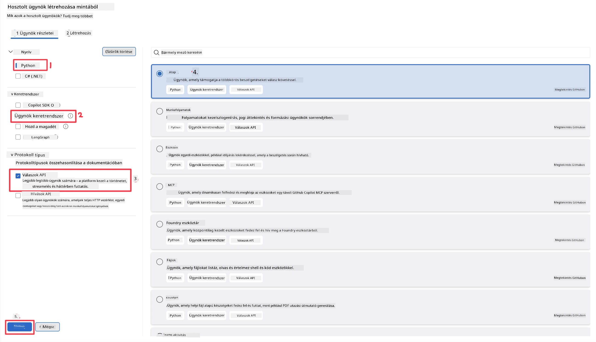
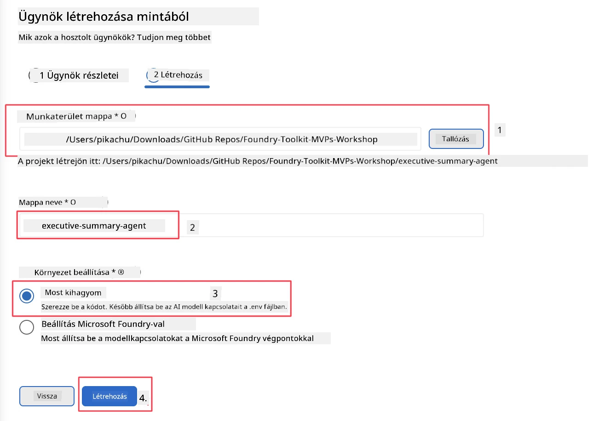

# 2. modul - Új hosztolt ügynök létrehozása

⏱️ ~5 perc

Ebben a modulban a Foundry Toolkit-et használod, hogy **hosztolt ügynök projektet létrehozz**. A sablon legenerálja a teljes projekt struktúrát - `agent.yaml`, `main.py`, `Dockerfile`, `requirements.txt` és VS Code hibakeresési beállítások - így te az ügynök viselkedésének testreszabására koncentrálhatsz.

> **Kulcsfogalom:** Az ebben a laborban található `agent/` mappa egy példa arra, amit a Foundry Toolkit generál. Ezeket a fájlokat nem neked kell a nulláról megírnod.

### Sablonkészítő varázsló folyamata

```mermaid
flowchart LR
    A["Command Palette:
    Create new Hosted Agent"] --> B["Language:
    Python"]
    B --> C["API type:
    Response API"]
    C --> D["Template:
    Basic - Agent Framework"]
    D --> E["Modell kiválasztása"]
    E --> F["Workspace folder
    & agent name"]
    F --> G["Létrehozott projekt"]

    style A fill:#4A90D9,color:#fff
    style B fill:#7B68EE,color:#fff
    style C fill:#7B68EE,color:#fff
    style D fill:#7B68EE,color:#fff
    style E fill:#7B68EE,color:#fff
    style F fill:#7B68EE,color:#fff
    style G fill:#27AE60,color:#fff
```



---

## 1. lépés: Nyisd meg a Create Hosted Agent varázslót

1. Nyomd meg a `Ctrl+Shift+P` billentyűket a **Parancspaletta** megnyitásához.
2. Írd be: **Foundry Toolkit: Create new Hosted Agent** és válaszd ki.

> **Alternatíva: Létrehozás a Foundry Portálon keresztül**
> Ha inkább a böngészőt használod, létrehozhatod projekted a [https://ai.azure.com](https://ai.azure.com) címen. Miután a projekt létrejött, térj vissza a VS Code-ba és használd a **Foundry Toolkit** oldalsávját, hogy kapcsolódj hozzá.

> **Alternatíva:** Kattints a **+** ikonra a **Hosted Agents (Preview)** mellett a Foundry Toolkit oldalsávban.

## 2. lépés: Válaszd ki a beállításokat



1. A bal oldali navigációs/opciós részen válaszd ki a következőket:

| Menü | Kiválasztás | Megjegyzések |
|--------|-----------|-------|
| **Nyelv** | Python | támogatott a C# is |
| **Keretrendszer** | Agent Framework | Egyszerű kiindulópont az Agent Framework SDK használatával |
| **API típus** | Response API | `POST /responses` - beszélgetős, platform által kezelt előzményekkel |
| **Sablon** | Basic | Egyszerű kiindulópont az Agent Framework SDK használatával |

2. Ha kiválasztottad, kattints a **Next** gombra



3. A következő ablakban válaszd ki a következőket:

| Menü | Kiválasztás | Megjegyzések |
|--------|-----------|-------|
| **Munkaterület mappa** | Válassz ki egy célmappát | pl. `/workspace/Foundry_Toolkit_for_VSCode_Lab/` vagy egy almappát ebben a repo-ban |
| **Ügynök neve** | Írj be egy nevet | pl. `executive-summary-agent` |
| **Környezet beállítása** | hagyd ki most a beállítást |  |

Kattints a **create** gombra az ügynök létrehozásához. Egy új mappa jön létre a hosztolt ügynök nevével.

## 3. lépés: Ellenőrizd a generált projektet

A sablonkészítés befejezése után ellenőrizd, hogy látod-e ezeket a fájlokat a Felfedezőben (`Ctrl+Shift+E`):

```
📂 my-agent/
├── .env                ← Environment variables (placeholders)
├── .vscode/
│   ├── launch.json     ← Debug config (F5 → run + Agent Inspector)
│   └── tasks.json      ← VS Code task definitions
├── agent.yaml          ← Agent definition (kind: hosted)
├── Dockerfile          ← Container config for deployment
├── main.py             ← Agent entry point (your main code)
└── requirements.txt    ← Python dependencies
```

### Fontos fájlok magyarázata

| Fájl | Célja |
|------|---------|
| `agent.yaml` | Meghatározza az ügynököt mint `kind: hosted`, leképezi a környezeti változókat, definiálja a `/responses` protokollt |
| `main.py` | Létrehoz egy `FoundryChatClient`-et → becsomagolja egy `Agent`-be utasításokkal → szolgáltatja a `ResponsesHostServer`-en keresztül a 8088-as porton |
| `Dockerfile` | A `python:3.12-slim`-et használja, telepíti a függőségeket, megnyitja a 8088-as portot, futtatja a `main.py`-t |
| `requirements.txt` | `agent-framework-foundry`, `agent-framework-foundry-hosting`, `mcp`, `debugpy` |

> **Fontos:** Nyisd meg a sablon által létrehozott ügynök mappát közvetlenül a VS Code-ban (magát az `agent/` mappát), hogy a `.vscode/launch.json` és `tasks.json` helyesen működjön az F5 hibakereséshez.

---

### ✅ Ellenőrző pont

- [ ] A sablonkészített projekt létrejött az összes várt fájllal
- [ ] Az `agent.yaml` mutatja a `kind: hosted` és `protocol: responses` értékeket
- [ ] A `main.py` importálja az `Agent`, `FoundryChatClient`, `ResponsesHostServer`-t
- [ ] Az ügynök mappa meg van nyitva VS Code-ban munkaterület gyökérként

---

**Előző:** [01 - Beállítás](01-setup.md) · **Következő:** [03 - Konfigurálás és kódolás →](03-configure-and-code.md)

---

<!-- CO-OP TRANSLATOR DISCLAIMER START -->
**Jogi nyilatkozat**:
Ez a dokumentum az AI fordítási szolgáltatás, a [Co-op Translator](https://github.com/Azure/co-op-translator) segítségével készült. Bár az pontosságra törekszünk, kérjük, vegye figyelembe, hogy az automatikus fordítások hibákat vagy pontatlanságokat tartalmazhatnak. Az eredeti dokumentum az anyanyelvén tekintendő hiteles forrásnak. Fontos információk esetén professzionális emberi fordítást javasolunk. Nem vállalunk felelősséget semmilyen félreértésért vagy téves értelmezésért, amely ebből a fordításból ered.
<!-- CO-OP TRANSLATOR DISCLAIMER END -->