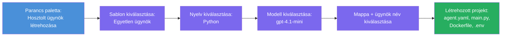

# Modul 3 - Új hosztolt ügynök létrehozása (Automatikusan generálva a Foundry bővítmény által)

Ebben a modulban a Microsoft Foundry bővítmény segítségével **létrehozol egy új [hosztolt ügynök](https://learn.microsoft.com/azure/foundry/agents/concepts/hosted-agents) projektet**. A bővítmény automatikusan generálja az egész projekt struktúráját - beleértve az `agent.yaml`, `main.py`, `Dockerfile`, `requirements.txt`, egy `.env` fájlt és egy VS Code hibakereső konfigurációt. A generálás után testre szabod ezeket a fájlokat az ügynököd utasításaival, eszközeivel és konfigurációjával.

> **Kulcsfogalom:** Az ebben a laborban található `agent/` mappa példa arra, hogy mit generál a Foundry bővítmény, amikor lefuttatod ezt a generáló parancsot. Ezeket a fájlokat nem neked kell kézzel írni - a bővítmény hozza létre, majd te módosítod őket.

### Generáló varázsló lépései


---

## 1. lépés: Nyisd meg az Új Hosztolt Ügynök létrehozás varázslót

1. Nyomd meg a `Ctrl+Shift+P` billentyűkombinációt a **Parancs paletta** megnyitásához.
2. Írd be: **Microsoft Foundry: Create a New Hosted Agent**, majd válaszd ki.
3. Megnyílik a hosztolt ügynök létrehozó varázsló.

> **Alternatív út:** A Microsoft Foundry oldalsávból is elérheted ezt a varázslót → kattints az **Agents** mellett a **+** ikonra vagy jobbklikk és válaszd a **Create New Hosted Agent** menüpontot.

---

## 2. lépés: Válaszd ki a sablont

A varázsló kér, hogy válassz sablont. Ilyen opciók közül választhatsz:

| Sablon | Leírás | Mikor használd |
|--------|--------|---------------|
| **Egyszerű Ügynök** | Egy ügynök saját modellel, utasításokkal és opcionális eszközökkel | Ez a workshop (1-es labor) |
| **Többügynökös Munkafolyamat** | Több ügynök, amelyek egymás után együttműködnek | 2-es labor |

1. Válaszd az **Egyszerű Ügynök** opciót.
2. Kattints a **Tovább** gombra (vagy automatikusan tovább lép a választás).

---

## 3. lépés: Válaszd ki a programozási nyelvet

1. Válaszd a **Python** nyelvet (ez ajánlott ehhez a workshophoz).
2. Kattints a **Tovább** gombra.

> **A C# is támogatott**, ha inkább .NET-et használsz. A generált struktúra hasonló (a `main.py` helyett `Program.cs`-t használ).

---

## 4. lépés: Válaszd ki a modellt

1. A varázsló megmutatja azokat a modelleket, amelyeket a Foundry projektedben telepítettél (2-es modul alapján).
2. Válaszd ki a telepített modellt - pl. **gpt-4.1-mini**.
3. Kattints a **Tovább** gombra.

> Ha nem látsz modelleket, menj vissza a [2-es modulhoz](02-create-foundry-project.md) és telepíts egyet először.

---

## 5. lépés: Válaszd ki a mappa helyét és az ügynök nevét

1. Megnyílik egy fájlkiválasztó ablak – válassz egy **célmappát**, ahová létrejön a projekt. Ehhez a workshophoz:
   - Ha frissen kezded: válassz bármely mappát (pl. `C:\Projects\my-agent`)
   - Ha a workshop repozitóriumban dolgozol: hozz létre egy új almappát a `workshop/lab01-single-agent/agent/` alatt
2. Írd be az új hosztolt ügynök **nevét** (pl. `executive-summary-agent` vagy `my-first-agent`).
3. Kattints a **Létrehozás** gombra (vagy nyomd meg az Entert).

---

## 6. lépés: Várd meg, míg a generálás befejeződik

1. A VS Code megnyit egy **új ablakot** az generált projekttel.
2. Várj néhány másodpercet, míg a projekt teljesen betöltődik.
3. Az Explorer panelen (`Ctrl+Shift+E`) látnod kell a következő fájlokat:

```
📂 my-first-agent/
├── .env                ← Environment variables (auto-generated with placeholders)
├── .vscode/
│   └── launch.json     ← Debug configuration (F5 to run + Agent Inspector)
├── agent.yaml          ← Agent definition (kind: hosted)
├── Dockerfile          ← Container configuration for deployment
├── main.py             ← Agent entry point (your main code file)
└── requirements.txt    ← Python dependencies
```

> **Ez ugyanaz a szerkezet, mint az ebben a laborban lévő `agent/` mappa.** A Foundry bővítmény automatikusan generálja ezeket a fájlokat - neked nem kell manuálisan létrehoznod őket.

> **Workshop megjegyzés:** Ebben a workshop repozitóriumban a `.vscode/` mappa a **munkatér gyökérkönyvtárában** van (nem minden projektben külön). Ez tartalmaz egy közös `launch.json` és `tasks.json` fájlt két hibakeresési konfigurációval - **"Lab01 - Single Agent"** és **"Lab02 - Multi-Agent"** -, amelyek mindegyike a megfelelő labor aktuális munkakönyvtárára mutat. Amikor megnyomod az F5-öt, válaszd ki a legördülő menüből annak a labornak a konfigurációját, amelyen dolgozol.

---

## 7. lépés: Ismerd meg az egyes generált fájlokat

Szánj egy percet, hogy átnézd mindegyik fájlt, amit a varázsló létrehozott. Megértésük fontos a 4-es modulhoz (testreszabás).

### 7.1 `agent.yaml` – Ügynök definíció

Nyisd meg az `agent.yaml` fájlt. Így néz ki:

```yaml
# yaml-language-server: $schema=https://raw.githubusercontent.com/microsoft/AgentSchema/refs/heads/main/schemas/v1.0/ContainerAgent.yaml

kind: hosted
name: my-first-agent
description: >
  A hosted agent deployed to Microsoft Foundry Agent Service.
metadata:
  authors:
    - Microsoft
  tags:
    - Azure AI AgentServer
    - Microsoft Agent Framework
    - Hosted Agent
protocols:
  - protocol: responses
    version: v1
environment_variables:
  - name: AZURE_AI_PROJECT_ENDPOINT
    value: ${PROJECT_ENDPOINT}
  - name: AZURE_AI_MODEL_DEPLOYMENT_NAME
    value: ${MODEL_DEPLOYMENT_NAME}
dockerfile_path: Dockerfile
resources:
  cpu: '0.25'
  memory: 0.5Gi
```

**Főbb mezők:**

| Mező | Cél |
|-------|-----|
| `kind: hosted` | Meghatározza, hogy ez egy hosztolt ügynök (konténer alapú, a [Foundry Agent Service](https://learn.microsoft.com/azure/foundry/agents/overview) szolgáltatásba telepítve) |
| `protocols: responses v1` | Az ügynök egy OpenAI kompatibilis `/responses` HTTP végpontot tesz elérhetővé |
| `environment_variables` | Leképezi a `.env` értékeit a konténer környezeti változóihoz telepítéskor |
| `dockerfile_path` | Megadja, hogy melyik Dockerfile-t használja a konténer képének építéséhez |
| `resources` | CPU és memória allokáció a konténer számára (0.25 CPU, 0.5Gi memória) |

### 7.2 `main.py` – Az ügynök belépési pontja

Nyisd meg a `main.py`-t. Ez a fő Python fájl, ahol az ügynök logikája él. Az automatikusan generált fájl tartalmazza:

```python
from agent_framework.azure import AzureAIAgentClient
from azure.ai.agentserver.agentframework import from_agent_framework
from azure.identity.aio import DefaultAzureCredential
```

**Fontos importok:**

| Import | Cél |
|--------|-----|
| `AzureAIAgentClient` | Csatlakozik a Foundry projekthez, és létrehozza az ügynököket `.as_agent()` metódussal |
| [`DefaultAzureCredential`](https://learn.microsoft.com/azure/developer/python/sdk/authentication/credential-chains#defaultazurecredential-overview) | Azonosítást kezel (Azure CLI, VS Code bejelentkezés, felügyelt identitás vagy szolgáltatásfiók) |
| `from_agent_framework` | HTTP szerverré csomagolja az ügynököt, amely elérhetővé teszi a `/responses` végpontot |

A fő folyamat:
1. Hitelesítési adat létrehozása → ügyfél létrehozása → `.as_agent()` hívás egy ügynök létrehozásához (aszinron kontextuskezelő) → szerverként csomagolás → futtatás

### 7.3 `Dockerfile` – Konténer kép

```dockerfile
FROM python:3.14-slim

WORKDIR /app

COPY ./ .

RUN pip install --upgrade pip && \
    if [ -f requirements.txt ]; then \
        pip install -r requirements.txt; \
    else \
        echo "No requirements.txt found" >&2; exit 1; \
    fi

EXPOSE 8088

CMD ["python", "main.py"]
```

**Fontos részletek:**
- Az alap kép `python:3.14-slim`.
- Az összes projektfájl átmásolása az `/app` könyvtárba.
- `pip` frissítése, a `requirements.txt`-ben lévő függőségek telepítése, és azonnali hiba, ha a fájl hiányzik.
- **Kiszolgálja a 8088-as portot** – ez a hosztolt ügynököknél kötelező port. Ne változtasd meg.
- Az ügynököt a `python main.py` paranccsal indítja.

### 7.4 `requirements.txt` – Függőségek

```
agent-framework-azure-ai==1.0.0rc3
agent-framework-core==1.0.0rc3
azure-ai-agentserver-agentframework==1.0.0b16
azure-ai-agentserver-core==1.0.0b16
debugpy
agent-dev-cli
```

| Csomag | Cél |
|---------|-----|
| `agent-framework-azure-ai` | Azure AI integráció a Microsoft Agent Frameworkhöz |
| `agent-framework-core` | Alap runtime ügynökök építéséhez (tartalmazza a `python-dotenv` csomagot) |
| `azure-ai-agentserver-agentframework` | Hosztolt ügynök szerver runtime a Foundry Agent Service-hez |
| `azure-ai-agentserver-core` | Alapvető ügynökszerver absztrakciók |
| `debugpy` | Python hibakeresési támogatás (engedi az F5 hibakeresést VS Code-ban) |
| `agent-dev-cli` | Helyi fejlesztői CLI ügynökök teszteléséhez (a debug/futtatás konfiguráció használja) |

---

## Az ügynök protokoll megértése

A hosztolt ügynökök az **OpenAI Responses API** protokollon kommunikálnak. Futtatás közben (helyi gépen vagy felhőben) az ügynök egyetlen HTTP végpontot szolgál ki:

```
POST http://localhost:8088/responses
Content-Type: application/json

{
  "input": "Your prompt here",
  "stream": false
}
```

A Foundry Agent Service ezt a végpontot hívja meg, hogy felhasználói kéréseket küldjön és válaszokat kapjon az ügynöktől. Ez ugyanaz a protokoll, amelyet az OpenAI API használ, így az ügynök bármilyen olyan klienssel kompatibilis, amely az OpenAI Responses formátumot támogatja.

---

### Ellenőrző pont

- [ ] A generáló varázsló sikeresen lefutott és megnyílt egy **új VS Code ablak**
- [ ] Látod az összes 5 fájlt: `agent.yaml`, `main.py`, `Dockerfile`, `requirements.txt`, `.env`
- [ ] A `.vscode/launch.json` fájl létezik (engedélyezi az F5 hibakeresést - ebben a workshopban a munkatér gyökérben van, laborhoz kötött konfigurációkkal)
- [ ] Átolvastad mindegyik fájlt és érted a céljukat
- [ ] Érted, hogy a 8088-as port kötelező, és a `/responses` végpont a használt protokoll

---

**Előző:** [02 - Foundry projekt létrehozása](02-create-foundry-project.md) · **Következő:** [04 - Konfiguráció és kód →](04-configure-and-code.md)

---

<!-- CO-OP TRANSLATOR DISCLAIMER START -->
**Jogi nyilatkozat**:  
Ez a dokumentum az AI fordítási szolgáltatás, a [Co-op Translator](https://github.com/Azure/co-op-translator) segítségével készült. Bár törekszünk a pontosságra, kérjük, vegye figyelembe, hogy az automatikus fordítások tartalmazhatnak hibákat vagy pontatlanságokat. Az eredeti, anyanyelvű dokumentum tekintendő a hiteles forrásnak. Kritikus információk esetén szakmai, emberi fordítást javaslunk. Nem vállalunk felelősséget semmilyen félreértésért vagy téves értelmezésért, amely a fordítás használatából ered.
<!-- CO-OP TRANSLATOR DISCLAIMER END -->