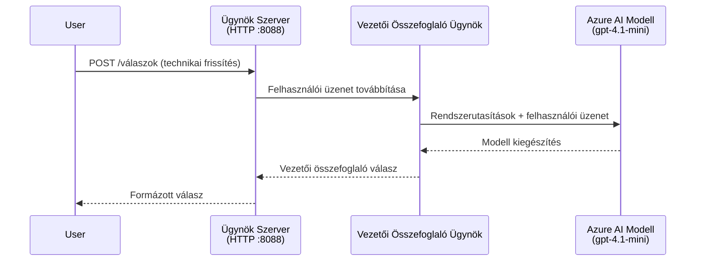
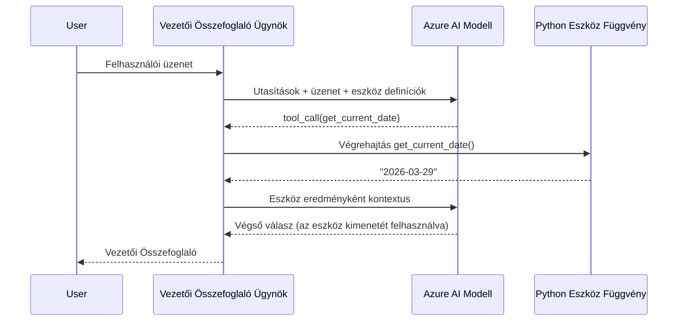

# 4. modul – Utasítások konfigurálása, környezet beállítása és függőségek telepítése

Ebben a modulban testreszabod a 3. modulból automatikusan generált agent fájlokat. Itt alakítod át az általános vázat **a te** agenteddé – utasításokat írsz, környezeti változókat állítasz be, opcionálisan eszközöket adsz hozzá, és telepíted a szükséges függőségeket.

> **Emlékeztető:** A Foundry kiterjesztés automatikusan generálta a projektfájlokat. Most te módosítod őket. Teljes, működő példát lásd az [`agent/`](../../../../../workshop/lab01-single-agent/agent) mappában egy testreszabott agentről.

---

## Hogyan illeszkednek össze az összetevők

### Kérés életciklusa (egyetlen agent)


> **Eszközökkel:** Ha az agentez eszközök vannak regisztrálva, a modell eszközhívást adhat vissza közvetlen befejezés helyett. A keretrendszer helyben végrehajtja az eszközt, az eredményt visszaküldi a modellnek, amely ezt követően előállítja a végleges választ.


---

## 1. lépés: Környezeti változók beállítása

A váz egy `.env` fájlt hozott létre helykitöltő értékekkel. Ki kell töltened a valós értékekkel a 2. modulból.

1. Nyisd meg a vázolt projektben a **`.env`** fájlt (a projekt gyökerében található).
2. Cseréld le a helykitöltő értékeket a tényleges Foundry projektadataiddal:

   ```env
   PROJECT_ENDPOINT=https://<your-account>.services.ai.azure.com/api/projects/<your-project>
   MODEL_DEPLOYMENT_NAME=gpt-4.1-mini
   ```

3. Mentsd el a fájlt.

### Hol találhatod meg ezeket az értékeket

| Érték | Hol található |
|-------|---------------|
| **Projekt végpont** | Nyisd meg a **Microsoft Foundry** oldalsávot a VS Code-ban → kattints a projektedre → a végpont URL-je megjelenik a részletező nézetben. Ilyen formátumú: `https://<account-name>.services.ai.azure.com/api/projects/<project-name>` |
| **Modell telepítés neve** | A Foundry oldalsávban bontsd ki a projekted → keresd a **Models + endpoints** részt → a név a telepített modell mellett látható (pl. `gpt-4.1-mini`) |

> **Biztonság:** Soha ne tedd be a `.env` fájlt verziókezelésbe. Alapból benne van a `.gitignore`-ban. Ha nem, add hozzá:
> ```
> .env
> ```

### Hogyan áramlanak a környezeti változók

A leképezési lánc: `.env` → `main.py` (az `os.getenv` segítségével olvassa) → `agent.yaml` (ezzel a konténer környezeti változóihoz kötődik telepítéskor).

A `main.py`-ben a váz így olvassa be az értékeket:

```python
PROJECT_ENDPOINT = os.getenv("AZURE_AI_PROJECT_ENDPOINT") or os.getenv("PROJECT_ENDPOINT")
MODEL_DEPLOYMENT_NAME = os.getenv("AZURE_AI_MODEL_DEPLOYMENT_NAME", os.getenv("MODEL_DEPLOYMENT_NAME", "gpt-4.1-mini"))
```

Mindkét `AZURE_AI_PROJECT_ENDPOINT` és `PROJECT_ENDPOINT` formátum elfogadott (az `agent.yaml` az `AZURE_AI_*` előtagot használja).

---

## 2. lépés: Agent utasítások írása

Ez a legfontosabb testreszabási lépés. Az utasítások határozzák meg az agent személyiségét, viselkedését, kimeneti formátumát és biztonsági korlátait.

1. Nyisd meg a `main.py`-t a projektedben.
2. Keresd meg az utasítások karaktersorozatát (a váz tartalmaz egy alapértelmezett/generikus utasítást).
3. Cseréld le részletes, strukturált utasításokra.

### Mit tartalmazzon egy jó utasítás

| Összetevő | Cél | Példa |
|-----------|-----|-------|
| **Szerep** | Mi az agent, mit csinál | "Te egy összefoglaló agent vagy" |
| **Célközönség** | Kiknek szólnak a válaszok | "Tapasztalt vezetők, korlátozott technikai háttérrel" |
| **Bemenet definíció** | Milyen promptokat kezel | "Műszaki hibajelentések, működési frissítések" |
| **Kimeneti formátum** | Pontos válaszstruktúra | "Összefoglaló: - Mi történt: ... - Üzleti hatás: ... - Következő lépés: ..." |
| **Szabályok** | Korlátozások és elutasítási feltételek | "NE adj hozzá információt a megadottnál" |
| **Biztonság** | Visszaélések, tévedések megelőzése | "Ha a bemenet nem egyértelmű, kérj tisztázást" |
| **Példák** | Bemenet/kimenet párok a viselkedés irányítására | 2-3 változatos bemenetű példa |

### Példa: Összefoglaló agent utasítások

Itt az utasítás, amely a workshop [`agent/main.py`](../../../../../workshop/lab01-single-agent/agent/main.py) fájljában található:

```python
AGENT_INSTRUCTIONS = """You are an "Explain Like I'm an Executive" agent.

Purpose:
Your job is to translate complex technical or operational information into
clear, concise, and outcome-focused summaries that can be easily understood
by non-technical executives.

Audience:
Senior leaders with limited technical background who care about impact,
risk, and what happens next.

What you must do:
- Rephrase the input so it is understandable to a non-technical audience
- Prioritize clarity, brevity, and outcomes over technical accuracy
- Remove technical jargon, logs, metrics, stack traces, and deep root-cause details
- Translate technical causes into simple cause-and-effect statements
- Explicitly call out business impact
- Always include a clear next step or action
- Maintain a neutral, factual, and calm executive tone
- Do NOT add new facts or speculate beyond the input

Standard Output Structure (always use this wording):

Executive Summary:
- What happened: <plain-language description>
- Business impact: <clear, non-technical impact>
- Next step: <clear action or mitigation>

Rules:
- Keep responses under 100 words
- Do NOT add facts beyond the input
- If input is unclear, ask for clarification
"""
```

4. Cseréld le a meglévő utasításokat a `main.py`-ben a saját egyedi utasításaidra.
5. Mentsd el a fájlt.

---

## 3. lépés: (Opcionális) Egyedi eszközök hozzáadása

A hosztolt agentek képesek **helyi Python függvények** futtatására mint [eszközök](https://learn.microsoft.com/azure/foundry/agents/concepts/tool-catalog). Ez a kódalapú hosztolt agentek kulcsfontosságú előnye a csak prompt alapú agentekkel szemben – tetszőleges szerveroldali logikát futtathatsz.

### 3.1 Eszköz függvény definiálása

Adj hozzá egy eszköz függvényt a `main.py`-hez:

```python
from agent_framework import tool

@tool
def get_current_date() -> str:
    """Returns the current date in YYYY-MM-DD format."""
    from datetime import date
    return str(date.today())
```

Az `@tool` dekorátor egy szokványos Python függvényt agent eszközzé alakít. A docstring lesz az eszköz leírása, amit a modell lát.

### 3.2 Regisztráld az eszközt az agentnél

Az agent létrehozásakor a `.as_agent()` kontextuskezelőben add át az eszközt a `tools` paraméterben:

```python
async with AzureAIAgentClient(
    project_endpoint=PROJECT_ENDPOINT,
    model_deployment_name=MODEL_DEPLOYMENT_NAME,
    credential=credential,
).as_agent(
    name="my-agent",
    instructions=AGENT_INSTRUCTIONS,
    tools=[get_current_date],
) as agent:
    server = from_agent_framework(agent)
    await server.run_async()
```

### 3.3 Hogyan működnek az eszközhívások

1. A felhasználó promptot küld.
2. A modell eldönti, hogy szükséges-e eszköz (a prompt, az utasítások és az eszközleírások alapján).
3. Ha szükséges, a keretrendszer helyben meghívja a Python függvényedet (a konténeren belül).
4. Az eszköz visszatérési értékét visszaküldik a modellnek kontextusként.
5. A modell előállítja a végleges választ.

> **Az eszközök szerveroldalon futnak** – a konténereden belül, nem a felhasználó böngészőjében vagy a modellben. Ez lehetővé teszi adatbázisok, API-k, fájlrendszerek vagy bármilyen Python könyvtár elérését.

---

## 4. lépés: Virtuális környezet létrehozása és aktiválása

A függőségek telepítése előtt hozz létre egy izolált Python környezetet.

### 4.1 Virtuális környezet létrehozása

Nyiss meg egy terminált a VS Code-ban (`` Ctrl+` ``), és futtasd:

```powershell
python -m venv .venv
```

Ez létrehoz egy `.venv` mappát a projektkönyvtáradban.

### 4.2 A virtuális környezet aktiválása

**PowerShell (Windows):**

```powershell
.\.venv\Scripts\Activate.ps1
```

**Parancssor (Windows):**

```cmd
.venv\Scripts\activate.bat
```

**macOS/Linux (Bash):**

```bash
source .venv/bin/activate
```

Meg kell jelennie a `(.venv)` jelzésnek a terminálprompt elején, jelezve, hogy a virtuális környezet aktív.

### 4.3 Függőségek telepítése

Az aktivált környezetben telepítsd a szükséges csomagokat:

```powershell
pip install -r requirements.txt
```

Ezek települnek:

| Csomag | Cél |
|---------|---------|
| `agent-framework-azure-ai==1.0.0rc3` | Azure AI integráció a [Microsoft Agent Framework](https://learn.microsoft.com/agent-framework/overview/) számára |
| `agent-framework-core==1.0.0rc3` | Agentek építéséhez szükséges mag runtime (tartalmazza a `python-dotenv`-t) |
| `azure-ai-agentserver-agentframework==1.0.0b16` | Hosztolt agent szerver runtime a [Foundry Agent Service](https://learn.microsoft.com/azure/foundry/agents/overview) számára |
| `azure-ai-agentserver-core==1.0.0b16` | Core agent szerver absztrakciók |
| `debugpy` | Python hibakeresés (engedi az F5 hibakeresést VS Code-ban) |
| `agent-dev-cli` | Helyi fejlesztői CLI az agentek teszteléséhez |

### 4.4 Telepítés ellenőrzése

```powershell
pip list | Select-String "agent-framework|agentserver"
```

A várható kimenet:
```
agent-framework-azure-ai   1.0.0rc3
agent-framework-core       1.0.0rc3
azure-ai-agentserver-agentframework 1.0.0b16
azure-ai-agentserver-core  1.0.0b16
```

---

## 5. lépés: Hitelesítés ellenőrzése

Az agent a [`DefaultAzureCredential`](https://learn.microsoft.com/azure/developer/python/sdk/authentication/credential-chains#defaultazurecredential-overview) használja, amely több hitelesítési módot próbál ki a következő sorrendben:

1. **Környezeti változók** – `AZURE_CLIENT_ID`, `AZURE_TENANT_ID`, `AZURE_CLIENT_SECRET` (szolgáltatásfelhasználó)
2. **Azure CLI** – az aktuális `az login` munkamenetet használja
3. **VS Code** – a VS Code-ba bejelentkezett fiókot használja
4. **Kezelt identitás** – Azure-ban futtatáskor (telepítéskor)

### 5.1 Ellenőrzés helyi fejlesztéshez

Legalább az egyiknek működnie kell:

**A lehetőség: Azure CLI (ajánlott)**

```powershell
az account show --query "{name:name, id:id}" --output table
```

Várható: Megjeleníti az előfizetés nevét és azonosítóját.

**B lehetőség: VS Code-ba való bejelentkezés**

1. Nézd meg a VS Code bal alsó sarkában az **Fiókok** ikont.
2. Ha látod a fióknevét, be vagy jelentkezve.
3. Ha nem, kattints az ikonra → **Jelentkezz be a Microsoft Foundry használatához**.

**C lehetőség: Szolgáltatásfelhasználó (CI/CD esetén)**

```powershell
$env:AZURE_TENANT_ID = "<your-tenant-id>"
$env:AZURE_CLIENT_ID = "<your-client-id>"
$env:AZURE_CLIENT_SECRET = "<your-client-secret>"
```

### 5.2 Gyakori hitelesítési probléma

Ha több Azure fiókba vagy bejelentkezve, győződj meg arról, hogy a megfelelő előfizetés van kiválasztva:

```powershell
az account set --subscription "<your-subscription-id>"
```

---

### Ellenőrzőlista

- [ ] A `.env` fájlban érvényes `PROJECT_ENDPOINT` és `MODEL_DEPLOYMENT_NAME` szerepel (nem helykitöltő)
- [ ] Az agent utasítások személyre szabottak a `main.py`-ben – definiálják a szerepet, célközönséget, kimeneti formátumot, szabályokat és biztonsági előírásokat
- [ ] (Opcionális) Egyedi eszközök definiálva és regisztrálva vannak
- [ ] A virtuális környezet létrehozva és aktiválva van (`(.venv)` látható a terminálpromptban)
- [ ] A `pip install -r requirements.txt` sikeresen lefut hiba nélkül
- [ ] A `pip list | Select-String "azure-ai-agentserver"` mutatja, hogy a csomag telepítve van
- [ ] A hitelesítés érvényes – az `az account show` visszaadja az előfizetésed, VAGY be vagy jelentkezve a VS Code-ba

---

**Előző:** [03 – Hosztolt agent létrehozása](03-create-hosted-agent.md) · **Következő:** [05 – Lokális tesztelés →](05-test-locally.md)

---

<!-- CO-OP TRANSLATOR DISCLAIMER START -->
**Feloldás**:
Ezt a dokumentumot az AI fordító szolgáltatás [Co-op Translator](https://github.com/Azure/co-op-translator) segítségével fordítottuk le. Bár a pontosságra törekszünk, kérjük vegye figyelembe, hogy az automatikus fordítások hibákat vagy pontatlanságokat tartalmazhatnak. Az eredeti dokumentum az anyanyelvén tekintendő hivatalos forrásnak. Kritikus információk esetén szakmai emberi fordítást javaslunk. Nem vállalunk felelősséget a fordítás használatából eredő félreértésekért vagy félreértelmezésekért.
<!-- CO-OP TRANSLATOR DISCLAIMER END -->