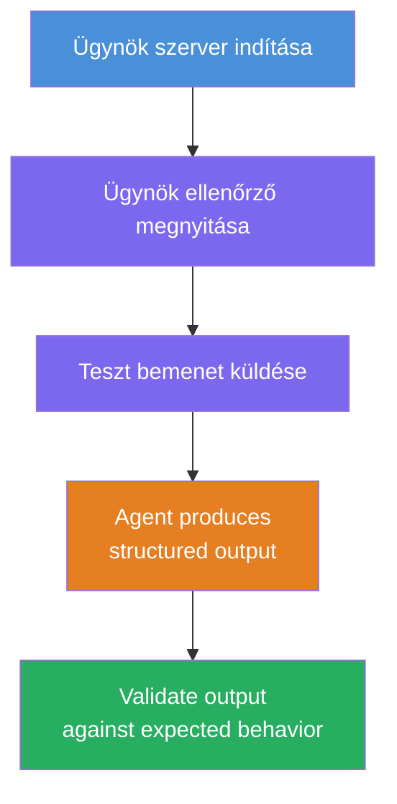
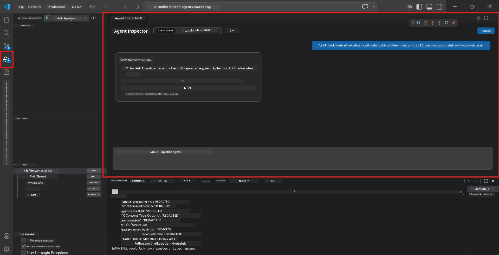
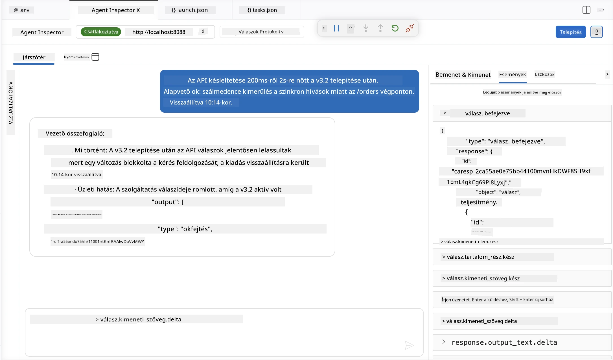

# 4. modul – Helyi tesztelés

⏱️ ~10 perc

Ebben a modulban helyileg futtatod az ügynököt, és ellenőrzöd, hogy helyesen működik-e **happy-path funkcionális tesztek** segítségével. Az Agent Inspector (vizuális UI) vagy közvetlen HTTP hívások segítségével megerősíted, hogy az ügynök strukturált, pontos válaszokat ad.

### Helyi tesztelési folyamat



---

## 1. lehetőség: F5 megnyomása – Hibakeresés az Agent Inspectorral (ajánlott)

### Indítsd el a hibakeresőt

1. Nyisd meg közvetlenül a **executive-summary-agent/** mappát a VS Code-ban (`File → Open Folder`).
2. Nyisd meg a **Run and Debug** panelt (`Ctrl+Shift+D`).
3. Válaszd ki a legördülő menüből a **Debug Local Agent Server** opciót.
4. Nyomd meg az **F5** gombot (vagy kattints a ▶ Start Debugging gombra).

> ⚠️ **Fontos: Válaszd ki a Python Interpretered**
> Ha "ModuleNotFoundError"-t kapsz, vagy a hibakereső nem indul el, meg kell mondanod a VS Code-nak, hogy a virtuális környezetet használja:
  > 1. Nyomd meg a `Ctrl+Shift+P`-t és gépeld be, hogy **Python: Select Interpreter**.
  > 2. Válaszd ki a projekted `.venv` mappájában található interpretert (pl. `.\.venv\Scripts\python.exe` Windows rendszeren).
  > 3. Indítsd újra a hibakereső munkamenetet.
> Ha még mindig hibákat kapsz, kézzel frissítsd a `tasks.json` fájlodat az alábbiak szerint:
  > 1. Navigálj a `.vscode/tasks.json` fájlhoz
  > 2. Keresd meg a `Run Agent/Workflow HTTP Server` nevű parancsot
  > 3. Frissítsd a parancs értékét így: `"value": "${workspaceFolder}/.venv/bin/python",`

### Mi történik

1. Az HTTP szerver elindul a `http://localhost:8088/responses` címen.
2. Az **Agent Inspector** panel automatikusan megnyílik – egy vizuális csevegőfelület teszteléshez.
3. A töréspontok engedélyezve vannak a `main.py` fájlban.

Figyeld a Terminált az alábbiakért:
```
Starting executive summary hosted agent
Executive agent server running on http://localhost:8088
```

> **Ha az Agent Inspector nem nyílik meg:** Nyomd meg a `Ctrl+Shift+P`-t → válaszd a **Foundry Toolkit: Open Agent Inspector** opciót.



> *A képernyőkép esetleg egy korábbi 'AI TOOLKIT' márkajelzést mutat egy régebbi bővítményverzióból.*

---

## 2. lehetőség: Tesztelés terminálon keresztül (alternatíva)

Indítsd el az ügynököt egy terminálban, kérdéseket egy másikból küldj:

```bash
# Terminál 1: Ügynök indítása
cd executive-summary-agent/
source .venv/bin/activate
python main.py
```

```bash
# Terminál 2: Teszt küldése (curl)
curl -sS -X POST http://localhost:8088/responses \
  -H "Content-Type: application/json" \
  -d '{"input": "The API latency increased due to thread pool exhaustion caused by sync calls in v3.2.", "stream": false}'
```

---

## Forgatókönyvtesztek: Happy-path funkcionális validáció

Futtasd le mindhárom alábbi forgatókönyvet. Ezekkel ellenőrzöd, hogy az ügynök helyes, strukturált válaszokat ad valós bemenetekre.



### Forgatókönyv 1: IT incidens – API késleltetés kiugrás

**Bemenet:**
```
The API latency increased from 200ms to 2s after deploying v3.2.
Root cause: thread pool starvation from synchronous calls in /orders.
Rolled back at 10:14.
```

**Várt viselkedés:**
- ✅ Követi az "Executive Summary" szerkezetet (Mi történt / Üzleti hatás / Következő lépés)
- ✅ Nincs technikai zsargon (nincs "thread pool", "/orders", vagy "v3.2")
- ✅ Világosan ismerteti az üzleti hatást (pl. felhasználók késéseket tapasztaltak)
- ✅ Tartalmaz egy következő lépést (pl. javítás telepítve, monitorozás beállítva)

---

### Forgatókönyv 2: Adatfolyam – ETL hiba

**Bemenet:**
```
The nightly ETL job failed because the upstream schema changed. APAC dashboards show missing data.
```

**Várt viselkedés:**
- ✅ Egyszerű nyelvű összefoglaló az adatfrissítés hibájáról
- ✅ Megemlíti az APAC dashboardra gyakorolt hatást
- ✅ Tartalmaz javítási következő lépést
- ✅ Nem tartalmaz "ETL", "séma" vagy más technikai kifejezést

---

### Forgatókönyv 3: Biztonság – Ki volt téve hitelesítő adat

**Bemenet:**
```
Static analysis flagged a hardcoded secret in the repository.
The secret may have been exposed in commit history.
```

**Várt viselkedés:**
- ✅ Vállalati nyelven írja le a hitelesítési/biztonsági problémát
- ✅ Kiemeli a potenciális kockázatot (jogosulatlan hozzáférés)
- ✅ Megnevezi a javítási lépést (hitelesítő adat forgatás, audit)
- ✅ Nem tartalmaz olyan kifejezéseket, mint "statikus elemzés", "commit történet" vagy "hardcoded"

---

## Érvényességi kritériumok

Minden forgatókönyv esetén ellenőrizd:

| # | Kritérium | Átmeneti feltétel |
|---|----------|---------------|
| 1 | **Szerkezet** | A válasz "Executive Summary" formátumot használ mindhárom ponttal |
| 2 | **Egyszerű nyelv** | Nincs technikai zsargon, amit egy vezető nem értene |
| 3 | **Pontosság** | Az összefoglaló tükrözi a bemenetet – nincs kitalált részlet |
| 4 | **Tömörség** | A válasz kevesebb, mint 100 szó |
| 5 | **Következő lépés** | Egyértelmű cselekvés vagy enyhítő lépés szerepel |

---

## Hibakeresési tippek

| Probléma | Megoldás |
|-------|---------|
| Az ügynök nem indul el | Ellenőrizd a `.env` értékeket, győződj meg róla, hogy a venv aktív, futtasd a `pip install -r requirements.txt` parancsot |
| Üres vagy általános válasz | Nézd át a `main.py`-ben az utasításokat – győződj meg, hogy meg van adva a válasz formátuma |
| A válasz tartalmaz zsargont | Erősítsd meg a "technikai kifejezések eltávolítása" szabályait az utasításokban |
| Az Agent Inspector nem nyílik meg | `Ctrl+Shift+P` → **Foundry Toolkit: Open Agent Inspector** |
| Modellhibák a Terminálban | Ellenőrizd, hogy az `AZURE_AI_MODEL_DEPLOYMENT_NAME` pontosan egyezzen (kis- és nagybetű érzékeny) |

---

### ✅ Ellenőrző pont

- [ ] Az ügynök helyileg elindul hibák nélkül
- [ ] Az Agent Inspector megnyílik és csevegőfelületet mutat (ha az F5-öt használod)
- [ ] **1. forgatókönyv** (IT incidens) – strukturált Executive Summary, nincs zsargon
- [ ] **2. forgatókönyv** (adatfolyam) – releváns összefoglaló az üzleti hatással
- [ ] **3. forgatókönyv** (biztonsági riasztás) – megfelelő kockázatkommunikáció
- [ ] Minden válasz követi a definiált kimeneti struktúrát

> **Mentsd el a válaszaidat** (másold ki vagy készíts képernyőképet) – összehasonlítod őket a felhőben kapott eredményekkel a 06. modulban.

---

**Előző:** [03 - Beállítás és kódolás](03-configure-and-code.md) · **Következő:** [05 - Telepítés Foundry-ba →](05-deploy-to-foundry.md)

---

<!-- CO-OP TRANSLATOR DISCLAIMER START -->
**Jogi nyilatkozat**:
Ez a dokumentum az AI fordítási szolgáltatás, a [Co-op Translator](https://github.com/Azure/co-op-translator) segítségével készült. Bár az pontosságra törekszünk, kérjük, vegye figyelembe, hogy az automatikus fordítások hibákat vagy pontatlanságokat tartalmazhatnak. Az eredeti dokumentum az anyanyelvén tekintendő hiteles forrásnak. Fontos információk esetén professzionális emberi fordítást javasolunk. Nem vállalunk felelősséget semmilyen félreértésért vagy téves értelmezésért, amely ebből a fordításból ered.
<!-- CO-OP TRANSLATOR DISCLAIMER END -->