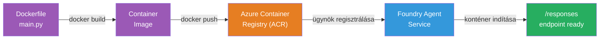
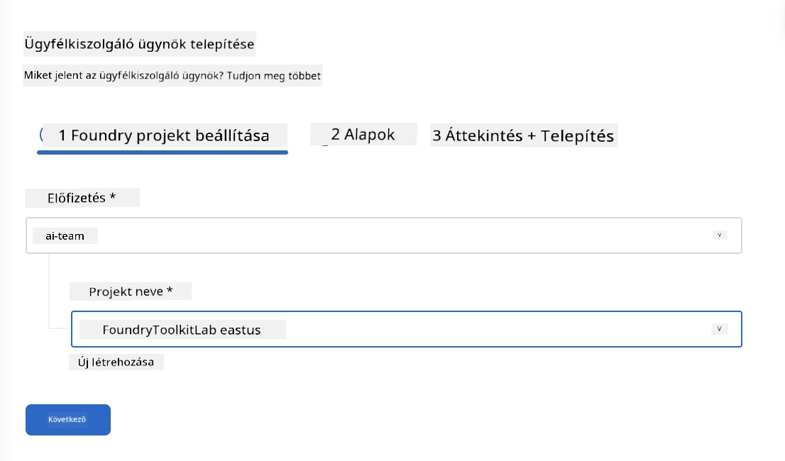
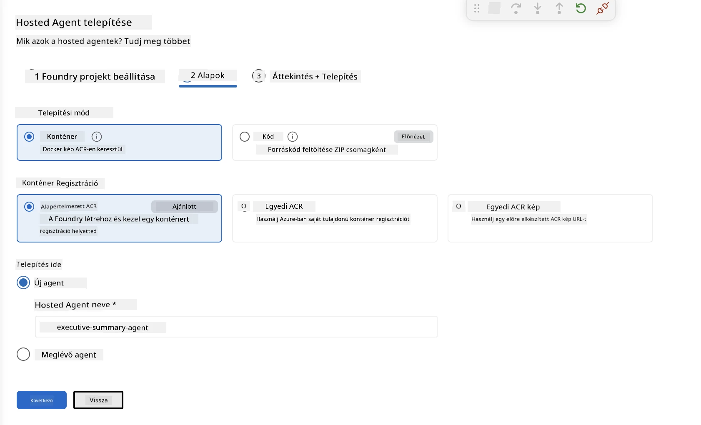
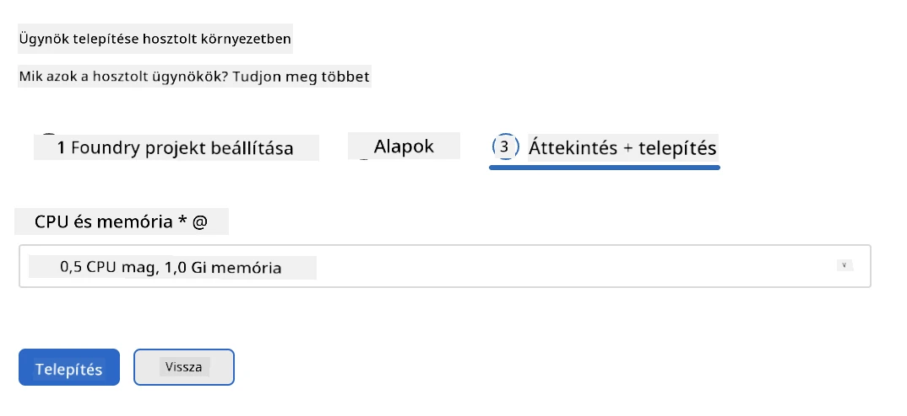
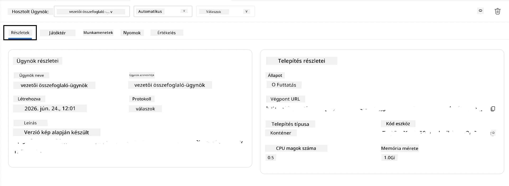

# 5. modul – Telepítés a Foundry Agent Szolgáltatásra

⏱️ ~10 perc

> ⚠️ **B útvonal felhasználók:** Ez a modul Foundry előfizetést igényel. Ha Foundry Local-t használsz, ugorj a [07. modul – Összefoglaló](07-summary.md) című részre. Sikeresen befejezted a helyi fejlesztési munkafolyamatot!

Ebben a modulban a helyben tesztelt ügynöködet telepíted a Microsoft Foundry-ba, mint **Kezelt Ügynököt**. A telepítés során egy konténerképet épít, feltölti azt az Azure Container Registry-be, és elindítja az ügynököt a Foundry kezelt infrastruktúrájában.

### Telepítési folyamat

---

## Előfeltételek ellenőrzése

A telepítés előtt ellenőrizd:

- [ ] Az ügynök megfelel mindhárom helyi tesztesetnek a [04. modulból](04-test-locally.md)
- [ ] Az **Azure AI User** szerepkörrel rendelkezel a projekt szintjén ([01. modul, RBAC hozzárendelés](01-setup.md#deploy-a-model--assign-rbac))
- [ ] Be vagy jelentkezve az Azure-ba a VS Code-ban (a fiók ikon a nevedet mutatja)

---

## 1. lépés: A telepítés indítása

### A lehetőség: Telepítés az Agent Inspectorból (ajánlott)

Ha az Agent Inspector nyitva van (a tesztelésből):
1. Kattints a jobb felső sarokban a **Deploy** gombra (felhő ikon ↑).

### B lehetőség: Telepítés a Parancspalettáról

1. Nyomd meg a `Ctrl+Shift+P` billentyűkombinációt → válaszd a **Foundry Toolkit: Deploy Hosted Agent** parancsot.

---

## 2. lépés: A telepítés konfigurálása

A varázsló ezeket kéri majd:

| Kérdés | Választás |
|--------|-----------|
| **Előfizetés** | Az Azure előfizetésed |
| **Célprojekt** | A Foundry projekted (pl. `workshop-agents`) |

Kattints a **Tovább** gombra az ügynök konfigurálásához.

| Kérdés | Választás |
|--------|-----------|
| **Telepítési mód** | Konténer |
| **Konténerregiszter** | **Alapértelmezett ACR** (a Microsoft Foundry létrehoz és kezel számodra egyet) |
| **Telepítés helye** | Új ügynök (név, `executive-summary-agent`) |

Kattints a **Tovább** gombra az ügynök áttekintéséhez és telepítéséhez.

| Kérdés | Választás |
|--------|-----------|
| **CPU és memória** | **0.25 CPU mag, 0.5 Gi memória** (elég a workshophoz) |

---

## 3. lépés: Telepítés és figyelés

1. Kattints a **Deploy** gombra.
2. Figyeld az **Output** panelt (válaszd a legördülőből a **Microsoft Foundry** opciót).
3. A telepítés a következő szakaszokon megy keresztül:
   - **Docker build** – felépíti a konténert a Dockerfile alapján
   - **Docker push** – feltölti a képet az ACR-be (az első telepítés 1–3 perc)
   - **Agent regisztráció** – létrehozza a hosztolt ügynököt a Foundry-ban
   - **Konténer indítása** – rendszer által kezelt identitással indul el

4. Ha elkészül, egy értesítés jelenik meg:
   > **my-agent sikeresen telepítve.** `Naplók megtekintése` `Ügynök futtatása`

5. Kattints az **Ügynök futtatása** gombra az Agent Playground megnyitásához.

### Telepítési állapotok

| Állapot | Jelentés |
|--------|---------|
| **Fut** | A konténer készen áll, az ügynök válaszol |
| **Függőben** | A konténer indul – várj 30–60 másodpercet |
| **Sikertelen** | Nézd meg a naplókat (hibák elhárítása lásd lent) |

---

## Gyakori telepítési hibák

| Hiba | Ok | Megoldás |
|-------|-----------|-----|
| `agents/write` engedély megtagadva | Hiányzik az **Azure AI User** szerepkör a projekt szintjén | [01. modul, RBAC hozzárendelés](01-setup.md#deploy-a-model--assign-rbac) |
| Docker nem fut | A Docker Desktop nincs elindítva | Indítsd el a Docker Desktopot → ellenőrizd a `docker info`-t |
| ACR jogosultsági hiba | A kezelt identitás nem tudja lehúzni a képet | Lásd [08. modul - Hibakeresés](08-troubleshooting.md) |

---

### ✅ Ellenőrző pont

- [ ] A telepítés hiba nélkül befejeződött
- [ ] Az ügynök megjelenik a Foundry oldalsávjában a **Hosted Agents (Preview)** alatt
- [ ] A konténer állapota **Fut**
- [ ] Megnyílt az Agent Playground fül, ami mutatja az ügynök részleteit és a végpont URL-jét

---

**Előző:** [04 – Helyi tesztelés](04-test-locally.md) · **Következő:** [06 – Ellenőrzés a Playground-ban →](06-verify-in-playground.md)

---

<!-- CO-OP TRANSLATOR DISCLAIMER START -->
**Jogi nyilatkozat**:
Ez a dokumentum az AI fordítási szolgáltatás, a [Co-op Translator](https://github.com/Azure/co-op-translator) segítségével készült. Bár az pontosságra törekszünk, kérjük, vegye figyelembe, hogy az automatikus fordítások hibákat vagy pontatlanságokat tartalmazhatnak. Az eredeti dokumentum az anyanyelvén tekintendő hiteles forrásnak. Fontos információk esetén professzionális emberi fordítást javasolunk. Nem vállalunk felelősséget semmilyen félreértésért vagy téves értelmezésért, amely ebből a fordításból ered.
<!-- CO-OP TRANSLATOR DISCLAIMER END -->