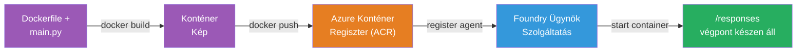
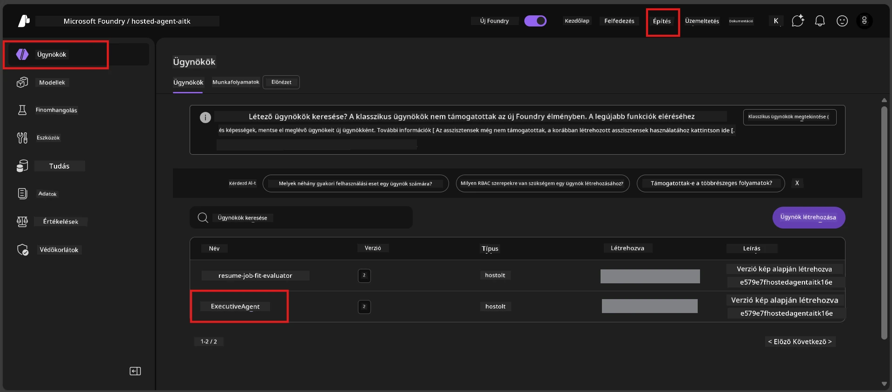

# 6. modul - Telepítés a Foundry Agent Service-be

Ebben a modulban a helyileg tesztelt ügynököt telepíted a Microsoft Foundry-ba, mint [**Felügyelt Ügynököt**](https://learn.microsoft.com/azure/foundry/agents/concepts/hosted-agents). A telepítési folyamat egy Docker konténer képet épít a projektedből, feltölti azt az [Azure Container Registry (ACR)](https://learn.microsoft.com/azure/container-registry/container-registry-intro) szolgáltatásba, és létrehoz egy felügyelt ügynök verziót a [Foundry Agent Service](https://learn.microsoft.com/azure/foundry/agents/overview) szolgáltatásban.

### Telepítési folyamat


---

## Előfeltételek ellenőrzése

A telepítés előtt ellenőrizd az alábbiakat. Ezek kihagyása a leggyakoribb oka a telepítési hibáknak.

1. **Az ügynök átmegy a helyi smoke teszteken:**
   - Teljesítetted mind a 4 tesztet az [5. modulban](05-test-locally.md), és az ügynök helyesen válaszolt.

2. **Rendelkezel [Azure AI User](https://learn.microsoft.com/azure/foundry/concepts/rbac-foundry#built-in-roles) szerepkörrel:**
   - Ezt a [2. modul 3. lépésében](02-create-foundry-project.md) kaptad meg. Ha bizonytalan vagy, ellenőrizd most:
   - Azure Portal → a Foundry **projekt** erőforrásod → **Hozzáférés-vezérlés (IAM)** → **Szerepkör-azonosítások** fül → keresd meg a neved → győződj meg róla, hogy az **Azure AI User** szerepkör szerepel.

3. **Be vagy jelentkezve az Azure-ba a VS Code-ban:**
   - Ellenőrizd a VS Code bal alsó részén található Fiókok ikont. A fiók nevednek láthatónak kell lennie.

4. **(Opcionális) Fut a Docker Desktop:**
   - A Docker csak akkor szükséges, ha a Foundry kiterjesztés kéri a helyi buildet. A legtöbb esetben a kiterjesztés automatikusan kezeli a konténer építését a telepítés során.
   - Ha van telepítve Docker, ellenőrizd, hogy fut: `docker info`

---

## 1. lépés: Indítsd a telepítést

Két lehetőséged van a telepítésre - mindkettő ugyanahhoz az eredményhez vezet.

### A lehetőség: Telepítés az Agent Inspector-ból (ajánlott)

Ha az ügynököt hibakeresővel (F5) futtatod, és az Agent Inspector nyitva van:

1. Nézd meg az Agent Inspector panel **jobb felső sarkát**.
2. Kattints a **Deploy** gombra (felhő ikon felfelé mutató nyíllal ↑).
3. Megnyílik a telepítési varázsló.

### B lehetőség: Telepítés a Parancs palettáról

1. Nyomd meg a `Ctrl+Shift+P` billentyűket a **Parancs paletta** megnyitásához.
2. Írd be: **Microsoft Foundry: Deploy Hosted Agent** és válaszd ki.
3. Megnyílik a telepítési varázsló.

---

## 2. lépés: Állítsd be a telepítést

A telepítési varázsló lépésről lépésre vezet a konfiguráción. Töltsd ki az egyes mezőket:

### 2.1 Válaszd ki a célprojektet

1. Egy legördülő menü mutatja a Foundry projektjeidet.
2. Válaszd ki azt a projektet, amelyet a 2. modulban létrehoztál (pl. `workshop-agents`).

### 2.2 Válaszd ki a konténer ügynök fájlt

1. Megkér, hogy válaszd ki az ügynök belépési pontját.
2. Válaszd a **`main.py`** (Python) fájlt – ez alapján az varázsló azonosítja az ügynök projektedet.

### 2.3 Állítsd be az erőforrásokat

| Beállítás | Ajánlott érték | Megjegyzések |
|-----------|----------------|--------------|
| **CPU** | `0.25` | Alapbeállítás, elegendő a workshophoz. Növeld éles környezethez |
| **Memória** | `0.5Gi` | Alapbeállítás, elegendő a workshophoz |

Ezek megegyeznek az `agent.yaml` fájlban szereplő értékekkel. Elfogadhatod az alapértelmezett értékeket.

---

## 3. lépés: Erősítsd meg és telepítsd

1. A varázsló megjeleníti a telepítés összegzését:
   - Célprojekt neve
   - Ügynök neve (`agent.yaml` alapján)
   - Konténer fájl és erőforrások
2. Nézd át az összegzést, majd kattints a **Megerősítés és telepítés** (vagy **Deploy**) gombra.
3. Kövesd a folyamatot a VS Code-ban.

### Mi történik a telepítés alatt (lépésről lépésre)

A telepítés több lépésből áll. Kövesd a VS Code **Output** panelt (válaszd ki a „Microsoft Foundry” opciót a legördülőből):

1. **Docker build** - A VS Code építi a Docker konténer képet a `Dockerfile` alapján. Láthatod a Docker rétegek üzeneteit:
   ```
   Step 1/6 : FROM python:<version>-slim
   Step 2/6 : WORKDIR /app
   ...
   Successfully built abc123def456
   ```

2. **Docker push** - A képet feltölti a Foundry projektedhez tartozó **Azure Container Registry (ACR)**-be. Az első telepítés 1-3 percig is eltarthat (az alap kép >100MB).

3. **Ügynök regisztráció** - A Foundry Agent Service létrehoz egy új felügyelt ügynököt (vagy új verziót, ha az ügynök már létezik). Az ügynök metaadatai az `agent.yaml` fájlból származnak.

4. **Konténer indítása** - A konténer elindul a Foundry kezelt infrastruktúrájában. A platform hozzárendel egy [rendszer által kezelt identitást](https://learn.microsoft.com/azure/foundry/agents/concepts/agent-identity), és elérhetővé teszi a `/responses` végpontot.

> **Az első telepítés lassabb** (a Dockernek fel kell töltenie az összes réteget). A későbbi telepítések gyorsabbak, mivel a Docker cache-eli a változatlan rétegeket.

---

## 4. lépés: Ellenőrizd a telepítés állapotát

A telepítés befejezése után:

1. Nyisd meg a **Microsoft Foundry** oldalsávot a tevékenységsávban a Foundry ikonra kattintva.
2. Bontsd ki a **Felügyelt Ügynökök (Előzetes verzió)** részt a projekted alatt.
3. Látnod kell az ügynök nevét (pl. `ExecutiveAgent` vagy az `agent.yaml` fájlból származó nevet).
4. Kattints az ügynök nevére a kibontáshoz.
5. Látnod kell egy vagy több **verziót** (pl. `v1`).
6. Kattints a verzióra a **Konténer részletek** megtekintéséhez.
7. Ellenőrizd az **Állapot** mezőt:

   | Állapot | Jelentése |
   |---------|-----------|
   | **Indult** vagy **Fut** | A konténer fut, az ügynök készen áll |
   | **Függőben** | A konténer indul (várj 30-60 másodpercet) |
   | **Sikertelen** | A konténer nem indult el (nézd meg a naplókat - lásd a hibaelhárítást lent) |



> **Ha az állapot több mint 2 percig "Függőben" marad:** A konténer valószínűleg behúzza az alap képet. Várj még egy kicsit. Ha továbbra is "Függőben" marad, nézd meg a konténer naplóit.

---

## Gyakori telepítési hibák és javításuk

### Hiba 1: Jogosultság megtagadva - `agents/write`

```
Error: lacks the required data action 
Microsoft.CognitiveServices/accounts/AIServices/agents/write 
to perform POST /api/projects/{projectName}/assistants operation.
```

**Ok:** Nincs meg az `Azure AI User` szerepköröd a **projekt** szinten.

**Javítás lépésről lépésre:**

1. Nyisd meg a [https://portal.azure.com](https://portal.azure.com) oldalt.
2. A keresősávban írd be a Foundry **projekt** nevét és lépj be rá.
   - **Fontos:** Győződj meg, hogy a **projekt** erőforráshoz jutottál el (típus: "Microsoft Foundry project"), és nem a fiók/ügyfél vagy hub erőforráshoz.
3. A bal oldali menüben kattints a **Hozzáférés-vezérlés (IAM)** menüpontra.
4. Kattints a **+ Hozzáadás** → **Szerepkör-hozzárendelés hozzáadása** opcióra.
5. A **Szerepkör** fülön keresd meg az [**Azure AI User**](https://learn.microsoft.com/azure/foundry/concepts/rbac-foundry#built-in-roles) szerepkört és válaszd ki. Kattints a **Tovább** gombra.
6. A **Tagok** fülön válaszd a **Felhasználó, csoport vagy szolgáltatás-fiók** opciót.
7. Kattints a **+ Tagok kiválasztása**, keresd meg a neved/email címed, válaszd ki magad, majd kattints a **Kiválasztás** gombra.
8. Kattints a **Áttekintés + hozzárendelés** gombra, majd ismét ugyanerre.
9. Várj 1-2 percet, amíg a szerepkör hozzárendelés érvénybe lép.
10. **Próbáld újra a telepítést** az 1. lépésből.

> A szerepkörnek a **projekt** szinten kell lennie, nem csak a fiók szinten. Ez a leggyakoribb oka a telepítési hibáknak.

### Hiba 2: Docker nem fut

```
Error: Docker build failed / Cannot connect to Docker daemon
```

**Javítás:**
1. Indítsd el a Docker Desktopot (keresd meg a Start menüben vagy a rendszer tálcán).
2. Várj, amíg megjelenik az "Docker Desktop fut" állapot (30-60 másodperc).
3. Ellenőrizd: `docker info` terminálban.
4. **Windows esetén:** Győződj meg róla, hogy az WSL 2 backend engedélyezve van a Docker Desktop beállításainál → **Általános** → **Használja a WSL 2 alapú motort**.
5. Próbáld újra a telepítést.

### Hiba 3: ACR engedélyezés - `AcrPullUnauthorized`

```
Error: AcrPullUnauthorized
```

**Ok:** A Foundry projekt által kezelt identitás nem rendelkezik lehúzási jogosultsággal a konténerregisztrációhoz.

**Javítás:**
1. Az Azure Portalon lépj be a **[Container Registry](https://learn.microsoft.com/azure/container-registry/container-registry-intro)** szolgáltatásba (ugyanabban az erőforráscsoportban van, mint a Foundry projekted).
2. Menj a **Hozzáférés-vezérlés (IAM)** menüpontra → **Hozzáadás** → **Szerepkör-hozzárendelés hozzáadása**.
3. Válaszd az **[AcrPull](https://learn.microsoft.com/azure/container-registry/container-registry-roles)** szerepkört.
4. A Tagok alatt válaszd a **Kezelt identitás** → keresd meg a Foundry projekt által kezelt identitást.
5. **Áttekintés + hozzárendelés**.

> Ezt általában a Foundry kiterjesztés állítja be automatikusan. Ha ez a hiba megjelenik, az automatikus beállítás sikertelen lehetett.

### Hiba 4: Konténer platform eltérés (Apple Silicon)

Apple Silicon Macről (M1/M2/M3) történő telepítés esetén a konténert `linux/amd64` platformra kell építeni:

```bash
docker build --platform linux/amd64 -t myagent:v1 .
```

> A Foundry kiterjesztés ezt a legtöbb felhasználónál automatikusan kezeli.

---

### Ellenőrző pont

- [ ] A telepítési parancs sikeresen lefutott a VS Code-ban
- [ ] Az ügynök megjelenik a Foundry oldalsáv **Felügyelt Ügynökök (Előzetes verzió)** részénél
- [ ] Kiválasztottad az ügynököt → választottál egy verziót → megtekintetted a **Konténer részleteket**
- [ ] A konténer állapota **Indult** vagy **Fut**
- [ ] (Ha hiba történt) Azonosítottad a hibát, elvégezted a javítást, és sikeresen újratelepítetted

---

**Előző:** [05 - Helyi tesztelés](05-test-locally.md) · **Következő:** [07 - Ellenőrzés a Playground-ban →](07-verify-in-playground.md)

---

<!-- CO-OP TRANSLATOR DISCLAIMER START -->
**Nyilatkozat**:  
Ez a dokumentum az [Co-op Translator](https://github.com/Azure/co-op-translator) AI fordító szolgáltatásával készült. Bár a pontosságra törekszünk, kérjük, vegye figyelembe, hogy az automatikus fordítások hibákat vagy pontatlanságokat tartalmazhatnak. A dokumentum eredeti, anyanyelvi változatát tekintse hivatalos forrásnak. Kritikus információk esetén szakmai, emberi fordítást javaslunk. Nem vállalunk felelősséget az ebből eredő félreértésekért vagy téves értelmezésekért.
<!-- CO-OP TRANSLATOR DISCLAIMER END -->