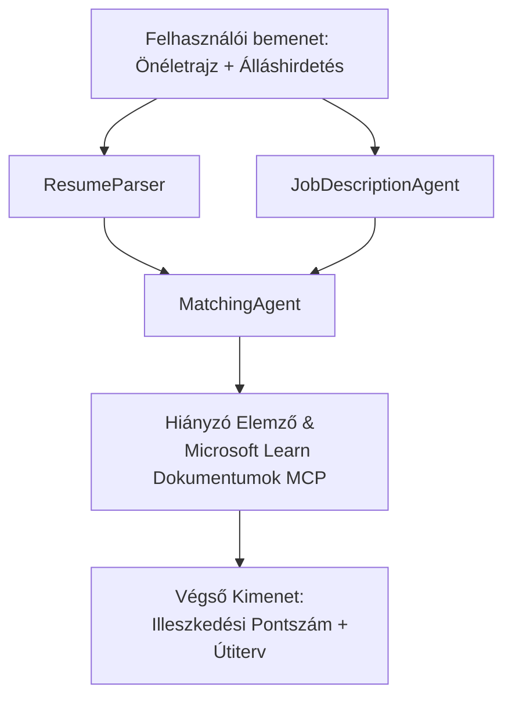

# PersonalCareerCopilot - Önéletrajz → Állásalkalmasság értékelő

Egy többügynökös munkafolyamat, amely értékeli, mennyire illeszkedik egy önéletrajz egy álláshirdetéshez, majd személyre szabott tanulási útvonalat készít a hiányosságok pótlására.

---

## Ügynökök

| Ügynök | Szerep | Eszközök |
|--------|--------|----------|
| **ResumeParser** | Strukturált készségek, tapasztalat, tanúsítványok kinyerése az önéletrajz szövegéből | - |
| **JobDescriptionAgent** | Követelt/preferált készségek, tapasztalat, tanúsítványok kinyerése az álláshirdetésből | - |
| **MatchingAgent** | Profil összehasonlítása a követelményekkel → illeszkedési pontszám (0-100) + egyező/hiányzó készségek | - |
| **GapAnalyzer** | Személyre szabott tanulási útvonal létrehozása Microsoft Learn erőforrásokkal | `search_microsoft_learn_for_plan` (MCP) |

## Munkafolyamat


---

## Gyors kezdés

### 1. Környezet beállítása

```powershell
cd workshop\lab02-multi-agent\PersonalCareerCopilot
python -m venv .venv
.\.venv\Scripts\Activate.ps1          # Windows PowerShell
# source .venv/bin/activate            # macOS / Linux
pip install -r requirements.txt
```

### 2. Hitelesítő adatok konfigurálása

Másolja az env minta fájlt és töltse ki Foundry projekt részleteivel:

```powershell
cp .env.example .env
```

Szerkessze a `.env` fájlt:

```env
PROJECT_ENDPOINT=https://<your-account>.services.ai.azure.com/api/projects/<your-project>
MODEL_DEPLOYMENT_NAME=gpt-4.1-mini
```

| Érték | Hol található |
|-------|---------------|
| `PROJECT_ENDPOINT` | Microsoft Foundry oldalsáv a VS Code-ban → jobb klikk a projektre → **Copy Project Endpoint** |
| `MODEL_DEPLOYMENT_NAME` | Foundry oldalsáv → projekt kibontása → **Models + endpoints** → telepítés neve |

### 3. Helyi futtatás

```powershell
python -m debugpy --listen 127.0.0.1:5679 -m agentdev run main.py --verbose --port 8088
```

Vagy használja a VS Code feladatot: `Ctrl+Shift+P` → **Tasks: Run Task** → **Run Lab02 HTTP Server**.

### 4. Tesztelés Agent Inspectorral

Nyissa meg az Agent Inspectort: `Ctrl+Shift+P` → **Foundry Toolkit: Open Agent Inspector**.

Illessze be ezt a teszt promptot:

```
Resume:
Jane Doe
Senior Software Engineer with 5 years of experience in Python, Django, and AWS.
Built microservices handling 10K+ requests/second. Led a team of 4 developers.
Certifications: AWS Solutions Architect Associate.
Education: B.S. Computer Science, State University.

Job Description:
Senior Cloud Engineer at Contoso Ltd.
Required: Python, Azure, Kubernetes, Terraform, CI/CD pipelines.
Preferred: Go, monitoring (Prometheus/Grafana), cost optimization.
Experience: 5+ years in cloud infrastructure.
Certifications: Azure Solutions Architect Expert preferred.
```

**Elvárt:** Egy illeszkedési pontszám (0-100), egyező/hiányzó készségek, és személyre szabott tanulási útvonal Microsoft Learn URL-ekkel.

### 5. Telepítés Foundryba

`Ctrl+Shift+P` → **Microsoft Foundry: Deploy Hosted Agent** → válassza ki a projektet → megerősítés.

---

## Projekt struktúra

```
PersonalCareerCopilot/
├── .env.example        ← Template for environment variables
├── .env                ← Your credentials (git-ignored)
├── agent.yaml          ← Hosted agent definition (name, resources, env vars)
├── Dockerfile          ← Container image for Foundry deployment
├── main.py             ← 4-agent workflow (instructions, MCP tool, WorkflowBuilder)
└── requirements.txt    ← Python dependencies
```

## Kulcsfájlok

### `agent.yaml`

Definiálja a hosztolt ügynököt a Foundry Agent Service-hez:
- `kind: hosted` - menedzselt konténerként fut
- `protocols: [responses v1]` - kiteszi a `/responses` HTTP végpontot
- `environment_variables` - `PROJECT_ENDPOINT` és `MODEL_DEPLOYMENT_NAME` a telepítéskor beadva

### `main.py`

Tartalmazza:
- **Ügynök utasítások** - négy `*_INSTRUCTIONS` konstans ügynökök szerint
- **MCP eszköz** - `search_microsoft_learn_for_plan()` hívja a `https://learn.microsoft.com/api/mcp`-t Streamable HTTP-n keresztül
- **Ügynök létrehozás** - `create_agents()` kontextuskezelő `AzureAIAgentClient.as_agent()` használatával
- **Munkafolyamat grafikon** - `create_workflow()` a `WorkflowBuilder`-rel az ügynökök összekapcsolására ventilátor ki/be és soros minták szerint
- **Szerver indítás** - `from_agent_framework(agent).run_async()` a 8088-as porton

### `requirements.txt`

| Csomag | Verzió | Cél |
|---------|---------|-----|
| `agent-framework-azure-ai` | `1.0.0rc3` | Azure AI integráció a Microsoft Agent Framework-hez |
| `agent-framework-core` | `1.0.0rc3` | Alaprendszer (tartalmazza a WorkflowBuilder-t) |
| `azure-ai-agentserver-agentframework` | `1.0.0b16` | Hosztolt ügynök szerver futtatókörnyezet |
| `azure-ai-agentserver-core` | `1.0.0b16` | Alap ügynök szerver absztrakciók |
| `debugpy` | legfrissebb | Python hibakeresés (VS Code F5) |
| `agent-dev-cli` | `--pre` | Helyi fejlesztői CLI + Agent Inspector backend |

---

## Hibakeresés

| Probléma | Megoldás |
|----------|----------|
| `RuntimeError: Missing required environment variable(s)` | Készítsen `.env` fájlt `PROJECT_ENDPOINT` és `MODEL_DEPLOYMENT_NAME` értékekkel |
| `ModuleNotFoundError: No module named 'agent_framework'` | Aktiválja a virtuális környezetet és futtassa: `pip install -r requirements.txt` |
| Nincsenek Microsoft Learn URL-ek a kimenetben | Ellenőrizze az internetkapcsolatot a `https://learn.microsoft.com/api/mcp` címhez |
| Csak 1 hiányosság kártya (levágva) | Ellenőrizze, hogy a `GAP_ANALYZER_INSTRUCTIONS` tartalmazza a `CRITICAL:` blokkot |
| A 8088-as port foglalt | Állítsa le a többi szervert: `netstat -ano \| findstr :8088` |

Részletes hibakeresésért lásd: [8. Modul - Hibakeresés](../docs/08-troubleshooting.md).

---

**Teljes bemutató:** [Lab 02 Docs](../docs/README.md) · **Vissza:** [Lab 02 README](../README.md) · [Workshop kezdőlap](../../../README.md)

---

<!-- CO-OP TRANSLATOR DISCLAIMER START -->
**Nyilatkozat**:
Ezt a dokumentumot az AI fordító szolgáltatás [Co-op Translator](https://github.com/Azure/co-op-translator) segítségével fordítottuk le. Bár a pontosságra törekszünk, kérjük, vegye figyelembe, hogy az automatikus fordítások hibákat vagy pontatlanságokat tartalmazhatnak. Az eredeti dokumentum anyanyelvű változatát tekintse hiteles forrásnak. Kritikus információk esetén professzionális emberi fordítást javasolt igénybe venni. Nem vállalunk felelősséget az ebből a fordításból eredő félreértésekért vagy félrefordításokért.
<!-- CO-OP TRANSLATOR DISCLAIMER END -->