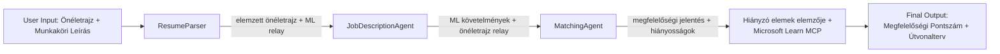

# PersonalCareerCopilot - Önéletrajz → Munkaalkalmasság Értékelő

Egy munkafolyamat-központú többügynökös alkalmazás, amely értékeli, mennyire illeszkedik egy önéletrajz a munkaköri leíráshoz, majd személyre szabott tanulási ütemtervet készít a hiányosságok pótlására.

---

## Ügynökök

| Ügynök | Szerep | Eszközök |
|-------|------|-------|
| **ResumeParser** | Strukturált készségek, tapasztalatok, tanúsítványok kinyerése az önéletrajz szövegéből | - |
| **JobDescriptionAgent** | Követelt/preferált készségek, tapasztalatok, tanúsítványok kinyerése egy munkaköri leírásból | - |
| **MatchingAgent** | Profil összehasonlítása a követelményekkel → illeszkedési pontszám (0-100) + egyező/hiányzó készségek | - |
| **GapAnalyzer** | Személyre szabott tanulási ütemterv készítése Microsoft Learn forrásokkal | `search_microsoft_learn_for_plan` (MCP) |

## Munkafolyamat


```mermaid
flowchart LR
    UserInput["User Input: Önéletrajz + Munkaköri Leírás"] --> ResumeParser
    ResumeParser -- "elemzett önéletrajz + ML relay" --> JobDescriptionAgent
    JobDescriptionAgent -- "ML követelmények + önéletrajz relay" --> MatchingAgent
    MatchingAgent -- "megfelelőségi jelentés + hiányosságok" --> GapAnalyzerMCP["Hiányzó elemek elemzője +\nMicrosoft Learn MCP"]
    GapAnalyzerMCP --> FinalOutput["Final Output:\nMegfelelőségi Pontszám + Útvonalterv"]
```

---

## Gyors kezdés

### 1. Környezet beállítása

Ez a mappa a munkafolyamat-alapú Lab 02 sablon referencia megvalósítása. A `main.py` a meglévő prompt blokkokat és a `WorkflowBuilder` eszközt használja az ügynökök összekapcsolására.

```powershell
cd workshop\lab02-multi-agent\PersonalCareerCopilot
python -m venv .venv
.\.venv\Scripts\Activate.ps1          # Windows PowerShell
# source .venv/bin/activate            # macOS / Linux
pip install -r requirements.txt
```

### 2. Hitelesítő adatok konfigurálása

Hozz létre egy `.env` fájlt ebben a mappában:

```powershell
copy .env .env.bak 2>$null; echo $null > .env
```

Szerkeszd a `.env` fájlt:

```env
FOUNDRY_PROJECT_ENDPOINT=https://<your-account>.services.ai.azure.com/api/projects/<your-project>
AZURE_AI_MODEL_DEPLOYMENT_NAME=gpt-4.1-mini
```

| Érték | Hol található |
|-------|------------------|
| `FOUNDRY_PROJECT_ENDPOINT` | Foundry Toolkit oldalsáv → jobb klikk a projektre → **Copy Project Endpoint** |
| `AZURE_AI_MODEL_DEPLOYMENT_NAME` | Foundry oldalsáv → projekt kibontása → **Models + endpoints** → telepítés neve |

### 3. Futtatás helyben

```powershell
python -m debugpy --listen 127.0.0.1:5679 main.py --port 8088
```

Vagy használd a VS Code feladatot: `Ctrl+Shift+P` → **Tasks: Run Task** → **Run Agent HTTP Server**.

Hibakereséshez F5-tel használd a **Debug Local Agent HTTP Server** opciót.

### 4. Teszt az Agent Inspectorral

Nyisd meg az Agent Inspectort: `Ctrl+Shift+P` → **Foundry Toolkit: Open Agent Inspector**.

Illeszd be ezt a teszt promptot:

```
Resume:
Jane Doe
Senior Software Engineer with 5 years of experience in Python, Django, and AWS.
Built microservices handling 10K+ requests/second. Led a team of 4 developers.
Certifications: AWS Solutions Architect Associate.
Education: B.S. Computer Science, State University.

Job Description:
Senior Cloud Engineer at Contoso Ltd.
Required: Python, Azure, Kubernetes, Terraform, CI/CD pipelines.
Preferred: Go, monitoring (Prometheus/Grafana), cost optimization.
Experience: 5+ years in cloud infrastructure.
Certifications: Azure Solutions Architect Expert preferred.
```

**Várt eredmény:** Illeszkedési pontszám (0-100), egyező/hiányzó készségek, és személyre szabott tanulási ütemterv Microsoft Learn URL-ekkel.

### 5. Telepítés Foundry-ba

`Ctrl+Shift+P` → **Foundry Toolkit: Deploy Hosted Agent** → válaszd ki a project-et → erősítsd meg.

---

## Projekt felépítés

```
PersonalCareerCopilot/
├── .env                ← Your credentials (git-ignored)
├── agent.yaml          ← Hosted agent definition (name, resources, env vars)
├── Dockerfile          ← Container image for Foundry deployment
├── main.py             ← 4-agent workflow (instructions, MCP tool, WorkflowBuilder)
└── requirements.txt    ← Python dependencies
```

## Fontos fájlok

### `agent.yaml`

Meghatározza a Foundry Agent Service-hez tartozó hosztolt ügynököt:
- `kind: hosted` - kezelt konténerként fut
- `protocols` - `responses` protokoll `version: 1.0.0`-val, `/responses` HTTP végpontot nyit meg
- `environment_variables` - itt deklarált `AZURE_AI_MODEL_DEPLOYMENT_NAME`; `FOUNDRY_PROJECT_ENDPOINT` a telepítéskor automatikusan beillesztve

### `main.py`

Tartalma:
- **Ügynök utasítások** - négy `*_INSTRUCTIONS` konstans, egy ügynökönként
- **MCP eszköz** - `search_microsoft_learn_for_plan()` hívja a `https://learn.microsoft.com/api/mcp` végpontot Streamable HTTP-n keresztül
- **Ügynök létrehozás** - négy `Agent()` + `AgentExecutor()` példány, közös `FoundryChatClient`-tel
- **Munkafolyamat gráf** - `WorkflowBuilder` az ügynököket soros csővezetékként kapcsolja össze: ResumeParser → JD Agent → MatchingAgent → GapAnalyzer
- **Szerver indítás** - `ResponsesHostServer` fut a 8088-as porton

### `requirements.txt`

| Csomag | Cél |
|---------|----------|
| `agent-framework-foundry` | Alap futtatókörnyezet: `Agent`, `AgentExecutor`, `WorkflowBuilder`, `@tool`, `FoundryChatClient` |
| `agent-framework-foundry-hosting` | `ResponsesHostServer` + Foundry hosztolási integráció |
| `mcp<2,>=1.24.0` | MCP kliens a GapAnalyzer-hez (`streamable_http_client`) |
| `debugpy` | Python hibakeresés (F5 a VS Code-ban) |

---

## Hibakeresés

| Probléma | Megoldás |
|-------|-----|
| `KeyError: 'FOUNDRY_PROJECT_ENDPOINT'` vagy `KeyError: 'AZURE_AI_MODEL_DEPLOYMENT_NAME'` | Hozz létre `.env`-t mindkét változó beállításával: `FOUNDRY_PROJECT_ENDPOINT` és `AZURE_AI_MODEL_DEPLOYMENT_NAME` |
| `ModuleNotFoundError: No module named 'agent_framework'` | Aktiváld a virtuális környezetet és futtasd a `pip install -r requirements.txt` parancsot |
| Nincsenek Microsoft Learn URL-ek a kimenetben | Ellenőrizd az internetkapcsolatot a `https://learn.microsoft.com/api/mcp` felé |
| Csak 1 gap kártya (levágott) | Ellenőrizd, hogy a `GAP_ANALYZER_INSTRUCTIONS` tartalmazza a `CRITICAL:` blokkot |
| A 8088-as port foglalt | Állítsd le más szervereket: `netstat -ano \| findstr :8088` |

Részletes hibakereséshez lásd a [8. modul - Hibakeresés](../docs/08-troubleshooting.md) részt.

---

**Teljes végigvezetés:** [Lab 02 Docs](../docs/README.md) · **Vissza ide:** [Lab 02 README](../README.md) · [Workshop Főoldal](../../../README.md)

---

<!-- CO-OP TRANSLATOR DISCLAIMER START -->
**Jogi nyilatkozat**:
Ez a dokumentum az AI fordítási szolgáltatás, a [Co-op Translator](https://github.com/Azure/co-op-translator) segítségével készült. Bár az pontosságra törekszünk, kérjük, vegye figyelembe, hogy az automatikus fordítások hibákat vagy pontatlanságokat tartalmazhatnak. Az eredeti dokumentum az anyanyelvén tekintendő hiteles forrásnak. Fontos információk esetén professzionális emberi fordítást javasolunk. Nem vállalunk felelősséget semmilyen félreértésért vagy téves értelmezésért, amely ebből a fordításból ered.
<!-- CO-OP TRANSLATOR DISCLAIMER END -->