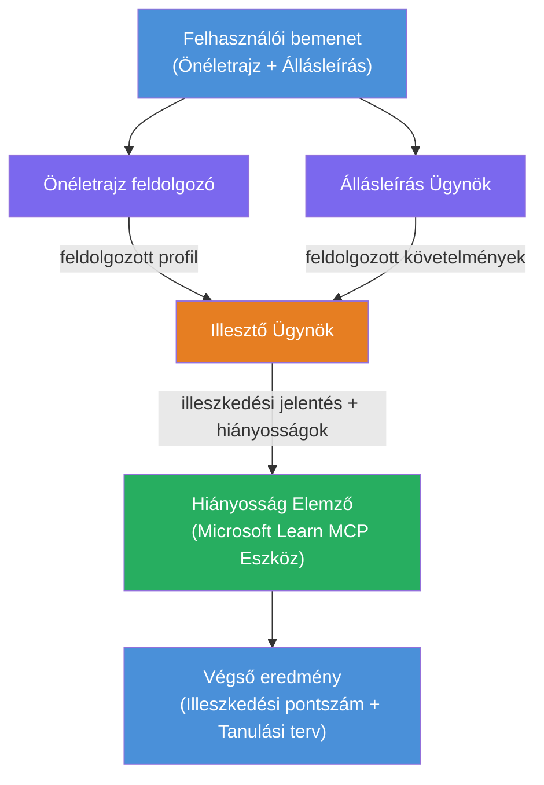

# Lab 02 - Többügynökös munkafolyamat: Önéletrajz → Munkaalkalmassági értékelő

---

## Amit építeni fogsz

Egy **Önéletrajz → Munkaalkalmassági értékelő** - egy többügynökös munkafolyamat, ahol négy specializált ügynök együttműködik annak értékelésére, hogy a jelölt önéletrajza mennyire illeszkedik egy munkaköri leíráshoz, majd személyre szabott tanulási útvonalat generál a hiányosságok pótlására.

### Az ügynökök

| Ügynök | Szerep |
|--------|--------|
| **Önéletrajz elemző** | Strukturált készségek, tapasztalat, tanúsítványok kinyerése az önéletrajz szövegéből |
| **Munkaköri leírás ügynök** | Szükséges/preferált készségek, tapasztalat, tanúsítványok kinyerése egy munkaköri leírásból |
| **Illesztő ügynök** | Profil és elvárások összehasonlítása → illeszkedési pontszám (0-100) + egyező/hiányzó készségek |
| **Hiány elemző** | Személyre szabott tanulási útvonal összeállítása forrásokkal, ütemtervekkel és gyors sikert eredményező projektekből |

### Demó folyamat

Önéletrajz + munkaköri leírás feltöltése → illeszkedési pontszám + hiányzó készségek megkapása → személyre szabott tanulási útvonal fogadása.

### Munkafolyamat architektúra

> Lila = párhuzamos ügynökök | Narancs = összesítő pont | Zöld = végső ügynök eszközökkel. A részletes ábrákért és adatfolyamért lásd a [1. modul - Az architektúra megértése](docs/01-understand-multi-agent.md) és a [4. modul - Orkesztrációs minták](docs/04-orchestration-patterns.md) dokumentumokat.

### Témakörök

- Többügynökös munkafolyamat létrehozása a **WorkflowBuilder** használatával
- Ügynöki szerepek és orkesztrációs folyamat definiálása (párhuzamos + szekvenciális)
- Ügynökök közötti kommunikációs minták
- Helyi tesztelés az Agent Inspectorral
- Többügynökös munkafolyamatok telepítése a Foundry Agent Service-re

---

## Előfeltételek

Először fejezd be az 1. labor feladatot:

- [Lab 01 - Egyetlen ügynök](../lab01-single-agent/README.md)

---

## Kezdés

A teljes beállítási utasításokat, kódmagyarázatot és teszt parancsokat lásd:

- [Lab 2 Dokumentáció - Előfeltételek](docs/00-prerequisites.md)
- [Lab 2 Dokumentáció - Teljes tanulási út](docs/README.md)
- [PersonalCareerCopilot futtatási útmutató](PersonalCareerCopilot/README.md)

## Orkesztrációs minták (ügynöki alternatívák)

A Lab 2 tartalmazza az alapértelmezett **párhuzamos → összesítő → tervező** folyamatot, és a dokumentáció alternatív mintákat is ismertet a még erősebb ügynöki viselkedés bemutatására:

- **Szétosztó/összegző súlyozott konszenzussal**
- **Felülvizsgáló/kritikus áttekintés a végső tanulási úton előtt**
- **Feltételes útválasztó** (útvonal kiválasztása az illeszkedési pontszám és hiányzó készségek alapján)

Lásd: [docs/04-orchestration-patterns.md](docs/04-orchestration-patterns.md).

---

**Előző:** [Lab 01 - Egyetlen ügynök](../lab01-single-agent/README.md) · **Vissza:** [Műhelyfoglalkozás főoldal](../../README.md)

---

<!-- CO-OP TRANSLATOR DISCLAIMER START -->
**Jogi nyilatkozat**:  
Ez a dokumentum az AI fordító szolgáltatás [Co-op Translator](https://github.com/Azure/co-op-translator) segítségével készült. Bár a pontosságra törekszünk, kérjük, vegye figyelembe, hogy az automatikus fordítások hibákat vagy pontatlanságokat tartalmazhatnak. Az eredeti dokumentum a saját nyelvén tekintendő hivatalos forrásnak. Kiemelt jelentőségű információk esetén szakmai, emberi fordítást javaslunk. Nem vállalunk felelősséget a fordítás használatából eredő félreértésekért vagy téves értelmezésekért.
<!-- CO-OP TRANSLATOR DISCLAIMER END -->