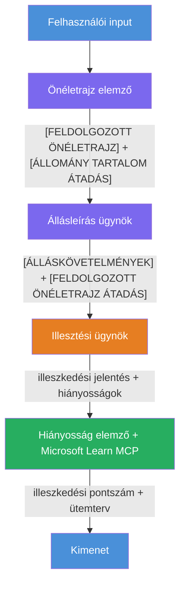

# Labor 02 - Többügynökös munkafolyamat: Önéletrajz → Állásalkalmasság értékelő

## Áttekintés

Ebben a gyakorlati laborban egy **munkafolyamat-központú többügynökös alkalmazást** építesz a Foundry Toolkit segítségével VS Code-ban, és telepíted a Microsoft Foundry Agent Service-be.

**Amit építesz:** egy Önéletrajz → Állásalkalmasság értékelő, amely elemzi az önéletrajzot és az állásleírást, pontozza az illeszkedést, és személyre szabott tanulási ütemtervet készít Microsoft Learn források felhasználásával.

---

## Architektúra

```mermaid
flowchart TD
    A["Felhasználói input"] --> B["Önéletrajz elemző"]
    B -->|"[FELDOLGOZOTT ÖNÉLETRAJZ] + [ÁLLOMÁNY TARTALOM ÁTADÁS]"| C["Állásleírás ügynök"]
    C -->|"[ÁLLÁSKÖVETELMÉNYEK] + [FELDOLGOZOTT ÖNÉLETRAJZ ÁTADÁS]"| D["Illesztési ügynök"]
    D -->|illeszkedési jelentés + hiányosságok| E["Hiányosság elemző + Microsoft Learn MCP"]
    E -->|illeszkedési pontszám + ütemterv| F["Kimenet"]

    style A fill:#4A90D9,color:#fff
    style B fill:#7B68EE,color:#fff
    style C fill:#7B68EE,color:#fff
    style D fill:#E67E22,color:#fff
    style E fill:#27AE60,color:#fff
    style F fill:#4A90D9,color:#fff
```

**Működése:**
1. A felhasználó beilleszt egy önéletrajzot és állásleírást.
2. A **ResumeParser** elemzi az önéletrajzot, és szó szerint bemásolja az állásleírást egy `[ÁLLÁSLEÍRÁS ÁTADÓ]` szakaszba.
3. A **JD Agent** struktúrált követelményeket húz ki az átadóból, majd továbbítja a `[FELDOLGOZOTT ÖNÉLETRAJZ]`-t `[FELDOLGOZOTT ÖNÉLETRAJZ ÁTADÓ]` formában.
4. A **MatchingAgent** összehasonlítja a `[FELDOLGOZOTT ÖNÉLETRAJZ ÁTADÓ]`-t a `[ÁLLÁSKÖVETELMÉNYEK]`-kel, és pontszámot ad az illeszkedésre.
5. A **GapAnalyzer** a hiányosságokat gyakorlati ütemtervvé alakítja, és a Microsoft Learn valódi linkjeit lekéri az MCP-n keresztül.

---

## Előfeltételek

Először végezd el az 01-es laboratóriumot:

- [Labor 01 - Egyetlen ügynök](../lab01-single-agent/README.md)

---

## 1. rész: Olvasd el a modulokat sorrendben

Lásd a teljes tanulási utat:

- [Labor 2 dokumentáció - Előfeltételek](docs/00-prerequisites.md)
- [Labor 2 dokumentáció - Teljes tanulási út](docs/README.md)
- [PersonalCareerCopilot használati útmutató](PersonalCareerCopilot/README.md)

---

## 2. rész: Építsd fel és teszteld a munkafolyamatot

1. Használd a Foundry Toolkit varázslót a munkafolyamat-alapú projekt létrehozásához.
2. Másold át a prompt blokkokat és a munkafolyamat gráfot a `PersonalCareerCopilot/main.py` fájlból a munkaterületedre.
3. Futtasd helyben az Agent Inspectorral, és ellenőrizd mind a négy ügynököt, valamint az MCP eszközt.
4. Telepítsd a hosztolt ügynököt a Foundry-be, ha a helyi teszt sikeres.

---

## Működtetési minták

A 02-es labor tartalmazza az alapértelmezett **szétosztás → összegzés → szekvenciális** folyamatot, a dokumentáció pedig alternatív működtetési mintákat is bemutat kísérletezéshez.

- **Szétosztás/összegzés súlyozott konszenzussal**
- **Átnéző/kritikus átfutás a végső ütemterv előtt**
- **Feltételes útválasztó** az illeszkedési pontszám és hiányzó készségek alapján

Lásd [docs/04-orchestration-patterns.md](docs/04-orchestration-patterns.md).

---

**Előző:** [Labor 01 - Egyetlen ügynök](../lab01-single-agent/README.md) · **Vissza ide:** [Workshop főoldal](../../README.md)

---

<!-- CO-OP TRANSLATOR DISCLAIMER START -->
**Jogi nyilatkozat**:
Ez a dokumentum az AI fordítási szolgáltatás, a [Co-op Translator](https://github.com/Azure/co-op-translator) segítségével készült. Bár az pontosságra törekszünk, kérjük, vegye figyelembe, hogy az automatikus fordítások hibákat vagy pontatlanságokat tartalmazhatnak. Az eredeti dokumentum az anyanyelvén tekintendő hiteles forrásnak. Fontos információk esetén professzionális emberi fordítást javasolunk. Nem vállalunk felelősséget semmilyen félreértésért vagy téves értelmezésért, amely ebből a fordításból ered.
<!-- CO-OP TRANSLATOR DISCLAIMER END -->