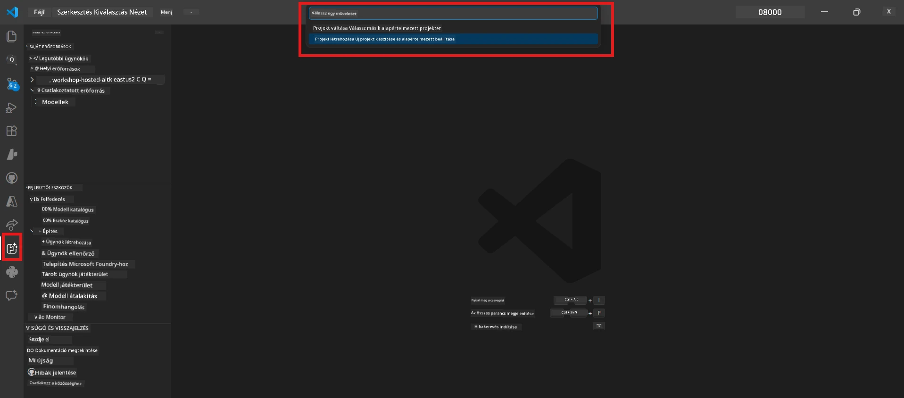

# 0. modul - Előfeltételek

Mielőtt elkezdenéd a 02-es laboratóriumot, győződj meg róla, hogy az alábbiakat befejezted. Ez a labor közvetlenül a 01-es laborra épül, ne hagyd ki.

---

## 1. Befejezni a 01-es labort

A 02-es labor azt feltételezi, hogy már:

- [x] Teljesítetted a [01-es labor - Egyetlen ügynök](../../lab01-single-agent/README.md) 8 modulját
- [x] Sikeresen telepítettél egyetlen ügynököt a Foundry Agent Service-be
- [x] Ellenőrizted, hogy az ügynök működik helyi Agent Inspectorban és a Foundry Playgroundban is

Ha még nem fejezted be a 01-es labort, térj vissza és csináld meg most: [01-es labor dokumentáció](../../lab01-single-agent/docs/00-prerequisites.md)

---

## 2. Ellenőrizd a meglévő környezetet

A 01-es laborban telepített és működő eszközöknek még mindig működniük kell. Futtasd le ezeket a gyors ellenőrzéseket:

### 2.1 Azure CLI

```powershell
az account show --query "{name:name, id:id}" --output table
```

Elvárt: Megjeleníti a feliratkozás nevét és azonosítóját. Ha nem sikerül, futtasd az [`az login`](https://learn.microsoft.com/cli/azure/authenticate-azure-cli-interactively) parancsot.

### 2.2 VS Code bővítmények

1. Nyomd meg a `Ctrl+Shift+P` → gépeld be hogy **"Microsoft Foundry"** → ellenőrizd, hogy látsz parancsokat (pl. `Microsoft Foundry: Create a New Hosted Agent`).
2. Nyomd meg a `Ctrl+Shift+P` → gépeld be hogy **"Foundry Toolkit"** → ellenőrizd, hogy látsz parancsokat (pl. `Foundry Toolkit: Open Agent Inspector`).

### 2.3 Foundry projekt és modell

1. Kattints a **Microsoft Foundry** ikonra a VS Code aktivitás sávban.
2. Ellenőrizd, hogy a projekted listázva van (pl. `workshop-agents`).
3. Bonts ki a projektet → ellenőrizd, hogy létezik egy telepített modell (pl. `gpt-4.1-mini`) **Succeeded** állapottal.

> **Ha a modell telepítése lejárt:** Egyes ingyenes szintű telepítések automatikusan lejárnak. Telepítsd újra a [Model Katalógusból](https://learn.microsoft.com/azure/foundry/foundry-models/concepts/models-sold-directly-by-azure) (`Ctrl+Shift+P` → **Microsoft Foundry: Open Model Catalog**).



### 2.4 RBAC szerepkörök

Ellenőrizd, hogy rendelkezel **Azure AI User** szerepkörrel a Foundry projektedhez:

1. [Azure Portál](https://portal.azure.com) → a Foundry **projekt** erőforrásod → **Hozzáférés-vezérlés (IAM)** → **[Szerepkör-hozzárendelések](https://learn.microsoft.com/azure/foundry/concepts/rbac-foundry)** fül.
2. Keresd meg a neved → ellenőrizd, hogy az **[Azure AI User](https://aka.ms/foundry-ext-project-role)** szerepkör szerepel.

---

## 3. Ismerd meg a többügynökös fogalmakat (új a 02-es labor számára)

A 02-es labor olyan fogalmakat vezet be, amelyek nem szerepeltek az 01-es laborban. Olvasd át ezeket, mielőtt továbbmész:

### 3.1 Mi az a többügynökös munkafolyamat?

Egyetlen ügynök helyett egy **többügynökös munkafolyamat** több specializált ügynökre osztja a munkát. Minden ügynöknek van:

- Saját **utasítása** (rendszerüzenet)
- Saját **szerepe** (amivel felelős)
- Opcionális **eszközei** (funkciók, amelyeket hívhat)

Az ügynökök egy **orchestrációs gráfon** kommunikálnak, amely meghatározza, hogyan áramlik az adat közöttük.

### 3.2 WorkflowBuilder

Az [`WorkflowBuilder`](https://learn.microsoft.com/agent-framework/workflows/agents-in-workflows) osztály az `agent_framework`-ből az SDK komponens, amely összekapcsolja az ügynököket:

```python
from agent_framework import WorkflowBuilder

workflow = (
    WorkflowBuilder(
        name="MyWorkflow",
        start_executor=agent_a,
        output_executors=[agent_d],
    )
    .add_edge(agent_a, agent_b)
    .add_edge(agent_a, agent_c)
    .add_edge(agent_b, agent_d)
    .add_edge(agent_c, agent_d)
    .build()
)
```

- **`start_executor`** - Az első ügynök, amely megkapja a felhasználói bemenetet
- **`output_executors`** - Az ügynök(ök), amelyek kimenete végső válasszá válik
- **`add_edge(source, target)`** - Meghatározza, hogy a `target` megkapja a `source` kimenetét

### 3.3 MCP (Model Context Protocol) eszközök

A 02-es labor egy **MCP eszközt** használ, amely a Microsoft Learn API-t hívja meg tanulási források lekérésére. Az [MCP (Model Context Protocol)](https://modelcontextprotocol.io/introduction) egy szabványos protokoll AI modellek összekapcsolására külső adatforrásokkal és eszközökkel.

| Kifejezés | Meghatározás |
|-----------|--------------|
| **MCP szerver** | Egy szolgáltatás, amely eszközöket/forrásokat tesz elérhetővé az [MCP protokoll](https://learn.microsoft.com/azure/foundry/agents/how-to/tools/model-context-protocol) szerint |
| **MCP kliens** | Az ügynököd kódja, amely csatlakozik egy MCP szerverhez és hívja annak eszközeit |
| **[Streamable HTTP](https://learn.microsoft.com/agent-framework/agents/tools/hosted-mcp-tools)** | Az az átviteli mód, amelyet az MCP szerverrel való kommunikációra használnak |

### 3.4 Hogyan különbözik a 02-es labor az 01-estől

| Szempont | 01-es labor (Egyetlen ügynök) | 02-es labor (Több ügynök) |
|----------|------------------------------|---------------------------|
| Ügynökök | 1 | 4 (specializált szerepek) |
| Orchestráció | Nincs | WorkflowBuilder (párhuzamos + soros) |
| Eszközök | Opcionális `@tool` funkció | MCP eszköz (külső API hívás) |
| Komplexitás | Egyszerű prompt → válasz | Önéletrajz + álláshirdetés → illeszkedési pontszám → fejlesztési terv |
| Kontextusfolyam | Közvetlen | Ügynökről ügynökre átadás |

---

## 4. Műhely tárhely struktúrája a 02-es laborhoz

Győződj meg róla, hogy tudod, hol vannak a 02-es labor fájljai:

```
workshop/
└── lab02-multi-agent/
    ├── README.md                       ← Lab overview
    ├── docs/                           ← You are here
    │   ├── README.md                   ← Learning path index
    │   ├── 00-prerequisites.md         ← This file
    │   ├── 01-understand-multi-agent.md
    │   ├── ...
    │   └── 08-troubleshooting.md
    └── PersonalCareerCopilot/          ← The agent project
        ├── agent.yaml                  ← Agent definition
        ├── main.py                     ← 4-agent workflow code
        ├── Dockerfile                  ← Container configuration
        └── requirements.txt            ← Python dependencies
```

---

### Ellenőrző lista

- [ ] A 01-es labor teljesen be van fejezve (mind a 8 modul, ügynök telepítve és ellenőrizve)
- [ ] Az `az account show` visszaadja a feliratkozásodat
- [ ] A Microsoft Foundry és a Foundry Toolkit bővítmények telepítve és reagálnak
- [ ] A Foundry projektben van egy telepített modell (pl. `gpt-4.1-mini`)
- [ ] Rendelkezel az **Azure AI User** szerepkörrel a projekten
- [ ] Elolvastad a többügynökös fogalmak szakaszt, és érted a WorkflowBuilder, MCP és az ügynök orchestráció működését

---

**Következő:** [01 - Értsd meg a Többügynökös Architektúrát →](01-understand-multi-agent.md)

---

<!-- CO-OP TRANSLATOR DISCLAIMER START -->
**Kizáró nyilatkozat**:  
Ezt a dokumentumot az AI fordító szolgáltatás [Co-op Translator](https://github.com/Azure/co-op-translator) segítségével fordítottuk. Bár az pontosságra törekszünk, kérjük, vegye figyelembe, hogy az automatikus fordítások hibákat vagy pontatlanságokat tartalmazhatnak. Az eredeti dokumentum az anyanyelvén tekintendő a hiteles forrásnak. Kritikus információk esetén javasolt szakmai emberi fordítást igénybe venni. Nem vállalunk felelősséget a fordítás használatából eredő félreértésekért vagy téves értelmezésekért.
<!-- CO-OP TRANSLATOR DISCLAIMER END -->