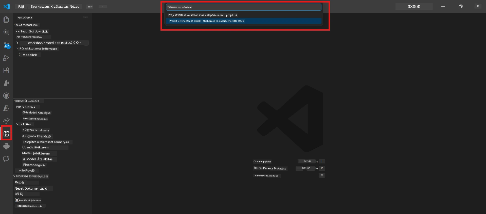

# Modul 0 - Bevezetés

⏱️ ~10 perc

> [!WARNING]
> **Előzetes verzió és korlátozások:** A [Hosztolt Ügynökök](https://learn.microsoft.com/azure/foundry/agents/concepts/hosted-agents) jelenleg **nyilvános előzetes** állapotban vannak – nem ajánlott éles munkaterhelésekhez. A műhelyben bemutatott néhány funkció változhat, amint a szolgáltatás eléri a GA állapotot.

## Amit építeni fogsz

Ebben a laborban kiterjeszted az első labor 01 egy-ügynökös képességeit, hogy egy **több-ügynökös munkafolyamatot** építs – az Önéletrajz → Munkakör Megfelelőség Értékelőt.

Beillesztesz egy **önéletrajzot** és egy **állásleírást**. Négy specializált ügynök szekvenciálisan feldolgozza a bemeneteket, majd visszaküldik:
- Egy megfelelőségi pontszámot (0–100 pontozási lebontással)
- A képesség- és tanúsítványhiányok listáját
- Egy személyre szabott tanulási útitervet valós Microsoft Learn hivatkozásokkal minden hiányra

**A munkafolyamat használja:**
- **Microsoft Agent Framework** - `WorkflowBuilder` a szekvenciális pipeline menedzsmenthez
- **Foundry Toolkit for VS Code** - sablon létrehozása, helyi tesztelés, telepítés
- **Egy mesterséges intelligencia modell** (pl. `gpt-4.1-mini`) - mind a négy ügynök használja
- **Microsoft Learn MCP szerver** - valós tanulási erőforrás linkeket biztosít minden képességhiányhoz

---

## Válaszd ki az utadat

> ⚠️ **Folytasd ugyanazzal az úttal, amit az 01-es laborban használtál.**

<details open>
<summary><strong>🅰️ A út - Azure felhő (Azure előfizetés szükséges)</strong></summary>

| | Részletek |
|---|---|
| **Kinek szól?** | Az 01-es labor teljesítése Azure előfizetéssel |
| **Modell** | Azure OpenAI a Foundry-n keresztül (pl. `gpt-4.1-mini`) |
| **Foglalt modulok** | Minden modul (00–09) |
| **Felhőbe telepítés?** | ✅ Igen - teljes végponttól végpontig telepítés |

</details>

<details open>
<summary><strong>🅱️ B út - Foundry helyi használat (nem szükséges Azure előfizetés)</strong></summary>

| | Részletek |
|---|---|
| **Kinek szól?** | Az 01-es labor teljesítése Foundry Local használatával |
| **Modell** | Foundry Local (ingyenes, a gépeden fut) |
| **Foglalt modulok** | Modulok 00–05 (kihagyva 06–07 - telepítés és felhő ellenőrzése) |
| **Felhőbe telepítés?** | ❌ Nem - csak helyi tesztelés Agent Inspectorral |

</details>

---

## 01-es labor ellenőrzése

A 02-es labor közvetlenül az 01-esre épül. Kérjük, először végezd el az 01-es labort.

Még nem végezted el az 01-es labort? Kezd itt: [Lab 01 - Bevezetés](../../lab01-single-agent/docs/00-prerequisites.md)

<details open>
<summary><strong>🅰️ A út - Azure felhő</strong></summary>

```powershell
az account show --query "{name:name, id:id}" --output table
```

Ha ez nem sikerül, futtasd az `az login` parancsot. Ezután ellenőrizd a VS Code-ban:

1. `Ctrl+Shift+P` → írd be **Foundry Toolkit** → győződj meg róla, hogy megjelennek a parancsok.
2. Kattints a **Foundry Toolkit** ikonra → a projekted és a telepített modell **Sikeres** státuszt mutat.



> **RBAC:** A 01-es labor során kijelölted a **Foundry User** szerepkört. Ha újra kell jelölni, lásd [Lab 01, Modul 1](../../lab01-single-agent/docs/01-setup.md#deploy-a-model--assign-rbac). A szerepkör korábban **Azure AI User** néven volt ismert – ugyanazokkal a jogosultságokkal.

</details>

<details open>
<summary><strong>🅱️ B út - Foundry helyi használat</strong></summary>

```powershell
Invoke-WebRequest -Uri "http://localhost:5273/v1/health" -UseBasicParsing | Select-Object StatusCode
```

Várt eredmény: `StatusCode: 200`. Ha nem, indítsd újra a Foundry Local-t a Foundry Toolkit oldalsávjából.

> Az összes lekérdezés a gépeden fut. Az egyetlen kimenő hívás az MCP eszköz a `https://learn.microsoft.com/api/mcp` címre.

</details>

---

## Mi újság a 02-es laborban

| | Labor 01 | Labor 02 |
|--|--------|--------|
| Ügynökök | 1 | 4 (WorkflowBuilderrel láncolva) |
| Sablon | Alap - Agent Framework | Munkafolyamatok - Agent Framework |
| Új csomag | - | `mcp` |
| Orkesztráció | Egyetlen beszélgető ügynök | Szekvenciális pipeline (WorkflowBuilder) |
| Új eszköz | - | `search_microsoft_learn_for_plan` (MCP) |

---

**Következő:** [01 - Az architektúra megértése →](01-understand-multi-agent.md)

---

<!-- CO-OP TRANSLATOR DISCLAIMER START -->
**Jogi nyilatkozat**:
Ez a dokumentum az AI fordítási szolgáltatás, a [Co-op Translator](https://github.com/Azure/co-op-translator) segítségével készült. Bár az pontosságra törekszünk, kérjük, vegye figyelembe, hogy az automatikus fordítások hibákat vagy pontatlanságokat tartalmazhatnak. Az eredeti dokumentum az anyanyelvén tekintendő hiteles forrásnak. Fontos információk esetén professzionális emberi fordítást javasolunk. Nem vállalunk felelősséget semmilyen félreértésért vagy téves értelmezésért, amely ebből a fordításból ered.
<!-- CO-OP TRANSLATOR DISCLAIMER END -->